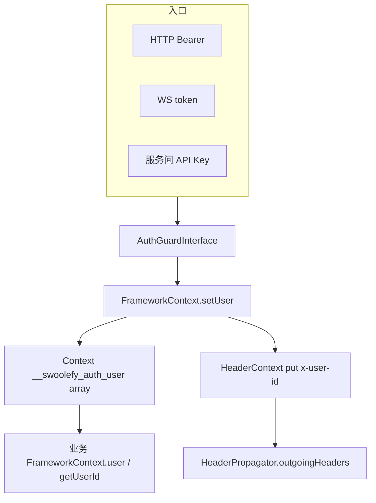
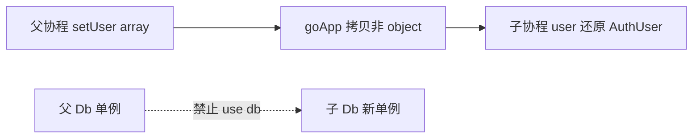

# Auth：统一身份门面（AuthUser + FrameworkContext）

## 定位

swoolefy 在 Swoole **常驻进程 + 协程** 下，HTTP / WebSocket / Workflow HITL 等入口各自验票，导致：

1. 身份来源不一致（JWT claim、Query `uid`、Body `userId`、Header 自报 role 并存）。
2. 请求态若挂在 `static` / 可变对象上，易跨请求或跨协程串数据。
3. Neuron / RAG / Capability / SDK 出站已依赖 `FrameworkContext::getUserId()`，却与本地登录态脱节。

本方案在 `src/Support` 下建立 **最小可用、生产级** 的统一 Authentication 层：

| 目标 | 做法 |
|------|------|
| 唯一身份门面 | 扩展 [`FrameworkContext`](../src/Support/FrameworkContext.php)，**不另建 AuthContext** |
| 可 goApp 透传 | Context 只存 **array 快照**，读时还原为 `AuthUser` |
| 出站一致 | `setUser` 同步回写 `HeaderContext`（`x-user-id` / `x-tenant-id`） |
| 三通道共用 Guard | HTTP 中间件 / WS callback / HITL 同一 `AuthGuardInterface` |

推荐选型：

| 场景 | 推荐方式 |
|------|----------|
| 面向浏览器 / App 的入口 API | JWT Guard + `AuthenticateMiddleware` → `FrameworkContext::setUser` |
| 网关已验票的内部服务 | 可无本地 `AuthUser`，继续只读透传头 `x-user-id`（与今日行为兼容） |
| WebSocket 握手 | 同一 Guard；**忽略** query `uid`，只用 JWT 解析出的 `user.userId` |
| Workflow HITL 人机操作 | `FrameworkContext::userOrFail()`；admin 来自 `roles` claim，不信 `X-Workflow-Role` |
| 服务间无用户脚本 | 仅允许配置的 HITL / 系统 API Key（`via=api_key` 系统身份） |

默认行为必须保守：

| 条件 | 行为 |
|------|------|
| 未调用 `setUser` | `getUserId()` / `getTenantId()` 行为与今日一致：只读 `HeaderContext` |
| 已调用 `setUser` | **Auth 优先**，Header 仅作兜底 |
| Context 中误存 `AuthUser` 对象 | **禁止**；`goApp` 会跳过 object，子协程丢身份 |

### MVP 不做

| 不做 | 原因 |
|------|------|
| 完整 Gate / Policy / RBAC 注册表 | Phase 4；MVP 用 `AuthUser::hasRole` + HITL assignee 即可 |
| OAuth2 / Passport | 过重，可后接 |
| Session Guard | API 优先 JWT；Session 另期 |
| WS 每条消息重验 JWT | 握手一次绑定 `user_id` 即可；改绑须再走 Guard |
| 把 AuthUser 放进 `HeaderPropagation` 包 | 透传层只应持有 `string => string` |

### 核心原则

1. 身份只进 **当前协程** Context（array）；禁止进程级 static 挂「当前用户」。
2. 业务只读 `FrameworkContext::user()` / `getUserId()`；**禁止**把 Body/Query 的 `userId` / `uid` 当鉴权身份。
3. `AuthGuard` / JWT 密钥配置可以进程单例；`AuthUser` 不可以。
4. Db/Redis 等组件必须在子协程内 `Application::getApp()->get(...)` 重新取；禁止 `use ($db)` 带入父协程连接。

---

## 现有架构依据

| 模块 | 路径 | 在本方案中的角色 |
|------|------|------------------|
| 协程 Context | [`src/Core/Coroutine/Context.php`](../src/Core/Coroutine/Context.php) | 存放 `__swoolefy_auth_user` array |
| goApp 跳过 object | [`src/Core/Func/function.php`](../src/Core/Func/function.php)（`goApp`） | 透传时 `is_object` → `continue`，故必须用 array |
| FrameworkContext | [`src/Support/FrameworkContext.php`](../src/Support/FrameworkContext.php) | **扩展为唯一身份门面** |
| HeaderContext | [`src/Support/HeaderPropagation/HeaderContext.php`](../src/Support/HeaderPropagation/HeaderContext.php) | 服务间透传；`setUser` 回写白名单头 |
| HeaderPropagator | [`src/Support/HeaderPropagation/HeaderPropagator.php`](../src/Support/HeaderPropagation/HeaderPropagator.php) | `x-user-id` / `x-tenant-id` 等；`outgoingHeaders()` 出站 |
| HTTP 入口捕获 | [`src/Http/HttpServer.php`](../src/Http/HttpServer.php) | 已有 `HeaderContext::set(captureIncoming)` + defer clear |
| WS 握手鉴权 | [`src/Websocket/WebsocketAuthenticator.php`](../src/Websocket/WebsocketAuthenticator.php) | 抽 token；callback 返回 `user_id` |
| WS callback stub | [`src/Stubs/WebsocketAuthCallback.stub.php`](../src/Stubs/WebsocketAuthCallback.stub.php) | 改为同一 Guard，忽略 query uid |
| HITL | [`src/Support/Workflow/WorkflowHitlAuth.php`](../src/Support/Workflow/WorkflowHitlAuth.php) | 增加 ForUser API；废弃客户端自报 role |
| JWT 库 | `Swoolefy\Library\Jwt\*` | Guard 复用，不重造解析器 |
| JWT 演示 | [`Test/Controller/TokenController.php`](../Test/Controller/TokenController.php) | 签发/校验示例，非生产 Guard |
| 登录中间件 stub | [`Test/Middleware/Route/ValidLoginMiddleware.php`](../Test/Middleware/Route/ValidLoginMiddleware.php) | 由 `AuthenticateMiddleware` 替换 |
| 路由中间件契约 | [`src/Core/RouteMiddlewareInterface.php`](../src/Core/RouteMiddlewareInterface.php) | HTTP 接入点 |
| Neuron / 记忆 | [`src/Support/Neuron/NeuronFactory.php`](../src/Support/Neuron/NeuronFactory.php)、[`ChatHistoryFactory`](../src/Support/Neuron/Memory/ChatHistoryFactory.php) | 已读 `FrameworkContext::getUserId()` |
| 租户 | [`src/Support/TenantScope.php`](../src/Support/TenantScope.php) | 已读 `getTenantId()` |
| Capability | [`docs/CapabilityTool.md`](CapabilityTool.md) | `ToolResolveContext` 从 FrameworkContext 取 user/tenant |
| Workflow | [`src/Support/Workflow/README.md`](../src/Support/Workflow/README.md)、[`docs/AI-WORKFLOW.md`](AI-WORKFLOW.md) | HITL 鉴权与本方案对齐 |

因此实现路径统一为：

```text
src/Support/Auth/          # AuthUser + Guard + Exception
src/Support/FrameworkContext.php   # 扩展 setUser / user / …
src/Http/Middleware/AuthenticateMiddleware.php
src/Http/Middleware/OptionalAuthenticateMiddleware.php
```

命名空间：

```text
Swoolefy\Support\Auth\*
Swoolefy\Support\FrameworkContext
Swoolefy\Http\Middleware\AuthenticateMiddleware
Swoolefy\Http\Middleware\OptionalAuthenticateMiddleware
```

### 与当前框架的落地约束（实现前必读）

下列约束来自现有运行时行为，**实现与示例代码必须遵守**（勿按 Laravel 式构造器注入编写路由中间件）：

| 约束 | 依据 | 本方案做法 |
|------|------|------------|
| 路由中间件零参 `new $class()` | [`HttpRoute::runMiddlewares`](../src/Http/HttpRoute.php) | `AuthenticateMiddleware` **无构造参数**；在 `handle()` 内 `Application::getApp()->get('auth.guard')` |
| 路由配置无法传 `$optional` | 中间件项仅为 class-string / Closure | 强制登录与可选登录拆成两个类；公开路由不挂登录中间件 |
| WS `callback` 为 `call_user_func` | [`WebsocketAuthenticator`](../src/Websocket/WebsocketAuthenticator.php) | callback 用 **静态方法** 或 **闭包**，内部再取容器 Guard；禁止依赖实例构造注入 |
| HTTP 状态码取自异常 `code` | [`SwoolefyException`](../src/Core/SwoolefyException.php) / `SystemException` | `AuthException` **继承** `SystemException`，构造时传入 `401` / `403` |
| 框架无 `auth:api` alias | 仅有 group / before 中间件链 | 受保护路由显式挂 `AuthenticateMiddleware`；公开路由不挂 |

中间件解析 Guard 的推荐写法（进程内复用 Guard **配置实例**，不缓存「当前用户」）：

```php
/** @var AuthGuardInterface $guard */
$guard = Application::getApp()->get('auth.guard');
```

---

## 架构



### goApp 透传与协程单例隔离



[`goApp`](../src/Core/Func/function.php) 行为摘要：

```php
foreach ($contextData as $key => $value) {
    if (is_object($value)) {
        continue; // AuthUser 对象不会被拷贝
    }
    Context::set($key, $value); // array / 标量会透传
}
```

| 要隔离（禁止跨协程共享） | 要透传（身份 / 租户） |
|--------------------------|----------------------|
| Db / Redis / HTTP Client | `userId` / `roles` / `tenantId` |
| Application 容器实例 | `__swoolefy_auth_user` **array** |
| 有 socket 的连接对象 | HeaderContext 整包 array |

闭包 `use ($user)` 仍可显式传入只读 `AuthUser`（PHP 引用），但 **主路径** 必须是 Context array，以便嵌套 `goApp` / `GoWaitGroup` / `Parallel` 无需层层 `use`。

---

## 目录结构

```text
src/Support/Auth/
  AuthUser.php                 # 不可变身份值对象
  AuthGuardInterface.php       # 凭证 → AuthUser
  JwtAuthGuard.php             # 默认 JWT Guard
  AuthException.php            # extends SystemException；code=401/403

src/Support/FrameworkContext.php   # 扩展身份读写（唯一门面）
src/Http/Middleware/AuthenticateMiddleware.php           # 强制 Bearer；零参
src/Http/Middleware/OptionalAuthenticateMiddleware.php   # 有 token 则验，无则放行

Test/Config/auth.php                 # JWT / Guard 配置
Test/Config/component/auth.php       # 注册 auth.guard 组件
Test/Auth/WebsocketAuthCallback.php  # 应用侧 WS callback（静态方法，容器取 Guard）
```

**禁止**：在 `src/Support/HeaderPropagation/` 下放置 `AuthUser`。

---

## 接口契约

### AuthUser

```php
namespace Swoolefy\Support\Auth;

/**
 * 请求态身份值对象。禁止放入进程 static；Context 中只存 toArray()。
 */
final readonly class AuthUser
{
    /**
     * @param list<string>         $roles
     * @param array<string, mixed> $claims
     */
    public function __construct(
        public string $userId,
        public array $roles = [],
        public ?string $tenantId = null,
        public array $claims = [],
        public string $via = 'jwt', // jwt|session|api_key|system
    ) {
    }

    /** @param array<string, mixed> $data */
    public static function fromArray(array $data): self
    {
        $userId = (string) ($data['userId'] ?? '');
        if ($userId === '') {
            throw new AuthException('AuthUser userId is required', 500);
        }

        return new self(
            userId: $userId,
            roles: array_values(array_map('strval', (array) ($data['roles'] ?? []))),
            tenantId: isset($data['tenantId']) && $data['tenantId'] !== ''
                ? (string) $data['tenantId']
                : null,
            claims: (array) ($data['claims'] ?? []),
            via: (string) ($data['via'] ?? 'jwt'),
        );
    }

    /** @return array<string, mixed> */
    public function toArray(): array
    {
        return [
            'userId' => $this->userId,
            'roles' => $this->roles,
            'tenantId' => $this->tenantId,
            'via' => $this->via,
            'claims' => $this->claims,
        ];
    }

    public function hasRole(string $role): bool
    {
        return in_array($role, $this->roles, true);
    }

    public function isAdmin(): bool
    {
        return $this->hasRole('admin');
    }
}
```

### AuthGuardInterface / JwtAuthGuard

```php
namespace Swoolefy\Support\Auth;

interface AuthGuardInterface
{
    /**
     * @param array{token?: string, bearer?: string} $credentials
     * @return AuthUser|null null = 匿名（由调用方决定是否拒绝）
     * @throws AuthException 凭证存在但非法 / 过期 / 签名错误
     */
    public function authenticate(array $credentials): ?AuthUser;

    /**
     * 签发与 authenticate 对称的凭证（同一密钥 / claim 映射）。
     *
     * @param int|null $ttlSeconds null 时用配置 jwt.ttl_seconds
     * @throws AuthException 密钥未配置或签发失败
     */
    public function generateToken(AuthUser $user, ?int $ttlSeconds = null): string;
}
```

登录成功后应通过同一 Guard 签发，例如：

```php
/** @var AuthGuardInterface $guard */
$guard = Application::getApp()->get('auth.guard');
$token = $guard->generateToken(new AuthUser(userId: '100', roles: ['operator']));
```

`JwtAuthGuard` 约定：

| Claim | 映射 |
|-------|------|
| `uid` 或 `sub` | `AuthUser.userId`（优先 `uid`，其次 `sub`） |
| `roles`（数组或逗号分隔字符串） | `AuthUser.roles` |
| `tenant_id` | `AuthUser.tenantId` |
| 其余 | 进入 `claims` 只读副本 |
| — | `via = 'jwt'` |

校验至少包含：签名算法、密钥、`exp`（ValidAt）。密钥与算法来自 `Config/auth.php`，**禁止**硬编码在业务控制器。

空 token → 返回 `null`（非异常）。非空但非法 → 抛 `AuthException`（`code=401`）。

### AuthException

```php
namespace Swoolefy\Support\Auth;

use Swoolefy\Exception\SystemException;

/**
 * 鉴权失败。code 必须为有效 HTTP 状态（401 / 403），
 * 以便 App 异常处理按 $throwable->getCode() 写回响应，避免落到 500。
 */
final class AuthException extends SystemException
{
    public function __construct(string $message = 'Unauthenticated', int $code = 401, ?\Throwable $previous = null)
    {
        parent::__construct($message, $code, $previous);
    }
}
```

| 场景 | code |
|------|------|
| 缺 token / 非法 JWT / 过期 | `401` |
| 已登录但角色/assignee 不足（HITL 等） | `403` |

实现阶段验收：中间件抛 `AuthException(..., 401)` 时，HTTP 响应状态必须为 **401**，不得被统一包装成 500。

### FrameworkContext 扩展

在现有透传读方法之上增加身份 API（**不另建 AuthContext**）：

```php
namespace Swoolefy\Support;

use Swoolefy\Core\Coroutine\Context as SwooleContext;
use Swoolefy\Support\Auth\AuthException;
use Swoolefy\Support\Auth\AuthUser;
use Swoolefy\Support\HeaderPropagation\HeaderContext;
use Swoolefy\Support\HeaderPropagation\HeaderPropagator;

final class FrameworkContext
{
    private const AUTH_USER_KEY = '__swoolefy_auth_user'; // array，非 object

    // ===== 原有：透传头 =====
    // get / getTraceId / getUserAgent / getUserId / getTenantId …

    public static function setUser(AuthUser $user): void
    {
        SwooleContext::set(self::AUTH_USER_KEY, $user->toArray());

        HeaderContext::put(HeaderPropagator::HEADER_USER_ID, $user->userId);
        if ($user->tenantId !== null && $user->tenantId !== '') {
            HeaderContext::put(HeaderPropagator::HEADER_TENANT_ID, $user->tenantId);
        }
    }

    public static function user(): ?AuthUser
    {
        $data = SwooleContext::get(self::AUTH_USER_KEY);
        if (!is_array($data) || ($data['userId'] ?? '') === '') {
            return null;
        }

        return AuthUser::fromArray($data);
    }

    public static function userOrFail(): AuthUser
    {
        $user = self::user();
        if ($user === null) {
            throw new AuthException('Unauthenticated', 401);
        }

        return $user;
    }

    public static function clearUser(): void
    {
        SwooleContext::delete(self::AUTH_USER_KEY);
    }

    public static function check(): bool
    {
        return self::user() !== null;
    }

    /**
     * 语义读：本地 Auth 优先，透传头兜底。
     * 未 setUser 时与改造前行为兼容（内部服务只透传头）。
     */
    public static function getUserId(?string $default = null): ?string
    {
        return self::user()?->userId
            ?? self::get(HeaderPropagator::HEADER_USER_ID, $default);
    }

    public static function getTenantId(?string $default = null): ?string
    {
        return self::user()?->tenantId
            ?? self::get(HeaderPropagator::HEADER_TENANT_ID, $default);
    }
}
```

优先级：

```text
getUserId() / getTenantId()
  1. FrameworkContext::user()     ← Guard 验过的（可信）
  2. HeaderContext 白名单头       ← 网关 / 上游透传（半可信）
  3. $default
```

| 部署角色 | 要求 |
|----------|------|
| 入口服务（对公网） | 必须 Guard → `setUser`；**不得**只信客户端带来的 `x-user-id` |
| 内部服务（网关已验） | 可不 `setUser`，继续读透传头 |

### AuthenticateMiddleware（强制登录）

> **框架硬约束**：[`HttpRoute`](../src/Http/HttpRoute.php) 对中间件执行 `new $middleware()`，**不支持构造器注入**。
> Guard 必须在 `handle()` 内从组件容器取出；`optional` **不要**做成构造参数，改用独立类 `OptionalAuthenticateMiddleware`。

```php
namespace Swoolefy\Http\Middleware;

use Swoolefy\Core\Application;
use Swoolefy\Core\Coroutine\Context;
use Swoolefy\Core\RouteMiddlewareInterface;
use Swoolefy\Http\RequestInput;
use Swoolefy\Http\ResponseOutput;
use Swoolefy\Support\Auth\AuthException;
use Swoolefy\Support\Auth\AuthGuardInterface;
use Swoolefy\Support\FrameworkContext;

final class AuthenticateMiddleware implements RouteMiddlewareInterface
{
    /** 必须零参，供 HttpRoute::new $middleware() */
    public function __construct()
    {
    }

    public function handle(RequestInput $requestInput, ResponseOutput $responseOutput): void
    {
        $this->authenticate($requestInput, optional: false);
    }

    protected function authenticate(RequestInput $requestInput, bool $optional): void
    {
        /** @var AuthGuardInterface $guard */
        $guard = Application::getApp()->get('auth.guard');

        $token = $this->bearerToken($requestInput);
        if ($token === '') {
            if ($optional) {
                return;
            }
            throw new AuthException('Missing bearer token', 401);
        }

        $user = $guard->authenticate(['token' => $token]);
        if ($user === null) {
            if ($optional) {
                return;
            }
            throw new AuthException('Unauthenticated', 401);
        }

        FrameworkContext::setUser($user);

        // 与 Bootstrap 等使用的租户 Context 键对齐（若业务已依赖）
        if ($user->tenantId !== null && $user->tenantId !== '') {
            Context::set('tenant_id', $user->tenantId);
        }
    }

    private function bearerToken(RequestInput $requestInput): string
    {
        $authorization = (string) $requestInput->getHeaderParams('authorization', '');
        if (stripos($authorization, 'bearer ') === 0) {
            return trim(substr($authorization, 7));
        }

        return '';
    }
}
```

### OptionalAuthenticateMiddleware（可选登录）

有 Bearer 则验票并 `setUser`；无 token 直接放行（匿名 + Header 兜底仍可用）。
路由无法传布尔参数时，用本类代替 `optional=true`：

```php
namespace Swoolefy\Http\Middleware;

use Swoolefy\Http\RequestInput;
use Swoolefy\Http\ResponseOutput;

final class OptionalAuthenticateMiddleware extends AuthenticateMiddleware
{
    public function handle(RequestInput $requestInput, ResponseOutput $responseOutput): void
    {
        $this->authenticate($requestInput, optional: true);
    }
}
```

路由示例：

```php
use Swoolefy\Http\Middleware\AuthenticateMiddleware;
use Swoolefy\Http\Middleware\OptionalAuthenticateMiddleware;

// 需登录
Route::group([
    'middleware' => [AuthenticateMiddleware::class],
], function () {
    // …
});

// 可匿名；有 JWT 则写入 FrameworkContext
Route::group([
    'middleware' => [OptionalAuthenticateMiddleware::class],
], function () {
    // …
});

// 公开接口：不要挂上述任一登录中间件
```

控制器：

```php
$userId = FrameworkContext::getUserId();
$user   = FrameworkContext::userOrFail();
// Body 中的 userId / destination 等只作业务参数，不当身份
```

---

## 三通道接入规范

### HTTP

```text
Request
  → HeaderContext::set(captureIncoming)     # HttpServer 已有
  → AuthenticateMiddleware
  → Guard.authenticate(Bearer)
  → FrameworkContext::setUser
  → Controller：FrameworkContext::user() / getUserId()
```

| 规则 | 说明 |
|------|------|
| 身份 | 仅来自 Guard |
| Body `userId` | 业务字段，**不是**登录身份 |
| 替换 stub | `ValidLoginMiddleware` 不再用于生产登录 |

### WebSocket

保留 [`WebsocketAuthenticator`](../src/Websocket/WebsocketAuthenticator.php) 的 token 提取与 `callback` 钩子。

> **框架硬约束**：`callback` 经 `call_user_func($callback, $request, $token)` 调用。
> 配置写成 `[Class::class, 'authenticate']` 时，方法必须是 **可静态调用**（或改用闭包）。
> **禁止**依赖「先 `new Class($guard)` 再调实例方法」——Authenticator 不会做容器解析。

应用 callback 推荐（静态方法 + 容器取 Guard）：

```php
namespace App\Auth; // 或 Test\Auth

use Swoole\Http\Request;
use Swoolefy\Core\Application;
use Swoolefy\Support\Auth\AuthException;
use Swoolefy\Support\Auth\AuthGuardInterface;
use Swoolefy\Support\FrameworkContext;

final class WebsocketAuthCallback
{
    /**
     * @return array{user_id: string}|false
     */
    public static function authenticate(Request $request, string $token): array|false
    {
        /** @var AuthGuardInterface $guard */
        $guard = Application::getApp()->get('auth.guard');

        try {
            $user = $guard->authenticate(['token' => $token]);
        } catch (AuthException) {
            return false;
        }
        if ($user === null) {
            return false;
        }

        // 关键：忽略 query uid / user_id，只用 Guard 结果
        // 握手协程内同步写入，便于后续 onOpen / 首条消息读 FrameworkContext
        FrameworkContext::setUser($user);

        return ['user_id' => $user->userId];
    }
}
```

亦可在 `Config/websocket.php` 使用闭包（同样在闭包内取 Guard）：

```php
'auth' => [
    'enable' => true,
    'require_user_id' => true,
    // 推荐：静态方法（可 call_user_func）
    'callback' => [App\Auth\WebsocketAuthCallback::class, 'authenticate'],
    // 或：
    // 'callback' => static function (Request $request, string $token) {
    //     return App\Auth\WebsocketAuthCallback::authenticate($request, $token);
    // },
],
```

注意：若 callback 返回 `true`（而非 `['user_id' => ...]`），Authenticator 会回退读 query `uid`——**生产禁止返回 `true`**，必须返回数组绑定 JWT 解析出的 `user_id`。

长连接后续消息默认信任该 fd 已绑定身份；**改绑用户**必须再次走 Guard。

### Workflow HITL

人机操作与 Header 自报角色脱钩：

```php
// WorkflowHitlAuth 新增（实现阶段）
public function assertAuthorizedForUser(?AuthUser $user, ?string $apiKeyHeader): void;
public function assertCanResumeForUser(WorkflowRun $run, AuthUser $user): void;
public function assertCanListTasksForUser(
    ?string $filterAssignee,
    AuthUser $user,
): void;
```

规则：

| 调用方 | 鉴权 |
|--------|------|
| 已登录用户 | `FrameworkContext::userOrFail()`；`allowed_roles` 与 `$user->roles` 求交；`actor = $user->userId`；admin = `$user->isAdmin()` |
| 无用户 | 仅当配置的 `api_key` 与 Header/Body 一致时放行（系统旁路） |
| 仅 `X-Workflow-Role: admin` 无 JWT | **拒绝（403）** |

旧方法 `assertAuthorized($apiKey, $role)` 标 `@deprecated`：若 `FrameworkContext::check()` 为真则走 ForUser 路径；否则在 `auth_enabled` 下不再接受「仅 Header role」通过。

控制器迁移要点（[`WorkflowController`](../Test/Module/Workflow/Controller/WorkflowController.php)）：

```php
$user = FrameworkContext::userOrFail();
$hitlAuth->assertCanResumeForUser($run, $user);
// 禁止 Body.actor 覆盖为他人
```

与 [`workflow.hitl`](../src/Stubs/workflow.conf.stub.php) 关系：

- `auth_enabled=false`：开发/单测放行（保持现状）。
- `auth_enabled=true`：优先 AuthUser；API Key 仅服务间。

---

## 配置

### `Test/Config/auth.php`（建议）

```php
<?php

return [
    'jwt' => [
        'secret' => env('AUTH_JWT_SECRET', ''),
        'algo' => env('AUTH_JWT_ALGO', 'HS256'),
        'ttl_seconds' => (int) env('AUTH_JWT_TTL', 3600),
        'issuer' => env('AUTH_JWT_ISSUER', ''),
        'audience' => env('AUTH_JWT_AUDIENCE', ''),
        // claim 映射
        'id_claim' => 'uid',       // 其次 sub
        'roles_claim' => 'roles',
        'tenant_claim' => 'tenant_id',
    ],
    'http' => [
        // 中间件默认 optional=false；公开路由不要挂 AuthenticateMiddleware
        'bearer_header' => 'authorization',
    ],
];
```

### 环境变量

| 变量 | 说明 |
|------|------|
| `AUTH_JWT_SECRET` | HMAC 密钥；生产必填且足够长 |
| `AUTH_JWT_ALGO` | 默认 `HS256` |
| `AUTH_JWT_TTL` | 签发 TTL（秒）；校验仍以 token `exp` 为准 |
| `AUTH_JWT_ISSUER` | 可选 iss 约束 |
| `AUTH_JWT_AUDIENCE` | 可选 aud 约束 |

### 组件注册示例

```php
// Test/Config/component/auth.php
use Swoolefy\Support\Auth\JwtAuthGuard;

return [
    'auth.guard' => static function () {
        $config = include APP_PATH . '/Config/auth.php';

        return new JwtAuthGuard($config['jwt'] ?? []);
    },
];
```

并确保 `Test/Config/app.php` 的 `components` 已加载该文件（与 `session` / `rateLimit` 等同级）。

| 调用方 | 如何取 Guard |
|--------|----------------|
| `AuthenticateMiddleware` / `OptionalAuthenticateMiddleware` | `Application::getApp()->get('auth.guard')`（零参中间件） |
| WS `WebsocketAuthCallback::authenticate` | 同上（静态方法内） |
| 单测 | 可直接 `new JwtAuthGuard([...])`，或向测试容器注册 `auth.guard` |

Guard **配置实例**可进程内复用；**禁止**在 Guard 上缓存「当前请求的 AuthUser」。

---

## 安全与 Swoole 禁忌

| 禁止 | 原因 |
|------|------|
| Context 存 `AuthUser` **对象** | `goApp` 跳过 object，子协程 `user()` 为 null |
| `static` / 进程单例挂当前用户 | Worker 常驻下跨请求串身份 |
| 信 Query `uid` / Body `userId` / `X-Workflow-Role` 当身份 | 客户端可伪造 |
| `use ($db)` 把父协程连接带进子协程 | 破坏协程单例隔离，连接状态错乱 |
| 入口服务只信 `x-user-id` 不验 JWT | 透传头半可信，可被伪造 |
| 把可变「当前请求」对象放进 Guard 单例属性 | 协程并发下串数据 |

| 允许 | 说明 |
|------|------|
| Guard / JWT 密钥配置进程单例 | 无请求态 |
| Context 存 array 快照 | `goApp` 自动透传 |
| `use ($user)` 只读不可变 AuthUser | 补充手段；嵌套 goApp 仍建议依赖 Context |
| 内部服务只读 Header | 网关已验票的部署模型 |

典型错误 vs 正确：

```php
// ❌
Context::set('__swoolefy_auth_user', $authUserObject);
CurrentUser::$id = $user->userId;
goApp(function () use ($db) { $db->query(...); });

// ✅
FrameworkContext::setUser($authUser); // 内部 toArray
goApp(function () {
    $id = FrameworkContext::getUserId();
    $db = Application::getApp()->get('db');
});
```

---

## 与现有调用方兼容

以下已调用 `FrameworkContext::getUserId()` / `getTenantId()`，**实现 Phase 1 后语义增强为 Auth 优先**；未 `setUser` 时与今日一致：

| 调用方 | 路径 |
|--------|------|
| NeuronFactory | [`src/Support/Neuron/NeuronFactory.php`](../src/Support/Neuron/NeuronFactory.php) |
| ChatHistoryFactory | [`src/Support/Neuron/Memory/ChatHistoryFactory.php`](../src/Support/Neuron/Memory/ChatHistoryFactory.php) |
| TenantScope | [`src/Support/TenantScope.php`](../src/Support/TenantScope.php) |
| Capability ToolResolveContext | [`docs/CapabilityTool.md`](CapabilityTool.md)、`ToolResolveContext` |
| README 示例 | [`README.md`](../README.md) FrameworkContext 段落 |
| MCP 演示 | [`Test/Module/Mcp/Controller/McpController.php`](../Test/Module/Mcp/Controller/McpController.php) |

改造后业务侧推荐写法：

```php
use Swoolefy\Support\FrameworkContext;

// 需要登录的接口
$user = FrameworkContext::userOrFail();
$userId = $user->userId;

// 允许匿名或内部透传
$userId = FrameworkContext::getUserId();
$tenantId = FrameworkContext::getTenantId();
```

---

## 分阶段路线

| Phase | 内容 | 验收焦点 |
|-------|------|----------|
| **1** | `AuthUser` + `AuthException(extends SystemException)` + `FrameworkContext` 扩展 + `JwtAuthGuard` + 零参 `AuthenticateMiddleware` / `OptionalAuthenticateMiddleware` + `auth.guard` 组件 + 单元/协程测试（含 goApp 透传） | 中间件零参可挂路由；401 不落到 500；array 透传；双并发不串；未 setUser 时 Header 兜底 |
| **2** | WS 静态 `WebsocketAuthCallback` + stub / Websocket README 更新（callback 禁止返回 `true`） | query uid 伪造失败；绑连接 id = JWT uid；握手后 `FrameworkContext::user()` 可读 |
| **3** | HITL `*ForUser` API + `WorkflowController` 迁移 + HITL 测试更新 | 仅 Header role → 403；JWT admin 可跨 assignee |
| **4**（后续） | 薄 Policy / RBAC（`can` / Gate）；不在本 MVP 实现清单 | 资源级授权 |

本期文档对应 Phase 1–3 的设计冻结；**Phase 4 仅预留**，不阻塞 MVP。

---

## 验收用例

实现阶段必须覆盖：

1. **双并发 HTTP**：用户 100 / 200 同时请求，各自 `FrameworkContext::getUserId()` 互不串扰。
2. **goApp 子协程**：父协程 `setUser` 后 `goApp` 内 `FrameworkContext::user()` 非 null，且 `id` 一致；子协程 `get('db')` 与父协程 `spl_object_id` 不同。
3. **中间件零参挂载**：`Route::group(['middleware' => [AuthenticateMiddleware::class]])` 可正常实例化；缺 Bearer → HTTP **401**（非 500）。
4. **可选登录**：挂 `OptionalAuthenticateMiddleware` 无 token 可进控制器；带非法 token → 仍 401。
5. **WS 伪造 uid**：合法 JWT（uid=100）+ query `uid=999` → 连接 `user_id` 必须为 `100`；callback 不得返回 `true`。
6. **HITL 自报角色**：无 JWT、仅 `X-Workflow-Role: admin` → 403。
7. **HITL JWT admin**：`roles` 含 `admin` → 可 resume 他人 assignee 任务。
8. **HITL 普通用户**：Body `actor` 为他人 → 仍以 JWT `id` 校验，越权失败。
9. **兼容内部服务**：不挂登录中间件、仅透传 `x-user-id` → `getUserId()` 仍返回该头（与改造前一致）。

---

## 生产检查清单

- [ ] `AUTH_JWT_SECRET` 已配置且非演示密钥
- [ ] `auth.guard` 已在 `Config/component` 注册，中间件 / WS 可 `get('auth.guard')`
- [ ] 对公网路由已挂 **零参** `AuthenticateMiddleware`（公开路由不挂；可选登录用 `OptionalAuthenticateMiddleware`）
- [ ] `AuthException` 继承 `SystemException`，401/403 不被异常层改写成 500
- [ ] WS `auth.enable=true`；callback 为静态方法/闭包；**返回 `['user_id'=>…]`**，忽略 query uid；禁止返回 `true`
- [ ] HITL `auth_enabled=true` 时不再依赖客户端自报 role
- [ ] 业务代码无 `static` 当前用户；无 Context 存 AuthUser 对象
- [ ] Outdoor / Demo 等接口不以 Body `userId` 作为鉴权身份
- [ ] 日志不打印完整 JWT / Authorization

---

## 相关文件

| 文件 | 说明 |
|------|------|
| [docs/Auth.md](Auth.md) | 本文：Auth 生产级技术方案 |
| [src/Support/FrameworkContext.php](../src/Support/FrameworkContext.php) | 身份 + 透传统一门面（实现时扩展） |
| [src/Support/HeaderPropagation/](../src/Support/HeaderPropagation/) | Header 透传层 |
| [src/Http/HttpRoute.php](../src/Http/HttpRoute.php) | 中间件零参 `new $class()`（落地约束） |
| [src/Exception/SystemException.php](../src/Exception/SystemException.php) | `AuthException` 基类；HTTP code |
| [src/Core/Func/function.php](../src/Core/Func/function.php) | `goApp` Context 拷贝规则 |
| [src/Websocket/WebsocketAuthenticator.php](../src/Websocket/WebsocketAuthenticator.php) | WS 握手鉴权 / `call_user_func` callback |
| [src/Support/Workflow/WorkflowHitlAuth.php](../src/Support/Workflow/WorkflowHitlAuth.php) | HITL 鉴权（Phase 3 扩展） |
| [docs/CapabilityTool.md](CapabilityTool.md) | Capability 从 FrameworkContext 取 user/tenant |
| [docs/AI-WORKFLOW.md](AI-WORKFLOW.md) | Workflow / HITL 接入 |
| [src/Support/Workflow/README.md](../src/Support/Workflow/README.md) | 引擎与 HITL 说明 |
| [DocumentOcr.md](../DocumentOcr.md) / [docs/DocumentOcr.md](DocumentOcr.md) | 文档解析（无 Auth 强依赖） |
| [README.md](../README.md) | FrameworkContext 用法与文档索引 |

---

## 交叉引用

- **CapabilityCenter**：[`docs/CapabilityTool.md`](CapabilityTool.md) 中 `FrameworkContext::getTenantId()` / `getUserId()` 在本方案下变为 Auth 优先；组装 `ToolResolveContext` 时无需改调用点，但入口须先 `setUser` 才能得到验票后的身份。
- **Workflow HITL**：详见 [`docs/AI-WORKFLOW.md`](AI-WORKFLOW.md) 与 [`WorkflowHitlAuth`](../src/Support/Workflow/WorkflowHitlAuth.php)；人机 API 迁移到 ForUser 后与本文 Phase 3 一致。
- **Header 透传**：[`README.md`](../README.md)「服务间 Header 透传」章节；`setUser` 会回写白名单头，使 `HeaderPropagator::outgoingHeaders()` 与登录态对齐。
- **协程单例**：[`README.md`](../README.md)「协程单例」章节；身份透传与 Db 隔离职责分离，见本文「goApp 透传与协程单例隔离」。
- **中间件 / WS 注入**：勿套用构造器 DI；见上文「与当前框架的落地约束」及零参中间件、静态 WS callback 示例。
