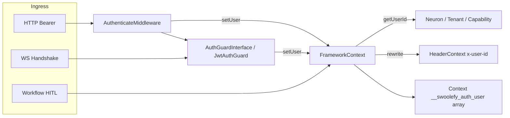

# Auth：统一身份门面（AuthUser + FrameworkContext）

> **状态**：Phase 1–3 已落地（HTTP / WS / HITL）。本文描述**当前代码行为**，非设计草案。  
> Gate / Policy / 完整 RBAC 仍属后续扩展（见文末「后续」）。

## 定位

swoolefy 在 Swoole **常驻进程 + 协程** 下，HTTP / WebSocket / Workflow HITL 等入口共用同一套身份层：

| 目标 | 做法 |
|------|------|
| 唯一身份门面 | 扩展 [`FrameworkContext`](../src/Support/FrameworkContext.php)，**不另建 AuthContext** |
| 可 goApp 透传 | Context 只存 **array 快照**（键 `__swoolefy_auth_user`），读时还原为 `AuthUser` |
| 出站一致 | `setUser` 同步回写 `HeaderContext`（`x-user-id` / `x-tenant-id`） |
| 签发与解析同 Guard | `AuthGuardInterface::generateToken` / `authenticate`（默认 `JwtAuthGuard`） |
| 三通道共用 Guard | HTTP 中间件 / WS callback / HITL 同一 `auth.guard` 组件 |

推荐选型：

| 场景 | 推荐方式 |
|------|----------|
| 面向浏览器 / App 的入口 API | JWT Guard + `AuthenticateMiddleware` → `FrameworkContext::setUser` |
| 网关已验票的内部服务 | 可无本地 `AuthUser`，继续只读透传头 `x-user-id` |
| WebSocket 握手 | 同一 Guard；**忽略** query `uid`，只用 JWT 解析出的 `user.userId` |
| Workflow HITL 人机操作 | `FrameworkContext::userOrFail()` + `*ForUser` API；admin 来自 `roles`，不信 `X-Workflow-Role` |
| 服务间无用户脚本 | 仅允许配置的 HITL / 系统 API Key |

默认行为：

| 条件 | 行为 |
|------|------|
| 未调用 `setUser` | `getUserId()` / `getTenantId()` 只读 `HeaderContext`（与改造前兼容） |
| 已调用 `setUser` | **Auth 优先**，Header 仅作兜底 |
| Context 中误存 `AuthUser` 对象 | **禁止**；`goApp` 会跳过 object，子协程丢身份 |

### 刻意不做（后续）

| 不做 | 原因 |
|------|------|
| 完整 Gate / Policy / RBAC 注册表 | 当前用 `AuthUser::hasRole` + HITL assignee 即可 |
| OAuth2 / Passport | 过重，可后接 |
| Session Guard | API 优先 JWT |
| WS 每条消息重验 JWT | 握手一次绑定 `user_id` 即可 |

### 核心原则

1. 身份只进 **当前协程** Context（array）；禁止进程级 static 挂「当前用户」。
2. 业务只读 `FrameworkContext::user()` / `getUserId()`；**禁止**把 Body/Query 的 `userId` / `uid` 当鉴权身份。
3. `AuthGuard` / JWT 密钥配置可以进程单例；`AuthUser` 不可以。
4. Db/Redis 等组件必须在子协程内 `Application::getApp()->get(...)` 重新取；禁止 `use ($db)` 带入父协程连接。

---

## 架构依据与运行时约束

| 模块 | 路径 | 角色 |
|------|------|------|
| 协程 Context | [`src/Core/Coroutine/Context.php`](../src/Core/Coroutine/Context.php) | 存放 `__swoolefy_auth_user` array |
| goApp | [`src/Core/Func/function.php`](../src/Core/Func/function.php) | 拷贝 Context 时跳过 object → 必须用 array |
| FrameworkContext | [`src/Support/FrameworkContext.php`](../src/Support/FrameworkContext.php) | 唯一身份门面 |
| HeaderContext / Propagator | [`src/Support/HeaderPropagation/`](../src/Support/HeaderPropagation/) | 透传头；`setUser` 回写白名单 |
| HTTP 入口 | [`src/Http/HttpServer.php`](../src/Http/HttpServer.php) | `HeaderContext::set(captureIncoming)` + defer clear |
| WS 握手 | [`src/Websocket/WebsocketAuthenticator.php`](../src/Websocket/WebsocketAuthenticator.php) | 抽 token；callback 返回 `user_id` |
| HITL | [`src/Support/Workflow/WorkflowHitlAuth.php`](../src/Support/Workflow/WorkflowHitlAuth.php) | `*ForUser` API；废弃客户端自报 role |
| JWT 库 | `Swoolefy\Library\Jwt\*` | Guard 复用，不重造解析器 |
| 异常 HTTP 状态 | [`src/Core/SwoolefyException.php`](../src/Core/SwoolefyException.php) | `code` 在 400–599 时 `withStatus($code)` |
| 联调示例 | [`Test/Controller/AuthUserController.php`](../Test/Controller/AuthUserController.php) | `GET /api/auth-user/me` |

### 运行时硬约束

| 约束 | 依据 | 做法 |
|------|------|------|
| 路由中间件零参 `new $class()` | [`HttpRoute::runMiddlewares`](../src/Http/HttpRoute.php) | `AuthenticateMiddleware` **无构造参数**；`handle()` 内 `get('auth.guard')` |
| 无法给中间件传 `$optional` | 中间件项仅为 class-string / Closure | 强制 / 可选拆成两个类 |
| WS `callback` 为 `call_user_func` | `WebsocketAuthenticator` | **静态方法**或闭包，内部取容器 Guard |
| HTTP 状态取自异常 `code` | `SwoolefyException::response` | `AuthException` 继承 `SystemException`，构造传 `401` |
| 无 `auth:api` alias | 仅有 group / before 链 | 受保护路由显式挂中间件 |

```php
/** @var \Swoolefy\Support\Auth\AuthGuardInterface $guard */
$guard = Application::getApp()->get('auth.guard');
```

---

## 架构



### goApp 透传与协程隔离

| 存放位置 | 可否 goApp 透传 | 说明 |
|----------|-----------------|------|
| Application 容器实例 | `__swoolefy_auth_user` **array** | 可透传；`user()` 再还原 |
| `AuthUser` 对象进 Context | **否** | goApp 跳过 object |
| 进程 static / 单例属性上的「当前用户」 | **禁止** | 协程并发会串身份 |

典型错误 vs 正确：

```php
// ❌
Context::set('__swoolefy_auth_user', $authUserObject);
CurrentUser::$id = $user->userId;
goApp(function () use ($db) { $db->query(...); });

// ✅
FrameworkContext::setUser($user);
goApp(function () {
    $userId = FrameworkContext::getUserId();
    $db = Application::getApp()->get('db');
});
```

---

## 目录结构

```text
src/Support/Auth/
  AuthUser.php                 # 不可变身份 VO
  AuthException.php            # extends SystemException；code=401（等）
  AuthGuardInterface.php       # authenticate + generateToken
  JwtAuthGuard.php             # 默认 JWT 实现
  Tests/                        # 已迁入 PhpUintTest/Unit/Support/Auth/

src/Support/FrameworkContext.php
src/Http/Middleware/AuthenticateMiddleware.php           # 强制 Bearer；零参
src/Http/Middleware/OptionalAuthenticateMiddleware.php   # 有 token 则验，无则放行

Test/Config/auth.php
Test/Config/component/auth.php
Test/Controller/AuthUserController.php
Test/Router/Common/AuthUser.php
Test/Auth/WebsocketAuthCallback.php

src/Stubs/auth.conf.stub.php
src/Stubs/WebsocketAuthCallback.stub.php
```

命名空间：

```text
Swoolefy\Support\Auth\*
Swoolefy\Support\FrameworkContext
Swoolefy\Http\Middleware\AuthenticateMiddleware
Swoolefy\Http\Middleware\OptionalAuthenticateMiddleware
```

---

## 接口契约（与代码一致）

### AuthUser

路径：[`src/Support/Auth/AuthUser.php`](../src/Support/Auth/AuthUser.php)

```php
namespace Swoolefy\Support\Auth;

final readonly class AuthUser
{
    public function __construct(
        public string $userId,
        public array $roles = [],
        public ?string $tenantId = null,
        public array $claims = [],
        public string $via = 'jwt',
    ) {}

    public static function fromArray(array $data): self; // userId 空 → AuthException(500)
    public function toArray(): array;                    // Context 快照
    public function hasRole(string $role): bool;
    public function isAdmin(): bool;                     // hasRole('admin')
}
```

| 字段 | 含义 |
|------|------|
| `userId` | 用户主键（JWT `uid`/`sub`） |
| `roles` | 角色列表；HITL / 业务用 `hasRole` / `isAdmin` |
| `tenantId` | 可选租户；与 `x-tenant-id` 对齐 |
| `claims` | 其余 JWT claim 只读副本（不含已映射字段） |
| `via` | 通道：`jwt` / `api_key` / `system` 等 |

### AuthGuardInterface / JwtAuthGuard

路径：[`AuthGuardInterface.php`](../src/Support/Auth/AuthGuardInterface.php)、[`JwtAuthGuard.php`](../src/Support/Auth/JwtAuthGuard.php)

```php
namespace Swoolefy\Support\Auth;

interface AuthGuardInterface
{
    /**
     * @param array{token?: string, bearer?: string} $credentials
     * @return AuthUser|null null = 匿名（由调用方决定是否拒绝）
     * @throws AuthException 凭证存在但非法 / 过期 / 签名错误
     */
    public function authenticate(array $credentials): ?AuthUser;

    /**
     * 签发与 authenticate 对称的凭证（同一密钥 / claim 映射）。
     *
     * @param int|null $ttlSeconds null 时用配置 jwt.ttl_seconds
     * @throws AuthException 密钥未配置或签发失败
     */
    public function generateToken(AuthUser $user, ?int $ttlSeconds = null): string;
}
```

登录签发示例：

```php
/** @var AuthGuardInterface $guard */
$guard = Application::getApp()->get('auth.guard');
$token = $guard->generateToken(new AuthUser(userId: '100', roles: ['operator']));
```

#### Claim ↔ AuthUser

| Claim（可配） | 默认键 | AuthUser |
|---------------|--------|----------|
| `id_claim`，否则 `sub` | `uid` | `userId` |
| `roles_claim`（数组或逗号串） | `roles` | `roles` |
| `tenant_claim` | `tenant_id` | `tenantId` |
| 其余 | — | `claims` |
| — | — | `via = 'jwt'`（仅解析侧） |

#### `authenticate` 校验顺序

1. 空 token → 返回 `null`（非异常）
2. 解析失败 → `AuthException('Parse Token Error', 401)`
3. **HMAC 签名**（`SignedWith`）→ 失败：`Invalid Token`
4. **显式过期**（`Token::isExpired`）→ `Token expired`
5. **nbf / iat**（`ValidAt`）及可选 iss / aud → `Invalid token`
6. 缺少 uid/sub → `Token missing user id claim`

先验签再报过期，避免伪造 token 被优先暴露为「已过期」。

#### `generateToken`

- 写入 `iat` / `exp`、`sub` + `id_claim`、`roles_claim` 数组、可选 `tenant` / `iss` / `aud`
- 合并 `AuthUser::claims`（不覆盖已映射顶层字段）
- TTL：参数优先，否则 `jwt.ttl_seconds`（默认 3600）
- 算法：`HS256` / `HS384` / `HS512`（未知回落 HS256）

### AuthException

路径：[`AuthException.php`](../src/Support/Auth/AuthException.php)

```php
namespace Swoolefy\Support\Auth;

use Swoolefy\Exception\SystemException;

final class AuthException extends SystemException
{
    public function __construct(string $message = 'Unauthenticated', int $code = 401, ?\Throwable $previous = null)
    {
        parent::__construct($message, $code, $previous);
    }
}
```

| 场景 | 异常 / code |
|------|-------------|
| 缺 Bearer / 非法 JWT / 过期 / 签名错误 | `AuthException` → **401** |
| Context 快照损坏（空 userId） | `AuthException` → **500** |
| HITL 角色 / assignee 不足 | **`WorkflowPermissionException`**（非 AuthException 403） |

`SwoolefyException::response`：当 `$throwable->getCode()` 在 **400–599** 时调用 `withStatus($code)`，再写 JSON body（`code` 字段同步）。因此中间件抛 `AuthException(..., 401)` 时，HTTP 状态为 **401**，不会落成 200/500。

### FrameworkContext

路径：[`FrameworkContext.php`](../src/Support/FrameworkContext.php)

| 方法 | 行为 |
|------|------|
| `setUser(AuthUser $user): void` | 写 `__swoolefy_auth_user` array；回写 `x-user-id`（有 tenant 再写 `x-tenant-id`）；**不写** Authorization |
| `user(): ?AuthUser` | 未 setUser 或快照无效 → `null` |
| `userOrFail(): AuthUser` | 无用户 → `AuthException('Unauthenticated', 401)` |
| `clearUser(): void` | 只删 Context 快照；**不**回滚已写入的 Header |
| `check(): bool` | `user() !== null` |
| `getUserId(?string $default = null): ?string` | Auth → Header `x-user-id` → default |
| `getTenantId(?string $default = null): ?string` | Auth → Header `x-tenant-id` → default |

优先级：

```text
1. FrameworkContext::user()     ← setUser 之后（Auth 优先）
2. HeaderContext 白名单头       ← 未 setUser 时与改造前一致
3. $default
```

### AuthenticateMiddleware（强制登录）

路径：[`AuthenticateMiddleware.php`](../src/Http/Middleware/AuthenticateMiddleware.php)

- **零参构造**（供 `HttpRoute` `new $middleware()`）
- 仅读 `Authorization: Bearer …`（不从 Query/Body 取 token）
- 缺 token → `Missing bearer token`（401）
- Guard 失败 / 返回 null → 401
- 成功 → `FrameworkContext::setUser`；有 `tenantId` 时额外 `Context::set('tenant_id', …)`

### OptionalAuthenticateMiddleware（可选登录）

路径：[`OptionalAuthenticateMiddleware.php`](../src/Http/Middleware/OptionalAuthenticateMiddleware.php)

继承强制中间件，`optional=true`：

| 情况 | 行为 |
|------|------|
| 无 Bearer | 放行（匿名） |
| 合法 Bearer | `setUser` |
| 非法 / 过期 Bearer | 仍抛 **401**（不当匿名） |

---

## 三通道接入

### HTTP

挂载方式（二选一，效果均为「调度前」执行）：

```php
use Swoolefy\Http\Middleware\AuthenticateMiddleware;
use Swoolefy\Http\Middleware\OptionalAuthenticateMiddleware;

// ① 路由 before（Test 联调采用此方式）
Route::get('/auth-user/me', [
    'beforeHandle' => AuthenticateMiddleware::class,
    'dispatch_route' => [\Test\Controller\AuthUserController::class, 'me'],
]);

// ② group middleware
Route::group([
    'middleware' => [AuthenticateMiddleware::class],
], function () {
    // …
});

// 可选登录
Route::group([
    'middleware' => [OptionalAuthenticateMiddleware::class],
], function () {
    // …
});

// 公开接口：不要挂上述任一登录中间件
```

控制器：

```php
$userId = FrameworkContext::getUserId();
$user   = FrameworkContext::userOrFail();
// Body 中的 userId / destination 等只作业务参数，不当身份
```

#### Test 联调：`GET /api/auth-user/me`

| 项 | 值 |
|----|-----|
| 路由 | [`Test/Router/Common/AuthUser.php`](../Test/Router/Common/AuthUser.php) |
| 控制器 | [`AuthUserController::me`](../Test/Controller/AuthUserController.php) |
| before | `AuthenticateMiddleware` |

```bash
# 缺 token → HTTP 401
curl -i -X GET 'http://127.0.0.1:9501/api/auth-user/me' \
  -H 'Accept: application/json'

# 非法 token → HTTP 401
curl -i -X GET 'http://127.0.0.1:9501/api/auth-user/me' \
  -H 'Accept: application/json' \
  -H 'Authorization: Bearer not.a.jwt'

# 合法 JWT → 200，body 含 userId / roles / …
curl -i -X GET 'http://127.0.0.1:9501/api/auth-user/me' \
  -H 'Accept: application/json' \
  -H 'Authorization: Bearer YOUR_JWT'
```

请求链路：

```text
HTTP Request
  → group middleware（若有）
  → beforeHandle: AuthenticateMiddleware
  → Guard.authenticate(Bearer)
  → FrameworkContext::setUser
  → Controller
```

### WebSocket

实现：[`Test/Auth/WebsocketAuthCallback.php`](../Test/Auth/WebsocketAuthCallback.php)（stub：[`WebsocketAuthCallback.stub.php`](../src/Stubs/WebsocketAuthCallback.stub.php)）

```php
public static function authenticate(Request $request, string $token): array|false
{
    /** @var AuthGuardInterface $guard */
    $guard = Application::getApp()->get('auth.guard');
    try {
        $user = $guard->authenticate(['token' => $token]);
    } catch (AuthException) {
        return false;
    }
    if ($user === null) {
        return false;
    }
    FrameworkContext::setUser($user);
    // 必须返回 array；禁止 return true（会回退读 query uid）
    return ['user_id' => $user->userId];
}
```

配置示例：

```php
'callback' => [Test\Auth\WebsocketAuthCallback::class, 'authenticate'],
```

客户端传 token（由 `WebsocketAuthenticator` 提取）：

1. `Authorization: Bearer <jwt>`
2. Query `token` / `access_token`
3. Header `Sec-WebSocket-Protocol`（部分浏览器限制）

**忽略** query `uid` / `user_id`。

### Workflow HITL

路径：[`WorkflowHitlAuth.php`](../src/Support/Workflow/WorkflowHitlAuth.php)  
控制器已迁至 ForUser：[`WorkflowController`](../Test/Module/Workflow/Controller/WorkflowController.php)

| API | 行为 |
|-----|------|
| `assertAuthorizedForUser(?AuthUser $user, ?string $apiKeyHeader)` | auth 关闭 → 放行；合法 API Key → 放行；否则需用户且 `roles ∩ allowed_roles` |
| `assertCanResumeForUser(WorkflowRun $run, AuthUser $user)` | 身份 + assignee=`user.userId`；`admin` 可跨 |
| `assertCanListTasksForUser(?string $filterAssignee, AuthUser $user)` | 非 admin 不可查他人 |
| `resolveListAssigneeFilterForUser(?string $queryAssignee, AuthUser $user)` | admin 查全部；否则默认收窄为 `user.userId` |

权限不足抛 **`WorkflowPermissionException`**（不是 `AuthException` 403）。

旧方法 `assertAuthorized` / `assertCanResume` / `assertCanListTasks` 已 **@deprecated**：`FrameworkContext::check()` 时转 ForUser；auth 开启时**不再**接受仅 Header role。

---

## 配置

### `Test/Config/auth.php`

```php
return [
    'jwt' => [
        // Test 演示默认值；生产务必 AUTH_JWT_SECRET 覆盖
        'secret' => env('AUTH_JWT_SECRET', 'test-auth-jwt-secret-change-me'),
        'algo' => env('AUTH_JWT_ALGO', 'HS256'),
        'ttl_seconds' => (int) env('AUTH_JWT_TTL', 3600),
        'issuer' => env('AUTH_JWT_ISSUER', ''),
        'audience' => env('AUTH_JWT_AUDIENCE', ''),
        'id_claim' => 'uid',
        'roles_claim' => 'roles',
        'tenant_claim' => 'tenant_id',
    ],
    'http' => [
        // 中间件当前固定读 authorization；此键预留扩展
        'bearer_header' => 'authorization',
    ],
];
```

应用脚手架可用 [`src/Stubs/auth.conf.stub.php`](../src/Stubs/auth.conf.stub.php)。

### 环境变量

| 变量 | 说明 |
|------|------|
| `AUTH_JWT_SECRET` | HMAC 密钥；生产必填 |
| `AUTH_JWT_ALGO` | HS256 / HS384 / HS512 |
| `AUTH_JWT_TTL` | 签发默认 TTL（秒）；校验以 token 内 `exp` 为准 |
| `AUTH_JWT_ISSUER` | 非空则校验 iss |
| `AUTH_JWT_AUDIENCE` | 非空则校验 aud |

### 组件注册

[`Test/Config/component/auth.php`](../Test/Config/component/auth.php)：

```php
use Swoolefy\Support\Auth\JwtAuthGuard;

$authcConfig = include APP_PATH . '/Config/auth.php';
return [
    'auth.guard' => static function () use ($authcConfig) {
        return new JwtAuthGuard($authcConfig['jwt'] ?? []);
    },
];
```

- Guard **配置实例**可进程内复用
- **禁止**在 Guard 上缓存「当前请求用户」

自定义 Guard：替换 `auth.guard` 闭包返回值即可。

---

## 安全与 Swoole 禁忌

| 禁忌 | 正确做法 |
|------|----------|
| `Context::set('…', $authUserObject)` | `FrameworkContext::setUser($user)`（内部存 array） |
| 进程 static / 单例挂当前用户 | 只读 `FrameworkContext::user()` |
| Body/Query `userId`/`uid` 当身份 | 只信 Guard / `FrameworkContext` |
| HITL 信任 `X-Workflow-Role` | 用 JWT `roles` / `isAdmin()` |
| WS 返回 `true` 让框架读 query uid | 返回 `['user_id' => $user->userId]` |
| 密钥硬编码在控制器 | `Config/auth.php` + env |
| `goApp(fn () use ($db) { … })` | 子协程内重新 `get('db')` |

---

## 与现有调用方兼容

| 调用方 | 行为 |
|--------|------|
| `NeuronFactory` / `ChatHistoryFactory` / `TenantScope` / Capability | 已读 `getUserId()` / `getTenantId()` → **自动 Auth 优先**；未 setUser 时仍走 Header |
| 内部服务只透传头 | 不挂 `AuthenticateMiddleware` 即可，与改造前一致 |
| `ValidLoginMiddleware`（Test stub） | 演示用；受保护路由请挂框架 `AuthenticateMiddleware` |

取 Guard 的入口：

| 调用方 | 取 Guard 方式 |
|--------|----------------|
| `AuthenticateMiddleware` / `OptionalAuthenticateMiddleware` | `Application::getApp()->get('auth.guard')`（零参中间件） |
| WS `WebsocketAuthCallback::authenticate` | 同上（静态方法内） |
| 登录签发 `generateToken` | 同上 |

---

## 测试

```bash
composer test:auth
# 或
./vendor/bin/phpunit --filter AuthModuleTest
```

覆盖：claim 映射、空 token→null、非法/过期 token、`generateToken` 往返、Auth vs Header 优先级、goApp 透传、Context 仅 array。

HTTP 联调见上文 `GET /api/auth-user/me` curl。

---

## 落地状态与后续

| 阶段 | 内容 | 状态 |
|------|------|------|
| **1** | `AuthUser` / `AuthException` / `JwtAuthGuard`（含 `generateToken` + 显式过期）/ `FrameworkContext` / 零参中间件 / `auth.guard` / 单元测试 / HTTP 401 `withStatus` | ✅ |
| **2** | WS `WebsocketAuthCallback` + stub | ✅ |
| **3** | HITL `*ForUser` + `WorkflowController` 迁移 | ✅ |
| **4** | Gate / Policy / 完整 RBAC（可选） | 未做 |

### 生产检查清单

- [ ] 生产环境已设置强随机 `AUTH_JWT_SECRET`（勿用 Test 默认值）
- [ ] 对公网路由已挂 **零参** `AuthenticateMiddleware`（公开路由不挂；可选登录用 `OptionalAuthenticateMiddleware`）
- [ ] WS callback 忽略 query uid，返回 `['user_id' => …]`
- [ ] HITL 使用 ForUser API；不信任客户端自报 role
- [ ] 业务禁止把 Body/Query userId 当鉴权身份
- [ ] `AuthException` 401 经异常层写出 HTTP 401（见 `SwoolefyException::response`）

---

## 相关文件

| 路径 | 说明 |
|------|------|
| [src/Support/Auth/](../src/Support/Auth/) | 身份核心 |
| [src/Support/FrameworkContext.php](../src/Support/FrameworkContext.php) | 身份门面 |
| [src/Http/Middleware/AuthenticateMiddleware.php](../src/Http/Middleware/AuthenticateMiddleware.php) | 强制登录 |
| [src/Http/Middleware/OptionalAuthenticateMiddleware.php](../src/Http/Middleware/OptionalAuthenticateMiddleware.php) | 可选登录 |
| [src/Core/SwoolefyException.php](../src/Core/SwoolefyException.php) | 4xx/5xx → HTTP status |
| [src/Exception/SystemException.php](../src/Exception/SystemException.php) | `AuthException` 基类 |
| [src/Support/Workflow/WorkflowHitlAuth.php](../src/Support/Workflow/WorkflowHitlAuth.php) | HITL ForUser |
| [Test/Config/auth.php](../Test/Config/auth.php) | JWT 配置 |
| [Test/Config/component/auth.php](../Test/Config/component/auth.php) | `auth.guard` |
| [Test/Controller/AuthUserController.php](../Test/Controller/AuthUserController.php) | HTTP 联调 |
| [Test/Router/Common/AuthUser.php](../Test/Router/Common/AuthUser.php) | before 挂中间件 |
| [Test/Auth/WebsocketAuthCallback.php](../Test/Auth/WebsocketAuthCallback.php) | WS 握手 |

## 交叉引用

- [AI-WORKFLOW.md](AI-WORKFLOW.md) — Workflow / HITL
- [CapabilityTool.md](CapabilityTool.md) — ToolResolveContext 取 user/tenant
- [src/Support/Workflow/README.md](../src/Support/Workflow/README.md) — Workflow 总览
