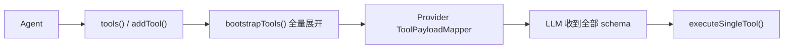
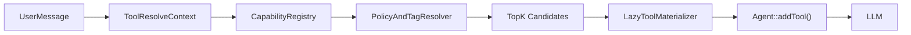
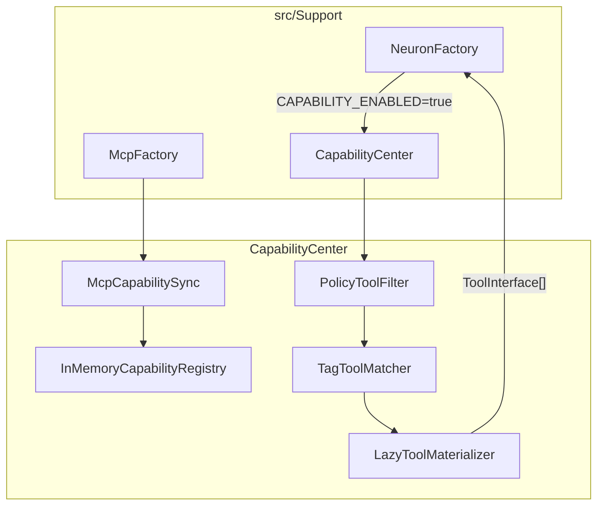
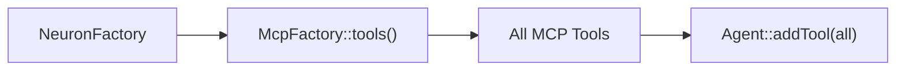
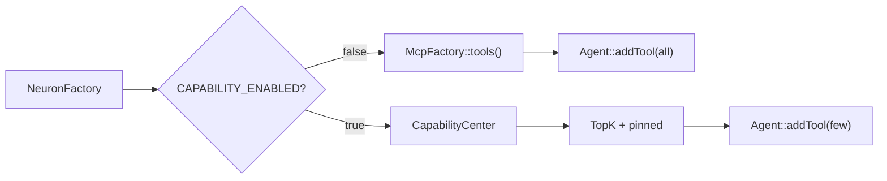

# CapabilityCenter：Capability Registry + Tool Resolver

## 定位

`CapabilityCenter` 是 swoolefy 在 `src/Support` 下的轻量 Tool 能力中心，用来解决 Neuron AI 在企业级场景下「全量注入大量 Tool」的问题。

它不替代 Neuron AI，也不重写 MCP。它只在 Neuron `Agent::addTool()` 之前增加一层：

1. Registry 保存全量 Tool 元数据。
2. Resolver 按租户、角色、标签、用户意图筛选 Top-K。
3. Materializer 只把命中的少量 Tool 懒加载成 Neuron `ToolInterface`。

推荐选型：

| 场景 | 推荐模式 |
|------|----------|
| 小型 Agent、≤20 Tool | Neuron 原生 `tools()` / `addTool()` 全量注入 |
| 固定子集、静态白名单 | `AINodeBuilder::mcp()` + `mcpOnly` / `mcpExclude` |
| RAG 检索问答 | `RetrievalToolFactory`，可作为 pinned tool |
| 企业级 100~1000+ Tool、动态意图 | `CapabilityCenter`，即本方案 |

默认行为必须保持保守：

| 配置 | 行为 |
|------|------|
| `CAPABILITY_ENABLED=false` | 完全回退当前 `NeuronFactory::attachMcpTools()` 全量挂载逻辑 |
| `CAPABILITY_ENABLED=true` | 由 `CapabilityCenter` 接管 MCP / Native Tool 的候选筛选 |

## 现有架构依据

当前 swoolefy 的 AI / Tool 链路已经集中在 `src/Support`：

| 模块 | 当前职责 | CapabilityCenter 复用方式 |
|------|----------|----------------------------|
| `src/Support/Neuron/NeuronFactory.php` | 创建并 boot Neuron Agent，挂载 MCP Tools | Phase 3 唯一必要接入点 |
| `src/Support/Mcp/McpFactory.php` | 解析 MCP Server 配置、做安全校验、发现 Tools | Registry 同步 MCP 元数据；Materializer 懒加载 Tool |
| `src/Support/AI/Builder/AINodeBuilder.php` | Workflow AI 节点 DSL，已有 `mcp()` 声明 | Phase 4 再扩展 `capabilityProfile()` 等 DSL |
| `src/Support/FrameworkContext.php` | 从 HeaderContext 获取 tenant / trace / user | 组装 `ToolResolveContext` |
| `src/Support/Security/OutboundUrlGuard.php` | 出站 URL 安全校验 | 继续由 `McpFactory` 负责，不重复实现 |
| `src/Support/Mcp/McpProcessRunner.php` | stdio MCP 子进程并发守卫 | Materializer 复用 MCP 现有安全链 |
| `src/Support/Rag/Store/PgVectorStore.php` | RAG pgvector 存储 | Phase 4 语义 Tool 检索可复用思路 |
| `src/Support/SupportLog.php` | Support 模块统一日志 | 记录 sync / resolve / materialize 警告 |

因此，本方案路径统一为：

```text
src/Support/CapabilityCenter
```

命名空间统一为：

```php
Swoolefy\Support\CapabilityCenter
```

不再使用 `src/Workflow/Capability`。CapabilityCenter 与 `Mcp`、`Neuron`、`Rag`、`Workflow` 并列，避免 Workflow 包继续膨胀。

## 问题背景

Neuron AI 原生 Tool 链路简洁，但在 Tool 数量很大时会遇到边界：



主要问题：

| 问题 | 说明 |
|------|------|
| schema token 爆炸 | 350+ Tool 的 name / description / input schema 会被全量送入 LLM |
| 模型选错 Tool | 决策空间过大，容易在相似工具之间误选 |
| 首 token 延迟上升 | MCP 建连、tools/list、schema 序列化都会放大延迟 |
| 静态过滤不足 | `mcpOnly` / `mcpExclude` 适合固定子集，不适合每轮动态意图 |
| 元数据分散 | MCP / Native / API / DB / Workflow Tool 没有统一目录 |

CapabilityCenter 的目标不是把系统做复杂，而是在现有链路前加一个很薄的筛选层：



## 设计原则

| # | 原则 | 说明 |
|---|------|------|
| 1 | Neuron 兼容 | 最终仍只给 Agent 注入 `ToolInterface[]`，不 fork Neuron |
| 2 | 默认关闭 | `CAPABILITY_ENABLED=false` 时零行为变化 |
| 3 | 注册与实例化分离 | Registry 只存元数据，Materializer 才创建真实 Tool |
| 4 | 小而美 | Phase 3 不做 pgvector、不做管理 API、不做独立 ToolExecutor |
| 5 | 复用 Support 模式 | Config + ComponentFactory + 构造注入 + 协程 Context |
| 6 | 失败可降级 | 单个 MCP Server 或 Tool 失败只 warning，不影响其他候选 |
| 7 | pinned 保底 | 核心工具可强制注入，避免 Top-K 漏选 |

## Phase 3 最小架构

Phase 3 只交付能验证价值的最小闭环：

```text
src/Support/CapabilityCenter/
├── CapabilityDescriptor.php
├── CapabilityRegistryInterface.php
├── InMemoryCapabilityRegistry.php
├── CapabilityComponentFactory.php
├── LazyToolMaterializer.php
├── Sync/
│   └── McpCapabilitySync.php
└── Resolver/
    ├── ToolResolveContext.php
    ├── ResolvedCapability.php
    ├── ToolResolverInterface.php
    ├── CompositeToolResolver.php
    ├── PolicyToolFilter.php
    └── TagToolMatcher.php
```

Phase 3 数据流：



## 核心模型

### CapabilitySource

```php
<?php

declare(strict_types=1);

namespace Swoolefy\Support\CapabilityCenter;

enum CapabilitySource: string
{
    case Mcp = 'mcp';
    case Native = 'native';
    case Api = 'api';
    case Db = 'db';
    case Workflow = 'workflow';
}
```

Phase 3 只要求 `Mcp` 和少量显式注册的 `Native` 可用；`Api`、`Db`、`Workflow` 作为后续来源预留。

### CapabilityDescriptor

`CapabilityDescriptor` 是 Registry 与 Resolver 之间的唯一元数据契约。

```php
<?php

declare(strict_types=1);

namespace Swoolefy\Support\CapabilityCenter;

final class CapabilityDescriptor
{
    /**
     * @param list<string> $tags
     * @param list<string> $requiredRoles
     * @param array<string, mixed> $metadata
     */
    public function __construct(
        public readonly string $id,
        public readonly string $name,
        public readonly string $description,
        public readonly CapabilitySource $source,
        public readonly array $tags = [],
        public readonly string $riskLevel = 'low',
        public readonly ?string $tenantId = null,
        public readonly array $requiredRoles = [],
        public readonly string $executorRef = '',
        public readonly ?string $mcpServer = null,
        public readonly bool $enabled = true,
        public readonly array $metadata = [],
    ) {
    }

    public function toIndexContent(): string
    {
        return trim($this->name . "\n" . $this->description . "\n" . implode(' ', $this->tags));
    }
}
```

ID 规则：

| 来源 | ID 示例 | executorRef |
|------|---------|-------------|
| MCP | `mcp:github:search_code` | `mcp:github` |
| Native | `native:rag:query_internal_kb` | `class:Swoolefy\Support\Rag\Tool\RetrievalToolFactory` |
| API | `api:order:create_order` | `api:order_service` |
| Workflow | `workflow:research:run_research` | `workflow:research_workflow` |

Phase 3 不强制存完整 `inputSchema`。如需用于 Tag 匹配，可以将 schema 摘要放入 `metadata['schemaSummary']`，避免把大 schema 变成 Registry 的强依赖。

## Registry

### 接口

```php
<?php

declare(strict_types=1);

namespace Swoolefy\Support\CapabilityCenter;

interface CapabilityRegistryInterface
{
    public function register(CapabilityDescriptor $descriptor): void;

    /** @param list<CapabilityDescriptor> $descriptors */
    public function registerBatch(array $descriptors): void;

    public function get(string $id): ?CapabilityDescriptor;

    /** @return list<CapabilityDescriptor> */
    public function all(): array;

    /** @return list<CapabilityDescriptor> */
    public function bySource(CapabilitySource $source, ?string $sourceName = null): array;
}
```

### InMemoryCapabilityRegistry

Phase 3 使用内存 Registry：

- Worker 级只读元数据缓存，避免每轮重新 tools/list。
- 请求态不放入 Registry，而放入 `ToolResolveContext`。
- MCP sync 失败时保留已有缓存，不清空。
- 存储键为 `(tenantId, id)`，多租户 sync 同名 MCP tool 互不覆盖。
- 当前 Worker reload 后重新 sync 即可，不引入分布式一致性。

这与 Support 现有风格一致：生产装配走 ComponentFactory，运行时状态尽量用协程 Context 隔离。

## MCP 元数据同步

`McpCapabilitySync` 负责把 MCP Server 中的工具转成 `CapabilityDescriptor`：

```php
final class McpCapabilitySync
{
    public function __construct(
        private readonly McpFactory $mcpFactory,
        private readonly CapabilityRegistryInterface $registry,
    ) {
    }

    public function syncServer(string $serverName, ?string $tenantId = null): int
    {
        // 通过 McpFactory 获取 tool 名称与基本信息，转为 Descriptor 后注册。
    }
}
```

实现约束：

1. Phase 3 可以先用 `McpFactory::listToolNames($serverName)` 注册基础元数据。
2. 如果 Neuron MCP Tool 能拿到 description，则同步 description；拿不到时用 server + tool name 生成保守描述。
3. `McpFactory` 仍负责 `McpStdioGuard`、`OutboundUrlGuard`、`McpProcessRunner`，CapabilityCenter 不重复安全逻辑。
4. 单个 Server 失败只写 `SupportLog::warning()`，不阻断其他 Server。

Descriptor 映射：

| 字段 | MCP 来源 |
|------|----------|
| `id` | `mcp:{serverName}:{toolName}` |
| `name` | MCP tool name |
| `description` | tool description 或 fallback |
| `source` | `CapabilitySource::Mcp` |
| `tags` | server name、tool name 分词、配置中的 profile tags |
| `executorRef` | `mcp:{serverName}` |
| `mcpServer` | server name |
| `tenantId` | 当前 tenant 或 null |

## Resolver

### ToolResolveContext

`ToolResolveContext` 是每次请求 / 每轮 Agent 调用的运行时上下文，不能存到 static。

```php
<?php

declare(strict_types=1);

namespace Swoolefy\Support\CapabilityCenter\Resolver;

final class ToolResolveContext
{
    /**
     * @param list<string> $roles
     * @param list<string> $pinnedToolIds
     * @param list<string> $mcpServers
     * @param list<string> $profileTags
     */
    public function __construct(
        public readonly string $query,
        public readonly string $agentId,
        public readonly ?string $tenantId,
        public readonly ?string $userId,
        public readonly array $roles = [],
        public readonly array $pinnedToolIds = [],
        public readonly array $mcpServers = [],
        public readonly ?string $capabilityProfile = null,
        public readonly array $profileTags = [],
        public readonly int $topK = 12,
    ) {
    }
}
```

上下文来源：

| 字段 | 来源 |
|------|------|
| `query` | 当前用户消息、Workflow state 中的 prompt，或 agentOptions 显式传入 |
| `agentId` | Agent class / node id |
| `tenantId` | `agentOptions['tenantId']` → `FrameworkContext::getTenantId()` |
| `userId` | `FrameworkContext::getUserId()` |
| `roles` | agentOptions / header / 业务登录态 |
| `mcpServers` | `agentOptions['mcpServers']` 或 `agentOptions['mcp']` |
| `pinnedToolIds` | agentOptions / Agent 配置 |
| `topK` | agentOptions → `CAPABILITY_DEFAULT_TOP_K` |

### PolicyToolFilter

Policy 阶段只做确定性过滤：

| 规则 | 行为 |
|------|------|
| `enabled=false` | 过滤 |
| descriptor tenant 与 ctx tenant 不匹配 | 过滤 |
| `requiredRoles` 不满足 | 过滤 |
| `riskLevel=critical` | Phase 3 默认过滤，Phase 4 交给 HITL / ToolExecutor |
| `mcpServers` 为空 | 过滤全部 MCP Tool（对齐 `attachMcpTools` 空列表不挂载） |
| `mcpServers` 非空 | 只保留白名单 server 的 MCP Tool |

不要在 Phase 3 引入复杂 RBAC。它只读取已有 `FrameworkContext` 和 agentOptions。

### TagToolMatcher

Tag 阶段用轻量规则排序：

1. `capabilityProfile` 映射到预定义 tag 集合。
2. query 分词与 `name / description / tags` 做简单匹配。
3. pinned tools 始终加入，且不占 Top-K 名额。
4. 返回前按 score 排序并截断 `topK`。

Phase 3 不做 embedding。Tag 匹配足以验证「少量候选注入」是否能降低 token 和延迟。

### CompositeToolResolver

```php
final class CompositeToolResolver implements ToolResolverInterface
{
    public function resolve(ToolResolveContext $context): array
    {
        // registry all
        // policy filter
        // tag score
        // merge pinned
        // materialize
    }
}
```

返回值建议为：

```php
final class ResolvedCapability
{
    public function __construct(
        public readonly CapabilityDescriptor $descriptor,
        public readonly float $score,
        public readonly string $stage,
    ) {
    }
}
```

是否在 Resolver 内 materialize 可以按实现选择。为了小而美，推荐 Resolver 先返回 `ResolvedCapability[]`，由 `NeuronFactory` 或 `CapabilityCenter` 门面调用 `LazyToolMaterializer` 得到 `ToolInterface[]`。

## LazyToolMaterializer

`LazyToolMaterializer` 只负责把命中的 Descriptor 转成 Neuron `ToolInterface`。

Phase 3 支持两类：

| Source | materialize 方式 |
|--------|------------------|
| MCP | `McpFactory::connector($server)` 后对单个 tool 进行 only/create |
| Native | 从显式注册的 factory / callable / class map 生成 Tool |

MCP 懒加载约束：

1. 不调用 `McpFactory::tools($servers)` 全量拉取。
2. 只对命中的 server + tool name 建立 connector。
3. 如果 Neuron `McpConnector` 当前版本不稳定支持单 tool `createTool()`，可以退而求其次使用 `only([$toolName])->tools()`。
4. stdio 并发、URL 安全、错误日志仍由 `McpFactory` 处理。

伪代码：

```php
final class LazyToolMaterializer
{
    public function materialize(CapabilityDescriptor $descriptor): ?ToolInterface
    {
        return match ($descriptor->source) {
            CapabilitySource::Mcp => $this->materializeMcp($descriptor),
            CapabilitySource::Native => $this->materializeNative($descriptor),
            default => null,
        };
    }
}
```

Phase 3 遇到 materialize 失败：

- 记录 warning。
- 跳过该工具。
- 不影响其他工具。
- 如果 pinned tool 失败，应在 debug 日志中明确标记。

## NeuronFactory 接入

优先选择 `NeuronFactory` 拦截，而不是继承 Neuron Agent。

当前逻辑：

```php
$tools = $this->mcpFactory->tools($servers, $only, $exclude, $tenantId);
if ($tools !== []) {
    $agent->addTool($tools);
}
```

目标逻辑：

```php
if (!$capabilityConfig->enabled()) {
    $this->attachMcpTools($agent, $agentOptions);
    return $agent;
}

$context = ToolResolveContextFactory::fromAgentOptions($agent, $agentOptions);
$tools = $capabilityCenter->resolveTools($context);

if ($tools !== []) {
    $agent->addTool($tools);
}
```

接入原则：

| 原则 | 说明 |
|------|------|
| 默认关闭 | 默认仍走原来的 `attachMcpTools()` |
| 可并行灰度 | 可以按 agentOptions / env / tenant 开启 |
| 保留 mcpOnly/mcpExclude | 下沉为 Policy 阶段的静态限制 |
| 不改 Neuron 核心 | 只改变注入给 Agent 的 Tool 数组 |
| 不破坏 Native Agent | Agent 自己 `tools()` 返回的少量工具继续保留 |

## AINodeBuilder 扩展

`AINodeBuilder` 现有 `mcp()` 已经能声明 MCP source：

```php
AINode::make('research')
    ->agent(ResearchAgent::class)
    ->mcp(['github', 'filesystem'])
    ->build();
```

Phase 3 不要求新增 DSL。可先通过数组配置支持：

```php
[
    'capabilityEnabled' => true,
    'capabilityProfile' => 'research',
    'capabilityTopK' => 12,
    'pinnedTools' => ['native:rag:query_internal_kb'],
]
```

Phase 4 再补 Fluent 方法：

```php
AINode::make('research')
    ->agent(ResearchAgent::class)
    ->mcp(['github', 'filesystem'])
    ->capabilityProfile('research')
    ->capabilityTopK(12)
    ->pinnedTools(['native:rag:query_internal_kb'])
    ->build();
```

这样可以避免 Phase 3 同时改 DSL、文档、Factory、Resolver，降低回归面。

## 配置

建议新增 `Config/capability.php` 或放入 `Config/neuron_ai.php` 的 `capability` 段。为了减少配置碎片，推荐先放在 `neuron_ai.php`：

```php
return [
    'capability' => [
        'enabled' => env('CAPABILITY_ENABLED', false),
        'default_top_k' => env('CAPABILITY_DEFAULT_TOP_K', 12),
        'resolver' => env('CAPABILITY_RESOLVER', 'policy,tag'),
        'index_store' => env('CAPABILITY_INDEX_STORE', 'memory'),
        'mcp_sync_on_boot' => env('CAPABILITY_MCP_SYNC_ON_BOOT', true),
        'max_schema_tools' => env('CAPABILITY_MAX_SCHEMA_TOOLS', 20),
    ],
];
```

环境变量：

| 变量 | 默认 | Phase | 说明 |
|------|------|-------|------|
| `CAPABILITY_ENABLED` | `false` | 3 | 总开关 |
| `CAPABILITY_DEFAULT_TOP_K` | `12` | 3 | 默认候选工具数 |
| `CAPABILITY_RESOLVER` | `policy,tag` | 3 | Resolver 阶段 |
| `CAPABILITY_INDEX_STORE` | `memory` | 3 | Phase 4 可切 pgvector |
| `CAPABILITY_MCP_SYNC_ON_BOOT` | `true` | 3 | boot 时同步 MCP 元数据 |
| `CAPABILITY_MAX_SCHEMA_TOOLS` | `20` | 3 | 兜底限制注入工具数 |
| `CAPABILITY_DEBUG` | `false` | 3 | 打印 resolve 调试日志 |

读取配置应复用 `ApplicationConfig::loadPhpConfig()` 与 `pick*EnvFirst()` 模式。

## ComponentFactory

新增 `CapabilityComponentFactory`，保持与 `McpComponentFactory`、`RagFactory`、`WorkflowComponentFactory` 同风格：

```php
final class CapabilityComponentFactory
{
    public function __construct(
        private readonly ?McpFactory $mcpFactory = null,
    ) {
    }

    public function registry(): CapabilityRegistryInterface;

    public function resolver(): ToolResolverInterface;

    public function materializer(): LazyToolMaterializer;

    public function capabilityCenter(): CapabilityCenter;
}
```

`CapabilityCenter` 可以是很薄的门面：

```php
final class CapabilityCenter
{
    /** @return list<ToolInterface> */
    public function resolveTools(ToolResolveContext $context): array
    {
        // resolver -> materializer -> ToolInterface[]
    }
}
```

不要在 Phase 3 引入独立 DI 容器或复杂 lifecycle。生产装配走 Factory，单测直接 new。

## 稳定性设计

### 协程边界

| 数据 | 存放位置 |
|------|----------|
| CapabilityDescriptor 元数据 | Registry，可 Worker 级缓存 |
| tenant / user / trace | `FrameworkContext` / `SwooleContext` |
| ToolResolveContext | 每次 resolve 临时对象 |
| materialized MCP Tool | 每次 resolve 创建，或按协程短生命周期缓存 |
| MCP stdio 并发计数 | 继续由 `McpProcessRunner` 管理 |

禁止把 `ToolResolveContext`、当前用户消息、租户 ID 放入进程级 static。

### 失败策略

| 场景 | 策略 |
|------|------|
| 单个 MCP Server sync 失败 | warning + 跳过 |
| 单个 Tool materialize 失败 | warning + 跳过 |
| pinned tool materialize 失败 | warning + debug 明确标记 |
| Resolver 结果为空 | 回退 pinned tools；仍为空则不注入 Tool |
| CapabilityCenter 初始化失败 | `CAPABILITY_FAIL_CLOSED=false` 时回退旧逻辑 |
| 注入数量超过上限 | 按 score 截断，并记录 debug |

建议新增：

```text
CAPABILITY_FAIL_CLOSED=false
```

含义：

| 值 | 行为 |
|----|------|
| `false` | Capability 出错时回退原 MCP 全量挂载 |
| `true` | Capability 出错时直接抛错，适合严格生产策略 |

### pinned tools

pinned tools 是防漏选机制，适合：

- RAG 检索工具，如 `native:rag:query_internal_kb`
- 安全审计工具
- Agent 必须可用的核心业务工具

规则：

1. pinned tools 不参与 Top-K 截断。
2. pinned tools 仍要经过权限和 tenant 检查。
3. pinned tools materialize 失败必须记录更明显的 warning。

## 可观测性

Phase 3 先做轻量日志，不强制接入完整 OpenTelemetry。

日志事件：

| 事件 | 字段 |
|------|------|
| `capability.registry.sync` | `source`, `serverName`, `count`, `latencyMs`, `tenantId` |
| `capability.resolve` | `agentId`, `total`, `filtered`, `selected`, `topK`, `profile`, `tenantId` |
| `capability.materialize` | `capabilityId`, `source`, `success`, `latencyMs`, `error` |

Phase 4 再对接 Workflow `OpenTelemetryPlugin` / `AuditPlugin` 风格，增加 spans：

- `capability.resolve`
- `capability.registry.sync`
- `capability.tool.call`

不要在 Phase 3 把 Workflow EventBus 或 SSE 调试做成必选项。

## 与 pgvector / Embedding 的关系

Embedding Resolver 是 Phase 4，不是第一版必需。

Phase 4 可以复用：

| 现有组件 | 用途 |
|----------|------|
| `src/Support/Rag/Store/PgVectorStore.php` | Tool 元数据语义检索实现参考 |
| `src/Support/Neuron/Embedding/EmbeddingFactory.php` | embed provider 创建 |
| `src/Support/Rag/Factory/VectorStoreFactory.php` | 向量库连接与别名模式参考 |

Phase 4 表结构可以叫 `capability_tools`，但必须通过迁移预建，禁止在请求路径运行 DDL。

Phase 4 前不要实现：

- `capability_sync_jobs`
- OpenAPI 批量导入
- Hybrid RRF
- 管理 API
- 分布式 MCP 限流

## ToolExecutor 的边界

文档旧版本把 `ToolExecutor`、`PermissionPlugin`、`RateLimitPlugin` 放在核心链路里。这里需要收缩：

| 能力 | Phase 3 | Phase 4+ |
|------|---------|----------|
| Tool 候选筛选 | 支持 | 增强 |
| Tool 调用审计 | 轻量日志 | 专门 `ToolExecutor` |
| Tool 级权限 | Policy 阶段过滤 | `ToolPermissionGuard` |
| critical HITL | 默认过滤 | 对接 `PauseNode` / HITL |
| Rate limit | 不做 | 参考 `RateLimitPlugin` 新建 Tool 级 guard |

现有 Workflow `PermissionPlugin` / `RateLimitPlugin` 是 Run 级横切，不应在文档里描述成可直接 assert 单个 Tool。Phase 4 若需要 Tool 级控制，应新增薄组件，而不是复用错层级。

## 分阶段实施

### Phase 3：最小可用

目标：减少大规模 MCP Tool 全量注入。

交付：

- `CapabilityDescriptor`
- `InMemoryCapabilityRegistry`
- `McpCapabilitySync`
- `PolicyToolFilter`
- `TagToolMatcher`
- `CompositeToolResolver`
- `LazyToolMaterializer`
- `CapabilityComponentFactory`
- `NeuronFactory` 开关接入

不交付：

- pgvector
- Embedding Resolver
- ToolExecutor
- 管理 API
- OpenAPI 导入
- AINode Fluent DSL

验收标准：

| 项 | 标准 |
|----|------|
| 默认兼容 | `CAPABILITY_ENABLED=false` 时行为与当前完全一致 |
| Top-K | 100 个 fake descriptor 中能按 tag / profile 选出 ≤`topK` |
| MCP sync | 单个 server 失败不影响其他 server |
| lazy materialize | 只 materialize 选中的工具 |
| pinned tools | pinned 始终注入且不占 Top-K |
| 回滚 | 关闭 env 即可回退旧链路 |

### Phase 4：语义检索与审计

目标：当 tags 不足以区分相似工具时，引入 embedding。

交付：

- `EmbeddingToolResolver`
- `capability_tools` pgvector 表迁移
- `CapabilityReindexCommand`
- AINodeBuilder Fluent DSL
- Tool 级审计与权限薄组件

### Phase 5：多来源与治理

目标：扩展 Tool 来源与企业治理能力。

交付：

- OpenAPI / YAML API Tool 注册
- DB Toolkit Descriptor
- Workflow Tool Descriptor
- Hybrid RRF
- 管理 API
- 分布式 sync / 限流

## NeuronFactory 改造前后

改造前：



改造后：



## 示例配置

Workflow AI 节点仍可沿用现有 `mcp()`：

```php
AINode::make('research')
    ->agent(ResearchAgent::class)
    ->mcp(['github', 'filesystem'])
    ->build();
```

开启 Capability 后，同样的 `mcp(['github', 'filesystem'])` 不再表示「全量挂载两个 server 的全部 tools」，而是表示：

1. Resolver 的工具来源限制在 github、filesystem。
2. Registry 可从这两个 server 同步 descriptor。
3. 每轮只注入 Top-K + pinned。

如果需要更强控制，先用数组配置：

```php
[
    'mcpServers' => ['github', 'filesystem'],
    'capabilityEnabled' => true,
    'capabilityProfile' => 'code_research',
    'capabilityTopK' => 8,
    'pinnedTools' => [
        'native:rag:query_internal_kb',
    ],
]
```

## 风险与对策

| 风险 | 对策 |
|------|------|
| Top-K 漏选关键 Tool | pinned tools + profile tags + debug 日志 |
| MCP 元数据不完整 | description fallback，后续从 Tool schema 增强 |
| CapabilityCenter 故障 | 默认 fail open，回退旧 `McpFactory::tools()` |
| schema 仍过大 | `CAPABILITY_MAX_SCHEMA_TOOLS` 兜底截断 |
| 与 Neuron 升级冲突 | 不 fork Neuron，只改变注入 Tool 子集 |
| 协程串数据 | 请求态只放 `ToolResolveContext`，不进 static |
| 过早复杂化 | Phase 3 禁止 pgvector / API / ToolExecutor 必选 |

## 与 SwoolefyAI.md 的关系

| swoolefyAI 章节 | 本方案关系 |
|-----------------|------------|
| Tool / MCP 章节 | 将全量 MCP Tool merge 升级为可选 Top-K Resolver |
| AI Node / AINodeBuilder | Phase 3 沿用 `mcp()`；Phase 4 再扩展 DSL |
| RAG / pgvector | Phase 4 复用 Embedding 与 PgVectorStore 思路 |
| Workflow Plugin | Phase 4 参考，不直接复用为 Tool 级权限 |
| 组件注册 | 新增 `CapabilityComponentFactory`，对齐 Support Factory 风格 |

建议在 `docs/SwoolefyAI.md` 的 MCP / Tool 章节增加指向本文的链接，但本文本身不要求同步修改主架构文档。

## 相关文件

| 文件 | 说明 |
|------|------|
| `docs/CapabilityTool.md` | 本方案 |
| `docs/SwoolefyAI.md` | 主 AI 架构文档 |
| `src/Support/Neuron/NeuronFactory.php` | Phase 3 接入点 |
| `src/Support/Mcp/McpFactory.php` | MCP 配置、发现、安全链 |
| `src/Support/AI/Builder/AINodeBuilder.php` | AI 节点 DSL |
| `src/Support/FrameworkContext.php` | tenant / trace / user 上下文 |
| `src/Support/Rag/Store/PgVectorStore.php` | Phase 4 语义索引参考 |
| `src/Support/SupportLog.php` | 轻量日志 |

## 最小实现顺序

1. 新增 `src/Support/CapabilityCenter` 基础 DTO、Registry、Resolver。
2. 新增 `McpCapabilitySync`，从 `McpFactory` 同步 MCP descriptor。
3. 新增 `LazyToolMaterializer`，只 materialize Top-K 与 pinned。
4. 新增 `CapabilityComponentFactory`，按 `neuron_ai.php` 配置装配。
5. 在 `NeuronFactory` 中增加 `CAPABILITY_ENABLED` 分支。
6. 增加单测：默认关闭兼容、Top-K、pinned、MCP sync 失败降级。

这条路径的核心目标是：用最小改动把「全量 Tool 注入」变成「动态少量候选注入」，先稳定解决 100+ Tool 的 token 与延迟问题，再逐步扩展语义检索和企业治理。
