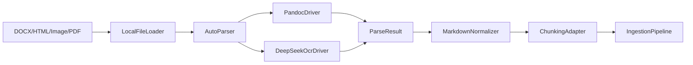
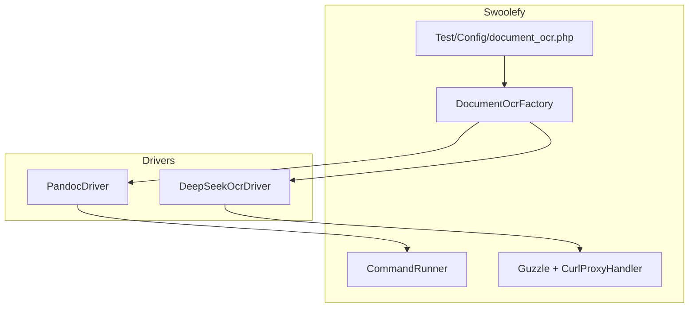

# DocumentOcr 模块 — PHP 技术方案

## 定位


| 场景                              | 推荐方式                             |
| ------------------------------- | -------------------------------- |
| 少量固定格式、直接 RAG 入库                | Neuron `FileDataLoader`          |
| DOCX / HTML / 图片 OCR → Markdown | **DocumentOcr（本方案）**             |
| PDF 扫描件 / 图片型 PDF → Markdown     | **PDF 直传 DeepSeek-OCR-2（Phase 2）** |
| 复杂 PDF 版面分析                     | 后续 MinerU / Docling Parser（预留接口） |


将文档解析从 RAG 入库中**独立**为 `src/Support/DocumentOcr` 模块，上层只依赖稳定的 `ParseResult.markdown`，不绑定 Neuron `Document` 模型，便于复用到导出、摘要、结构化抽取等场景。

**已覆盖能力**：

- `PandocDriver`：DOCX / DOC / HTML / MD / TXT → Markdown（`CommandRunner` 调用 pandoc）
- `DeepSeekOcrDriver`：PNG / JPG / JPEG → `/api/ocr`；PDF → `/api/ocr/pdf`
- `AutoParser`：按扩展名自动选择 Driver；`.pdf` 默认仍走 `DeepSeekOcrDriver`，但 endpoint 切换为 `/api/ocr/pdf`

---

## 架构







---

## 目录结构

```text
src/Support/DocumentOcr/
  Contracts/
    DocumentLoaderInterface.php
    DocumentParserInterface.php
    ParserSelectorInterface.php
  Loaders/
    LocalFileLoader.php
  Parsers/
    AutoParser.php
    PandocDriver.php
    DeepSeekOcrDriver.php
  Markdown/
    MarkdownNormalizer.php
  Chunking/
    ChunkingAdapter.php
  Schema/
    DocumentSource.php
    ParseOptions.php
    ParseResult.php
    ParsedDocument.php
  Exceptions/
    DocumentException.php
    ParserException.php
    UnsupportedDocumentException.php
    DocumentParseException.php
    UnsupportedDocumentTypeException.php
  WorkDirectory.php
  DocumentOcrFactory.php

Test/Config/document_ocr.php          # pandoc + deepseek_ocr 配置
Test/Config/component/document_parser.php # 组件注册 document_ocr
```

---

## 配置

统一放在 `[Test/Config/document_ocr.php](Test/Config/document_ocr.php)`，顶层分为 `pandoc` 与 `deepseek_ocr`。图片和 PDF 都属于 DeepSeek-OCR 服务能力，只是 endpoint 不同：

```php
return [
    'pandoc' => [
        'enabled' => true,
        'bin' => env('PANDOC_BIN', 'pandoc'),
        'runner_name' => 'document-pandoc',
        'concurrent' => 2,
        'input_formats' => ['docx', 'doc', 'html', 'htm', 'md', 'txt'],
        'output_format' => 'gfm',
        'work_dir' => '/tmp/swoolefy_document_ocr/pandoc',
    ],
    'deepseek_ocr' => [
        'enabled' => true,
        'base_uri' => 'http://127.0.0.1:7860',
        'endpoint' => '/api/ocr',
        'pdf_endpoint' => '/api/ocr/pdf',
        'time_out' => 120,
        'connect_timeout' => 3,
        'max_retry_num' => 1,
        'retry_sleep_ms' => 1000,
        'clean_temp' => true,
        'output_mmd' => true,
        'max_file_size' => 20 * 1024 * 1024,
        'pdf_max_file_size' => 100 * 1024 * 1024,
        'allowed_extensions' => ['png', 'jpg', 'jpeg', 'pdf'],
        'work_dir' => '/tmp/swoolefy_document_ocr/deepseek',
    ],
];
```

### 环境变量


| 变量                            | 说明                                  |
| ----------------------------- | ----------------------------------- |
| `PANDOC_BIN`                  | pandoc 可执行文件路径                      |
| `DOCUMENT_OCR_PANDOC_ENABLED` | 是否启用 Pandoc                         |
| `DEEPSEEK_OCR_PDF_ENDPOINT`   | PDF OCR endpoint，默认 `/api/ocr/pdf`   |
| `DEEPSEEK_OCR_PDF_MAX_FILE_SIZE` | PDF 最大字节数                         |
| `DEEPSEEK_OCR_BASE_URI`       | OCR 服务地址，默认 `http://127.0.0.1:7860` |
| `DEEPSEEK_OCR_ENDPOINT`       | 默认 `/api/ocr`                       |
| `DEEPSEEK_OCR_TIME_OUT`       | 请求总超时（秒），必须大于 `connect_timeout` |
| `DEEPSEEK_OCR_CONNECT_TIMEOUT` | 建连超时（秒） |
| `DEEPSEEK_OCR_MAX_RETRY_NUM`  | 最大重试次数（不含首次请求） |
| `DEEPSEEK_OCR_RETRY_SLEEP_MS` | 重试间隔（毫秒），建议 1000；超过 2000 时按 2000 处理 |
| `DEEPSEEK_OCR_MAX_FILE_SIZE`  | 图片最大字节数                             |
| `DEEPSEEK_OCR_WORK_DIR`       | DeepSeek-OCR 临时文件/返回文件读取的受控目录 |


### 组件注册

`[Test/Config/component/document_parser.php](Test/Config/component/document_parser.php)`：

```php
'document_ocr' => fn () => DocumentOcrFactory::fromConfig(include APP_PATH . '/Config/document_ocr.php'),
```

如需替换模块内置默认 Guzzle Client，可在注册时传入外部 Client：

```php
use GuzzleHttp\Client;
use Swoolefy\Library\CurlProxy\CurlProxyHandler;
use Swoolefy\Support\DocumentOcr\DocumentOcrFactory;

'document_ocr' => static function () {
    $config = include APP_PATH . '/Config/document_ocr.php';
    $client = new Client([
        'base_uri' => rtrim($config['deepseek_ocr']['base_uri'], '/') . '/',
        'timeout' => $config['deepseek_ocr']['time_out'],
        'connect_timeout' => $config['deepseek_ocr']['connect_timeout'],
        'handler' => CurlProxyHandler::getStackHandler(),
    ]);

    return DocumentOcrFactory::fromConfig($config, deepSeekClient: $client);
},
```

---

## 核心接口

```php
interface DocumentParserInterface
{
    public function name(): string;
    public function supports(DocumentSource $source): bool;
    public function parse(DocumentSource $source, ?ParseOptions $options = null): ParseResult;
}
```

`**DocumentSource**`：文件路径、mime、扩展名、元数据，不绑定 RAG。

`**ParseResult**`：统一输出 `markdown` + `assets` + `metadata` + `parserName` + `selectionReason`。

### Parser 行为契约

`DocumentParserInterface` 的执行语义固定如下，所有 Driver 与 `AutoParser` 必须遵守：

| 方法 | 职责 | 调用方是否依赖返回值分支 |
|------|------|--------------------------|
| `supports(DocumentSource $source): bool` | 预判当前 parser 是否可能处理该文档 | 否，仅用于 `AutoParser` 内部选择 |
| `parse(DocumentSource $source, ?ParseOptions $options = null): ParseResult` | 唯一执行入口，成功时返回 `ParseResult` | 是 |
| `name(): string` | 返回 parser 标识，写入 `ParseResult.parserName` 与 metadata | 否 |

**不支持时的行为（强制）**

- 当 parser 无法处理当前 `DocumentSource` 时，**必须**抛出 `UnsupportedDocumentException`。
- **禁止**用以下方式表达“不支持”：
  - 返回 `null` / `false`
  - 返回空 `ParseResult`
  - 让 `AutoParser::select()` 返回空 parser，再由调用方 `if ($parser)` 分支

**调用方推荐写法**

```php
try {
    $result = $parser->parse($source, $options);
} catch (UnsupportedDocumentException $e) {
    // 无可用 parser
} catch (ParserException $e) {
    // parser 已选中但执行失败
} catch (DocumentException $e) {
    // 其它 DocumentOcr 异常
}
```

调用方始终可以写 `$parser->parse($source)`，不需要在 `parse()` 前判断 parser 是否为空。

### ParseResult.metadata 固定字段

所有 Parser 在返回 `ParseResult` 时，`metadata` 应至少包含以下**稳定字段**（命名保持一致）：

```php
metadata = [
    'parser'      => 'deepseek_ocr',           // 与 ParseResult.parserName / driver::name() 一致
    'mime'        => 'application/pdf',        // 来自 DocumentSource.mime
    'extension'   => 'pdf',                    // 来自 DocumentSource.extension
    'durationMs'  => 1234,                     // 解析耗时（毫秒）
    'sourcePath'  => '/path/file.pdf',         // 源文件绝对路径
    'sourceHash'  => 'sha256...',              // 源文件内容哈希
]
```

**自定义字段边界**

- 固定字段由所有 Parser 尽量提供；语义相同必须使用相同 key（例如统一 `durationMs`，禁止 `duration` / `durationMs` 混用）。
- Parser 特有字段可追加在 metadata 顶层，建议使用明确、可读的命名，例如：
  - `ocrResponseKeys`（DeepSeek OCR 响应字段列表）
  - `endpoint`（实际请求的 OCR 地址）
  - `workDir`（Pandoc 临时工作目录）
  - `pageCount`（PDF 页数，若 OCR 服务返回）
- 不允许不同 Parser 用不同 key 表达同一语义；新增跨 Parser 通用字段前应先纳入“固定字段”列表。
- `DocumentSource.metadata` 中的上游字段可通过 `array_merge($source->metadata, [...])` 保留，但不得覆盖固定字段的约定命名。

---

## 异常体系

`DocumentOcr` 模块只向外抛出统一的模块异常，避免在业务层混合捕获 `RuntimeException`、`LogicException`、`InvalidArgumentException` 等 SPL 异常。

```text
DocumentException
└── ParserException
    └── UnsupportedDocumentException
```

| 异常 | 场景 |
|------|------|
| `DocumentException` | DocumentOcr 顶层异常；文件不存在、基础输入不可读等 |
| `ParserException` | 解析过程异常；Pandoc 失败、DeepSeek-OCR HTTP 失败、响应 JSON 不合法、超时配置不合法等 |
| `UnsupportedDocumentException` | 不支持的文档类型、指定 parser 不支持当前扩展名、未知 parser；**Parser 层“不支持”语义，不是特殊分支返回值** |

`UnsupportedDocumentException` 的定位：

- 属于 Parser 层契约异常，表示“当前没有 parser 能处理该文档”或“具体 parser 拒绝该类型”。
- 调用方可统一 `catch (DocumentException $e)`，或更细粒度 `catch (UnsupportedDocumentException $e)`。
- 与 `ParserException` 区分：后者表示 parser 已选中并开始执行，但过程中失败（超时、命令非零退出、OCR 响应异常等）。

兼容说明：

- `DocumentParseException` 保留为 `ParserException` 的旧名称兼容类，不建议新代码继续使用。
- `UnsupportedDocumentTypeException` 保留为 `UnsupportedDocumentException` 的旧名称兼容类，不建议新代码继续使用。
- 新增 Driver 时必须只抛出上述异常体系内的异常；底层第三方异常需要包一层 `ParserException` 再抛出。

---

## AutoParser 选择规则


| 输入                        | Driver            | selectionReason 示例                   |
| ------------------------- | ----------------- | ------------------------------------ |
| `.docx` / `.doc`          | PandocDriver      | `structured_format:docx`             |
| `.html` / `.md` / `.txt`  | PandocDriver      | `structured_format:html`             |
| `.png` / `.jpg` / `.jpeg` | DeepSeekOcrDriver | `image_extension:png`                |
| `.pdf`                    | DeepSeekOcrDriver | `pdf_direct_deepseek_ocr` |


边界策略（与 Parser 行为契约一致）：

- `AutoParser::select()` **必须**返回 `DocumentParserInterface` 实例；若无 parser 命中，抛 `UnsupportedDocumentException`
- `supports()` 仅用于 `AutoParser` 内部选择，**不作为**业务调用方的分支依据
- `parse()` 是唯一执行入口；不支持时抛异常，不返回 `null` / `false` / 空 `ParseResult`
- 调用方始终可以写 `$parser->parse($source)`，不需要判断 parser 是否为空
- `ParseOptions.parser` 可强制 `pandoc` / `deepseek_ocr`；指定 parser 不支持当前类型时同样抛 `UnsupportedDocumentException`
- 选择原因写入 `ParseResult.selectionReason`，便于日志与调试

---

## PandocDriver

通过 `[CommandRunner](src/Core/CommandRunner.php)` 执行：

```bash
pandoc input.docx -t gfm -o output.md --extract-media=assets_dir
```

**注意**：

- `exec()` / `procOpen()` 前必须调用 `isNextHandle()`，否则抛 `Missing call isNextHandle()`
- 文件路径使用 `escapeshellarg()`，输入文件须为已存在的本地路径
- 输出写入 `work_dir` 子目录，再读取 Markdown；不依赖 stdout 大文本
- Windows / Linux 的 `PANDOC_BIN` 需分别配置

---

## DeepSeekOcrDriver

HTTP 接口（DeepSeek-OCR-2）：

```text
POST http://localhost:7860/api/ocr
Content-Type: multipart/form-data

file=<PNG/JPG/JPEG>
clean_temp=true
output_mmd=true
```

实现要点：

- Guzzle multipart 上传；若存在 `CurlProxyHandler` 则注入（与 AI Provider 一致）
- 支持外部注入 `GuzzleHttp\Client`；注入后优先使用外部 Client，默认 Client 仅作为兜底
- `time_out` 与 `connect_timeout` 必须为正数，且 `time_out > connect_timeout`，Driver 构造时做校验
- `max_retry_num` 表示最大重试次数，不包含首次请求；例如 `1` 表示最多请求 2 次
- `retry_sleep_ms` 建议默认 `1000`；代码层最大只取 `2000`，避免重试等待过长
- 响应 JSON 兼容字段：`markdown` / `mmd` / `text` / `data.markdown`
- 若返回文件路径，仅允许读取 `work_dir` 内文件
- `work_dir` 是 DeepSeek-OCR 相关临时文件目录，也是服务端返回本地文件路径时允许读取的根目录
- 失败按 `max_retry_num` 重试；仍失败抛 `ParserException`

---

## PDF Direct OCR（Phase 2）

DeepSeek-OCR-2 官方已提供 `run_dpsk_ocr2_pdf.py`，HTTP 服务端也支持 PDF 文件。因此 PHP 侧不再默认本地拆图，而是按扩展名把 PDF 直接上传到 PDF endpoint，由 DeepSeek-OCR-2 服务端内部完成多页处理：


接口映射：

| 扩展名 | Endpoint | 处理方 |
|--------|----------|--------|
| `.png` / `.jpg` / `.jpeg` | `/api/ocr` | DeepSeek-OCR-2 图片 OCR |
| `.pdf` | `/api/ocr/pdf` | DeepSeek-OCR-2 PDF 多页 pipeline |

设计约束：

- `.pdf` 由 `AutoParser` 默认选择 `DeepSeekOcrDriver`
- endpoint 选择在 `DeepSeekOcrDriver::endpointFor()` 内完成，不需要业务层判断
- 服务端返回 Markdown 或纯文本均可，Driver 会兼容 `markdown` / `mmd` / `text` / `content` / `result`
- PDF 页数限制、渲染和多页合并交给 DeepSeek-OCR-2 服务端负责
- PHP 侧只做文件大小、超时、重试、JSON 解析、日志元数据
- 复杂版面、公式、跨页表格仍不是强保证，后续可接 Docling / MinerU

关键配置：

```php
'deepseek_ocr' => [
    'endpoint' => '/api/ocr',
    'pdf_endpoint' => '/api/ocr/pdf',
    'allowed_extensions' => ['png', 'jpg', 'jpeg', 'pdf'],
    'max_file_size' => 20 * 1024 * 1024,
    'pdf_max_file_size' => 100 * 1024 * 1024,
],
```

---

## 使用示例

### 解析单文件

```php
/** @var \Swoolefy\Support\DocumentOcr\DocumentOcrFactory $ocr */
$ocr = Application::getApp()->get('document_ocr');

$result = $ocr->parseFile('/data/manual.docx');
// $result->markdown, $result->parserName, $result->selectionReason
```

### 接入 RAG 入库

```php
$result = $ocr->parseFile('/data/page.png');
$chunks = (new ChunkingAdapter())->splitParseResult($result, sourceName: 'page.png');
$app->get(IngestionPipeline::class)->ingest('product_kb', $chunks);
```

---

## 与 swoolefyAI 架构的关系


- **DocumentOcr**：格式转换 + OCR → Markdown
- **ChunkingAdapter**：Markdown → Neuron `Document[]`
- **IngestionPipeline**：embed + 向量入库（见 `[pgvector.md](pgvector.md)`）

---

## 注意事项与边界问题


| 问题                       | 说明与对策                                                           |
| ------------------------ | --------------------------------------------------------------- |
| **PDF 路径**                 | `.pdf` 直接上传 `/api/ocr/pdf`；多页处理在 DeepSeek-OCR-2 服务端完成             |
| **Pandoc 不做 OCR**        | 扫描件 DOCX 内嵌图无法可靠识别；应走图片 OCR                                     |
| **CommandRunner 并发**     | `runner_name` + `concurrent` 控制 pandoc 子进程；长任务注意 Worker 占用      |
| **OCR 外部依赖**             | DeepSeek 服务宕机应快速失败 + 可观测；不要无限阻塞 Worker                          |
| **路径安全**                 | 仅处理 `realpath` 存在的本地文件；OCR 返回路径限制在 `work_dir`                   |
| **隐私与临时文件**              | `work_dir` 定期清理；日志不打印全文 Markdown                                |
| **复杂表格/公式**              | Pandoc/OCR 不保证完美；财报/论文后续用 Docling/MinerU                         |
| **与 Neuron Document 解耦** | `ParseResult` 独立；仅在 Chunking 阶段转为 Neuron `Document`             |
| **重复 normalize**         | 由 `DocumentOcrFactory::parseFile()` 统一 normalize，避免 Driver 重复处理 |


### 何时不适用本模块

- Tool 数量 ≤ 5、且全是纯文本 MD：可直接 `StringDataLoader`
- 强确定性流水线、固定单一解析器：直接指定 `ParseOptions(parser: 'pandoc')`
- 需要实时 sub-second OCR：HTTP OCR 延迟较高，应异步 `AsyncTask`

### 可选实现跟进：Driver metadata 对齐

文档已约定 `ParseResult.metadata` 固定字段（`parser` / `mime` / `extension` / `durationMs` / `sourcePath` / `sourceHash`）。当前实现状态：

| Driver | 已有字段 | 待补齐（可选） |
|--------|----------|----------------|
| `PandocDriver` | `sourcePath`, `sourceHash`, `durationMs`, `workDir` | `parser`, `mime`, `extension` |
| `DeepSeekOcrDriver` | `sourcePath`, `sourceHash`, `durationMs`, `endpoint`, `ocrResponseKeys` | `parser`, `mime`, `extension` |

`parser` 目前主要体现在 `ParseResult.parserName`，`mime` / `extension` 主要体现在 `DocumentSource`；若需要下游只读 `metadata` 即可完成溯源，可在各 Driver 的 `array_merge` 中补齐上述三个字段。此为可选增强，不改变 Parser 契约与异常语义。

---

## 分阶段路线


| Phase | 内容 |
|-------|------|
| Phase 1 | Pandoc + DeepSeek-OCR image endpoint + AutoParser + `document_ocr.php` |
| **Phase 2（当前补充）** | PDF direct upload + `/api/ocr/pdf`；`.pdf` 自动路由到 `DeepSeekOcrDriver` |
| Phase 3 | MinerU / Docling Parser 插件；`AutoParser` 扩展 |
| Phase 4 | 批量 AsyncTask 入库；解析缓存（source hash） |


---

## 验证计划

- AutoParser：`.docx` → pandoc，`.png` → deepseek_ocr `/api/ocr`，`.pdf` → deepseek_ocr `/api/ocr/pdf`
- DeepSeekOcrDriver：按扩展名选择 endpoint，PDF 返回 Markdown 或纯文本
- PandocDriver：本地 DOCX 生成非空 Markdown
- DeepSeekOcrDriver：mock 或真实服务返回 JSON markdown
- 边界：超大图片、OCR 超时、无效 JSON、pandoc 未安装

---

## 相关文件


| 文件                                                                                 | 说明                      |
| ---------------------------------------------------------------------------------- | ----------------------- |
| `[src/Support/DocumentOcr/](src/Support/DocumentOcr/)`                             | 模块实现                    |
| `[Test/Config/document_ocr.php](Test/Config/document_ocr.php)`                     | Pandoc + DeepSeek + PDF 配置 |
| `[Test/Config/component/document_parser.php](Test/Config/component/document_parser.php)` | DI 注册（DI 名 `document_ocr`） |
| `[src/Core/CommandRunner.php](src/Core/CommandRunner.php)`                         | Pandoc 进程调用             |
| `[pgvector.md](pgvector.md)`                                                       | RAG 向量入库                |
| `[SwoolefyAI.md](SwoolefyAI.md)`                                                   | RAG / IngestionPipeline |


