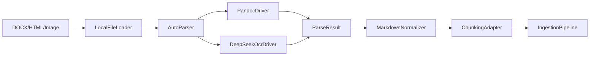
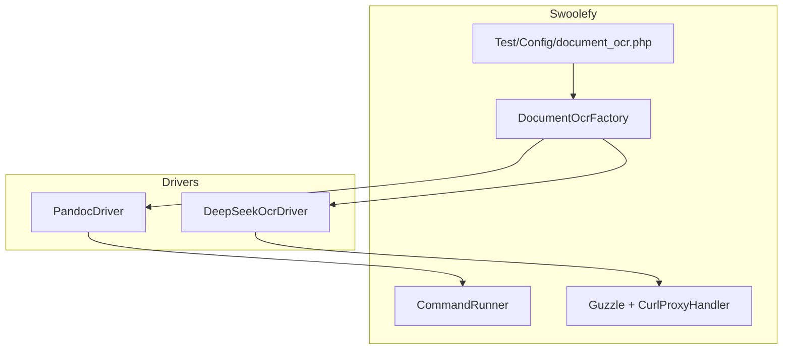

# DocumentOcr 模块 — PHP 技术方案

## 定位


| 场景                              | 推荐方式                             |
| ------------------------------- | -------------------------------- |
| 少量固定格式、直接 RAG 入库                | Neuron `FileDataLoader`          |
| DOCX / HTML / 图片 OCR → Markdown | **DocumentOcr（本方案）**             |
| 复杂 PDF 版面分析                     | 后续 MinerU / Docling Parser（预留接口） |


将文档解析从 RAG 入库中**独立**为 `src/Support/DocumentOcr` 模块，上层只依赖稳定的 `ParseResult.markdown`，不绑定 Neuron `Document` 模型，便于复用到导出、摘要、结构化抽取等场景。

**第一阶段仅实现**：

- `PandocDriver`：DOCX / DOC / HTML / MD / TXT → Markdown（`CommandRunner` 调用 pandoc）
- `DeepSeekOcrDriver`：PNG / JPG / JPEG → Markdown（HTTP `POST /api/ocr`）
- `AutoParser`：按扩展名自动选择 Driver

---

## 架构







---

## 目录结构

```text
src/Support/DocumentOcr/
  Contracts/
    DocumentLoaderInterface.php
    DocumentParserInterface.php
    ParserSelectorInterface.php
  Loaders/
    LocalFileLoader.php
  Parsers/
    AutoParser.php
    PandocDriver.php
    DeepSeekOcrDriver.php
  Markdown/
    MarkdownNormalizer.php
  Chunking/
    ChunkingAdapter.php
  Schema/
    DocumentSource.php
    ParseOptions.php
    ParseResult.php
    ParsedDocument.php
  Exceptions/
    DocumentParseException.php
    UnsupportedDocumentTypeException.php
  Support/
    WorkDirectory.php
  DocumentOcrFactory.php

Test/Config/document_ocr.php          # pandoc + deepseek_ocr 配置
Test/Config/component/document_ocr.php # 组件注册 document_ocr
```

---

## 配置

统一放在 `[Test/Config/document_ocr.php](Test/Config/document_ocr.php)`，顶层分为 `pandoc` 与 `deepseek_ocr`：

```php
return [
    'pandoc' => [
        'enabled' => true,
        'bin' => env('PANDOC_BIN', 'pandoc'),
        'runner_name' => 'document-pandoc',
        'concurrent' => 2,
        'input_formats' => ['docx', 'doc', 'html', 'htm', 'md', 'txt'],
        'output_format' => 'gfm',
        'work_dir' => '/tmp/swoolefy_document_ocr/pandoc',
    ],
    'deepseek_ocr' => [
        'enabled' => true,
        'base_uri' => 'http://127.0.0.1:7860',
        'endpoint' => '/api/ocr',
        'timeout' => 120,
        'clean_temp' => true,
        'output_mmd' => true,
        'allowed_extensions' => ['png', 'jpg', 'jpeg'],
    ],
];
```

### 环境变量


| 变量                            | 说明                                  |
| ----------------------------- | ----------------------------------- |
| `PANDOC_BIN`                  | pandoc 可执行文件路径                      |
| `DOCUMENT_OCR_PANDOC_ENABLED` | 是否启用 Pandoc                         |
| `DEEPSEEK_OCR_BASE_URI`       | OCR 服务地址，默认 `http://127.0.0.1:7860` |
| `DEEPSEEK_OCR_ENDPOINT`       | 默认 `/api/ocr`                       |
| `DEEPSEEK_OCR_TIMEOUT`        | 请求超时（秒）                             |
| `DEEPSEEK_OCR_MAX_FILE_SIZE`  | 图片最大字节数                             |


### 组件注册

`[Test/Config/component/document_ocr.php](Test/Config/component/document_ocr.php)`：

```php
'document_ocr' => fn () => DocumentOcrFactory::fromConfig(include APP_PATH . '/Config/document_ocr.php'),
```

---

## 核心接口

```php
interface DocumentParserInterface
{
    public function name(): string;
    public function supports(DocumentSource $source): bool;
    public function parse(DocumentSource $source, ?ParseOptions $options = null): ParseResult;
}
```

`**DocumentSource**`：文件路径、mime、扩展名、元数据，不绑定 RAG。

`**ParseResult**`：统一输出 `markdown` + `metadata`（含 `parserName`、`selectionReason`、`durationMs`、`sourceHash`）。

---

## AutoParser 选择规则


| 输入                        | Driver            | selectionReason 示例                   |
| ------------------------- | ----------------- | ------------------------------------ |
| `.docx` / `.doc`          | PandocDriver      | `structured_format:docx`             |
| `.html` / `.md` / `.txt`  | PandocDriver      | `structured_format:html`             |
| `.png` / `.jpg` / `.jpeg` | DeepSeekOcrDriver | `image_extension:png`                |
| `.pdf`                    | **不支持（Phase 1）**  | 抛 `UnsupportedDocumentTypeException` |


边界策略：

- 无可用 Driver 时**显式抛异常**，不静默兜底
- `ParseOptions.parser` 可强制 `pandoc` / `deepseek_ocr`
- 选择原因写入 `ParseResult.selectionReason`，便于日志与调试

---

## PandocDriver

通过 `[CommandRunner](src/Core/CommandRunner.php)` 执行：

```bash
pandoc input.docx -t gfm -o output.md --extract-media=assets_dir
```

**注意**：

- `exec()` / `procOpen()` 前必须调用 `isNextHandle()`，否则抛 `Missing call isNextHandle()`
- 文件路径使用 `escapeshellarg()`，输入文件须为已存在的本地路径
- 输出写入 `work_dir` 子目录，再读取 Markdown；不依赖 stdout 大文本
- Windows / Linux 的 `PANDOC_BIN` 需分别配置

---

## DeepSeekOcrDriver

HTTP 接口（DeepSeek-OCR-2）：

```text
POST http://localhost:7860/api/ocr
Content-Type: multipart/form-data

file=<PNG/JPG/JPEG>
clean_temp=true
output_mmd=true
```

实现要点：

- Guzzle multipart 上传；若存在 `CurlProxyHandler` 则注入（与 AI Provider 一致）
- 响应 JSON 兼容字段：`markdown` / `mmd` / `text` / `data.markdown`
- 若返回文件路径，仅允许读取 `work_dir` 内文件
- 失败按 `retry.times` 重试；仍失败抛 `DocumentParseException`

---

## 使用示例

### 解析单文件

```php
/** @var \Swoolefy\Support\DocumentOcr\DocumentOcrFactory $ocr */
$ocr = Application::getApp()->get('document_ocr');

$result = $ocr->parseFile('/data/manual.docx');
// $result->markdown, $result->parserName, $result->selectionReason
```

### 接入 RAG 入库

```php
$result = $ocr->parseFile('/data/page.png');
$chunks = (new ChunkingAdapter())->splitParseResult($result, sourceName: 'page.png');
$app->get(IngestionPipeline::class)->ingest('product_kb', $chunks);
```

---

## 与 swoolefyAI 架构的关系


- **DocumentOcr**：格式转换 + OCR → Markdown
- **ChunkingAdapter**：Markdown → Neuron `Document[]`
- **IngestionPipeline**：embed + 向量入库（见 `[pgvector.md](pgvector.md)`）

---

## 注意事项与边界问题


| 问题                       | 说明与对策                                                           |
| ------------------------ | --------------------------------------------------------------- |
| **PDF 不支持**              | Phase 1 不处理电子/扫描 PDF；需后续 PDF 拆图 + OCR 或 Docling                 |
| **Pandoc 不做 OCR**        | 扫描件 DOCX 内嵌图无法可靠识别；应走图片 OCR                                     |
| **CommandRunner 并发**     | `runner_name` + `concurrent` 控制 pandoc 子进程；长任务注意 Worker 占用      |
| **OCR 外部依赖**             | DeepSeek 服务宕机应快速失败 + 可观测；不要无限阻塞 Worker                          |
| **路径安全**                 | 仅处理 `realpath` 存在的本地文件；OCR 返回路径限制在 `work_dir`                   |
| **隐私与临时文件**              | `work_dir` 定期清理；日志不打印全文 Markdown                                |
| **复杂表格/公式**              | Pandoc 不保证完美；财报/论文后续用 Docling/MinerU                            |
| **与 Neuron Document 解耦** | `ParseResult` 独立；仅在 Chunking 阶段转为 Neuron `Document`             |
| **重复 normalize**         | 由 `DocumentOcrFactory::parseFile()` 统一 normalize，避免 Driver 重复处理 |


### 何时不适用本模块

- Tool 数量 ≤ 5、且全是纯文本 MD：可直接 `StringDataLoader`
- 强确定性流水线、固定单一解析器：直接指定 `ParseOptions(parser: 'pandoc')`
- 需要实时 sub-second OCR：HTTP OCR 延迟较高，应异步 `AsyncTask`

---

## 分阶段路线


| Phase           | 内容                                                      |         |                                            |
| --------------- | ------------------------------------------------------- | ------- | ------------------------------------------ |
| **Phase 1（当前）** | Pandoc + DeepSeek-OCR + AutoParser + `document_ocr.php` |         |                                            |
| Phase 2         | PDF 拆图 + OCR                                            |         |                                            |
|                 |                                                         | Phase 3 | MinerU / Docling Parser 插件；`AutoParser` 扩展 |
| Phase 4         | 批量 AsyncTask 入库；解析缓存（source hash）                       |         |                                            |


---

## 验证计划

- AutoParser：`.docx` → pandoc，`.png` → deepseek_ocr，`.pdf` → 异常
- PandocDriver：本地 DOCX 生成非空 Markdown
- DeepSeekOcrDriver：mock 或真实服务返回 JSON markdown
- 边界：超大图片、OCR 超时、无效 JSON、pandoc 未安装

---

## 相关文件


| 文件                                                                                 | 说明                      |
| ---------------------------------------------------------------------------------- | ----------------------- |
| `[src/Support/DocumentOcr/](src/Support/DocumentOcr/)`                             | 模块实现                    |
| `[Test/Config/document_ocr.php](Test/Config/document_ocr.php)`                     | Pandoc + DeepSeek 配置    |
| `[Test/Config/component/document_ocr.php](Test/Config/component/document_ocr.php)` | DI 注册                   |
| `[src/Core/CommandRunner.php](src/Core/CommandRunner.php)`                         | Pandoc 进程调用             |
| `[pgvector.md](pgvector.md)`                                                       | RAG 向量入库                |
| `[swoolefyAI.md](swoolefyAI.md)`                                                   | RAG / IngestionPipeline |


