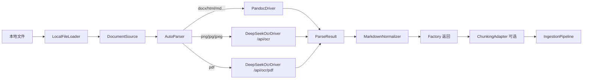

# DocumentOcr：文档解析 / OCR → Markdown

> **状态**：Pandoc + DeepSeek OCR（图片 / PDF）已落地。本文描述 `src/Support/DocumentOcr` **当前行为**。  
> 短文速览：[src/Support/DocumentOcr/README.md](../src/Support/DocumentOcr/README.md)

## 定位

将本地文档转为统一 **Markdown**（`ParseResult`），供 RAG 入库或其它业务使用。

| 目标 | 做法 |
|------|------|
| 多格式入口 | `DocumentOcrFactory::parseFile` → AutoParser 选 Driver |
| 结构化文档 | Pandoc：`docx` / `doc` / `html` / `htm` / `md` / `txt` → GFM |
| 扫描件 / PDF | DeepSeek OCR：图片走 `/api/ocr`，PDF 走 `/api/ocr/pdf` |
| 不绑定 Neuron | 输出只到 `ParseResult`；入库再经 `ChunkingAdapter` |
| 同步 API | 模块内无异步方法；长任务可在应用层用 Job / AsyncTask 包裹 |

---

## 架构



流程：`load → parse → MarkdownNormalizer`（normalize 只在 Factory 做一次，Driver 不重复）。

---

## 目录结构

```text
src/Support/DocumentOcr/
  DocumentOcrFactory.php          # 门面：parseFile / parseFileToDocuments
  WorkDirectory.php               # 临时目录
  Contracts/
    DocumentLoaderInterface.php
    DocumentParserInterface.php
    ParserSelectorInterface.php
  Loaders/LocalFileLoader.php
  Parsers/
    AutoParser.php
    PandocDriver.php
    DeepSeekOcrDriver.php
  Markdown/MarkdownNormalizer.php
  Chunking/ChunkingAdapter.php
  Schema/
    DocumentSource.php
    ParseOptions.php
    ParseResult.php
  Exceptions/
    DocumentException.php
    ParserException.php
    UnsupportedDocumentException.php
  Tests/DocumentOcrTest.php
  README.md

Test/Config/document_ocr.php
Test/Config/component/document_parser.php   # DI 名 document_ocr
src/Stubs/document_ocr.conf.stub.php
src/Stubs/document_parser.component.stub.php
```

命名空间：`Swoolefy\Support\DocumentOcr`。

---

## 配置与组件

### `Config/document_ocr.php`

完整键见 [`Test/Config/document_ocr.php`](../Test/Config/document_ocr.php) / stub。摘要：

#### `pandoc`

| 键 | 默认 | Env |
|----|------|-----|
| `enabled` | `true` | `DOCUMENT_OCR_PANDOC_ENABLED` |
| `bin` | `pandoc` | `PANDOC_BIN` |
| `runner_name` | `document-pandoc` | — |
| `concurrent` | `2` | — |
| `input_formats` | `docx,doc,html,htm,md,txt` | — |
| `output_format` | `gfm` | — |
| `work_dir` | `/tmp/swoolefy_document_ocr/pandoc` | `DOCUMENT_OCR_PANDOC_WORK_DIR` |

#### `deepseek_ocr`

| 键 | 默认 | Env |
|----|------|-----|
| `enabled` | `true` | `DOCUMENT_OCR_DEEPSEEK_ENABLED` |
| `base_uri` | `http://127.0.0.1:7860` | `DEEPSEEK_OCR_BASE_URI` |
| `endpoint` | `/api/ocr` | `DEEPSEEK_OCR_ENDPOINT` |
| `pdf_endpoint` | `/api/ocr/pdf` | `DEEPSEEK_OCR_PDF_ENDPOINT` |
| `time_out` | `120` | `DEEPSEEK_OCR_TIME_OUT`（兼容 `DEEPSEEK_OCR_TIMEOUT`） |
| `connect_timeout` | `3` | `DEEPSEEK_OCR_CONNECT_TIMEOUT` |
| `max_retry_num` | `1` | `DEEPSEEK_OCR_MAX_RETRY_NUM` |
| `retry_sleep_ms` | `1000`（驱动内上限 2000） | `DEEPSEEK_OCR_RETRY_SLEEP_MS` |
| `clean_temp` / `output_mmd` | `true` | — |
| `allowed_extensions` | `png,jpg,jpeg,pdf` | — |
| `max_file_size` | `20MB` | `DEEPSEEK_OCR_MAX_FILE_SIZE` |
| `pdf_max_file_size` | `100MB` | `DEEPSEEK_OCR_PDF_MAX_FILE_SIZE` |
| `work_dir` | `/tmp/swoolefy_document_ocr/deepseek` | `DEEPSEEK_OCR_WORK_DIR` / `DOCUMENT_OCR_DEEPSEEK_WORK_DIR` |

约束：`time_out > connect_timeout` 且二者 `> 0`，否则构造期抛 `ParserException`。

工厂兼容旧键：`timeout` → `time_out`；`retry.times` / `retry_times` → `max_retry_num`。

配置文件缺失时：`fromConfig([])` 两 Driver 均按代码默认启用。

### 组件注册

[`Test/Config/component/document_parser.php`](../Test/Config/component/document_parser.php)：

- **文件名** `document_parser.php`
- **DI 名** `document_ocr` → `DocumentOcrFactory`

```php
/** @var \Swoolefy\Support\DocumentOcr\DocumentOcrFactory $ocr */
$ocr = Application::getApp()->get('document_ocr');
```

注入外部 Guzzle（如统一 CurlProxy）：

```php
return DocumentOcrFactory::fromConfig($config, deepSeekClient: $client);
```

---

## 核心 API

### DocumentOcrFactory

```php
public static function fromConfig(array $config, ?Client $deepSeekClient = null): self;

/** load → parse → MarkdownNormalizer */
public function parseFile(string $path, ?ParseOptions $options = null, array $metadata = []): ParseResult;

/** 解析后切分为 Neuron Document[]（sourceType = document_ocr） */
public function parseFileToDocuments(
    string $path,
    ?ParseOptions $options = null,
    string $sourceName = '',
    array $metadata = [],
    int $maxChars = 2000,
): array;

public function parser(): DocumentParserInterface; // 通常为 AutoParser
```

**仅同步**。无队列 / 异步 API；耗时长的调用请在应用层包 Job 或自定义进程。

### Schema

```php
new DocumentSource(
    string $path,
    string $extension,        // 小写、无点
    ?string $mimeType = null, // 属性名 mimeType；metadata 里写 mime
    array $metadata = [],
);

new ParseOptions(?string $parser = null); // 'pandoc' | 'deepseek_ocr' | null

new ParseResult(
    string $markdown,
    string $parserName,
    string $selectionReason = '',
    int $durationMs = 0,
    ?string $sourceHash = null,
    array $metadata = [],
    array $assets = [],       // 字段已预留；当前 Driver 通常留空
);
ParseResult::with(array $overrides): self;
```

### Driver metadata（已写入）

两 Driver 均在 `ParseResult.metadata` 中设置：

| 键 | 说明 |
|----|------|
| `parser` | Driver 名 |
| `mime` | 来自 `DocumentSource::mimeType` |
| `extension` | 扩展名 |
| `durationMs` / `sourcePath` / `sourceHash` | 耗时与源文件信息 |

另加：

- Pandoc：`workDir`、`outputFormat`
- DeepSeek：`endpoint`、`attempts`、`ocrResponseKeys`

顶层还有 `ParseResult::$durationMs` / `$sourceHash` / `$selectionReason`。

### ChunkingAdapter / MarkdownNormalizer

```php
new ChunkingAdapter(int $maxChars = 2000);
/** @return list<\NeuronAI\RAG\Document> */
splitParseResult(ParseResult $result, string $sourceName = '', array $extraMeta = []): array;

MarkdownNormalizer::normalize(string $markdown): string;
// CRLF→LF、trim、连续空行折叠为 \n\n
```

### 异常体系

```text
DocumentException extends RuntimeException
└── ParserException
    └── UnsupportedDocumentException
```

| 场景 | 异常 |
|------|------|
| 文件不存在 | `DocumentException` |
| 无可用 Driver / 强制 parser 不支持 | `UnsupportedDocumentException` |
| Pandoc/OCR 执行或 HTTP 失败 | `ParserException` |
| OCR 超时参数非法 | `ParserException`（构造期） |

---

## AutoParser 选择规则

| 输入 | Driver | `selectionReason` |
|------|--------|-------------------|
| `docx` / `doc` / `html` / `htm` / `md` / `txt` | `pandoc` | `structured_format:{ext}` |
| `png` / `jpg` / `jpeg` | `deepseek_ocr` | `image_extension:{ext}` |
| `pdf` | `deepseek_ocr`（`pdf_endpoint`） | `pdf_direct_deepseek_ocr` |
| `ParseOptions(parser: '…')` | 指定 Driver | `forced_parser:{name}` |
| 无命中 | — | 抛 `UnsupportedDocumentException` |

强制 parser 存在但不支持该扩展名 → 同样抛 `UnsupportedDocumentException`。

---

## PandocDriver

- 名：`pandoc`
- 机制：`CommandRunner` 调本机 pandoc：`-t gfm -o … --extract-media=`
- 任务目录写在 `work_dir` 下，`finally` 清理（提取的 media **不**回填到 `ParseResult.assets`）
- 并发：同 `runner_name` 下受 `concurrent` 限制

---

## DeepSeekOcrDriver

- 名：`deepseek_ocr`
- 图片 → `POST {base_uri}{endpoint}`（默认 `/api/ocr`）
- PDF → `POST {base_uri}{pdf_endpoint}`（默认 `/api/ocr/pdf`，服务端多页）
- 公开：`DeepSeekOcrDriver::endpointFor(string $extension): string`
- 表单：`file` + `clean_temp` + `output_mmd`
- 响应正文键尝试：`markdown` / `mmd` / `text` / `content` / `result`（及 `data` 下同名）；或本地路径键 `path` / `file` / `output_path`（须在 `work_dir` 下）
- 重试：`max_retry_num`（不含首次）；间隔 `retry_sleep_ms`（≤2000）
- 大小：图片用 `max_file_size`，PDF 用 `pdf_max_file_size`

---

## 使用示例

### 解析单文件

```php
use Swoolefy\Core\Application;
use Swoolefy\Support\DocumentOcr\Exceptions\DocumentException;
use Swoolefy\Support\DocumentOcr\Exceptions\ParserException;
use Swoolefy\Support\DocumentOcr\Exceptions\UnsupportedDocumentException;
use Swoolefy\Support\DocumentOcr\Schema\ParseOptions;

/** @var \Swoolefy\Support\DocumentOcr\DocumentOcrFactory $ocr */
$ocr = Application::getApp()->get('document_ocr');

try {
    $result = $ocr->parseFile('/data/manual.docx');
    // 强制 OCR：
    // $result = $ocr->parseFile('/data/scan.png', new ParseOptions(parser: 'deepseek_ocr'));

    $markdown = $result->markdown;
    $parser   = $result->parserName;
    $reason   = $result->selectionReason;
} catch (UnsupportedDocumentException $e) {
    // 类型不支持
} catch (ParserException $e) {
    // Driver 执行失败
} catch (DocumentException $e) {
    // 其它（如文件不存在）
}
```

### 接入 RAG 入库

```php
$docs = $ocr->parseFileToDocuments(
    '/data/manual.docx',
    sourceName: 'manual.docx',
    maxChars: 2000,
);
// 或手动：
// $result = $ocr->parseFile($path);
// $docs = (new ChunkingAdapter(2000))->splitParseResult($result, 'manual.docx');

$pipeline->ingest('product_kb', $docs);
```

---

## 与 swoolefy AI / RAG 的关系

| 层 | 职责 |
|----|------|
| DocumentOcr | 文件 → Markdown（`ParseResult`） |
| ChunkingAdapter | Markdown → `NeuronAI\RAG\Document[]` |
| IngestionPipeline / VectorStore | 切块入库、检索 |

本模块**不**实现向量库或 Agent；只保证上游解析契约稳定。

---

## 注意事项与边界

| 点 | 说明 |
|----|------|
| 同步阻塞 | Worker 内直接调大 PDF OCR 会占协程/进程时间；重活建议进 Job 进程 |
| Pandoc 依赖 | 需本机安装 `pandoc`；测试通过 mock executor，不强制本机二进制 |
| OCR 服务 | 需可达的 DeepSeek OCR HTTP；测试通过注入 mock callable / Client |
| `assets` | 字段预留；Pandoc extract-media 清理后不回传路径 |
| 无 MinerU / Docling | 未来可再加 Driver，挂到 AutoParser 列表即可 |

### 何时不适用

- 只要纯文本 / 已有 Markdown → 不必走本模块  
- 需要版面级结构化 JSON（复杂表格坐标等）→ OCR 服务能力之外，需换/扩 Provider  

---

## 落地状态与后续

| 阶段 | 内容 | 状态 |
|------|------|------|
| **1** | Pandoc + 图片 DeepSeek OCR + AutoParser + Factory + Chunking + 测试 | ✅ |
| **2** | PDF Direct OCR（`pdf_endpoint`）+ 大小/超时配置 | ✅ |
| **3** | MinerU / Docling 等更多 Driver（可选） | 未做 |
| **4** | 模块内异步封装 / 结果缓存（可选） | 未做 |

---

## 测试

```bash
composer test:document-ocr
# 或
./vendor/bin/phpunit --filter DocumentOcrTest
```

Pandoc / OCR 均注入 mock，不依赖本机 pandoc 或 OCR 服务。

---

## 相关文件

| 路径 | 说明 |
|------|------|
| [src/Support/DocumentOcr/](../src/Support/DocumentOcr/) | 实现 |
| [src/Support/DocumentOcr/README.md](../src/Support/DocumentOcr/README.md) | 快速使用 |
| [Test/Config/document_ocr.php](../Test/Config/document_ocr.php) | 配置 |
| [Test/Config/component/document_parser.php](../Test/Config/component/document_parser.php) | DI `document_ocr` |
| [src/Stubs/document_ocr.conf.stub.php](../src/Stubs/document_ocr.conf.stub.php) | 配置模版 |
| [src/Stubs/document_parser.component.stub.php](../src/Stubs/document_parser.component.stub.php) | 组件模版
