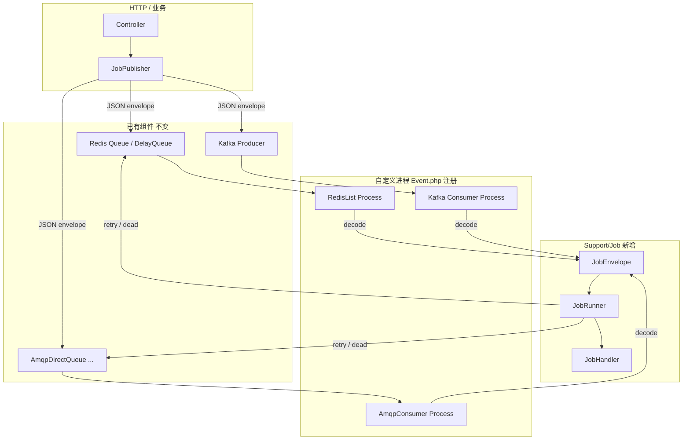

# Swoolefy Job 轻量封装方案（生产可用）

> 状态：**设计稿（推荐落地版）**  
> 定位：在**现有自定义进程消费**之上，补一层统一的 **Job 信封 + Handler + 重试/退避**，**不新建业务 SQL 表**。  
> 原则：**进程与传输仍由业务自由注册**（`Event.php` / Daemon）；框架只规范「消息长什么样、业务怎么处理、失败怎么重试」。

完整版（含 Transactional Outbox / DB DLQ / Ledger）见本文末尾「可选增强」；默认不采用，避免首期过重。

---

## 0. 问题与边界

### 0.1 已有且要保留的能力

`Test/Event.php` 已展示成熟模式：自定义进程 + Redis List / DelayQueue / AMQP / Kafka，灵活、可按需启停：

```php
// ProcessManager::getInstance()->addProcess('redis_list_test', RedisList::class, true, [], null, true);
// ProcessManager::getInstance()->addProcess('amqp-consumer', AmqpConsumer::class, ...);
// ProcessManager::getInstance()->addProcess('kafka-consumer-topic1', ConsumerKafka::class, ...);
```

进程自己 `pop` / `consumerWithTime` / `poll`，**这一层不改、不替换**。

### 0.2 缺什么

| 缺 | 后果 |
|----|------|
| 统一消息信封 | 各进程 payload 结构不一，难复用 Handler、难传 tenantId/traceId/attempt |
| 统一业务入口 | `var_dump` / 直接写 Controller，缺少 `handle(Job): Result` |
| 统一重试语义 | 有的调 `$queue->retry()`，有的 NACK，次数与退避不透明 |
| 毒消息约定 | 重试耗尽后行为各异（丢弃 / 打日志 / 进某 list） |

### 0.3 本方案做什么 / 不做什么

| 做 | 不做（首期） |
|----|----------------|
| `JobEnvelope` 统一序列化 | ❌ 强制 Outbox + 建表 |
| `JobHandlerInterface` + Registry | ❌ 替换 ProcessManager / 锁死某 MQ |
| `JobRunner`：超时、重试次数、指数退避、耗尽回调 | ❌ 强制 DB ledger / 管理台 |
| `JobPublisher`：组信封并交给已有组件 publish | ❌ 新建「框架独占」消费进程基类（可提供可选 Helper） |
| 死信：**Redis List / 日志 / 现有 AMQP DLX**（零新表） | ❌ 默认 SQL Schema |

语义：**At-least-once**；Exactly-once 靠 Handler **幂等**（业务唯一键 / 状态机）。

---

## 1. 架构（薄一层）



**一句话**：传输与进程还是你的；**进进程后的业务处理**走 Job 层。

---

## 2. 核心契约

### 2.1 命名空间（建议极简）

```text
Swoolefy\Support\Job\
  JobEnvelope.php
  JobResult.php
  JobHandlerInterface.php
  JobHandlerRegistry.php       # jobType → Handler（Phase 2）
  JobRetryPolicy.php
  JobRunner.php                # run / runRegistered
  JobPublisher.php
  JobId.php
  JobConfig.php                # Config/job.php
  JobComponentFactory.php
  RedisDeadLetter.php          # 零建表死信 List + replay
  Console/replay_dead_letter.php
```

无 `Outbox/`、无 `Schema/*.sql`、无强制 Transport 抽象（首期用不到）。

### 2.2 JobEnvelope

```json
{
  "v": 1,
  "jobId": "job_20260712_ab12cd",
  "jobType": "order.paid.notify",
  "payload": { "orderId": 10001 },
  "meta": {
    "tenantId": "t1",
    "traceId": "…",
    "idempotencyKey": "order:10001:paid-notify"
  },
  "attempt": 1,
  "maxAttempts": 5,
  "createdAt": 1720764000
}
```

| 字段 | 说明 |
|------|------|
| `jobId` | 全局唯一；日志与幂等兜底 |
| `jobType` | 业务类型；Registry 路由或进程内写死 Handler |
| `payload` | **小对象**；大内容只放 ref（对齐 `RagIngestJob`） |
| `meta.tenantId` / `traceId` | 跨进程上下文 |
| `meta.idempotencyKey` | Handler 幂等键 |
| `attempt` / `maxAttempts` | 消费侧重试计数（写回重投信封） |

```php
final class JobEnvelope
{
    public function __construct(
        public readonly string $jobId,
        public readonly string $jobType,
        public readonly array $payload,
        public readonly array $meta = [],
        public readonly int $attempt = 1,
        public readonly int $maxAttempts = 5,
        public readonly int $createdAt = 0,
        public readonly int $v = 1,
    ) {}

    public static function make(string $jobType, array $payload, array $meta = [], ?JobRetryPolicy $policy = null): self;
    public static function fromArray(array $data): self;
    /** @return array<string, mixed> */
    public function toArray(): array;
    public function withAttempt(int $attempt): self;
}
```

兼容：消费端若收到**非信封**旧消息，可配置 `JobRunner::wrapLegacy($raw, defaultJobType)` 包一层，便于灰度。

### 2.3 JobResult

```php
enum JobResultStatus: string {
    case SUCCESS = 'success';
    case RETRY   = 'retry';    // 可重试（瞬时失败）
    case FAIL    = 'fail';     // 不可重试 → 死信路径
    case DISCARD = 'discard';  // 主动丢弃（过期等）
}

final class JobResult
{
    public function __construct(
        public JobResultStatus $status,
        public ?string $error = null,
        public ?int $retryAfterMs = null, // 覆盖默认退避
    ) {}

    public static function success(): self;
    public static function retry(string $error, ?int $retryAfterMs = null): self;
    public static function fail(string $error): self;
    public static function discard(?string $reason = null): self;
}
```

### 2.4 JobHandlerInterface

```php
interface JobHandlerInterface
{
    /** @return list<string> */
    public function types(): array;

    public function handle(JobEnvelope $job): JobResult;
}
```

约束：

1. **幂等**：同一 `idempotencyKey` 重复执行可接受。  
2. 瞬时失败返回 `retry()`；数据非法返回 `fail()`。  
3. 未捕获异常由 `JobRunner` 视为 `retry()`。

### 2.5 JobRetryPolicy

```php
final class JobRetryPolicy
{
    public function __construct(
        public int $maxAttempts = 5,
        public int $baseDelayMs = 1000,
        public float $backoffMultiplier = 2.0,
        public int $maxDelayMs = 300_000,
        public float $jitterRatio = 0.2,
    ) {}

    public function delayMsForAttempt(int $attempt): int
    {
        $raw = (int) min(
            $this->maxDelayMs,
            $this->baseDelayMs * ($this->backoffMultiplier ** max(0, $attempt - 1)),
        );
        $jitter = (int) ($raw * $this->jitterRatio * (mt_rand(0, 1000) / 1000));
        return $raw + $jitter;
    }

    public function shouldRetry(int $attempt): bool
    {
        return $attempt < $this->maxAttempts;
    }
}
```

与 Workflow `RetryPolicy` 字段对齐，独立类，避免 Job 依赖 Workflow。

---

## 3. JobRunner：进程内唯一「业务引擎」

进程 pop 到数据后，只做三件事：**解码 → Runner → 按结果驱动已有队列 API**。

```php
final class JobRunner
{
    public function __construct(
        private readonly JobRetryPolicy $policy = new JobRetryPolicy(),
        private readonly float $timeoutSeconds = 120,
    ) {}

    /**
     * @param callable(JobEnvelope, int $delayMs): void $requeue  // 由进程注入：如何延迟重投
     * @param callable(JobEnvelope, string $error): void $dead     // 由进程注入：如何死信（无表）
     */
    public function run(
        JobHandlerInterface $handler,
        JobEnvelope $job,
        callable $requeue,
        callable $dead,
    ): void {
        // 1) 可选 TimeoutGuard
        // 2) try { $result = $handler->handle($job); } catch { $result = retry(exception) }
        // 3) match:
        //    SUCCESS/DISCARD → return（进程侧 ACK / 已 pop 即完成）
        //    RETRY / 异常 → if policy.shouldRetry(attempt): requeue(job.withAttempt(attempt+1), delay)
        //                  else: dead(job, error)
        //    FAIL → dead(job, error)
    }
}
```

**关键点**：`requeue` / `dead` 是 **callable**，由各传输进程自己实现——从而**零侵入**现有 Redis/AMQP/Kafka 组件。

---

## 4. 与现有进程怎么接（示例）

### 4.1 Redis List（改造 `RedisList` 消费段）

```php
// 生产（HTTP）
$envelope = JobEnvelope::make('order.paid.notify', ['orderId' => $id], [
    'tenantId' => $tenantId,
    'traceId' => $traceId,
    'idempotencyKey' => "order:{$id}:paid-notify",
]);
App::getQueue()->push($envelope->toArray());

// 消费进程内
$result = $queue->pop(3);
$data = is_string($result[1]) ? json_decode($result[1], true) : $result[1];
$job = JobEnvelope::fromArray($data);

$runner = new JobRunner(new JobRetryPolicy(maxAttempts: 5));
$runner->run(
    handler: new OrderPaidNotifyHandler(),
    job: $job,
    requeue: function (JobEnvelope $next, int $delayMs) use ($queue) {
        // 已有 delay / retry 能力优先
        $queue->retry($next->toArray(), $delayMs); // 或 push 到 DelayQueue
    },
    dead: function (JobEnvelope $job, string $error) use ($queue) {
        // 零建表：推入死信 List + warning 日志
        $queue->getRedis()->lPush('job:dead:default', json_encode([
            'job' => $job->toArray(),
            'error' => $error,
            'at' => time(),
        ], JSON_UNESCAPED_UNICODE));
        SupportLog::warning('job', 'job.dead', [
            'jobId' => $job->jobId,
            'jobType' => $job->jobType,
            'attempt' => $job->attempt,
            'error' => $error,
        ]);
    },
);
```

### 4.2 AMQP（改造 `process_message`）

```php
public function process_message($message): void
{
    $job = JobEnvelope::fromArray(json_decode($message->body, true));
    $runner = new JobRunner();
    $runner->run(
        new OrderPaidNotifyHandler(),
        $job,
        requeue: function (JobEnvelope $next, int $delayMs) use ($message) {
            // 发布到已有 delay queue / 或 basic_nack + 延迟插件
            Application::getApp()->get('orderDelayDirectQueue')
                ->publish(json_encode($next->toArray()), /* routing */, $delayMs);
            $message->ack(); // 原消息确认，避免重复无退避重投
        },
        dead: function (JobEnvelope $job, string $error) use ($message) {
            // 走已有 DLX，或 publish 到 dead routing key；再 ack
            SupportLog::warning('job', 'job.dead', [/* 精简字段 */]);
            $message->ack();
        },
    );
    // SUCCESS 路径：ack
    $message->ack();
}
```

> 实际 ACK 时机建议在 `JobRunner` 回调后由进程统一处理，避免双 ack；上面示意逻辑，实现时可把 `ack` 也做成成功回调。

### 4.3 Kafka

成功：commit；`retry`：写入 retry topic（带 `attempt+1`）后 commit 原消息（**禁止**长期不提交堵分区）；`dead`：写入 `job.dlq.*` topic 或仅打日志后 commit。

### 4.4 Event.php 仍然这样注册

```php
if (!SystemEnv::isWorkerService()) {
    ProcessManager::getInstance()->addProcess(
        'order-notify-consumer',
        \Test\Process\JobProcess\OrderNotifyConsumer::class,
        true,
        [],
        null,
        true,
    );
}
```

进程类仍继承 `AbstractProcess`，**内部**使用 `JobRunner`——框架不强迫你换基类。

---

## 5. JobPublisher（生产侧薄封装）

```php
final class JobPublisher
{
    /**
     * @param callable(array $envelopeArray): void $publish  用户绑定到 queue/amqp/kafka
     */
    public function __construct(
        private readonly callable $publish,
        private readonly JobRetryPolicy $defaultPolicy = new JobRetryPolicy(),
    ) {}

    public function dispatch(string $jobType, array $payload, array $meta = []): JobEnvelope
    {
        $job = JobEnvelope::make($jobType, $payload, $meta, $this->defaultPolicy);
        ($this->publish)($job->toArray());
        return $job;
    }
}

// 装配示例（业务代码）
$publisher = new JobPublisher(function (array $data) {
    App::getQueue()->push($data);
});
$publisher->dispatch('order.paid.notify', ['orderId' => $id], ['tenantId' => $t]);
```

可选：`JobComponentFactory::publisher('redis_default')` 读 `Config/job.php` 里「逻辑名 → 组件闭包」，**仍不新建表**。

---

## 6. 死信：零建表三种做法

| 方式 | 做法 | 适用 |
|------|------|------|
| **A. Redis List** | `job:dead:{queue}` LPUSH JSON | 默认推荐，可运维 `LRANGE` / 脚本重放 |
| **B. AMQP DLX** | 已有 `AMQP_COMMON_DLX_EXCHANGE` 拓扑 | 已上 Rabbit 的项目 |
| **C. 仅日志** | `SupportLog::warning` + metrics | 可丢失告警场景 |

重放（运维脚本，非必须框架 API）：

```bash
# 从 Redis dead list 取出 → JobPublisher 再 dispatch（attempt 重置为 1）
```

---

## 7. 配置（可选，极简）

`APP_PATH/Config/job.php`（stub，无 DB 段）：

```php
return [
    'job' => [
        'default_max_attempts' => (int) env('JOB_MAX_ATTEMPTS', 5),
        'base_delay_ms' => 1000,
        'backoff_multiplier' => 2.0,
        'max_delay_ms' => 300000,
        'handler_timeout_seconds' => 120,
        // 死信：redis_list | log_only
        'dead_letter' => [
            'driver' => env('JOB_DLQ', 'redis_list'),
            'redis_key_prefix' => 'job:dead:',
        ],
    ],
];
```

---

## 8. 日志与指标（精简）

| 事件 | 级别 | 字段 |
|------|------|------|
| 消费成功 | 不打 / debug | — |
| 重试 | warning（可采样） | jobId, jobType, attempt, error |
| 死信 | warning | jobId, jobType, attempt, error |
| Handler 超时 | warning | jobId, jobType |

指标（有则更好）：`job_consume_total{result}`、`job_dead_total{job_type}`。

---

## 9. 与 RagIngest / AsyncTask / Workflow

| 能力 | 用法 |
|------|------|
| `RagIngestJob` | 可 `jobType=rag.ingest`，payload 为其 `toArray()`；或 Handler 内再转 |
| `AsyncTask` | 进程内非持久；**持久异步用 Job + 已有队列** |
| Workflow | 编排 / HITL / Saga；**单次副作用异步用 Job** |

---

## 10. 实施计划（轻量）

### Phase 1（核心，约数天）

- [x] `JobEnvelope` / `JobResult` / `JobRetryPolicy` / `JobHandlerInterface`  
- [x] `JobRunner` + 单测（退避公式、耗尽走 dead、成功不 requeue）  
- [x] `JobPublisher`  
- [x] Test Demo：`OrderNotifyConsumer` + `OrderPaidNotifyHandler`（`Event.php` 注释注册）  
- [x] `docs/Job.md`（本文）+ `src/Support/Job/README.md`

### Phase 2（体验）

- [x] `JobHandlerRegistry`（多 jobType 共进程）+ `JobRunner::runRegistered`  
- [x] `Config/job.php` stub（`job.conf.stub.php`）+ `create` 复制 + `JobConfig` / `JobComponentFactory`  
- [x] Redis dead list 重放（`RedisDeadLetter` + `Console/replay_dead_letter.php`）  
- [x] AMQP / Kafka / Redis Multi demo 进程示例  

### Phase 3（按需，非默认）

- [ ] Transactional Outbox + SQL（仅强一致场景开启）——见原完整方案思路，**模块可选加载**  
- [ ] DB DeadLetter / 管理 API  

---

## 11. 验收标准

1. HTTP `JobPublisher::dispatch` 后，自定义进程能 `fromArray` 并执行 Handler。  
2. Handler 连续 `retry`，`attempt` 递增，延迟大致按退避增长。  
3. 超过 `maxAttempts` 后进入 Redis dead list（或日志），**主队列不再被毒消息堵死**。  
4. `Event.php` 注册方式不变；不强制新 SQL。  
5. 重复投递同一 `idempotencyKey`，业务无双份副作用（Handler 自测）。

---

## 12. 决策摘要

| 决策 | 选择 | 理由 |
|------|------|------|
| 进程模型 | **保持** Event 自定义进程 | 已灵活、已生产验证 |
| 框架职责 | 信封 + Runner + 重试策略 | 补业务封装，不夺传输控制权 |
| 存储 | **默认无新表** | 降低接入成本；DLQ 用 Redis/日志/现有 DLX |
| Outbox | 可选增强 | 需要事务原子性时再开 |
| 默认语义 | At-least-once + 幂等 | 务实可落地 |

---

## 13. 可选增强：何时才上 Outbox / SQL

仅当同时满足：

- 业务写库与发消息必须原子；且  
- 不能接受「先发消息后回滚」或「提交后 publish 失败靠人工」  

再引入 `job_outbox` 表与 Poller。那是**增强包**，不是本轻量方案的前置依赖。

---

## 14. 代码锚点

| 锚点 | 路径 |
|------|------|
| 进程注册 | `Test/Event.php`（约 50–85 行） |
| Redis 消费 demo | `Test/Process/ListProcess/RedisList.php` |
| AMQP 消费 demo | `Test/Process/AmqpProcess/AmqpConsumer.php` |
| Kafka 消费 demo | `Test/Process/Kafka/ConsumerKafka.php` |
| Queue / Retry | `library` → `Queues\Queue`、`RedisDelayQueue` |
| 信封风格参考 | `src/Support/Rag/Ingestion/RagIngestJob.php` |
| 退避字段参考 | `src/Support/Workflow/Engine/RetryPolicy.php` |

---

**文档版本**：v2.0-lite（2026-07-12）  
**相对 v1**：去掉默认 Outbox/建表/强制 Transport；改为「进程自由 + Job 信封/Runner」生产主路径。
