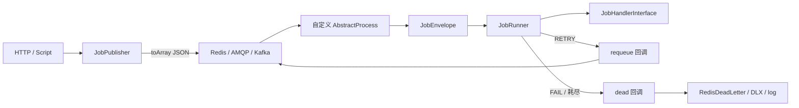

# Job：轻量信封 + Runner（生产可用）

> **状态**：Phase 1–2 已落地。本文描述 `src/Support/Job` **当前行为**。  
> 传输层仍用现有自定义进程（Redis / AMQP / Kafka）；Job **不**另建 SQL 表、**不**替换 ProcessManager。  
> 短文速览：[src/Support/Job/README.md](../src/Support/Job/README.md)

## 0. 问题与边界

### 0.1 已有且要保留的能力

| 能力 | 说明 |
|------|------|
| `ProcessManager::addProcess` | 自定义消费进程入口不变 |
| Redis List / 延迟队列 | `App::getQueue()` 等现有组件 |
| AMQP / Kafka 进程 | 现有 Library 消费写法 |
| 协程 `goApp` | 进程内并发消费照旧 |

### 0.2 Job 层补什么

跨传输统一的：

1. **信封**（`JobEnvelope`）：`jobId` / `jobType` / `payload` / `meta` / `attempt`
2. **Handler 契约**（`JobHandlerInterface` + `JobResult`）
3. **重试 / 退避**（`JobRetryPolicy` + `JobRunner`）
4. **多类型路由**（`JobHandlerRegistry`）
5. **生产侧组装**（`JobPublisher`）
6. **Redis 死信**（`RedisDeadLetter` + replay CLI）

### 0.3 做什么 / 不做什么

| 做 | 不做 |
|----|------|
| 统一信封与 Handler 返回值 | 新建 Job 专用 SQL / Outbox（Phase 3 可选） |
| Runner 映射 SUCCESS / RETRY / FAIL / DISCARD | 内置传输 Driver（Redis/AMQP 仍在进程里） |
| Registry 多 jobType 共进程 | 中间件链 / Laravel 式 Job 基类 |
| Redis List 死信 + replay | 强制 TimeoutGuard（`handler_timeout_seconds` 已预留，尚未强制执行） |

语义：**at-least-once**。Exactly-once 靠 Handler 对 `meta.idempotencyKey` 等做幂等。

---

## 1. 架构（薄一层）



要点：

- **进程**负责 pop / ACK / NACK / 延迟投递实现。
- **Runner**只决定业务侧重试语义，通过 `$requeue` / `$dead` 回调交给进程。
- 多 Handler 时用 `runRegistered`；未知 `jobType` → 直接 `$dead`（毒消息）。

---

## 2. 目录与命名空间

```text
src/Support/Job/
  JobEnvelope.php
  JobId.php
  JobHandlerInterface.php
  JobResult.php / JobResultStatus.php
  JobRetryPolicy.php
  JobRunner.php / JobRunOutcome.php
  JobHandlerRegistry.php
  JobPublisher.php
  JobConfig.php / JobComponentFactory.php
  RedisDeadLetter.php
  Exception/JobException.php
  Console/replay_dead_letter.php
  Tests/…
  README.md

src/Stubs/job.conf.stub.php          → create 时复制为 Config/job.php

Test/Config/job.php
Test/Module/Job/*Handler.php
Test/Process/JobProcess/
  OrderNotifyConsumer.php            # 单 Handler Redis
  JobRedisMultiConsumer.php          # Registry + RedisDeadLetter
  JobAmqpConsumer.php
  JobKafkaConsumer.php
```

命名空间：`Swoolefy\Support\Job`（异常：`Swoolefy\Support\Job\Exception\JobException`）。

---

## 3. 核心契约

### 3.1 JobEnvelope

```php
final class JobEnvelope
{
    public function __construct(
        public readonly string $jobId,
        public readonly string $jobType,
        public readonly array $payload,
        public readonly array $meta = [],
        public readonly int $attempt = 1,
        public readonly int $maxAttempts = 5,
        public readonly int $createdAt = 0,
        public readonly int $v = 1,
    ) {}

    public static function make(string $jobType, array $payload, array $meta = [], ?JobRetryPolicy $policy = null): self;
    public static function fromArray(array $data): self;           // jobType 空 / payload 非数组 → JobException
    public static function wrapLegacy(mixed $raw, string $defaultJobType): self; // 旧消息渐进迁移
    public function toArray(): array;
    public function withAttempt(int $attempt): self;
    public function metaString(string $key, ?string $default = null): ?string;
}
```

JSON 形态：

```json
{
  "v": 1,
  "jobId": "job_20260712_ab12cd34ef56",
  "jobType": "order.paid.notify",
  "payload": { "orderId": 10001 },
  "meta": { "tenantId": "t1", "idempotencyKey": "order:10001:paid-notify" },
  "attempt": 1,
  "maxAttempts": 5,
  "createdAt": 1720764000
}
```

`wrapLegacy`：已含 `(jobType+jobId)` 或 `(v+jobType)` → `fromArray`；否则整包当 `payload`，用 `$defaultJobType` 调 `make()`。

### 3.2 JobResult / JobResultStatus

```php
enum JobResultStatus: string { SUCCESS, RETRY, FAIL, DISCARD }

JobResult::success();
JobResult::retry(string $error, ?int $retryAfterMs = null);
JobResult::fail(string $error);
JobResult::discard(?string $reason = null);
```

| 返回 | 含义 |
|------|------|
| `SUCCESS` | 业务成功，进程 ACK |
| `RETRY` | 瞬时失败；未耗尽则 requeue（attempt+1） |
| `FAIL` | 不可恢复 → 立即 dead |
| `DISCARD` | 过期/忽略 → 不 requeue、不 dead |

### 3.3 JobHandlerInterface

```php
interface JobHandlerInterface
{
    /** @return list<string> */
    public function types(): array;

    public function handle(JobEnvelope $job): JobResult;
}
```

Demo：[`Test/Module/Job/OrderPaidNotifyHandler.php`](../Test/Module/Job/OrderPaidNotifyHandler.php)（`order.paid.notify`）。

### 3.4 JobRetryPolicy

```php
public function __construct(
    public int $maxAttempts = 5,
    public int $baseDelayMs = 1000,
    public float $backoffMultiplier = 2.0,
    public int $maxDelayMs = 300_000,
    public float $jitterRatio = 0.2,  // JobConfig 目前硬编码 0.2，未单独配置项
);

public function shouldRetry(int $attempt): bool;      // attempt < maxAttempts
public function delayMsForAttempt(int $attempt): int; // 指数退避 + jitter，封顶 maxDelayMs
```

生效次数：`min($job->maxAttempts, $policy->maxAttempts)`。  
延迟：`$result->retryAfterMs ?? $policy->delayMsForAttempt($job->attempt)`。

---

## 4. JobRunner

路径：[`JobRunner.php`](../src/Support/Job/JobRunner.php)

```php
public function __construct(
    private readonly JobRetryPolicy $policy = new JobRetryPolicy(),
    private readonly float $timeoutSeconds = 120, // 已存；TimeoutGuard 尚未强制执行
);

public function run(
    JobHandlerInterface $handler,
    JobEnvelope $job,
    callable $requeue,  // (JobEnvelope $next, int $delayMs): void
    callable $dead,     // (JobEnvelope $failed, string $error): void
): JobRunOutcome;

public function runRegistered(
    JobHandlerRegistry $registry,
    JobEnvelope $job,
    callable $requeue,
    callable $dead,
): JobRunOutcome;
```

### Outcome 映射

| Handler / 事件 | `JobRunOutcome` | 副作用 |
|----------------|-----------------|--------|
| `SUCCESS` | `SUCCESS` | 无（进程 ACK） |
| `DISCARD` | `DISCARDED` | 无 |
| `FAIL` | `DEAD` | `$dead($job, error)` |
| `RETRY` 且可重试 | `REQUEUED` | `$requeue($job.withAttempt(+1), delayMs)` |
| `RETRY` 耗尽 | `DEAD` | `$dead` |
| `handle` 抛 Throwable | 视同 `RETRY` | 同上 |
| `runRegistered` 未知 jobType | `DEAD` | `$dead(..., 'unregistered jobType: …')` |

日志：`SupportLog::warning('job', 'job.retry'|'job.dead', …)`（成功路径不打 info）。

---

## 5. 生产：JobPublisher

```php
use Swoolefy\Support\Job\JobComponentFactory;
use Test\App;

$publisher = JobComponentFactory::publisher(
    static fn (array $data) => App::getQueue()->push($data),
);

$envelope = $publisher->dispatch('order.paid.notify', [
    'orderId' => 10001,
], [
    'tenantId' => 't1',
    'idempotencyKey' => 'order:10001:paid-notify',
]);

// 已有信封（重放 / 转发）
$publisher->dispatchEnvelope($envelope);
```

工厂签名：`JobComponentFactory::publisher(callable $publish, ?JobConfig $config = null)`。  
**没有** `publisher('redis_default')` 这类命名绑定；publish callable 由业务注入。

---

## 6. 消费：与现有进程怎么接

### 6.1 Redis + Registry（推荐）

完整代码：[`JobRedisMultiConsumer.php`](../Test/Process/JobProcess/JobRedisMultiConsumer.php)

```php
$registry = JobComponentFactory::registry(
    new OrderPaidNotifyHandler(),
    new OrderExportHandler(),
);
$runner = JobComponentFactory::runner();
$dlq = JobComponentFactory::redisDeadLetter($redisObj);

$job = JobEnvelope::fromArray($raw);
$runner->runRegistered(
    $registry,
    $job,
    requeue: static function (JobEnvelope $next, int $delayMs) use ($queue): void {
        // Job 层单位是 ms；Queue::retry 用秒
        $seconds = max(1, (int) ceil($delayMs / 1000));
        $queue->retry($next->toArray(), $seconds);
    },
    dead: static function (JobEnvelope $failed, string $error) use ($dlq): void {
        $dlq->push($failed, $error, 'default');
    },
);
```

单 Handler 渐进迁移：[`OrderNotifyConsumer.php`](../Test/Process/JobProcess/OrderNotifyConsumer.php)（可用 `JobEnvelope::wrapLegacy`）。

### 6.2 AMQP / Kafka

| Demo | 说明 |
|------|------|
| [`JobAmqpConsumer`](../Test/Process/JobProcess/JobAmqpConsumer.php) | Registry + `consumerWithTime`；有 delay 队列则延迟再投；dead 侧 demo 以 ack 为主（可接 DLX） |
| [`JobKafkaConsumer`](../Test/Process/JobProcess/JobKafkaConsumer.php) | retry 时 producer republish；dead demo 为 log-only |

Kafka 无原生 delay 时可忽略 `$delayMs` 立即 republish（仍会 bump attempt）。

### 6.3 Event.php 注册

[`Test/Event.php`](../Test/Event.php)（注释示例）：

```php
// ProcessManager::getInstance()->addProcess('job-order-notify', \Test\Process\JobProcess\OrderNotifyConsumer::class, true, [], null, true);
// ProcessManager::getInstance()->addProcess('job-redis-multi', \Test\Process\JobProcess\JobRedisMultiConsumer::class, true, [], null, true);
// ProcessManager::getInstance()->addProcess('job-amqp-consumer', \Test\Process\JobProcess\JobAmqpConsumer::class, true, [], null, true);
// ProcessManager::getInstance()->addProcess('job-kafka-consumer', \Test\Process\JobProcess\JobKafkaConsumer::class, true, [], null, true);
```

取消注释并启动应用即可跑 Demo。

---

## 7. 死信：RedisDeadLetter

路径：[`RedisDeadLetter.php`](../src/Support/Job/RedisDeadLetter.php)

| 方法 | 行为 |
|------|------|
| `key($queue='default')` | `{prefix}{queue}`，默认 `job:dead:default` |
| `push($job, $error, $queue)` | LPUSH JSON `{job,error,at}` |
| `pop($queue)` | RPOP FIFO |
| `replay($publish, $queue, $limit)` | 弹出后 `withAttempt(1)` 再 `$publish` |
| `length($queue)` | List 长度 |

```php
$dlq = JobComponentFactory::redisDeadLetter(App::getRedis()->getObject());
$dlq->replay(fn (array $d) => App::getQueue()->push($d), 'default', 10);
```

CLI（需 Application / redis 上下文；无 App 时打印用法）：

```bash
php src/Support/Job/Console/replay_dead_letter.php --queue=default --limit=10
# JOB_REPLAY_MODE=queue|stdout
```

`dead_letter.driver`（`redis_list` | `log_only`）是**约定值**，框架不会自动切换实现；进程在 `$dead` 回调里决定用 RedisDeadLetter 还是只打日志。

---

## 8. 配置

模版：[`src/Stubs/job.conf.stub.php`](../src/Stubs/job.conf.stub.php)  
Test：[`Test/Config/job.php`](../Test/Config/job.php)  
读取：`JobConfig::load()` → `JobComponentFactory::*`

| 配置键 | 默认 | Env | 说明 |
|--------|------|-----|------|
| `default_max_attempts` | `5` | `JOB_MAX_ATTEMPTS` | 写入信封 / 策略 |
| `base_delay_ms` | `1000` | `JOB_BASE_DELAY_MS` | 首次退避基数（ms） |
| `backoff_multiplier` | `2.0` | `JOB_BACKOFF_MULTIPLIER` | 指数倍率 |
| `max_delay_ms` | `300000` | `JOB_MAX_DELAY_MS` | 延迟上限 |
| `handler_timeout_seconds` | `120` | `JOB_HANDLER_TIMEOUT_SECONDS` | **预留**；Runner 存值但尚未强制超时 |
| `dead_letter.driver` | `redis_list` | `JOB_DLQ` | 约定；进程侧选用 |
| `dead_letter.redis_key_prefix` | `job:dead:` | `JOB_DLQ_REDIS_PREFIX` | `RedisDeadLetter` 前缀 |

`jitterRatio` 当前在 `JobConfig::retryPolicy()` 内固定为 `0.2`。

---

## 9. JobComponentFactory

```php
JobComponentFactory::config(): JobConfig;
JobComponentFactory::runner(?JobConfig $config = null): JobRunner;
JobComponentFactory::publisher(callable $publish, ?JobConfig $config = null): JobPublisher;
JobComponentFactory::redisDeadLetter(object $redis, ?JobConfig $config = null): RedisDeadLetter;
JobComponentFactory::registry(JobHandlerInterface ...$handlers): JobHandlerRegistry;
```

---

## 10. 与 RagIngest / AsyncTask / Workflow

| 场景 | 建议 |
|------|------|
| 轻量异步通知 / 导出 | Job 信封 + 自定义进程 |
| 长链路编排 / HITL | Workflow（见 [AI-WORKFLOW.md](AI-WORKFLOW.md)） |
| 已有 RagIngest / AsyncTask | 可继续独立；新业务优先 Job 信封以便统一重试/死信 |

不必把一切搬进 Job；边界是「需要跨传输统一重试语义的后台任务」。

---

## 11. 测试

```bash
composer test:job
# 等价跑 Phase1 + Phase2：
# php src/Support/Job/Tests/JobPhase1Test.php
# php src/Support/Job/Tests/JobPhase2Test.php
```

覆盖：信封 / 策略 / Runner 映射 / Publisher / Registry / Config / RedisDeadLetter。

---

## 12. 落地状态与后续

| 阶段 | 内容 | 状态 |
|------|------|------|
| **1** | Envelope / Result / Policy / Runner / Publisher / 单 Handler Demo | ✅ |
| **2** | Registry / JobConfig / Factory / RedisDeadLetter / AMQP·Kafka Demo / 测试 | ✅ |
| **3** | TimeoutGuard 强制执行、Outbox / SQL 死信（按需） | 未做 |

### 决策摘要

1. 不替换 ProcessManager；Job 是进程内业务引擎。
2. ACK/NACK 永远在进程侧。
3. 零建表默认死信：Redis List。
4. at-least-once + Handler 幂等。
5. `handler_timeout_seconds` 已配置贯通，强制超时属后续增强。

### 何时才上 Outbox / SQL

- 需要与业务库同事务「写库 + 投递」原子性 → Outbox。
- 需要跨环境审计 / 运营后台翻死信 → SQL 死信表。  
否则保持 Redis List + replay 即可。

---

## 13. 代码锚点

| 路径 | 说明 |
|------|------|
| [src/Support/Job/](../src/Support/Job/) | 框架实现 |
| [src/Support/Job/README.md](../src/Support/Job/README.md) | 快速使用 |
| [src/Stubs/job.conf.stub.php](../src/Stubs/job.conf.stub.php) | 配置模版 |
| [Test/Config/job.php](../Test/Config/job.php) | Test 配置 |
| [Test/Module/Job/](../Test/Module/Job/) | Demo Handler |
| [Test/Process/JobProcess/](../Test/Process/JobProcess/) | 消费 Demo |
| [Test/Event.php](../Test/Event.php) | `addProcess` 注释注册 |
