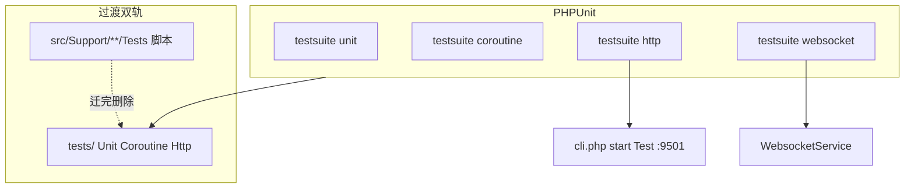

# Testing：PHPUnit 测试改造技术方案

## 1. 定位与目标

### 1.1 现状问题

| 问题 | 表现 |
|------|------|
| 无标准测试框架 | 无 `phpunit/phpunit`、无 `phpunit.xml`；全库无 `TestCase` |
| 脚本式回归 | `src/Support/**/Tests/*Test.php`：本地 `assertTrue` + `echo [PASS]` + `foreach ($tests)` |
| CI 难接入 | `composer test:*` 串联 `@php file.php`，无 JUnit / 覆盖率 / 失败聚合 |
| 分层缺失 | Unit、协程、HTTP 全流程、Redis 依赖混在一起，默认跑不稳 |
| HTTP「测试」靠人工 | README / Module 写 curl；需先 `php cli.php start Test`，无自动化断言 |
| 协程/连接池难回归 | 仅个别 Demo（如 Order 协程单例）有手写检查，无统一基类与泄漏检测 |

### 1.2 改造目标

1. **全面接入 PHPUnit 11**，作为唯一推荐运行器。
2. **三层套件**：Unit / CoroutineUnit / HttpIntegration（+ Websocket / redis 可选 group）。
3. **HTTP 全流程 = 自动化 curl**：真启 `Test` 服务 + Guzzle 打 `/api/v1/*`，覆盖路由→中间件→Controller→JSON。
4. **双轨过渡**：旧脚本与 PHPUnit 并存，按模块迁完再删脚本，避免大爆炸。
5. **默认 CI 绿灯**：不启 HTTP、不依赖 Redis/DB；全流程与中间件用例显式 suite / group。

### 1.3 非目标（MVP 不做）

| 不做 | 原因 |
|------|------|
| 进程内伪造完整 `Swoole\Http\Request` 调 `onRequest` | 耦合底层，维护成本高；Phase 后期可选 |
| 一次迁完所有 `Test/Scripts` CLI | 依赖 Script 进程，优先级低于 Support + Http |
| 强制覆盖率门槛 | Phase 5 再定 |
| 改业务行为 | 测试基建不夹带功能变更 |

---

## 2. 现有资产盘点（改造输入）

### 2.1 composer 脚本（全部为 PHP 直跑）

见 [`composer.json`](../composer.json) `scripts`：

| Script | 覆盖 |
|--------|------|
| `test:workflow` | Phase1–4、Integration、RunStore、HitlAuth、PluginMemory |
| `test:job` / `test:agent` / `test:ai` / `test:mcp` / … | 各 Support 模块 |
| `test:phase-a` … `test:phase-d` | 生产加固 |
| `test:support` | 聚合上述 |

**未进 composer：** `src/Websocket/Tests/*`、`src/Mqtt/Tests/*`、`RedisRunStoreCasTest.php`（需 Redis）。

### 2.2 脚本测试标准形态（迁移前）

```php
// 以 JobPhase1Test / WorkflowHitlAuthTest 为代表
require vendor/autoload.php;

function assertTrue(bool $c, string $m): void { if (!$c) throw new RuntimeException($m); }
function pass(string $name): void { echo "[PASS] {$name}\n"; }

function testEnvelopeRoundTrip(): void { /* … */ assertTrue(...); }

$tests = ['envelope' => 'testEnvelopeRoundTrip', /* … */];
foreach ($tests as $name => $fn) {
    $fn();
    pass($name);
}
```

**迁移映射规则：**

| 脚本元素 | PHPUnit |
|----------|---------|
| `function testXxx()` | `public function testXxx(): void` |
| `assertTrue($c, $msg)` | `$this->assertTrue($c, $msg)` 或更具体的 `assertSame` |
| `pass($name)` | 删除（PHPUnit 报告替代） |
| 文件尾 `foreach` | 删除（发现机制替代） |
| 文件级 `require autoload` | `tests/bootstrap.php` + composer autoload-dev |
| 顶部业务注释「覆盖范围」 | 类 PHPDoc 保留 |

### 2.3 已有可复用基建

| 资产 | 路径 | 改造中的角色 |
|------|------|--------------|
| Support 协程 stub | [`src/Support/Tests/SwoolefyTestBootstrap.php`](../src/Support/Tests/SwoolefyTestBootstrap.php) | `CoroutineTestCase::setUp` 必引 |
| WS 探活 | [`src/Websocket/Tests/Support/SmokeTestSupport.php`](../src/Websocket/Tests/Support/SmokeTestSupport.php) | Http/Ws `*ServerManager` 范本 |
| HTTP Demo + curl | [`Test/Module/`](../Test/Module/)、[`docs/AI-WORKFLOW.md`](AI-WORKFLOW.md) | HttpIntegration 用例来源 |
| Auth 验收 | [`docs/Auth.md`](Auth.md) | CoroutineUnit（goApp 透传）+ Http（Bearer） |
| Guzzle | `composer.json` require | Http 客户端，无需新增依赖（PHPUnit 除外） |

### 2.4 为何 HTTP 必须打真端口

swoolefy 请求路径：`HttpServer::onRequest` → Bootstrap / HeaderContext → 路由中间件 → Controller。  
**没有** Laravel 式进程内 `Kernel::handle`。因此：

| 测法 | 覆盖路由/中间件/JSON | 改造定位 |
|------|----------------------|----------|
| 真服务 + Guzzle（等价 curl） | 完整 | **HttpIntegration MVP** |
| `new Controller` + 假 RequestInput | 否 | 仅补充 Unit |
| 进程内伪造 Swoole Request | 理论完整 | Phase 后期可选 harness |

---

## 3. 目标架构



### 3.1 分层定义

| 层 | 目录 | 基类 | 依赖 | 默认 CI |
|----|------|------|------|---------|
| **Unit** | `tests/Unit/` | `Swoolefy\Tests\TestCase` | 无协程调度、无网络 | 是 |
| **CoroutineUnit** | `tests/Coroutine/` | `CoroutineTestCase` | `ext-swoole`、`SwoolefyTestBootstrap` | 是 |
| **HttpIntegration** | `tests/Http/` | `HttpIntegrationTestCase` | 真 HTTP 服务 | 否（独立 suite） |
| **Websocket** | `tests/Websocket/` | 复用探活 | WebsocketService | 否 |
| **Redis/DB** | 任意，标 `@group redis`/`db` | — | 中间件 | 默认 exclude |

### 3.2 目录落位（新建）

```text
phpunit.xml.dist
tests/
  bootstrap.php
  TestCase.php
  CoroutineTestCase.php
  Http/
    HttpIntegrationTestCase.php
    Support/
      HttpServerManager.php
      HttpServerUnavailableException.php
    OutdoorWorkflowHttpTest.php      # 首批样板
    WorkflowHttpTest.php             # list/status/resume 黄金路径
  Unit/
    Support/
      Job/
        JobPhase1Test.php            # 从脚本迁入
      Workflow/
        WorkflowHitlAuthTest.php
        …
  Coroutine/
    Support/
      PhaseCParallelTest.php
      Auth/
        AuthContextGoAppTest.php     # Auth 落地后

# 过渡期保留：
src/Support/**/Tests/*.php
src/Websocket/Tests/*.php
```

composer `autoload-dev`：

```json
{
  "autoload-dev": {
    "psr-4": {
      "Swoolefy\\Tests\\": "tests/"
    }
  },
  "require-dev": {
    "phpunit/phpunit": "^11.5"
  }
}
```

---

## 4. 核心接口与基类契约

### 4.1 TestCase

```php
namespace Swoolefy\Tests;

use PHPUnit\Framework\TestCase as BaseTestCase;

abstract class TestCase extends BaseTestCase
{
    // 禁止再定义文件级 assertTrue()；统一用 PHPUnit 断言
}
```

### 4.2 CoroutineTestCase

```php
namespace Swoolefy\Tests;

use Swoole\Coroutine;
use Swoole\Runtime;

abstract class CoroutineTestCase extends TestCase
{
    protected function setUp(): void
    {
        parent::setUp();
        require_once dirname(__DIR__, 2) . '/src/Support/Tests/SwoolefyTestBootstrap.php';
        Runtime::enableCoroutine(true);
    }

    protected function runInCoroutine(callable $fn): mixed
    {
        $result = null;
        $error = null;
        Coroutine\run(static function () use ($fn, &$result, &$error): void {
            try {
                $result = $fn();
            } catch (\Throwable $e) {
                $error = $e;
            }
        });
        if ($error instanceof \Throwable) {
            throw $error;
        }

        return $result;
    }
}
```

**用途：** goApp / GoWaitGroup / Context / Auth array 透传 / 协程内 `Application::getApp()->get('db')` 隔离。

### 4.3 HttpIntegrationTestCase（curl → PHPUnit）

```php
namespace Swoolefy\Tests\Http;

use GuzzleHttp\Client;
use Swoolefy\Tests\TestCase;

/**
 * @group http
 */
abstract class HttpIntegrationTestCase extends TestCase
{
    protected static Client $http;
    protected static string $baseUrl;

    public static function setUpBeforeClass(): void
    {
        parent::setUpBeforeClass();
        self::$baseUrl = rtrim(
            (string) (getenv('SWOOLEFY_TEST_BASE_URL') ?: 'http://127.0.0.1:9501'),
            '/'
        );
        try {
            HttpServerManager::ensureAvailable(self::$baseUrl);
        } catch (HttpServerUnavailableException $e) {
            self::markTestSkipped($e->getMessage());
        }
        self::$http = new Client([
            'base_uri' => self::$baseUrl . '/',
            'http_errors' => false,
            'timeout' => 30,
        ]);
    }

    protected function postJson(string $path, array $body = [], array $headers = []): array
    {
        $res = self::$http->post(ltrim($path, '/'), [
            'headers' => array_merge(['Content-Type' => 'application/json'], $headers),
            'json' => $body,
        ]);
        $raw = (string) $res->getBody();
        $json = json_decode($raw, true);

        return [
            'status' => $res->getStatusCode(),
            'body' => is_array($json) ? $json : $raw,
            'headers' => $res->getHeaders(),
        ];
    }

    protected function getJson(string $path, array $headers = []): array { /* 同理 */ }
}
```

### 4.4 HttpServerManager：两种启服模式

| 模式 | 适用 | 行为 |
|------|------|------|
| **A 外部启服** | 本地 Windows/日常 | 开发者先 `php cli.php start Test`；探活失败 + `SWOOLEFY_HTTP_SKIP_IF_DOWN=1` → skip |
| **B 自动拉起** | Linux CI | `SWOOLEFY_HTTP_AUTO_START=1` → `cli.php start Test`，shutdown 时 `stop` |

环境变量：

| 变量 | 默认 | 含义 |
|------|------|------|
| `SWOOLEFY_TEST_BASE_URL` | `http://127.0.0.1:9501` | HTTP 基址 |
| `SWOOLEFY_HTTP_AUTO_START` | `0` | 是否自动 start/stop |
| `SWOOLEFY_HTTP_SKIP_IF_DOWN` | `1`（phpunit.xml） | 不可达则 skip |
| `WS_HOST` / `WS_PORT` / `WS_SMOKE_SKIP_IF_DOWN` | 沿用现网 | Websocket suite |

实现注意：`PHP_OS_FAMILY === 'Windows'` 时后台进程用 `proc_open` / `start /B`，避免只写 `&`；日志落到 `Test/Storage/Logs/phpunit-http.log`。

---

## 5. HTTP 全流程改造详解（重点）

### 5.1 从 curl 到用例的固定模板

**改造前（文档）：**

```bash
php cli.php start Test
curl -s -X POST "http://127.0.0.1:9501/api/v1/outdoor/workflow/cycling" \
  -H "Content-Type: application/json" \
  -d '{"destination":"深圳湾公园","weatherHint":"sunny","useMock":true}'
```

**改造后（PHPUnit）：**

```php
namespace Swoolefy\Tests\Http;

/** @group http @group outdoor */
final class OutdoorWorkflowHttpTest extends HttpIntegrationTestCase
{
    public function testCyclingSunnyReturnsRunId(): void
    {
        $res = $this->postJson('/api/v1/outdoor/workflow/cycling', [
            'destination' => '深圳湾公园',
            'weatherHint' => 'sunny',
            'useMock' => true,
        ]);

        $this->assertSame(200, $res['status']);
        $this->assertIsArray($res['body']);
        $runId = $res['body']['runId']
            ?? $res['body']['data']['runId']
            ?? null;
        $this->assertNotEmpty($runId);
    }
}
```

HITL：

```php
$res = $this->postJson('/api/v1/workflow/resume', [
    'runId' => $runId,
], [
    'X-Workflow-Api-Key' => getenv('WORKFLOW_HITL_API_KEY') ?: 'test-hitl-key',
]);
```

Auth 落地后（见 [`docs/Auth.md`](Auth.md)）：

```php
$res = $this->postJson('/api/v1/...', $body, [
    'Authorization' => 'Bearer ' . $jwt,
]);
```

### 5.2 断言边界（防脆测）

| 应断言 | 不应断言 |
|--------|----------|
| HTTP status、业务 code | 完整 LLM / OCR 长文本 |
| `runId` / `status` 字段存在与枚举 | 绝对耗时（除非超时用例） |
| 401/403 鉴权失败 | 内部 spl_object_id |
| Header 透传关键键（若契约要求） | 日志文件内容 |

### 5.3 首批 Http 用例清单（Phase 3）

| 优先级 | 来源 | 用例 |
|--------|------|------|
| P0 | Outdoor README/Controller | cycling sunny / rainy；status 缺 runId |
| P0 | Workflow README | list workflows；start + status 黄金路径 |
| P1 | HITL curl | resume 错 Key → 403；对 Key + actor 匹配 |
| P2 | Order saga demo | 1～2 条主路径 |

引擎边角、HITL 纯逻辑仍留在 **Unit**（已有 `WorkflowHitlAuthTest` 脚本），Http 只保契约。

### 5.4 与直接测 Controller 的分工

```text
Unit:  WorkflowEngine / HitlAuth / JobRunner     ← 快、密
Http:  /api/v1/outdoor/workflow/cycling         ← 少而稳（黄金路径）
```

禁止「所有分支都打 HTTP」。

---

## 6. 脚本 → PHPUnit 改造规程（Support）

### 6.1 单文件改造步骤（Checklist）

1. 新建 `tests/Unit/Support/{Module}/{Name}Test.php`，`extends TestCase`。
2. 将每个 `function testXxx()` 变为类方法；`assertTrue` → `$this->assert*`。
3. 删除文件级 `assertTrue` / `pass` / 尾部 `foreach`。
4. Stub / Fake 类移入同文件 private class 或 `tests/Unit/Support/{Module}/Fixture/`。
5. 旧脚本改为：

```php
// src/Support/Job/Tests/JobPhase1Test.php（过渡期）
fwrite(STDERR, "DEPRECATED: use ./vendor/bin/phpunit --filter JobPhase1Test\n");
passthru(PHP_BINARY . ' ' . escapeshellarg(dirname(__DIR__, 4) . '/vendor/bin/phpunit')
    . ' --filter JobPhase1Test', $code);
exit($code);
```

或 Phase 后期直接删除并改 `composer test:job` → `phpunit --testsuite unit --filter Job`。

6. 跑通：`./vendor/bin/phpunit --filter JobPhase1Test` 与旧脚本结果一致后合并。

### 6.2 模块迁移优先级

| 批次 | 模块 | 理由 |
|------|------|------|
| 1（样板） | Job Phase1、WorkflowHitlAuth | 无 IO、断言清晰 |
| 2 | Workflow Phase1–4、Integration、PluginMemory | composer 主回归 |
| 3 | Agent/AI/Mcp/Neuron/Rag/Capability/DocumentOcr | 同模式批量 |
| 4 | Phase A–D、SupportLog | 注意部分需 Coroutine |
| 5 | Websocket 离线单测 → Unit；Smoke → Websocket suite | |
| 6 | RedisRunStoreCas、Cluster → `@group redis` | |

### 6.3 PhaseC / 协程脚本

凡内部已有 `Coroutine\run` 的，迁入 `tests/Coroutine/`，外层用 `runInCoroutine` 统一，避免双重 `Coroutine\run` 嵌套问题（实现时以单层调度为准）。

---

## 7. phpunit.xml.dist 与 composer 命令

### 7.1 phpunit.xml.dist（草案）

```xml
<?xml version="1.0" encoding="UTF-8"?>
<phpunit xmlns:xsi="http://www.w3.org/2001/XMLSchema-instance"
         bootstrap="tests/bootstrap.php"
         colors="true"
         cacheDirectory=".phpunit.cache"
         failOnWarning="true">
    <testsuites>
        <testsuite name="unit">
            <directory>tests/Unit</directory>
        </testsuite>
        <testsuite name="coroutine">
            <directory>tests/Coroutine</directory>
        </testsuite>
        <testsuite name="http">
            <directory>tests/Http</directory>
        </testsuite>
        <testsuite name="websocket">
            <directory>tests/Websocket</directory>
        </testsuite>
    </testsuites>
    <groups>
        <exclude>
            <group>redis</group>
            <group>db</group>
            <group>http</group>
            <group>websocket</group>
        </exclude>
    </groups>
    <php>
        <env name="SWOOLEFY_CLI_ENV" value="dev"/>
        <env name="SWOOLEFY_HTTP_SKIP_IF_DOWN" value="1"/>
    </php>
    <source>
        <include>
            <directory suffix=".php">src/Support</directory>
            <directory suffix=".php">src/Http</directory>
            <directory suffix=".php">src/Core</directory>
            <directory suffix=".php">src/Websocket</directory>
        </include>
    </source>
</phpunit>
```

说明：默认 `phpunit` 排除 http/websocket/redis/db；`--testsuite http` 显式跑全流程。

### 7.2 composer scripts（目标态）

```json
{
  "test": "phpunit --testsuite unit,coroutine",
  "test:unit": "phpunit --testsuite unit",
  "test:coroutine": "phpunit --testsuite coroutine",
  "test:http": "phpunit --testsuite http",
  "test:websocket": "phpunit --testsuite websocket",
  "test:support": "@test"
}
```

**过渡态：** 保留现有 `test:workflow` 等；每迁完一模块，将该 script 改为 phpunit filter，最后删除旧入口。

### 7.3 日常命令

```bash
# 默认（快）
composer test

# HTTP 全流程（先启服或 AUTO_START）
php cli.php start Test
composer test:http

# CI
SWOOLEFY_HTTP_AUTO_START=1 SWOOLEFY_HTTP_SKIP_IF_DOWN=0 composer test:http
```

---

## 8. 协程与泄漏检测（改造加分项）

迁入 CoroutineUnit 时固化以下用例类型：

| 检测 | 断言思路 |
|------|----------|
| Db 协程单例隔离 | 父/子 `spl_object_id` 不同；同协程两次 get 相同 |
| Context / Auth 不串 | 两并发写入不同 userId，互读隔离 |
| goApp array 透传 | `FrameworkContext::setUser` 后子协程 `getUserId()` 非空（Auth 落地后） |
| 协程泄漏（可选） | 用例前后 `Coroutine::stats()['coroutine_num']` 差值 ≤ 阈值 |

禁止在测试里 `use ($db)` 把父协程连接带进 `goApp`（与生产禁忌一致）。

---

## 9. 分阶段实施路线

| Phase | 内容 | 退出标准 |
|-------|------|----------|
| **P0 脚手架** | `composer require --dev phpunit/phpunit`；`phpunit.xml.dist`；`tests/bootstrap.php`；三基类空壳；README/本文交叉链接 | `./vendor/bin/phpunit` 可空跑 |
| **P1 样板迁移** | JobPhase1 + WorkflowHitlAuth → `tests/Unit`；旧脚本 deprecate 包装；`composer test` 含二者 | 与脚本断言结果一致 |
| **P2 Coroutine** | `CoroutineTestCase`；迁 PhaseC / 需协程的 Phase；Auth goApp（若 Auth 已实现） | `composer test` 含 coroutine |
| **P3 Http** | `HttpServerManager` + Outdoor + Workflow 黄金路径 2～4 条 | `composer test:http` 文档可跑 |
| **P4 批量 Support** | 其余 `test:support` 模块迁完；composer 旧 script 切 phpunit | `test:support` ≡ phpunit unit+coroutine |
| **P5 Websocket + 收尾** | Smoke 迁入；删废弃脚本；可选覆盖率 / JUnit | 单轨 PHPUnit |
| **P6（可选）** | 进程内 Request harness | 减少启服依赖 |

---

## 10. 验收标准

1. 无 HTTP 服务时，`composer test`（unit+coroutine）**全部通过**。
2. 服务未启 + `SWOOLEFY_HTTP_SKIP_IF_DOWN=1` → `test:http` **skip**，进程 exit 0。
3. `start Test` 后 Outdoor sunny cycling：`status=200` 且存在 `runId`。
4. HITL 错误 API Key：Http 或 Unit 层得到权限失败（403/业务码，与现网一致）。
5. 样板模块（JobPhase1、HitlAuth）PHPUnit 与旧脚本失败用例一一对应。
6. Coroutine：父子 Db `spl_object_id` 不同（至少 1 条固化用例）。
7. Windows 模式 A、Linux 模式 B 均在文档中可操作。

---

## 11. 风险与对策

| 风险 | 对策 |
|------|------|
| 端口占用 / 僵尸 Worker | AUTO_START 必须配对 stop；固定 Test 端口；CI 独占 runner |
| 测试污染 DB/Redis | Http 用 mock/useMock；写库用例 `@group db` + 测试库 |
| 迁移动作误改业务 | PR 只含测试文件与 composer；禁止顺手改 Controller |
| Windows 自动启服不稳 | 默认模式 A；CI 用 Linux |
| 双轨期间开发者跑错入口 | 旧脚本打印 DEPRECATED + 转发 phpunit |
| flaky Http（慢/偶发） | 少而稳的黄金路径；超时单独标 `@group slow` |

---

## 12. 禁忌

| 禁止 | 原因 |
|------|------|
| 默认 CI 启 HTTP/Redis | 破坏快速绿灯 |
| 全部逻辑只靠 HttpIntegration | 慢、脆、难定位 |
| Unit 隐式依赖 9501 | 环境耦合 |
| Context 存 AuthUser **对象** 做透传测 | `goApp` 跳过 object（见 Auth） |
| static 挂「当前用户」于测试基类 | 用例间串态 |
| Http 断言大模型全文 | 非稳定契约 |

---

## 13. 相关文件与交叉引用

| 文件 | 说明 |
|------|------|
| [docs/Testing.md](PHPUnitTest.md) | 本文：PHPUnit 改造方案 |
| [composer.json](../composer.json) | 现有 `test:*` |
| [src/Support/Tests/SwoolefyTestBootstrap.php](../src/Support/Tests/SwoolefyTestBootstrap.php) | 协程 stub |
| [src/Websocket/Tests/Support/SmokeTestSupport.php](../src/Websocket/Tests/Support/SmokeTestSupport.php) | 活服务探活 |
| [docs/AI-WORKFLOW.md](AI-WORKFLOW.md) | curl → Http 用例来源 |
| [docs/Auth.md](Auth.md) | Auth / goApp / Bearer Http |
| [docs/CapabilityTool.md](CapabilityTool.md) | Capability 单测迁入 Unit |
| [docs/Job.md](Job.md) | Job 模块与 Phase 测试说明 |
| [Test/Module/](../Test/Module/) | Demo 与 README curl |
| [README.md](../README.md) | 启服与文档索引（实现脚手架后补链接） |

**与 Auth：** CoroutineUnit 覆盖 `setUser` array 透传；HttpIntegration 覆盖 Bearer 黄金路径。  
**与 Workflow：** 引擎/HITL 逻辑 → Unit；`/api/v1/workflow/*` → Http。  
**与现网脚本：** Phase P1–P4 双轨；P5 单轨。

---

## 14. 建议的第一步（评审通过后）

不改业务，仅开脚手架 PR：

1. `composer require --dev phpunit/phpunit:^11.5`
2. 落地 `phpunit.xml.dist` + `tests/{bootstrap,TestCase,CoroutineTestCase}.php`
3. 迁入 **JobPhase1** 一个类作为样板
4. `composer test` 指向 phpunit unit（可暂仍调用旧 workflow 脚本）

评审本稿时重点确认：**Http 真服务方案（模式 A/B）** 与 **默认 exclude http** 是否符合你们 CI 习惯。
