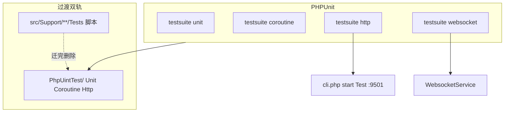

# Testing：PHPUnit 测试改造技术方案

## 1. 定位与目标

### 1.1 现状问题

| 问题 | 表现 |
|------|------|
| 无标准测试框架 | 无 `phpunit/phpunit`、无 `phpunit.xml`；全库无 `TestCase` |
| 脚本式回归 | 历史 `src/**/Tests/*Test.php` 脚本已迁入 `PhpUintTest/`；新测一律 PHPUnit |
| CI 难接入 | `composer test:*` 串联 `@php file.php`，无 JUnit / 覆盖率 / 失败聚合 |
| 分层缺失 | Unit、协程、HTTP 全流程、Redis 依赖混在一起，默认跑不稳 |
| HTTP「测试」靠人工 | README / Module 写 curl；需先 `php cli.php start Test`，无自动化断言 |
| 协程/连接池难回归 | 仅个别 Demo（如 Order 协程单例）有手写检查，无统一基类与泄漏检测 |

### 1.2 改造目标

1. **全面接入 PHPUnit 11**，作为唯一推荐运行器。
2. **三层套件**：Unit / CoroutineUnit / HttpIntegration（+ Websocket）；**分层用 suite，横切用 group**。
3. **HTTP 全流程 = 自动化 curl**：真启 `Test` 服务 + Guzzle 打 `/api/v1/*`，覆盖路由→中间件→Controller→JSON。
4. **迁移完成**：旧 `src/**/Tests/*Test.php` deprecate 转发已删除；`composer test:*` / `phpunit --filter` 为唯一入口。
5. **默认 CI 绿灯**：`composer test` 只跑 `unit`+`coroutine`；Http/Websocket **不进默认 suite**（不用 group exclude 挡）；Redis/DB 用 `@group` exclude。

### 1.3 非目标（MVP 不做）

| 不做 | 原因 |
|------|------|
| 进程内伪造完整 `Swoole\Http\Request` 调 `onRequest` | 耦合底层，维护成本高；Phase 后期可选 |
| 一次迁完所有 `Test/Scripts` CLI | 依赖 Script 进程，优先级低于 Support + Http |
| 强制覆盖率门槛 | Phase 5 再定 |
| 改业务行为 | 测试基建不夹带功能变更 |

---

## 2. 现有资产盘点（改造输入）

### 2.1 composer 脚本（全部为 PHP 直跑）

见 [`composer.json`](../composer.json) `scripts`：

| Script | 覆盖 |
|--------|------|
| `test:workflow` | Phase1–4、Integration、RunStore、HitlAuth、PluginMemory |
| `test:mqtt` | MqttModuleTest、MqttGracefulShutdownTest |
| `test:job` / `test:agent` / `test:ai` / `test:mcp` / … | 各 Support 模块 |
| `test:phase-a` … `test:phase-d` | 生产加固 |
| `test:support` | 聚合上述 |
| `test:module-workflows` / `test:outdoor-workflow` 等 | `PhpUintTest/Unit/Module/*` Demo 工作流独立性 |
| `test:websocket` | Offline + Cluster（默认排除 `redis`/`smoke`） |

**未进默认 `composer test`：** Http / Websocket suite；`@group redis|db|slow|smoke`（含 `RedisRunStoreCasTest`、MQTT 可选 smoke）。

### 2.2 脚本测试标准形态（迁移前）

```php
// 以 JobPhase1Test / WorkflowHitlAuthTest 为代表
require vendor/autoload.php;

function assertTrue(bool $c, string $m): void { if (!$c) throw new RuntimeException($m); }
function pass(string $name): void { echo "[PASS] {$name}\n"; }

function testEnvelopeRoundTrip(): void { /* … */ assertTrue(...); }

$tests = ['envelope' => 'testEnvelopeRoundTrip', /* … */];
foreach ($tests as $name => $fn) {
    $fn();
    pass($name);
}
```

**迁移映射规则：**

| 脚本元素 | PHPUnit |
|----------|---------|
| `function testXxx()` | `public function testXxx(): void` |
| `assertTrue($c, $msg)` | `$this->assertTrue($c, $msg)` 或更具体的 `assertSame` |
| `pass($name)` | 删除（PHPUnit 报告替代） |
| 文件尾 `foreach` | 删除（发现机制替代） |
| 文件级 `require autoload` | `PhpUintTest/bootstrap.php` + composer `autoload.psr-4` |
| 顶部业务注释「覆盖范围」 | 类 PHPDoc 保留 |

### 2.3 已有可复用基建

| 资产 | 路径 | 改造中的角色 |
|------|------|--------------|
| Support 协程 stub | [`src/Support/Tests/SwoolefyTestBootstrap.php`](../src/Support/Tests/SwoolefyTestBootstrap.php) | `CoroutineTestCase::setUp` 必引 |
| WS 探活 | [`PhpUintTest/Websocket/Support/SmokeTestSupport.php`](../PhpUintTest/Websocket/Support/SmokeTestSupport.php) | Http/Ws `*ServerManager` 范本 |
| HTTP Demo + curl | [`Test/Module/`](../Test/Module/)、[`docs/AI-WORKFLOW.md`](AI-WORKFLOW.md) | HttpIntegration 用例来源 |
| Auth 验收 | [`docs/Auth.md`](Auth.md) | CoroutineUnit（goApp 透传）+ Http（Bearer） |
| Guzzle | `composer.json` require | Http 客户端，无需新增依赖（PHPUnit 除外） |

### 2.4 为何 HTTP 必须打真端口

swoolefy 请求路径：`HttpServer::onRequest` → Bootstrap / HeaderContext → 路由中间件 → Controller。  
**没有** Laravel 式进程内 `Kernel::handle`。因此：

| 测法 | 覆盖路由/中间件/JSON | 改造定位 |
|------|----------------------|----------|
| 真服务 + Guzzle（等价 curl） | 完整 | **HttpIntegration MVP** |
| `new Controller` + 假 RequestInput | 否 | 仅补充 Unit |
| 进程内伪造 Swoole Request | 理论完整 | Phase 后期可选 harness |

---

## 3. 目标架构



### 3.1 分层定义

| 层 | 目录 | 基类 | 依赖 | 默认 CI |
|----|------|------|------|---------|
| **Unit** | `PhpUintTest/Unit/` | `PhpUintTest\TestCase` | 无协程调度、无网络 | 是 |
| **CoroutineUnit** | `PhpUintTest/Coroutine/` | `CoroutineTestCase` | `ext-swoole`、`SwoolefyTestBootstrap` | 是 |
| **HttpIntegration** | `PhpUintTest/Http/` | `HttpIntegrationTestCase` | 真 HTTP 服务 | 否（独立 suite `http`） |
| **Websocket** | `PhpUintTest/Websocket/` | 复用探活 | WebsocketService | 否（独立 suite `websocket`） |
| **Redis/DB** | 任意层，标 `@group redis`/`db` | — | 中间件 | 默认 **group exclude**（横切） |

**隔离约定（已定）：**

| 维度 | 手段 | 例子 |
|------|------|------|
| 分层（目录） | **suite** | `unit` / `coroutine` / `http` / `websocket` |
| 横切（依赖） | **`@group` + exclude** | `redis` / `db` / `slow` |

- Http 用例**不要**再标会被默认 exclude 的 `@group http`（否则与 suite 叠用会踩坑）。
- 可用 `@group outdoor` / `@group workflow` 等业务标签做 `--group` filter。

### 3.2 目录落位（新建）

```text
phpunit.xml.dist
PhpUintTest/
  bootstrap.php
  TestCase.php
  CoroutineTestCase.php
  Http/
    HttpIntegrationTestCase.php
    Support/
      HttpServerManager.php
      HttpServerUnavailableException.php
    OutdoorWorkflowHttpTest.php      # 首批样板
    WorkflowHttpTest.php             # list/status/resume 黄金路径
  Unit/
    Mqtt/
      MqttModuleTest.php
      MqttGracefulShutdownTest.php
    Support/
      Job/
        JobPhase1Test.php
      Workflow/
        WorkflowHitlAuthTest.php
        RedisRunStoreCasTest.php     # @group redis（默认 exclude）
        …
    Module/                          # Test/Module Demo 工作流
      Outdoor|Order|Research|Rag|Contract|Knowledge|Workflow/
  Coroutine/
    Support/
      PhaseCParallelTest.php
      Auth/
        AuthContextGoAppTest.php
  Websocket/                         # suite websocket
    WebsocketClusterTest.php
    WebsocketSmokeTest.php           # @group smoke

# deprecate 转发已删除；目标态 PhpUintTest/ 为唯一入口
```

**P1–P2 可选：就地发现（降低搬迁成本）**

不必一上来把全部脚本搬进 `PhpUintTest/Unit/Support/...`。可在 `phpunit.xml.dist` 的 `unit` suite 中临时增加：

```xml
<testsuite name="unit">
    <directory>PhpUintTest/Unit</directory>
    <!-- 过渡：已改成 PHPUnit TestCase 的模块可先留在原目录 -->
    <!-- <directory suffix="Test.php">src/Support/Job/Tests</directory> -->
</testsuite>
```

迁完一个模块再删旧路径；目标态仍以 `PhpUintTest/` 为唯一入口。

composer `autoload`（放入主 psr-4，避免 IDE 忽略 `autoload-dev` 误报命名空间）：

```json
{
  "autoload": {
    "psr-4": {
      "Swoolefy\\": "src/",
      "Test\\": "Test/",
      "PhpUintTest\\": "PhpUintTest/"
    }
  },
  "require-dev": {
    "phpunit/phpunit": "^11.5"
  }
}
```

---

## 4. 核心接口与基类契约

### 4.1 TestCase

```php
namespace PhpUintTest;

use PHPUnit\Framework\TestCase as BaseTestCase;

abstract class TestCase extends BaseTestCase
{
    // 禁止再定义文件级 assertTrue()；统一用 PHPUnit 断言
}
```

### 4.2 CoroutineTestCase

```php
namespace PhpUintTest;

use Swoole\Coroutine;
use Swoole\Runtime;

abstract class CoroutineTestCase extends TestCase
{
    protected function setUp(): void
    {
        parent::setUp();
        require_once dirname(__DIR__, 2) . '/src/Support/Tests/SwoolefyTestBootstrap.php';
        Runtime::enableCoroutine(true);
    }

    protected function runInCoroutine(callable $fn): mixed
    {
        $result = null;
        $error = null;
        Coroutine\run(static function () use ($fn, &$result, &$error): void {
            try {
                $result = $fn();
            } catch (\Throwable $e) {
                $error = $e;
            }
        });
        if ($error instanceof \Throwable) {
            throw $error;
        }

        return $result;
    }
}
```

**用途：** goApp / GoWaitGroup / Context / Auth array 透传 / 协程内 `Application::getApp()->get('db')` 隔离。

### 4.3 HttpIntegrationTestCase（curl → PHPUnit）

```php
namespace PhpUintTest\Http;

use GuzzleHttp\Client;
use PhpUintTest\TestCase;

/**
 * Http 全流程基类。
 * 靠 suite「http」隔离，勿标会被默认 exclude 的 @group http。
 * 业务可另标 @group outdoor / @group workflow 等。
 */
abstract class HttpIntegrationTestCase extends TestCase
{
    protected static Client $http;
    protected static string $baseUrl;

    public static function setUpBeforeClass(): void
    {
        parent::setUpBeforeClass();
        self::$baseUrl = rtrim(
            (string) (getenv('SWOOLEFY_TEST_BASE_URL') ?: 'http://127.0.0.1:9501'),
            '/'
        );
        try {
            HttpServerManager::ensureAvailable(self::$baseUrl);
        } catch (HttpServerUnavailableException $e) {
            self::markTestSkipped($e->getMessage());
        }
        self::$http = new Client([
            'base_uri' => self::$baseUrl . '/',
            'http_errors' => false,
            'timeout' => 30,
        ]);
    }

    protected function postJson(string $path, array $body = [], array $headers = []): array
    {
        $res = self::$http->post(ltrim($path, '/'), [
            'headers' => array_merge(['Content-Type' => 'application/json'], $headers),
            'json' => $body,
        ]);
        $raw = (string) $res->getBody();
        $json = json_decode($raw, true);

        return [
            'status' => $res->getStatusCode(),
            'body' => is_array($json) ? $json : $raw,
            'headers' => $res->getHeaders(),
        ];
    }

    protected function getJson(string $path, array $headers = []): array { /* 同理 */ }
}
```

### 4.4 HttpServerManager：两种启服模式

| 模式 | 适用 | 行为 |
|------|------|------|
| **A 外部启服（默认）** | 本地开发 | 开发者先 `php cli.php start Test`；探活失败且 `SWOOLEFY_HTTP_SKIP_IF_DOWN=1` → skip |
| **B 自动拉起** | CI | `SWOOLEFY_HTTP_AUTO_START=1` → 后台 `start`，suite 结束 `stop`；探活失败则 fail（CI 设 `SKIP_IF_DOWN=0`） |

环境变量：

| 变量 | 默认 | 含义 |
|------|------|------|
| `SWOOLEFY_TEST_BASE_URL` | `http://127.0.0.1:9501` | HTTP 基址 |
| `SWOOLEFY_HTTP_AUTO_START` | `0` | 是否自动 start/stop |
| `SWOOLEFY_HTTP_SKIP_IF_DOWN` | `1`（本地 phpunit.xml） | 不可达则 skip；CI Http job 建议 `0` |
| `SWOOLEFY_HTTP_READY_TIMEOUT` | `30` | 探活最长等待秒数 |
| `WS_HOST` / `WS_PORT` / `WS_SMOKE_SKIP_IF_DOWN` | 沿用现网 | Websocket suite |

**模式 B 实现要点（贴合 swoolefy CLI）：**

1. 启动：`php cli.php start Test --daemon=1`（或项目惯用的非交互启动参数）；避免交互式 `restart` 询问。
2. 若需重启脏进程：优先 `php cli.php restart Test --force=1`（跳过 yes/no）。
3. 探活：轮询 `GET {baseUrl}/` 或轻量健康路径，直到 2xx/4xx（非连接拒绝）或超时。
4. 日志：stdout/stderr 落到 `Test/Storage/Logs/phpunit-http.log`，失败时打印尾部便于 CI。
5. 收尾：`register_shutdown_function` / PHPUnit `tearDownAfterClass` 调 `php cli.php stop Test`（失败也尽量 stop，防僵尸 Worker）。
6. 端口：固定 Test 应用 `9501`；CI runner 独占，避免并行 job 抢端口。
7. 目标环境按 **macOS / Linux** 编写启停与探活即可，不单独适配 Windows。

---

## 5. HTTP 全流程改造详解（重点）

### 5.1 从 curl 到用例的固定模板

**改造前（文档）：**

```bash
php cli.php start Test
curl -s -X POST "http://127.0.0.1:9501/api/v1/outdoor/workflow/cycling" \
  -H "Content-Type: application/json" \
  -d '{"destination":"深圳湾公园","weatherHint":"sunny","useMock":true}'
```

**改造后（PHPUnit）：**

```php
namespace PhpUintTest\Http;

/** @group outdoor */
final class OutdoorWorkflowHttpTest extends HttpIntegrationTestCase
{
    public function testCyclingSunnyReturnsRunId(): void
    {
        $res = $this->postJson('/api/v1/outdoor/workflow/cycling', [
            'destination' => '深圳湾公园',
            'weatherHint' => 'sunny',
            'useMock' => true,
        ]);

        $this->assertSame(200, $res['status']);
        $this->assertIsArray($res['body']);
        $runId = $res['body']['runId']
            ?? $res['body']['data']['runId']
            ?? null;
        $this->assertNotEmpty($runId);
    }
}
```

HITL：

```php
$res = $this->postJson('/api/v1/workflow/resume', [
    'runId' => $runId,
], [
    'X-Workflow-Api-Key' => getenv('WORKFLOW_HITL_API_KEY') ?: 'test-hitl-key',
]);
```

Auth 已落地（见 [`docs/Auth.md`](Auth.md)），Bearer / 缺 token 401 可直接写 Http 样板：

```php
// 缺 Bearer → HTTP 401（GET /api/auth-user/me）
$res = $this->getJson('/api/auth-user/me');
$this->assertSame(401, $res['status']);

// 合法 JWT
$res = $this->postJson('/api/v1/...', $body, [
    'Authorization' => 'Bearer ' . $jwt,
]);
```

### 5.2 断言边界（防脆测）

| 应断言 | 不应断言 |
|--------|----------|
| HTTP status、业务 code | 完整 LLM / OCR 长文本 |
| `runId` / `status` 字段存在与枚举 | 绝对耗时（除非超时用例） |
| 401/403 鉴权失败 | 内部 spl_object_id |
| Header 透传关键键（若契约要求） | 日志文件内容 |

### 5.3 首批 Http 用例清单（Phase 3）

| 优先级 | 来源 | 用例 |
|--------|------|------|
| P0 | Outdoor | ✅ `OutdoorWorkflowHttpTest`：sunny / rainy / status 缺 runId / status by runId |
| P0 | Workflow | ✅ `WorkflowHttpTest`：list；`contract_review` run+status；resume；status 缺 runId |
| P0 | Auth | ✅ `AuthUserMeHttpTest`：无 Bearer / 非法 JWT → 401 |
| P1 | HITL curl | resume 错 Key → 403（auth_enabled 开启时再补） |
| P2 | Order saga demo | 1～2 条主路径（可选） |

引擎边角、HITL 纯逻辑仍留在 **Unit**（`WorkflowHitlAuthTest`），Http 只保契约。

### 5.4 与直接测 Controller 的分工

```text
Unit:  WorkflowEngine / HitlAuth / JobRunner     ← 快、密
Http:  /api/v1/outdoor/workflow/cycling         ← 少而稳（黄金路径）
```

禁止「所有分支都打 HTTP」。

---

## 6. 脚本 → PHPUnit 改造规程（Support）

### 6.1 单文件改造步骤（Checklist）

1. 新建 `PhpUintTest/Unit/Support/{Module}/{Name}Test.php`，`extends TestCase`。
2. 将每个 `function testXxx()` 变为类方法；`assertTrue` → `$this->assert*`。
3. 删除文件级 `assertTrue` / `pass` / 尾部 `foreach`。
4. Stub / Fake 类移入同文件 private class 或 `PhpUintTest/Unit/Support/{Module}/Fixture/`。
5. 删除旧 `src/**/Tests/*Test.php` 转发脚本；`composer test:{module}` → `phpunit --testsuite unit --filter X`。

6. 跑通：`./vendor/bin/phpunit --filter JobPhase1Test` 与旧脚本结果一致后合并。

### 6.2 模块迁移优先级

| 批次 | 模块 | 理由 |
|------|------|------|
| 1（样板） | Job Phase1、WorkflowHitlAuth | 无 IO、断言清晰 |
| 2 | Workflow Phase1–4、Integration、PluginMemory | composer 主回归 |
| 3 | Agent/AI/Mcp/Neuron/Rag/Capability/DocumentOcr | 同模式批量 |
| 4 | Phase A–D、SupportLog | 注意部分需 Coroutine |
| 5 | Websocket 离线单测 → Unit；Smoke → Websocket suite | |
| 6 | RedisRunStoreCas、Cluster → `#[Group('redis')]` | ✅ |
| 7 | `Test/Module/*` Demo 工作流 → `PhpUintTest/Unit/Module` | ✅ |

### 6.3 PhaseC / 协程脚本

凡内部已有 `Coroutine\run` 的，迁入 `PhpUintTest/Coroutine/`，外层用 `runInCoroutine` **单层**调度：

- 脚本原文若已包一层 `Coroutine\run`，迁入时去掉内层，只保留 `runInCoroutine(fn…)`。
- 禁止 `runInCoroutine` 里再调 `Coroutine\run`（双重嵌套在部分 Swoole 版本上行为不稳定）。
- `Runtime::enableCoroutine(true)` 放在 `CoroutineTestCase::setUp`；勿在每个用例里反复开关。

---

## 7. phpunit.xml.dist 与 composer 命令

### 7.1 phpunit.xml.dist（草案）

**隔离策略：分层靠 suite，横切靠 group。**  
默认命令只指定 `unit,coroutine`；Http/Websocket 不在默认 suite 扫描范围内，**不要**用 `<group>http</group>` exclude（否则 `--testsuite http` 也会被全局 exclude 掉）。

```xml
<?xml version="1.0" encoding="UTF-8"?>
<phpunit xmlns:xsi="http://www.w3.org/2001/XMLSchema-instance"
         bootstrap="PhpUintTest/bootstrap.php"
         colors="true"
         cacheDirectory=".phpunit.cache"
         failOnWarning="false">
    <!-- 过渡期 failOnWarning=false，避免 Swoole/扩展 notice 误伤；稳定后可改 true -->
    <testsuites>
        <testsuite name="unit">
            <directory>PhpUintTest/Unit</directory>
        </testsuite>
        <testsuite name="coroutine">
            <directory>PhpUintTest/Coroutine</directory>
        </testsuite>
        <testsuite name="http">
            <directory>PhpUintTest/Http</directory>
        </testsuite>
        <testsuite name="websocket">
            <directory>PhpUintTest/Websocket</directory>
        </testsuite>
    </testsuites>
    <groups>
        <exclude>
            <!-- 仅横切依赖；勿 exclude http/websocket（已由 suite 隔离） -->
            <group>redis</group>
            <group>db</group>
            <group>slow</group>
        </exclude>
    </groups>
    <php>
        <env name="SWOOLEFY_CLI_ENV" value="dev"/>
        <env name="SWOOLEFY_HTTP_SKIP_IF_DOWN" value="1"/>
    </php>
    <source>
        <include>
            <directory suffix=".php">src/Support</directory>
            <directory suffix=".php">src/Http</directory>
            <directory suffix=".php">src/Core</directory>
            <directory suffix=".php">src/Websocket</directory>
        </include>
    </source>
</phpunit>
```

| 命令 | 跑什么 |
|------|--------|
| `composer test` / `phpunit --testsuite unit,coroutine` | 默认绿灯（扫不到 Http/Websocket 目录） |
| `phpunit --testsuite http` | 全流程；不依赖 group exclude |
| `phpunit --group redis` | 显式跑 Redis 横切用例（需去掉 exclude 或 `--group redis` 覆盖，按 PHPUnit 版本选用） |

### 7.2 composer scripts（目标态）

```json
{
  "test": "phpunit --testsuite unit,coroutine",
  "test:unit": "phpunit --testsuite unit",
  "test:coroutine": "phpunit --testsuite coroutine",
  "test:http": "phpunit --testsuite http",
  "test:websocket": "phpunit --testsuite websocket",
  "test:support": "@test"
}
```

**过渡态：** 保留现有 `test:workflow` 等；每迁完一模块，将该 script 改为 phpunit filter，最后删除旧入口。

### 7.3 日常命令

```bash
# 默认（快）——只跑 unit + coroutine
composer test

# HTTP 全流程（模式 A：先启服）
php cli.php start Test
composer test:http

# HTTP 全流程（模式 B：CI 自动启停）
SWOOLEFY_HTTP_AUTO_START=1 SWOOLEFY_HTTP_SKIP_IF_DOWN=0 composer test:http
```

---

## 8. 协程与泄漏检测（改造加分项）

迁入 CoroutineUnit 时固化以下用例类型：

| 检测 | 断言思路 |
|------|----------|
| Db 协程单例隔离 | 父/子 `spl_object_id` 不同；同协程两次 get 相同 |
| Context / Auth 不串 | 两并发写入不同 userId，互读隔离 |
| goApp array 透传 | `FrameworkContext::setUser` 后子协程 `getUserId()` 非空（见 Auth） |
| 协程泄漏（可选） | 用例前后 `Coroutine::stats()['coroutine_num']` 差值 ≤ 阈值 |

禁止在测试里 `use ($db)` 把父协程连接带进 `goApp`（与生产禁忌一致）。

---

## 9. 分阶段实施路线

| Phase | 内容 | 状态 |
|-------|------|------|
| **P0 脚手架** | `phpunit/phpunit`；`phpunit.xml.dist`（suite 隔离）；`PhpUintTest/bootstrap` + 三基类 | ✅ |
| **P1 样板迁移** | JobPhase1 + WorkflowHitlAuth → `PhpUintTest/Unit`；旧脚本 deprecate 转发 | ✅ |
| **P2 Coroutine** | `CoroutineTestCase` + Auth goApp / Context array；PhaseC | ✅ |
| **P3 Http** | Auth `/api/auth-user/me` 401 + Outdoor cycling + Workflow list/run/status/resume | ✅ |
| **P4 批量 Support** | `test:support` 模块迁入 `PhpUintTest/`；composer `test:*` 切 phpunit | ✅ |
| **P4+ Module + Redis CAS** | `Test/Module/*` → `PhpUintTest/Unit/Module`；`RedisRunStoreCas` + `#[Group('redis')]` | ✅ |
| **P5 Websocket** | Offline + Smoke → `PhpUintTest/Websocket` | ✅ |
| **P5 单轨** | 删除 deprecate wrapper；Mqtt → `PhpUintTest/Unit/Mqtt`；`composer test:mqtt` | ✅ |
| **P6（可选）** | 进程内 Request harness；CI 固化模式 B；覆盖率门槛 | 待做 |

```bash
composer test                 # unit + coroutine（含 Module / Mqtt；排除 redis/db/slow/smoke）
composer test:http            # 需先 php cli.php start Test，或 AUTO_START=1
composer test:websocket       # Offline 等；--group redis / smoke 另开
composer test:mqtt
composer test:module-workflows
composer test:job
```

---

## 10. 验收标准

1. 无 HTTP 服务时，`composer test`（`--testsuite unit,coroutine`）**全部通过**，且**不会**执行 `PhpUintTest/Http`。
2. 服务未启 + `SWOOLEFY_HTTP_SKIP_IF_DOWN=1` → `composer test:http` **skip**，进程 exit 0。
3. `start Test` 后 Outdoor sunny cycling：`status=200` 且存在 `runId`。
4. `GET /api/auth-user/me` 无 Bearer → HTTP **401**；HITL 错误 API Key → 权限失败（与现网一致）。
5. 样板模块（JobPhase1、HitlAuth）PHPUnit 与旧脚本失败用例一一对应。
6. Coroutine：父子 Db `spl_object_id` 不同；Auth `setUser` 后 goApp 子协程可读 `getUserId()`。
7. 本地模式 A、CI 模式 B（AUTO_START + stop）均有文档与可操作步骤。

---

## 11. 风险与对策

| 风险 | 对策 |
|------|------|
| 端口占用 / 僵尸 Worker | AUTO_START 必须配对 stop/`--force`；固定 9501；CI 独占 runner |
| group exclude 误伤 Http | **已定**：Http 只用 suite，不 exclude `@group http` |
| 双重 `Coroutine\run` | 迁入时剥掉脚本内层，只留 `runInCoroutine` |
| 测试污染 DB/Redis | Http 用 mock/useMock；写库用例 `@group db` + 测试库 |
| 迁移动作误改业务 | PR 只含测试文件与 composer；禁止顺手改 Controller |
| 旧脚本路径被收藏 | 已单轨；文档与 README 统一 `composer test:*` |
| flaky Http（慢/偶发） | 少而稳的黄金路径；超时标 `@group slow`（默认 exclude） |
| `failOnWarning` 误伤 | 过渡期 `false`，收尾再收紧 |

---

## 12. 禁忌

| 禁止 | 原因 |
|------|------|
| 默认 CI 启 HTTP/Redis | 破坏快速绿灯 |
| 用 group exclude 挡 `@group http` | 与 `--testsuite http` 冲突，用例会被全 skip |
| 全部逻辑只靠 HttpIntegration | 慢、脆、难定位 |
| Unit 隐式依赖 9501 | 环境耦合 |
| Context 存 AuthUser **对象** 做透传测 | `goApp` 跳过 object（见 Auth） |
| static 挂「当前用户」于测试基类 | 用例间串态 |
| Http 断言大模型全文 | 非稳定契约 |
| `runInCoroutine` 内再套 `Coroutine\run` | 双重调度不稳定 |

---

## 13. 相关文件与交叉引用

| 文件 | 说明 |
|------|------|
| [docs/PHPUnitTest.md](PHPUnitTest.md) | 本文：PHPUnit 改造方案 |
| [composer.json](../composer.json) | 现有 `test:*` |
| [src/Support/Tests/SwoolefyTestBootstrap.php](../src/Support/Tests/SwoolefyTestBootstrap.php) | 协程 stub |
| [PhpUintTest/Websocket/Support/SmokeTestSupport.php](../PhpUintTest/Websocket/Support/SmokeTestSupport.php) | 活服务探活 |
| [docs/AI-WORKFLOW.md](AI-WORKFLOW.md) | curl → Http 用例来源 |
| [docs/Auth.md](Auth.md) | Auth / goApp / Bearer / `/api/auth-user/me` |
| [docs/CapabilityTool.md](CapabilityTool.md) | Capability 单测迁入 Unit |
| [docs/Job.md](Job.md) | Job 模块与 Phase 测试说明 |
| [Test/Module/](../Test/Module/) | Demo 与 README curl |
| [Test/Controller/AuthUserController.php](../Test/Controller/AuthUserController.php) | Auth Http 联调样板 |
| [README.md](../README.md) | 启服与文档索引（实现脚手架后补链接） |

**与 Auth：** CoroutineUnit 覆盖 `setUser` array 透传；HttpIntegration 覆盖 Bearer 与缺 token 401。  
**与 Workflow：** 引擎/HITL 逻辑 → Unit；`/api/v1/workflow/*` → Http。  
**入口：** `PhpUintTest/` + `composer test:*` 单轨；`src/**/Tests` 仅保留 Fixtures / Bootstrap / SchemaInstaller。

---

## 14. 评审决议与第一步

### 已决议

| 议题 | 决议 |
|------|------|
| Http / Websocket 如何不进默认 CI | **suite 隔离**：`composer test` = `unit,coroutine`；不用 group exclude 挡 http |
| `@group` 用途 | 仅横切：`redis` / `db` / `slow`；业务 filter 可用 `outdoor` / `workflow` |
| Auth | **已落地**，P2/P3 直接写 goApp + `/api/auth-user/me` 用例 |
| 启服 | 本地默认模式 A；CI 再上模式 B（`--daemon` / `--force` / 配对 stop）；不适配 Windows |

### 建议的第一步（不改业务）

1. `composer require --dev phpunit/phpunit:^11.5`
2. 落地 `phpunit.xml.dist`（按上文 suite 隔离）+ `PhpUintTest/{bootstrap,TestCase,CoroutineTestCase}.php`
3. 迁入 **JobPhase1** 一个类作为样板
4. `composer test` → `phpunit --testsuite unit,coroutine`（可暂仍串联旧 workflow 脚本）
