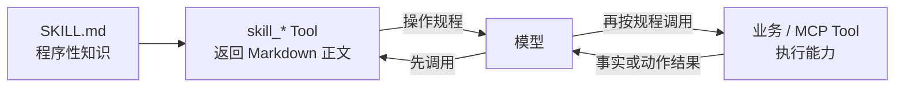
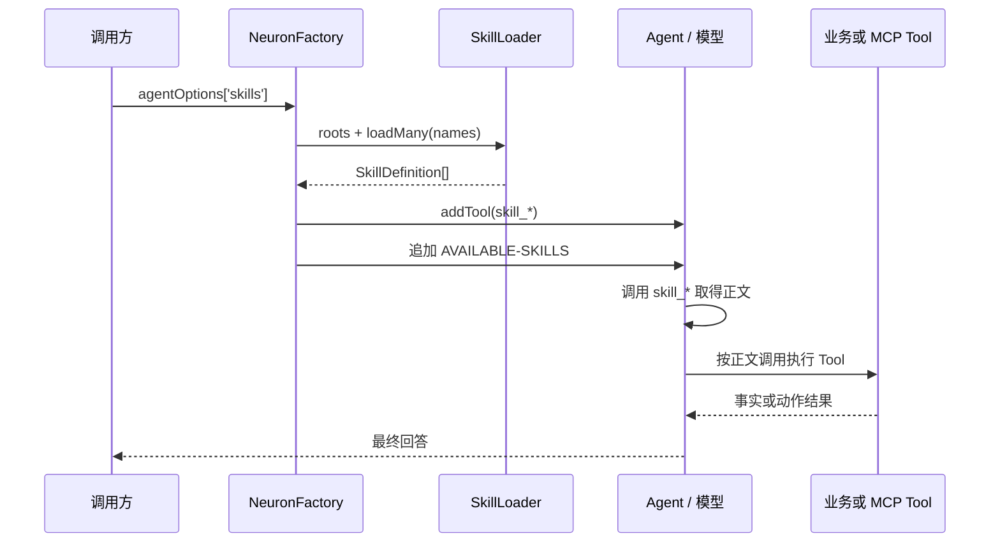

# Tool 与 Skill 的关系

本文说明 Swoolefy 当前 Neuron AI 集成中 Tool、Skill、MCP Tool、Capability Tool 与 Agent Native Tool 的职责、装配方式和运行时关系。内容以仓库现有实现为准。

## 1. 背景与设计目标

LLM Agent 同时需要两类能力：

- **知道怎样做**：例如先取得日期，再查询天气，并且只依据工具结果作答。
- **真正执行动作**：例如查询天气、访问 MCP Server、检索知识库或调用业务 API。

当前实现将这两类能力分开：

- Skill 保存“怎样做”的程序性知识，以目录中的 `SKILL.md` 表达。
- Tool 提供可执行能力，以 Neuron `ToolInterface` 暴露给模型。
- 为了让模型按需取得 Skill 正文，每个启用的 Skill 又会被包装成一个只返回 Markdown 正文的 `skill_*` Neuron Tool。

这样可以避免把所有 Skill 正文一次性塞入 system prompt，同时保持 Skill 与具体业务 Tool 的弱耦合。

设计目标包括：

1. 复用 Neuron 原生 Tool Calling，不修改 Neuron 核心。
2. Skill 正文按模型需要返回，减少初始 prompt token。
3. Skill 与执行能力分离：流程可以复用，业务 Tool 可以独立替换。
4. MCP 全量挂载与 Capability 动态筛选可切换。
5. Agent 自带 Tool、外部 Tool 和 Skill Tool 可以共存。

## 2. 概念与职责

### 2.1 Tool

本文中的普通 Tool 是实现 `NeuronAI\Tools\ToolInterface` 的可调用能力。它通常包含：

- Tool 名称；
- 给模型看的描述；
- 输入参数 schema；
- 实际执行 callable；
- 执行后的结果。

例如 `Test\Module\Agent\Tool\WeatherTools` 创建：

- `get_date`：返回 Asia/Shanghai 时区当前日期；
- `get_weather`：接收 `location` 和 `date`，返回 mock 天气 JSON。

Tool 的核心职责是**执行并返回事实或动作结果**，而不是保存一整套操作规程。

### 2.2 Skill

Skill 是 `{root}/{skill-directory}/SKILL.md` 中的程序性知识，包含：

- YAML frontmatter：主要使用 `name`、`description`；
- Markdown 正文：步骤、约束、工具使用方法和结果解释规则。

例如 `weather-ops` 说明应先在日期不明确时调用 `get_date`，再调用 `get_weather`，并要求只依据 Tool JSON 回答。

Skill 本身不是天气查询能力，也不会执行正文中的步骤。当前实现会把 Skill 包装成 `skill_weather_ops` Tool；调用这个 Tool 只会返回 Skill 的 Markdown 正文，由模型阅读后决定是否继续调用业务 Tool。

### 2.3 MCP Tool

MCP Tool 是由配置的 MCP Server 提供、经 `McpFactory` 物化为 Neuron `ToolInterface` 的外部工具。

`NeuronFactory` 有两种 MCP 挂载路径：

- Capability 关闭：`McpFactory::tools()` 加载声明 Server 的全部合规 Tool；
- Capability 开启：先将 MCP Tool 作为 Capability 候选解析，再只物化和挂载命中的 Tool。

`mcpServers`（兼容别名 `mcp`）为空时，旧 MCP 路径不会挂载任何 MCP Tool；Capability 策略也会据此过滤 MCP 候选。

### 2.4 Capability Tool

Capability Tool 不是一种新的 Neuron Tool 协议，而是经过 CapabilityCenter 的 Registry、Policy、匹配和懒物化流程筛选后得到的 `ToolInterface`。

当前 Capability 来源可包括 MCP Tool，以及显式注册 factory/callable/class map 的 Native Tool。最终结果仍通过 `Agent::addTool()` 注入。

它解决的是“候选 Tool 很多时，本轮应向模型暴露哪些 Tool”的问题，而不是替代 Tool 的执行实现。`capabilityEnabled` 只控制 `attachTools()` 选择 Capability 路径还是 MCP 全量路径。

### 2.5 Agent Native Tool

Agent Native Tool 指 Agent 子类通过 Neuron 原生 `tools()` 方法直接声明的工具。例如：

```php
protected function tools(): array
{
    return WeatherTools::all();
}
```

`WeatherToolAgent` 因而原生拥有 `get_date` 和 `get_weather`。这类 Tool 由 Agent 自身负责，独立于 `NeuronFactory::attachTools()` 的 MCP/Capability 挂载选择。

“Capability 来源中的 Native Tool”与“Agent 子类 `tools()` 中的 Native Tool”都可能最终成为 `ToolInterface`，但装配入口不同：

- Agent Native Tool：Agent 子类直接声明；
- Capability Native Tool：先注册为 Capability Descriptor，再按本轮上下文筛选和物化。

## 3. 当前架构关系

当前关系可以概括为：

> Skill 是 `SKILL.md` 中的程序性知识；运行时被包装为 `skill_*` Neuron Tool。普通 Tool、MCP Tool、Capability Tool 和 Agent Native Tool 才是执行能力。



Skill Tool 与业务 Tool 都使用 Neuron Tool Calling 通道，但语义不同：

- `skill_*`：返回“如何完成任务”；
- `get_weather` 等业务 Tool：返回“任务执行结果”。

## 4. 完整加载与调用链

### 4.1 boot 阶段

完整链路如下：

1. 调用方在 `agentOptions['skills']` 中声明要启用的 Skill 名称。
2. `NeuronFactory::attachSkillTools()` 解析 Skill roots。
3. `SkillLoader` 扫描每个 root 下一级子目录中的 `SKILL.md`。
4. `SkillFrontmatterParser` 拆分 YAML frontmatter 与 Markdown 正文。
5. `SkillLoader` 生成 `SkillDefinition`。
6. `SkillToolFactory::makeMany()` 为每个定义创建一个 `skill_*` Tool。
7. `Agent::addTool()` 挂载这些 Skill Tool。
8. 默认将 `<AVAILABLE-SKILLS>` 短列表追加到 Agent instructions。

注意：`SKILL.md` 文件在 boot/扫描阶段已经读入并解析，正文被闭包捕获在内存中；“按需”指正文只在 `skill_*` Tool 被调用时返回给模型，而不是调用时才从磁盘读取。

### 4.2 对话阶段

模型预期执行：

1. 从 `<AVAILABLE-SKILLS>` 或 Tool schema 发现 `skill_weather_ops`。
2. 调用 `skill_weather_ops`，无需输入参数。
3. Tool 返回去除 frontmatter 后的 Markdown 正文。
4. 模型理解正文中的流程。
5. 模型按正文调用 `get_date`、`get_weather` 或相应 MCP Tool。
6. 模型根据业务/MCP Tool 结果生成最终回答。



这是一条模型驱动的预期调用链，不是框架硬编码的工作流。模型可能不调用 Skill、调用后不遵循正文，或在信息足够时不调用业务 Tool；Agent instructions、Tool 描述和模型能力会影响实际行为。

## 5. `NeuronFactory::boot()` 的挂载顺序与互斥关系

`boot()` 当前顺序是：

1. `applyProvider()`：注入 LLM Provider；
2. 如果 `agentOptions['chatHistory']` 是 `ChatHistoryInterface`，覆盖 ChatHistory；
3. `attachTools()`：挂载 MCP 全量 Tool 或 Capability Tool；
4. `attachSkillTools()`：挂载本地 Skill Tool；
5. `attachMiddleware()`：追加节点级与全局 Middleware。

此外，Agent 子类自己的 `tools()` 属于 Neuron Agent 原生声明，不由上述 `attachTools()` 创建。例如 `WeatherToolAgent::tools()` 在 Agent 自身提供 `get_date`、`get_weather`。

互斥与共存规则：

- **MCP 全量路径与 Capability 路径互斥**：`capabilityEnabled=false` 走 `attachMcpTools()`；为 `true` 时走 CapabilityCenter。
- **Capability fail-open 例外**：Capability 抛错且全局 `capability.fail_closed=false` 时，回退 `attachMcpTools()`；为 `true` 时原异常继续抛出。
- **Skill Tool 不与上述路径互斥**：只要 `agentOptions['skills']` 非空且加载成功，就在 `attachTools()` 之后继续挂载。
- **Agent Native Tool 不与 Skill Tool 互斥**：两者可以同时存在。
- 当前 Skill 层没有检测 Tool 重名；命名冲突的最终行为取决于 Neuron `Agent::addTool()`，因此应主动保证名称唯一。

`capabilityEnabled` 的 per-call 值优先于全局 `capability.enabled`；全局默认值为 `false`。

## 6. Prompt 注入机制

默认 `skillsPrompt=true`。挂载 Skill Tool 后，`SkillToolFactory::availableSkillsPrompt()` 生成：

```text
<AVAILABLE-SKILLS>
- weather-ops (tool: skill_weather_ops): How to use weather tools (get_date / get_weather) and interpret mock results
Call the matching skill_* tool when you need that procedural knowledge.
</AVAILABLE-SKILLS>
```

该块会追加到 `Agent::resolveInstructions()` 的现有内容之后，并通过 `setInstructions()` 写回。

默认只注入：

- Skill `name`；
- Skill `description`，缺失时显示 `(no description)`；
- 对应 `skill_*` Tool 名；
- 一句建议模型按需调用 Skill Tool 的说明。

默认**不注入 Skill Markdown 正文**。正文只在 `skill_*` Tool 执行后作为 Tool result 返回。

设置：

```php
'skillsPrompt' => false,
```

会跳过 `<AVAILABLE-SKILLS>` instructions 注入，但不会取消 Skill 的加载或 `skill_*` Tool 挂载。模型仍可能从 Tool schema 的名称和描述发现它，只是 system instructions 中没有显式 Skill 清单。

布尔值通过 `FILTER_VALIDATE_BOOLEAN` 解析，因此 `false`、`0`、`'0'`、`'false'` 等都可关闭注入。

## 7. 目录、按名加载、frontmatter、缓存与异常

### 7.1 目录约定与 roots 优先级

目录必须是：

```text
{root}/
└── {skill-directory}/
    └── SKILL.md
```

只扫描 root 的直接子目录，不递归扫描更深层目录；文件名必须精确为 `SKILL.md`。

roots 解析优先级：

1. `agentOptions['skillPaths']`；
2. 兼容键 `agentOptions['skillRoots']`；
3. `neuron_ai.php` 的 `skills.paths`，由 `NeuronAiConfig::skillPaths()` 读取；
4. `SkillLoader::defaultRoots()`：
   - `APP_PATH . '/Skills'`；
   - `ROOT_PATH . '/Skills'`，且不与前者重复。

一旦 options 中提供了非空 roots 列表，就不会合并全局配置或默认 roots，而是完全覆盖。不存在的 root 会保留在 roots 列表中，但扫描时跳过。

多个 root 中出现同名 Skill 时，先扫描到的 root 优先。默认顺序是 `APP_PATH/Skills` 先于 `ROOT_PATH/Skills`。

测试配置 `Test/Config/neuron_ai.php` 明确设置：

```php
'skills' => [
    'paths' => [
        dirname(__DIR__) . '/Skills',
    ],
],
```

因此示例中的默认 `weather-ops` 会从 `Test/Skills/weather-ops/SKILL.md` 加载。生产 stub 的 `skills.paths` 默认为空，交给 `defaultRoots()` 决定。

### 7.2 按名加载

`agentOptions['skills']` 接受字符串或字符串数组；`NeuronFactory` 会过滤空字符串、非字符串并保持顺序去重。

`SkillLoader::loadMany()` 逐个调用 `load(name)`。扫描索引以最终 `SkillDefinition::name` 为 key：

- frontmatter 有有效 `name` 时使用该值；
- 缺失、空值或非字符串时回退到目录名。

因此 frontmatter `name` 与目录名不同时，应使用 frontmatter 中的名称加载。

### 7.3 frontmatter 解析

标准格式：

```markdown
---
name: weather-ops
description: How to use weather tools
extra: optional metadata
---

# Weather Ops

正文……
```

解析规则：

- 统一 CRLF/CR 为 LF；
- 允许开头 `---` 前有空白；
- 没有 frontmatter 时，完整文件作为正文，frontmatter 为空；
- 有起始 `---` 但缺少结束分隔符时抛 `InvalidArgumentException`；
- YAML 无效时抛 `InvalidArgumentException`，并保留 Symfony YAML 解析异常为 previous exception；
- YAML 结果必须是 mapping；非 mapping 时抛 `InvalidArgumentException`；
- `name`、`description` 从 metadata 中移除，其余字段保存到 `SkillDefinition::metadata`；
- 正文和 description 最终都会 `trim()`。

当前实现只保存额外 metadata，未使用这些字段控制权限、依赖或执行。

### 7.4 缓存

有两层进程内缓存：

- 每个 `SkillLoader` 实例缓存当前 roots 的扫描索引；
- 静态 `$fileCache` 按 `SKILL.md` 的 realpath（无法解析时用原路径）缓存 `SkillDefinition`。

同一路径重复加载会返回同一个 `SkillDefinition` 实例。缓存不检查文件 mtime，因此长驻 Worker 中修改 `SKILL.md` 后不会自动刷新；当前只有 `SkillLoader::clearCache()` 可清空静态文件缓存，新建 Loader 可重建扫描索引。

### 7.5 缺失和读取异常

- `load('')`：抛 `InvalidArgumentException('Skill name must not be empty')`。
- 显式名称找不到：抛 `SkillNotFoundException`，消息包含名称和已搜索 roots；若没有 roots，包含 `no skill roots configured`。
- 文件无法读取：抛 `InvalidArgumentException('Unable to read SKILL.md: ...')`。
- `NeuronFactory` 不吞掉 Skill 加载异常；Agent boot 直接失败。

### 7.6 Tool 命名规范

`SkillToolFactory::toolName()` 的规则：

1. trim Skill name；
2. 连续的非 `[a-zA-Z0-9_]` 字符替换为 `_`；
3. 去掉首尾 `_`；
4. 转小写；
5. 添加 `skill_` 前缀；
6. 规范化后为空则使用 `skill_unnamed`。

示例：

- `weather-ops` → `skill_weather_ops`
- `Tool Calling` → `skill_tool_calling`
- `foo/bar.v2` → `skill_foo_bar_v2`

不同 Skill 名可能规范化成相同 Tool 名，例如 `foo-bar` 与 `foo_bar`。当前没有冲突检查，命名时应避免这种情况。

## 8. Skill 与业务 Tool 的独立性和边界

Skill 与业务 Tool 是独立挂载、弱耦合的：

- Skill 正文可以提到 `get_weather`，但 SkillLoader 不解析这些引用。
- 挂载 `weather-ops` 不会自动创建或挂载 `get_date`、`get_weather`。
- 挂载业务 Tool 也不会自动寻找相关 Skill。
- `skill_*` callable 不接受参数，只返回 Markdown 正文，不代理正文提到的 Tool。
- Skill 不验证正文中的 Tool 名是否存在。
- Skill 不决定 MCP Server、Capability policy、tenant、roles 或 Tool 权限。
- CapabilityCenter 当前只负责 `attachTools()` 的候选执行 Tool；Skill 在之后由独立的 `attachSkillTools()` 挂载，不参与 Capability Top-K。

因此，调用方必须分别准备：

1. 程序性知识：`agentOptions['skills']` 与可扫描的 `SKILL.md`；
2. 执行能力：Agent `tools()`、`mcpServers`，或 Capability Registry/配置。

如果正文要求调用一个未挂载的 Tool，模型只能看到规程却无法执行。框架不会自动补齐依赖。

## 9. 使用示例

### 9.1 `agentOptions`

```php
$agentOptions = [
    'provider' => 'deepseek',
    'model' => 'deepseek-chat',
    'skills' => ['weather-ops', 'tool-calling'],
    'skillPaths' => [
        ROOT_PATH . '/Test/Skills',
    ],
    'skillsPrompt' => true,
    'capabilityEnabled' => false,
];

$agent = $neuronFactory->create(
    WeatherToolAgent::class,
    WorkflowState::fromInput(['message' => '深圳今天天气怎么样？']),
    $agentOptions,
);
```

`skills` 也可传单个字符串。`skillPaths` 会覆盖配置文件和默认 roots，不是追加。

天气示例控制器默认：

```php
'skills' => ['weather-ops']
```

请求还可传 `skillPaths`。控制器将逗号分隔字符串转为列表，但这是控制器自己的输入归一化；`NeuronFactory` 本身把单个非空字符串视为单元素列表，不拆分逗号。

### 9.2 示例 `SKILL.md`

```markdown
---
name: weather-ops
description: How to use weather tools (get_date / get_weather) and interpret mock results
---

# Weather Ops

When the user asks about weather for a city:

1. If the date is unclear, call `get_date` first.
2. Call `get_weather` with `location` and `date`.
3. Answer from tool JSON only. Do not invent data.
```

### 9.3 模型预期调用顺序

对于“深圳今天天气怎么样？”：

1. 调用 `skill_weather_ops`；
2. 得到 Weather Ops 正文；
3. 若“今天”需要解析，调用 `get_date`；
4. 调用 `get_weather(location: "深圳", date: "YYYY-MM-DD")`；
5. 依据 `weather`、`temperature`、`source` 返回中文答案。

`WeatherToolAgent::instructions()` 也明确要求：若存在匹配的 `skill_*` Tool，先调用一次取得规程，再按规程行动；禁止编造天气数据。

## 10. 适用、不适用、安全与 token 注意事项

### 10.1 适用场景

- 多步骤 Tool 调用规程；
- 需要统一结果解释、格式和质量约束；
- 多个 Agent 可复用的领域 SOP；
- 正文较长、不希望全部常驻 system prompt；
- 执行 Tool 会替换，但流程知识相对稳定的场景。

### 10.2 不适用场景

- 需要确定性编排、事务、补偿或严格状态机：应使用 Workflow/业务代码；
- 需要真正执行 API、数据库、文件或 MCP 操作：应实现普通 Tool；
- 需要强制权限控制：不能依赖 Skill 文本，应在 Tool、MCP 安全链或 Capability policy 中执行；
- 极短且每轮必需的固定规则：直接写入 Agent instructions 可能更简单；
- 期望 Skill 自动安装、发现或挂载依赖 Tool：当前未实现。

### 10.3 安全注意事项

- `SKILL.md` 会成为模型上下文，应按代码和 prompt 资产审查，防止 prompt injection 或越权指令。
- 不要在 frontmatter 或正文中保存密钥、token、内部凭证；Skill Tool 结果可能进入日志、流式事件和会话历史。
- Skill 只能提供建议，真正的认证、授权、租户隔离、参数校验、出站 URL 和 stdio 守卫必须在执行层完成。
- MCP Tool 仍受 `McpFactory` 的 stdio、URL、进程并发和租户配置约束；Skill 不会绕过这些约束。
- 对高风险 Tool 应使用 Middleware/审批或 Tool 自身的安全策略，不应把“先征得同意”只写在 Skill 中。

### 10.4 token 与性能

- 默认 prompt 只增加名称、描述和 Tool 名，避免加入全部正文。
- 调用 `skill_*` 后，完整正文仍会作为 Tool result 消耗上下文 token；正文应聚焦步骤，避免重复背景材料。
- Skill Tool 本身也会增加 Tool schema；大量 Skill 同时挂载仍会增加模型上下文。
- Capability 的 `default_top_k`/`max_schema_tools` 只限制 Capability 执行 Tool，不限制随后独立挂载的 Skill Tool。
- 静态文件缓存减少重复解析，但不会自动感知文件变更。
- Skill 描述应简短且具有区分度，帮助模型在不读正文时正确选择。

## 11. 关键代码路径索引

- `src/Support/Neuron/NeuronFactory.php`
  - `boot()`：总装配顺序；
  - `attachTools()`：Capability 与 MCP 全量路径选择；
  - `attachMcpTools()`：MCP Tool 全量挂载；
  - `attachSkillTools()`：Skill 加载、包装和挂载；
  - `resolveSkillRoots()`：roots 优先级；
  - `appendAvailableSkillsPrompt()`：追加短 prompt。
- `src/Support/Neuron/NeuronAiConfig.php`
  - `skillsSection()`；
  - `skillPaths()`。
- `src/Support/Neuron/Skill/SkillDefinition.php`
  - Skill 解析后的只读数据对象。
- `src/Support/Neuron/Skill/SkillFrontmatterParser.php`
  - YAML frontmatter 与 Markdown 正文拆分。
- `src/Support/Neuron/Skill/SkillLoader.php`
  - roots 归一化、目录扫描、按名加载、缓存。
- `src/Support/Neuron/Skill/SkillNotFoundException.php`
  - 显式 Skill 名称不存在时的异常。
- `src/Support/Neuron/Skill/SkillToolFactory.php`
  - `skill_*` 命名、Tool 创建、`AVAILABLE-SKILLS` 生成。
- `Test/Skills/weather-ops/SKILL.md`
  - 天气 Tool 使用规程示例。
- `Test/Skills/tool-calling/SKILL.md`
  - 通用 Tool Calling 规程示例。
- `Test/Module/Agent/WeatherToolAgent.php`
  - Agent Native Tool 与 Skill instructions 配合示例。
- `Test/Module/Agent/Tool/WeatherTools.php`
  - `get_date`、`get_weather` 执行 Tool。
- `Test/Module/Agent/Controller/AgentToolController.php`
  - HTTP 输入转换为 `agentOptions['skills']`/`skillPaths`。
- `Test/Config/neuron_ai.php`
  - 测试环境 `skills.paths`。
- `src/Stubs/neuron_ai.conf.stub.php`
  - 生产配置模板和空 paths 默认行为。
- `PhpUintTest/Unit/Support/Neuron/SkillModuleTest.php`
  - 解析、扫描、缓存、异常、Tool 结果和 prompt 注入测试。
- `docs/CapabilityTool.md`
  - Capability Registry、Resolver、Materializer 与 Tool 筛选细节。

## 12. 可选后续优化建议（尚未实现）

以下均为建议，**当前代码尚未实现**：

1. **Skill 依赖声明与校验**：在 metadata 中声明 required tools，boot 时验证依赖是否已挂载。
2. **名称与 Tool 冲突检测**：检测多个 Skill 规范化为同一 `skill_*` 名，或与现有 Tool 重名，并 fail-fast。
3. **热更新缓存**：按 mtime/hash 失效，或为长驻 Worker 提供受控 reload。
4. **Skill 权限与租户策略**：按 tenant、role、Agent 或环境过滤可加载 Skill。
5. **Capability 统一检索 Skill**：Skill 很多时先检索 Top-K，再挂载匹配的 Skill Tool。
6. **frontmatter schema 校验**：明确支持字段、类型、版本和兼容策略。
7. **可观测性**：记录 Skill 发现、加载、调用、token 估算和依赖 Tool 调用链。
8. **确定性 Skill 执行器**：对必须严格按步骤执行的规程，转换为显式 Workflow，而不是依赖模型自由解释。
9. **正文大小限制与安全扫描**：在加载阶段限制字节数，并检查敏感信息或危险 prompt 模式。
10. **调用去重策略**：通过 Middleware 或 Agent 状态避免同一轮重复调用同一个 Skill。
