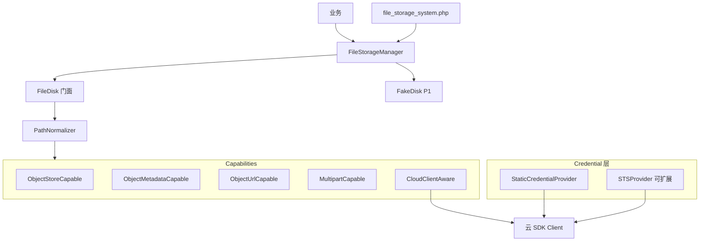

# FileStorageSystem：对象存储生产级技术方案

## 1. 定位

| 项 | 说明 |
|----|------|
| **问题** | swoolefy 仅本地 `UploadedFile::store()`；缺统一对象存储、大文件分片、元数据与可测 Fake |
| **目标** | 在 **bingcool/library** 落地 `FileStorageSystem`：Flysystem 底层 + 对象语义 API + **ObjectMetadata** + **Multipart** + **拆分 Capability**；云厂商 S3 / OSS / COS |
| **非目标** | 不写进 swoolefy 框架核心；不做管理后台 / CDN 中台 |

**分层：**

```text
业务
  → FileStorageManager::disk() → FileDisk（门面，组合 Capabilities）
       ObjectStore | ObjectMetadata | ObjectUrl | Multipart | CloudClient
       ↓
  → PathNormalizer（所有 path 入口统一规范化）
       ↓
  → Adapter → Client ← CredentialProvider（Static / STS…）
       ↓
  → Flysystem / 官方 SDK
```

| 优先级 | 能力 |
|--------|------|
| **P0 必须** | ObjectMetadata；Multipart；Capability 拆分；**PathNormalizer**；Credential 与请求态隔离 |
| **P1 推荐** | FakeDisk；统一异常树（ObjectNotFound / UploadFailed / PermissionDenied 等） |

---

## 2. 归属与依赖

| 层级 | 职责 |
|------|------|
| **library** | Disk、Capability、Metadata、Multipart、FakeDisk、异常、Adapter |
| **swoolefy 应用** | `file_storage_system.php` + component 闭包 |
| **框架核心** | 不实现云 Adapter（仅可选 stub） |

依赖：`league/flysystem` + local **require**；`aws-sdk` / `oss-sdk` / `cos-sdk` **suggest**。

---

## 3. 架构



**原则：**

1. Capability 拆分，禁止巨型单接口强制 Adapter 全实现。
2. **所有对象 path** 经 `PathNormalizer`（不仅拒绝 `..`）。
3. Manager 可缓存 **Disk / Client 工厂结果**；**禁止**缓存临时 Token、用户权限、Request 信息。
4. 凭证走 **CredentialProvider**（Static / 未来 STS），与 Disk 解耦。

---

## 4. 目录结构（library）

```text
library/src/FileStorageSystem/
  FileStorageManager.php
  FileStorageFactory.php
  FileDisk.php                              # 门面：委托各 Capability
  FileStorage.php                           # 可选静态入口
  ValueObject/
    ObjectMetadata.php                       # P0
    MultipartUploadState.php                # uploadId + parts
    UploadedPart.php                        # partNumber + etag
  Contracts/
    ObjectStoreCapableInterface.php          # put/get/delete/exists/copy/move/list
    ObjectMetadataCapableInterface.php       # getMetadata + 时间戳别名
    ObjectUrlCapableInterface.php            # getObjectUrl / signObjectUrl / getTemporaryUrl
    MultipartCapableInterface.php           # P0 分片
    CloudClientAwareInterface.php           # getClient()
    FileDiskInterface.php                   # 门面组合（见 §6.5，勿再膨胀实现类）
  Adapter/
    Local/...
    AwsS3/...
    AliyunOss/...
    TencentCos/...
  Support/
    PathNormalizer.php                      # P0：统一 path 规范化
    ExpirationParser.php
    VisibilityConverter.php
    CapabilityGuard.php
  Credential/                               # P0：与 Disk 解耦，勿缓存请求态
    CredentialProviderInterface.php
    StaticCredentialProvider.php
    StsCredentialProvider.php               # 可扩展骨架 / 后期实现
    AwsCredentialFactory.php                # 示例：组装 S3Client 凭证
  Testing/                                  # P1
    FakeDisk.php
  Exception/                                # P1 统一树；P0 可先基类
    FileStorageException.php
    ObjectNotFoundException.php
    UploadFailedException.php
    PermissionDeniedException.php
    InvalidProviderException.php
    MissingSdkException.php
    InvalidExpirationException.php
    InvalidObjectPathException.php          # PathNormalizer 失败
    UnsupportedCapabilityException.php
    MultipartUploadException.php
  Config/
    FileStorageConfig.php
```

---

## 5. 配置（节选）

```php
return [
    'default_provider' => env('FILE_STORAGE_DEFAULT', 'local'),
    'file_system_providers' => [
        'local' => [
            'driver' => 'local',
            'root' => env('FILE_STORAGE_LOCAL_ROOT', APP_PATH . '/Storage/Upload'),
            // Local 的 putObjectMultipart 不做云分片模拟，见 §6.4.1
            'throw' => true,
        ],
        'aws_s3' => [
            'driver' => 'aws_s3',
            // …密钥 bucket…
            'visibility' => 'private',
            'multipart_part_size' => 8 * 1024 * 1024,  // ≥ 5MiB（S3 约束）
            'multipart_threshold' => 16 * 1024 * 1024,
            // 凭证：默认 static；可换 sts（见 §10）
            'credentials' => [
                'provider' => 'static', // static | sts
                // 'sts' => ['role_arn' => '', 'duration_seconds' => 3600],
            ],
            'throw' => true,
        ],
        'aliyun_oss' => [/* … */ 'multipart_part_size' => 8 * 1024 * 1024],
        'tengxun_cos' => [/* … */ 'multipart_part_size' => 8 * 1024 * 1024],
        'fake' => [
            'driver' => 'fake',
        ],
    ],
];
```

> 注：下文若仍出现旧版「local 带 multipart_part_size 模拟分片」的表述，以 **§6.4.1 Local Multipart** 为准。
---

## 6. P0：拆分 Capability Interface

### 6.1 ObjectStoreCapableInterface（核心读写）

```php
interface ObjectStoreCapableInterface
{
    public function putObject(string $path, string $contents, array $options = []): void;

    /** @param resource $stream */
    public function putObjectStream(string $path, $stream, array $options = []): void;

    public function getObject(string $path): string;

    /** @return resource */
    public function getObjectStream(string $path);

    public function delete(string $path): void;

    public function deleteDirectory(string $path): void;

    public function fileExists(string $path): bool;

    public function directoryExists(string $path): bool;

    public function copy(string $source, string $destination): void;

    public function move(string $source, string $destination): void;

    /** @return iterable<array{path:string,type:string,...}> */
    public function listContents(string $path = '', bool $deep = false): iterable;
}
```

### 6.2 ObjectMetadataCapableInterface + ObjectMetadata（P0 必须）

```php
namespace Swoolefy\Library\FileStorageSystem\ValueObject;

/**
 * 对象元数据（只读值对象）。字段允许 null：表示驱动未提供该信息。
 */
final readonly class ObjectMetadata
{
    public function __construct(
        public ?int $size = null,           // 字节
        public ?string $mime = null,        // Content-Type
        public ?string $etag = null,        // 实体标签（各云 ETag）
        public ?string $checksum = null,    // 如 crc64 / sha256 / md5（有则填，无则 null）
        public ?int $created = null,        // Unix 秒；云上常无创建时间则 null
        public ?int $modified = null,       // Unix 秒；对应 Last-Modified
    ) {
    }

    /** @param array<string, mixed> $data */
    public static function fromArray(array $data): self
    {
        return new self(
            size: isset($data['size']) ? (int) $data['size'] : null,
            mime: isset($data['mime']) ? (string) $data['mime'] : null,
            etag: isset($data['etag']) ? (string) $data['etag'] : null,
            checksum: isset($data['checksum']) ? (string) $data['checksum'] : null,
            created: isset($data['created']) ? (int) $data['created'] : null,
            modified: isset($data['modified']) ? (int) $data['modified'] : null,
        );
    }

    /** @return array<string, int|string|null> */
    public function toArray(): array
    {
        return [
            'size' => $this->size,
            'mime' => $this->mime,
            'etag' => $this->etag,
            'checksum' => $this->checksum,
            'created' => $this->created,
            'modified' => $this->modified,
        ];
    }
}
```

```php
interface ObjectMetadataCapableInterface
{
    /**
     * 拉取对象元数据；对象不存在 → ObjectNotFoundException（P1）或等价。
     */
    public function getMetadata(string $path): ObjectMetadata;

    /** 同 metadata.modified；不存在则抛 */
    public function lastModified(string $path): int;

    /** 与 lastModified 完全同义 */
    public function getTimestamp(string $path): int;

    public function fileSize(string $path): int;

    public function mimeType(string $path): string;
}
```

实现建议：`lastModified` / `fileSize` / `mimeType` 默认委托 `getMetadata()`，避免重复 Head 逻辑（可缓存于单次请求内可选）。

各云映射：

| ObjectMetadata | S3 / OSS / COS（示意） |
|---------------|------------------------|
| size | ContentLength |
| mime | ContentType |
| etag | ETag（去引号规范化） |
| checksum | ChecksumCRC64 / Content-MD5 / 厂商校验头（有则填） |
| created | 常无 → null |
| modified | LastModified → Unix |

### 6.3 ObjectUrlCapableInterface

```php
interface ObjectUrlCapableInterface
{
    /** 公共读 bucket */
    public function getObjectUrl(string $path): string;

    /** 私有桶：相对秒数签名 */
    public function signObjectUrl(string $path, int $timeout, array $options = []): string;

    /**
     * 私有桶：绝对失效时刻（Y-m-d H:i:s），底层 ExpirationParser 校验。
     */
    public function getTemporaryUrl(string $path, string $expiration, array $options = []): string;
}
```

| 方法 | 过期 | 桶 |
|------|------|-----|
| getObjectUrl | 无 | 公共读 |
| signObjectUrl | `$timeout` 秒 | 私有 |
| getTemporaryUrl | `$expiration` 绝对时刻字符串 | 私有 |

### 6.4 MultipartCapableInterface（P0 必须）

云盘大文件必须走真实分片 API；**Local 实现策略见 §6.4.1（禁止模拟云分片）**。

```php
interface MultipartCapableInterface
{
    /**
     * 高级封装：自动上传大文件（云：分片；Local：流式落盘，见 §6.4.1）。
     * @param resource|string $source stream 或本地文件路径
     */
    public function putObjectMultipart(string $path, $source, array $options = []): ObjectMetadata;

    /** 低级：初始化，返回 uploadId（Local 可返回本地会话 id，仅用于接口齐套） */
    public function createMultipartUpload(string $path, array $options = []): string;

    /**
     * @param resource|string $body
     * @return string part ETag
     */
    public function uploadPart(
        string $path,
        string $uploadId,
        int $partNumber,
        $body,
        array $options = [],
    ): string;

    /**
     * @param list<array{partNumber:int,etag:string}> $parts
     */
    public function completeMultipartUpload(
        string $path,
        string $uploadId,
        array $parts,
        array $options = [],
    ): ObjectMetadata;

    public function abortMultipartUpload(string $path, string $uploadId): void;
}
```

| 约定 | 说明 |
|------|------|
| 云盘 part size | 配置 `multipart_part_size`；S3 单片通常 ≥ 5MiB（最后一片除外） |
| 云盘 `putObjectMultipart` | create → uploadPart* → complete；失败 **abort** |
| **Local** | **§6.4.1**：临时文件 + stream copy + rename；**禁止** part1/part2/part3 拼接模拟 |
| 失败 | `UploadFailedException` / `MultipartUploadException` |

```php
$meta = $disk->putObjectMultipart('videos/a.mp4', '/tmp/a.mp4');
$meta = $disk->putObjectMultipart('videos/a.mp4', fopen('/tmp/a.mp4', 'rb'));
```

#### 6.4.1 Local Multipart：流式落盘，不模拟云

Local 实现 `MultipartCapableInterface` 是为了 **API 齐套**（业务/测试可统一调 `putObjectMultipart`），但落盘路径必须与生产本地上传一致，**不要**伪装成云分片：

```text
❌ 错误（测试行为与生产差异过大）
  part1 → 临时目录/part_1
  part2 → 临时目录/part_2
  part3 → 临时目录/part_3
  再拼接 → 目标文件

✅ 正确（与 Local putObjectStream 同质）
  打开/创建临时文件
       ↓
  stream copy（source → temp，可分块读以免撑爆内存）
       ↓
  rename / move 到最终 path（同文件系统原子替换更佳）
```

| 低级方法在 Local 上的建议行为 | 说明 |
|------------------------------|------|
| `createMultipartUpload` | 可返回一次性 `local_upload_{uuid}`，并登记「目标 path + temp 文件句柄」 |
| `uploadPart` | **不推荐业务对 Local 调多 part**；若实现，仅追加写入同一 temp（忽略云式 partNumber 语义），或直接抛 `UnsupportedCapabilityException` 并文档写明「Local 请只用 putObjectMultipart」 |
| `completeMultipartUpload` | flush + rename |
| `abortMultipartUpload` | 删除 temp，清理会话 |
| **`putObjectMultipart`（主路径）** | **只走「临时文件 → stream copy → rename」**，不强制走 uploadPart 循环 |

**FakeDisk（P1）：** 内存写入即可，等同 `putObject`；不要实现假 part 列表拼接逻辑。

这样：单测 Local/Fake 的大文件路径与生产 Local 行为一致；云盘单测/集成再验证真实 multipart。
### 6.5 CloudClientAwareInterface

```php
interface CloudClientAwareInterface
{
    /** 与 Adapter 内部同一官方 Client */
    public function getClient(): object;
}
```

### 6.6 FileDisk 门面如何组合（防膨胀）

```php
/**
 * 门面：方法签名覆盖常用操作，内部 assertCapable 后委托。
 * 实现类持有 ?ObjectStoreCapableInterface 等，而非要求 Adapter implements 30+ methods 单接口。
 */
final class FileDisk implements FileDiskInterface
{
    public function __construct(
        private ObjectStoreCapableInterface $store,
        private ?ObjectMetadataCapableInterface $metadata = null,
        private ?ObjectUrlCapableInterface $url = null,
        private ?MultipartCapableInterface $multipart = null,
        private ?CloudClientAwareInterface $client = null,
    ) {
    }

    public function putObject(string $path, string $contents, array $options = []): void
    {
        $this->store->putObject($path, $contents, $options);
    }

    public function getMetadata(string $path): ObjectMetadata
    {
        return $this->metadata()->getMetadata($path);
    }

    public function putObjectMultipart(string $path, $source, array $options = []): ObjectMetadata
    {
        return $this->multipart()->putObjectMultipart($path, $source, $options);
    }

    public function getClient(): object
    {
        return $this->client()->getClient();
    }

    private function metadata(): ObjectMetadataCapableInterface
    {
        return $this->metadata ?? throw new UnsupportedCapabilityException('metadata');
    }

    // url() / multipart() / client() 同理
}
```

**`FileDiskInterface`（门面契约）** 可以是「文档化的宽接口」或拆成业务只依赖窄接口；**Adapter 实现类禁止再 implements 一个 40 方法的巨接口**，只 implements 其支持的 Capability。

查询能力：

```php
$disk->supports(MultipartCapableInterface::class); // bool
```

---

## 6.7 PathNormalizer（P0 必须）

仅「拒绝 `..`」不够。所有对外 API 的 `$path`（及 copy/move 的 source/destination）在进入 Adapter **之前**必须经统一规范化，风格对齐 Symfony Filesystem 的路径清理思路。

### 输入 → 输出示例

| 输入 | 输出 |
|------|------|
| `/abc//def/../a.txt` | `abc/a.txt` |
| `\\foo\\bar\\file.txt` | `foo/bar/file.txt` |
| `  folder/x.PNG  ` | `folder/x.PNG`（去首尾空白；中间空白策略见下） |
| `./a/./b` | `a/b` |
| `../secret` 或规范化后逃出根 | 抛 `InvalidObjectPathException` |

### 处理规则（写死）

1. **统一分隔符**：`\` → `/`（Windows 风格）。
2. **去首尾空白**（空格、`\t` 等）；path 段内首尾空白 trim。
3. **去掉前导 `/`**（对象键相对 bucket/root，不以 `/` 开头）。
4. **折叠**连续 `/` → 单个 `/`。
5. **解析 `.` / `..`**：`.` 丢弃；`..` 弹出上一段；若弹出导致「逃出根」（栈空仍遇 `..`）→ 非法。
6. **Unicode**：保留合法 Unicode 文件名；不做 punycode；拒绝 NUL `\0` 等控制字符。
7. **空结果**：规范化后为空字符串 → 非法。
8. **禁止**：绝对盘符路径（如 `C:/`）、URL（`http://`）当作 object key。

```php
final class PathNormalizer
{
    public static function normalize(string $path): string
    {
        $path = str_replace('\\', '/', $path);
        $path = trim($path);
        if ($path === '' || str_contains($path, "\0")) {
            throw new InvalidObjectPathException('Empty or invalid object path');
        }
        if (preg_match('#^[a-zA-Z]:/#', $path) || preg_match('#^[a-z][a-z0-9+.-]*://#i', $path)) {
            throw new InvalidObjectPathException("Absolute or URL path not allowed: {$path}");
        }

        $path = ltrim($path, '/');
        $segments = [];
        foreach (explode('/', $path) as $segment) {
            $segment = trim($segment);
            if ($segment === '' || $segment === '.') {
                continue;
            }
            if ($segment === '..') {
                if ($segments === []) {
                    throw new InvalidObjectPathException('Path escapes root');
                }
                array_pop($segments);
                continue;
            }
            $segments[] = $segment;
        }

        if ($segments === []) {
            throw new InvalidObjectPathException('Path resolves to empty');
        }

        return implode('/', $segments);
    }
}
```

**挂载点：** `FileDisk` 每个 path 参数入口调用一次；Adapter 内不再重复一套不一致的规则。

---

## 6.8 Swoole 长驻：Disk 缓存 vs Credential（P0）

### 可缓存（Manager / 协程组件内）

```php
// FileStorageManager
private array $disks = []; // provider 名 → FileDisk 实例：OK
```

同一协程内复用 Disk、底层 SDK Client **连接配置**没问题（与 Db/Redis 协程单例类似）。

### 禁止缓存

| 禁止挂在 Disk / Manager / static | 原因 |
|----------------------------------|------|
| 临时 Token / STS Session | 过期后串请求、越权 |
| 当前用户权限、ACL 决策结果 | 请求态，Swoole 下必串 |
| Request / AuthUser / tenant | 应来自 FrameworkContext，不进 Storage |
| 某次 `signObjectUrl` 的 URL | 无必要且易过期误用 |

### Credential Provider 分层

```text
Disk
  → Client（S3Client / OssClient / Cos\Client）
       → CredentialProvider
            ├── StaticCredentialProvider   # key/secret 来自配置
            └── StsCredentialProvider      # 可扩展：按需刷新，不把 token 塞进 Disk 属性乱缓存
```

```php
interface CredentialProviderInterface
{
    /**
     * 返回当前可用凭证快照（可短时缓存于 Provider 内部，带过期时间）。
     * @return array{key:string,secret:string,token?:string,expires_at?:int}
     */
    public function getCredentials(): array;
}

final class StaticCredentialProvider implements CredentialProviderInterface
{
    public function __construct(
        private string $key,
        private string $secret,
    ) {
    }

    public function getCredentials(): array
    {
        return ['key' => $this->key, 'secret' => $this->secret];
    }
}

/** 骨架：后续接 STS；内部按 expires_at 刷新，禁止写入 FileStorageManager::$disks */
final class StsCredentialProvider implements CredentialProviderInterface
{
    private ?array $cached = null;

    public function getCredentials(): array
    {
        if ($this->cached !== null && ($this->cached['expires_at'] ?? 0) > time() + 60) {
            return $this->cached;
        }
        $this->cached = $this->fetchFromSts(); // 实现期对接各云 STS
        return $this->cached;
    }
}
```

**Factory 组装 Client 时注入 Provider**；AWS SDK 可用官方 credential provider 闭包包装 `CredentialProviderInterface`。  
Disk **不**持有「当前用户」；需要按租户 STS 时，由**应用层**构造带对应 Provider 的 disk，或 Provider 内部读**协程 Context**（读可以，写缓存必须带过期且按租户隔离 key）。

### 组件注册提醒

```php
'file_storage' => static function () {
    // 每协程 new Manager：OK
    return new FileStorageManager(include APP_PATH . '/Config/file_storage_system.php');
},
```

不要 `static $manager` 进程单例跨请求复用且内含可变 STS 状态又不刷新。

---

## 7. P1：FakeDisk

```php
namespace Swoolefy\Library\FileStorageSystem\Testing;

/**
 * 内存盘：单测不依赖云与本地目录。
 * 实现 ObjectStore + ObjectMetadata +（可选）简易 Url/Multipart。
 */
final class FakeDisk implements
    ObjectStoreCapableInterface,
    ObjectMetadataCapableInterface,
    MultipartCapableInterface
{
    /** @var array<string, string> path => binary */
    private array $objects = [];

    /** @var array<string, ObjectMetadata> */
    private array $meta = [];

    public function putObject(string $path, string $contents, array $options = []): void
    {
        $this->objects[$path] = $contents;
        $this->meta[$path] = new ObjectMetadata(
            size: strlen($contents),
            mime: $options['mime'] ?? 'application/octet-stream',
            etag: md5($contents),
            checksum: md5($contents),
            created: time(),
            modified: time(),
        );
    }

    public function getMetadata(string $path): ObjectMetadata
    {
        if (!isset($this->objects[$path])) {
            throw new ObjectNotFoundException($path);
        }
        return $this->meta[$path];
    }

    // putObjectMultipart：直接内存写入（等同 putObject），禁止假 part 列表拼接
    // signObjectUrl / getTemporaryUrl：可返回 fake://signed?... 便于断言
}
```

配置 `'driver' => 'fake'` → Factory 返回包装了 FakeDisk 的 FileDisk。  
PHPUnit：`disk('fake')->putObject` / `getMetadata` / `putObjectMultipart` 无需网络。

---

## 8. P1：统一异常树

```text
FileStorageException（基类，extends RuntimeException）
├── ObjectNotFoundException          # getObject / getMetadata 不存在
├── UploadFailedException            # put / multipart 失败
├── PermissionDeniedException        # 403 / ACL
├── InvalidProviderException
├── MissingSdkException
├── InvalidExpirationException       # getTemporaryUrl 日期非法
├── UnsupportedCapabilityException   # disk 不支持某 Capability
├── MultipartUploadException         # 分片过程失败（可继承 UploadFailed）
└── ObjectUrlNotSupportedException
```

| 约定 | 说明 |
|------|------|
| 业务 | `catch (FileStorageException $e)` 统一处理 |
| 映射 | 云 SDK 403 → PermissionDenied；404/NoSuchKey → ObjectNotFound；网络/5xx → UploadFailed |
| Flysystem | `UnableToReadFile` 等包一层再抛 |

---

## 9. Manager 与用法

```php
$disk = Application::getApp()->get('file_storage')->disk();

$disk->putObject('a.txt', 'hi');
$meta = $disk->getMetadata('a.txt');
// $meta->size, $meta->mime, $meta->etag, $meta->checksum, $meta->created, $meta->modified

$meta = $disk->putObjectMultipart('big.bin', '/data/big.bin');

$url = $disk->signObjectUrl('a.txt', 600);
$url = $disk->getTemporaryUrl('a.txt', '2030-05-05 17:50:32');
$url = $disk->getObjectUrl('public/a.txt'); // 公共读

$t = $disk->lastModified('a.txt');
$t = $disk->getTimestamp('a.txt');

$client = $disk->getClient(); // 云高级 API
```

UploadedFile：`putObjectStream` 或大文件 `putObjectMultipart`。

---

## 10. 各驱动 Capability 支持矩阵

| Capability | local | aws_s3 | aliyun_oss | tengxun_cos | fake |
|------------|-------|--------|------------|-------------|------|
| ObjectStore | ✅ | ✅ | ✅ | ✅ | ✅ |
| ObjectMetadata | ✅ | ✅ | ✅ | ✅ | ✅ |
| ObjectUrl | 有限 | ✅ | ✅ | ✅ | 可选假 URL |
| Multipart | ✅ 流式落盘（非云模拟） | ✅ 真分片 | ✅ | ✅ | ✅ 内存直写 |
| CloudClient | ❌ | ✅ | ✅ | ✅ | ❌ |
| PathNormalizer | 门面统一，全驱动生效 | | | | |
| CredentialProvider | N/A | static/sts | static/sts | static/sts | N/A |

---

## 11. 安全与生产

| 规则 | 说明 |
|------|------|
| 私有桶 | signObjectUrl / getTemporaryUrl；校验 expiration |
| Path | **一律 PathNormalizer**；非法抛 InvalidObjectPathException |
| Multipart（云） | 失败必须 abort |
| Multipart（Local） | 临时文件 + stream copy + rename；失败删 temp |
| Credential | 不进 Manager 请求态缓存；STS 过期由 Provider 刷新 |
| getClient | 仅服务端 |
| 禁止 | Disk/static 缓存用户权限、临时 Token（无过期管理）、Request |

---

## 12. 测试策略

| 优先级 | 用例 |
|--------|------|
| P0 | getMetadata 六字段；云 multipart；Local multipart=流式落盘非 part 拼接 |
| P0 | PathNormalizer：`/abc//def/../a.txt` → `abc/a.txt`；逃逸抛异常 |
| P0 | Manager 缓存 disks OK；不缓存 request/token；CredentialProvider 可测 |
| P0 | UnsupportedCapability |
| P1 | FakeDisk（无假分片拼接） |
| P1 | ObjectNotFound / UploadFailed 映射 |
| 集成 | `@group cloud` 真桶 multipart + metadata |

---

## 13. 分阶段实施

| Phase | 内容 | 优先级 |
|-------|------|--------|
| **1** | Capability 拆分 + PathNormalizer + ObjectStore/Metadata + Local/Fake | P0 |
| **2** | Local `putObjectMultipart`=临时文件+stream copy+rename；云 S3 Multipart | P0 |
| **3** | ObjectUrl + ExpirationParser；CredentialProvider（Static）+ getClient | P0 |
| **4** | OSS / COS；STS Provider 骨架 | P0/扩展 |
| **5** | 异常树 + swoolefy stub | P1 |
| **6** | FakeDisk PHPUnit 示例 | P1 |

---

## 14. 验收清单

**P0**

- [ ] `ObjectMetadata` 六字段 + Capability 拆分
- [ ] 云 Multipart 真分片；Local/Fake **无** part1/part2/part3 模拟
- [ ] Local `putObjectMultipart` = 临时文件 → stream copy → rename
- [ ] `PathNormalizer`：`/abc//def/../a.txt` → `abc/a.txt`
- [ ] Disk/`$disks` 可缓存；不缓存临时 token / 用户权限 / Request
- [ ] `CredentialProvider`（Static；STS 可扩展）注入 Client

**P1**

- [ ] FakeDisk；`FileStorageException` 树

---

## 15. 禁忌

| 禁止 | 原因 |
|------|------|
| Local 用多 part 文件拼接模拟云 | 测产行为不一致 |
| 只拒 `..` 不做完整 PathNormalizer | `//`、`\`、前导 `/` 仍会出问题 |
| Manager/Disk 缓存 STS/用户/Request | Swoole 长驻串态 |
| 巨型单接口 Adapter | 膨胀 |
| 云 Multipart 失败不 abort | 垃圾分片 |
| 业务私自 new Client | 用 getClient + 统一 Credential |

---

## 16. 一句话

**P0：** Metadata + 真云 Multipart + Capability 拆分 + **PathNormalizer** + **CredentialProvider（Disk→Client→凭证，不缓存请求态）**；Local 大文件仅 **临时文件→stream copy→rename**。  
**P1：** FakeDisk + 统一异常树。