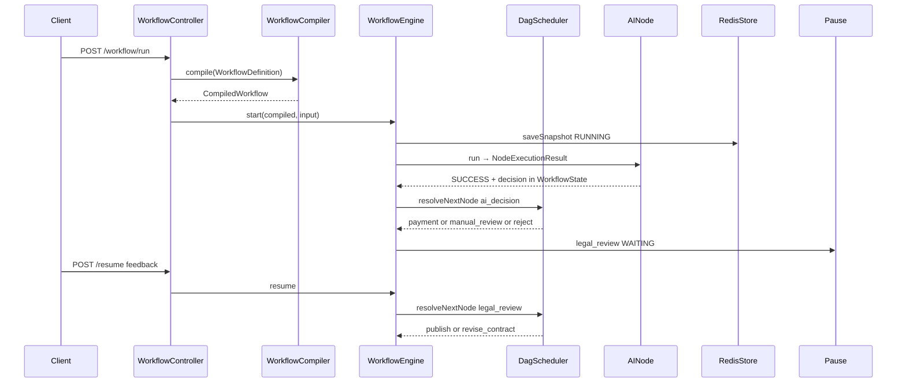
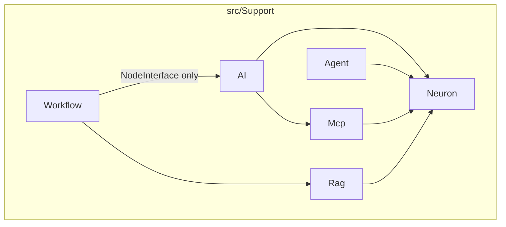
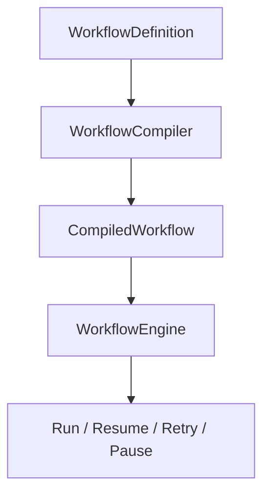
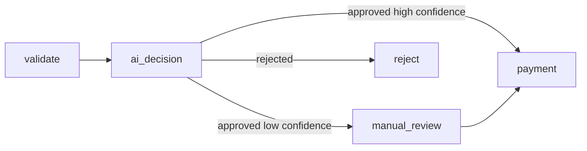
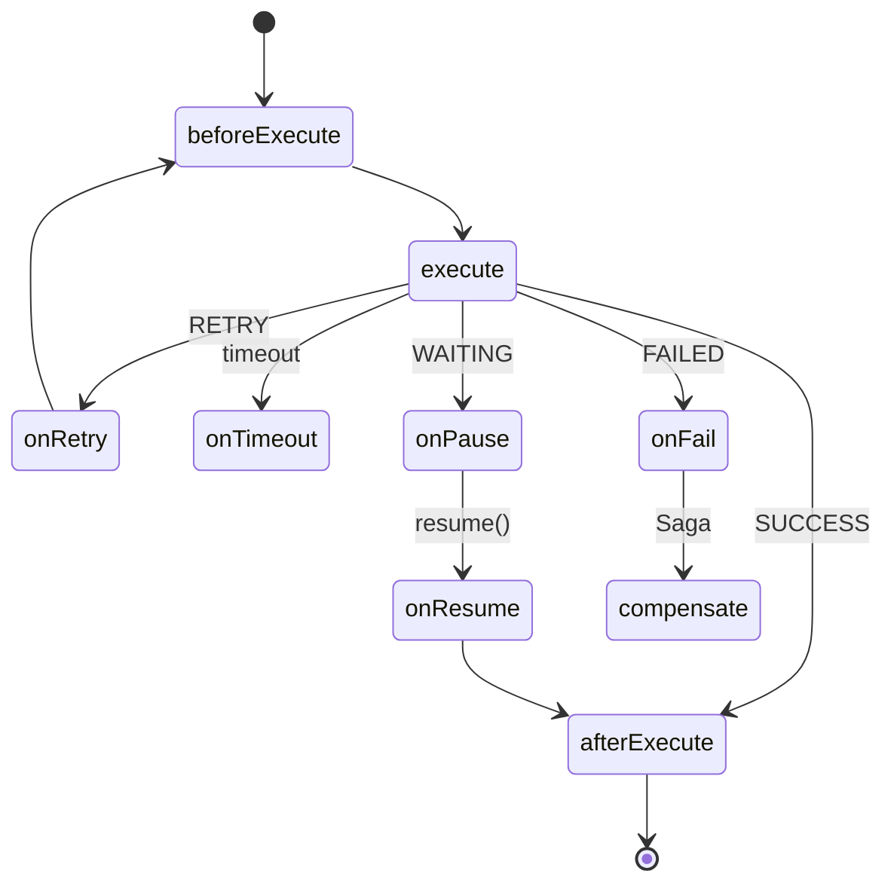
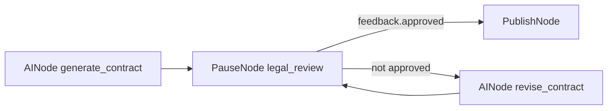
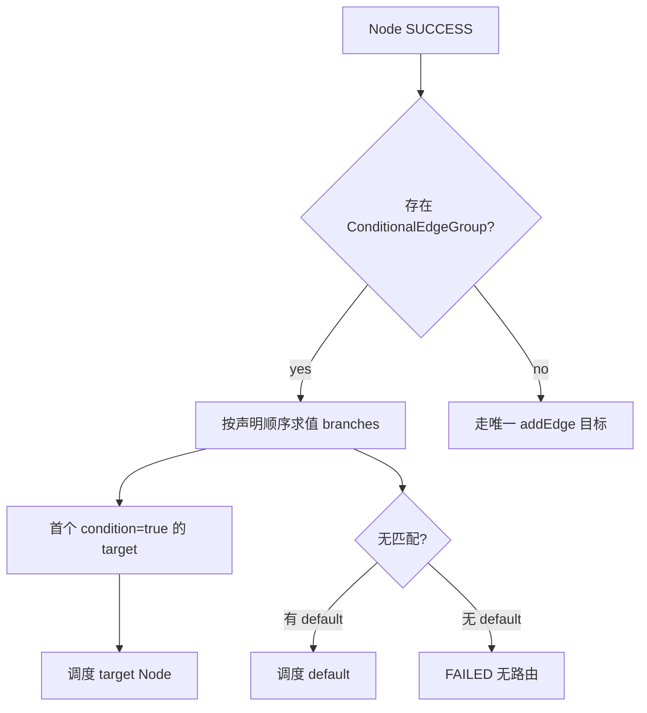
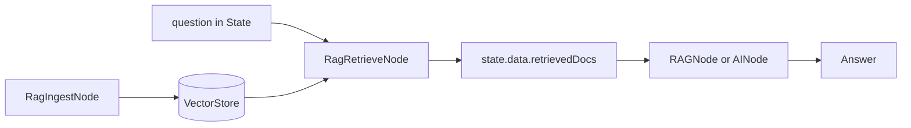
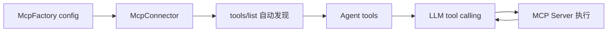
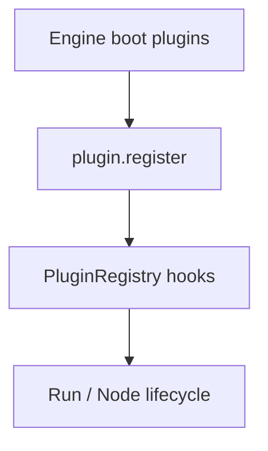

# Neuron AI + Swoolefy 集成技术方案

进行代码开发时，要求如下：
1、先认真阅读swoolefy框架的代码，理解其设计思路和运行原理，包括协程单例goApp, 协程并发Parallel， GoWaitGroup等。然后再阅读neuron-ai的代码，理解neuron-ai的运行原理。
2、swoolefy框架的composer.json 已经在vendor下安装了neuron-core/neuron-ai和php-standard-library/php-standard-library库,在开发实现过程中，可以大量使用这两个库的功能。
3、文件配置化，根据模块功能创建对应的配置文件，并引入到swoolefy的配置文件和生成stub模版。
4、功能封装整合，必须满足能够适应业务的快速接入。
5、添加单元测试用例。

## 1. 定位与核心原则

目标：打造 **PHP 版 Spring AI 2.0 + LangGraph + Temporal** —— Swoolefy 提供运行时与编排基础设施，Neuron AI 提供 AI 原语，业务层通过 **Workflow 节点 + 边依赖** 声明整个工作流，不直接操作调度器。

**关键边界（避免重复造轮子）**

| 层级 | 负责方 | 职责 |
|------|--------|------|
| 运行时 | Swoole / Swoolefy | HTTP/SSE/WS、协程、连接池、定时器、AsyncTask |
| 宏观编排 | **Swoolefy Workflow Engine（新建）** | 业务 DAG、通用 State、事件总线、Node 级协程并发、重试/超时、Saga、快照恢复、**条件边路由** |
| Agent 编排 | **AgentScheduler + AgentRouterInterface** | 路由策略可插拔；协程并发执行、结果汇聚；**调度对象是 Agent，不是 Node** |
| AI 原语 | **Neuron AI（复用）** | Agent、Prompt、Tool Calling、Memory、Structured Output、Provider、RAG、MCP |
| 业务 | 应用 Module | `WorkflowDefinition` 定义流程、自定义 Node、业务 Tool |

**Workflow 三层分离（Definition → Compiler → Runtime）**

| 层 | 类 | 职责 | 不负责 |
|----|-----|------|--------|
| **Definition** | `WorkflowDefinition` | Node、Edge、Metadata、Version；Fluent `addNode/addEdge` | 执行、Redis、协程 |
| **Compiler** | `WorkflowCompiler` | 校验、环检测、可达性、条件组 warning → 产出 `CompiledWorkflow` | Run 生命周期 |
| **Runtime** | `WorkflowEngine` + `PluginManager` | `start()` / `resume()` / `cancel()`；调度、快照、EventBus；**横切能力走 Plugin** | 修改 DAG 定义 |

保留 `Workflow` 作为薄 Facade（`Workflow::define(...)->compile()->start(...)`），内部委托三层。

**四类状态职责分离（重要）**

| 概念 | 职责 | 存储 |
|------|------|------|
| **WorkflowState** | 业务流程变量、节点输出、agentOutputs | Redis 快照 + DB `workflow_runs` |
| **ChatHistory（Memory）** | 用户与 Agent 的多轮对话上下文 | Redis 热会话 + SQL 冷归档 |
| **Structured Output DTO** | LLM 输出的强类型 JSON 对象 | 写入 `WorkflowState`，供下游 Node / **条件边** 消费 |
| **RAG 检索上下文** | 向量检索得到的 Document 片段 | `state.data.retrievedDocs`；向量在 VectorStore |

**推荐策略：三层编排 + Definition/Compiler/Runtime + RAG + MCP**

- **WorkflowDefinition → WorkflowCompiler → WorkflowEngine**：定义与运行彻底分离；`CompiledWorkflow` 可缓存、版本化
- **DagScheduler**：编排 Node；节点完成后通过 **`addConditionalEdges` + `ConditionEvaluatorInterface` 求值** 选择下一跳
- **AgentScheduler + AgentRouterInterface**：路由策略可插拔（Static / Rule / LLM / CostAware）；Scheduler 只负责协程并发
- **Node 完整生命周期**：`beforeExecute` → `execute` → `afterExecute`；以及 `onRetry` / `onTimeout` / `onPause` / `onResume` / `onFail`；**不用 EventBus 当 Hook**
- **AINode Builder DSL**：`AINode::make()->agent()->memory()->mcp()->structured()`，避免配置数组膨胀
- **WorkflowPlugin 插件体系**：Retry / Metrics / Tracing / OTel / RateLimit / Permission；Engine 保持瘦核心
- **MemoryFactory**：独立 ChatHistory；HITL Pause 不切断 threadId
- **Structured Output + 条件边 + Typed State**：`$state->dto(OrderDecisionDto::class)` 驱动分支，避免 magic string
- **NodeExecutionResult**：富结果承载 Streaming / Retry / Saga，不改 Node 接口
- **RAG**：Neuron `RAG` 类 = Agent + 自动检索；Workflow 用 `RAGNode` / `RagRetrieveNode` 嵌入 DAG；入库走 `IngestionPipeline`
- **MCP**：Neuron `McpConnector` 自动发现外部工具；`McpFactory` 统一管理 Server 配置；`AINode.mcpServers` 声明式挂载

---

## 2. 总体架构



---

## 3. 引擎模块设计

### 3.1 包结构（`src/Support/` 分模块孵化，Phase 5 可选拆 `bingcool/swoolefy-*` 包）

与现有 [`src/Support/Nacos/`](../src/Support/Nacos/) 一致：按子域分目录、包间单向依赖。AI 编排不再使用单体 `src/Workflow/`，拆为六个独立子模块；业务示例在 `Test/Module/` 组合各模块 Node。

```
src/Support/
  Workflow/                          # 纯编排内核，零 neuron-ai 依赖
    Workflow.php                     # Facade：define → compile → start / resume / cancel
    Definition/
      WorkflowDefinition.php         # 纯声明：Node、Edge、Metadata、Version
      WorkflowCompiler.php           # 校验 → CompiledWorkflow
      Edge.php                       # type: always | conditional
      EdgeCondition.php              # when() / fromCallable() / always() / fromJsonLogic()
      ConditionalEdgeGroup.php       # 同源多分支 + default
      CompiledWorkflow.php           # 拓扑索引、环检测、可达性（只读）
    Condition/
      ConditionEvaluatorInterface.php
      SymfonyExpressionLanguageEvaluator.php   # 默认（Phase 1）
      CallableConditionEvaluator.php
      JsonLogicEvaluator.php                 # Phase 2+ 可选
    Engine/
      WorkflowEngine.php
      DagScheduler.php
      SubWorkflowRunner.php
      NodeExecutionResult.php
      NodeStatus.php
      NodeLifecycle.php
      RetryPolicy.php
      SagaCoordinator.php                    # Phase 4
    State/
      WorkflowState.php
    Node/
      NodeInterface.php
      AbstractNode.php                 # run() 模板方法编排钩子
      PauseNode.php                    # HITL 通用节点
      SubWorkflowNode.php
    Plugin/
      WorkflowPluginInterface.php
      PluginManager.php
      PluginRegistry.php
      Builtin/
        RetryPlugin.php
        MetricsPlugin.php
        TracingPlugin.php
        OpenTelemetryPlugin.php
        AuditPlugin.php
        RateLimitPlugin.php
        PermissionPlugin.php

  Neuron/                            # Neuron AI 基础设施适配（无 Workflow Node）
    NeuronFactory.php
    Http/
      SwooleHttpClientAdapter.php    # CurlProxy 协程 HTTP 注入 Neuron
    Memory/
      MemoryFactory.php
      RedisChatHistory.php
      SqlChatHistoryArchive.php      # Phase 2
    Embedding/
      EmbeddingFactory.php

  AI/                                # LLM Workflow 节点与 DSL
    Node/
      AINode.php
      StructuredOutputNode.php
    Builder/
      AINodeBuilder.php              # make()->agent()->memory()->structuredOutput()->mcpServers()
    Stream/                          # Phase 2
      StreamBridge.php
      SseResponse.php
      WebSocketStreamSink.php

  Rag/                               # 检索增强与向量存储
    Factory/
      RagFactory.php
      VectorStoreFactory.php         # file | phpvector | meilisearch
    Store/
      FileVectorStore.php
      PhpVectorStore.php
      MeilisearchVectorStore.php     # Phase 4
    Ingestion/
      IngestionPipeline.php
      Loader/
        FileDataLoader.php
        StringDataLoader.php
    Retrieval/
      RetrievalService.php
      RetrievalTool.php              # Phase 4
    Node/
      RAGNode.php
      RagRetrieveNode.php
      RagIngestNode.php
    Builder/
      RAGNodeBuilder.php
    Console/
      IngestDocumentsCommand.php     # Phase 2 CLI

  Agent/                             # 多 Agent 调度与可插拔路由
    AgentScheduler.php
    AgentRouterInterface.php
    RouterContext.php
    Router/
      StaticRouter.php               # Phase 2
      RuleRouter.php                 # Phase 2
      LLMRouter.php                  # Phase 3
      RoundRobinRouter.php
      WeightedRouter.php
      CostAwareRouter.php            # Phase 4

  Mcp/                               # Model Context Protocol
    McpFactory.php
    McpServerConfig.php
    McpProcessRunner.php             # Phase 4 本地 stdio + 协程子进程
    Remote/
      HttpMcpClient.php              # Phase 2 远程 HTTP/SSE

Test/Module/                         # 业务示例（组合各 Support 模块）
  Order/
    Workflow/OrderProcessingWorkflow.php
    Dto/OrderDecisionDto.php
  Knowledge/
    Agent/ProductKnowledgeRag.php
    Workflow/KnowledgeQaWorkflow.php
    Console/IngestDocumentsCommand.php
  Research/
    Agent/ResearchAgent.php
    Workflow/McpResearchWorkflow.php
```

#### 模块依赖



**硬约束**：

- `Support/Workflow` 不依赖 `Neuron` / `AI` / `Rag` / `Agent` / `Mcp`
- `AI` / `Rag` / `Agent` / `Mcp` 仅依赖 `Workflow\Node\NodeInterface` + `Workflow\State\WorkflowState`
- `Neuron` 仅依赖 Swoolefy Core + `neuron-ai`；不依赖 `Workflow\Engine`

**命名空间**：`Swoolefy\Support\{Workflow|Neuron|AI|Rag|Agent|Mcp}\...`

| 原 `src/Workflow/` 路径 | 新路径 |
|-------------------------|--------|
| `Workflow/Definition/*` | `Support/Workflow/Definition/*` |
| `Workflow/Condition/*` | `Support/Workflow/Condition/*` |
| `Workflow/Engine/*` | `Support/Workflow/Engine/*` |
| `Workflow/Node/AINode*` | `Support/AI/Node/*` + `Support/AI/Builder/*` |
| `Workflow/Node/RAG*` | `Support/Rag/Node/*` + `Support/Rag/Builder/*` |
| `Workflow/Node/PauseNode` | `Support/Workflow/Node/PauseNode` |
| `Workflow/Agent/*` | `Support/Agent/*` |
| `Workflow/Plugin/*` | `Support/Workflow/Plugin/*` |
| `Workflow/Rag/*` | `Support/Rag/Ingestion/*` + `Retrieval/*` |
| `Workflow/Neuron/*` | `Support/Neuron/*` + `Support/Mcp/*` + `Support/Rag/Factory/*` |

### 3.2 引擎内部契约

**WorkflowState**（`Swoolefy\Support\Workflow\State\WorkflowState`；快照序列化仍用底层 array；业务优先 Typed API，见 §3.4）

```php
// namespace Swoolefy\Support\Workflow\State;

final class WorkflowState
{
    public array $data = [];
    public array $nodeOutputs = [];
    public array $agentOutputs = [];
    public array $meta = [];

    public function get(string $key, mixed $default = null): mixed;
    public function set(string $key, mixed $value): void;
    public function dto(string $class): object;
    public function outputOf(string $nodeId): mixed;
    public function agentOutput(string $agentId): mixed;
}
```

**NodeExecutionResult**（替代简单 `NodeResult::SUCCESS`）

```php
enum NodeStatus: string
{
    case SUCCESS = 'success';
    case WAITING = 'waiting';           // HITL Pause
    case FAILED = 'failed';
    case SKIPPED = 'skipped';
    case RETRY = 'retry';
    case COMPENSATING = 'compensating'; // Saga
}

final class NodeExecutionResult
{
    public NodeStatus $status;
    public mixed $output;                // 写入 state 的节点输出
    public array $events = [];           // 待发布 EventBus（token、rag、mcp…）
    public array $metrics = [];          // latencyMs、tokenCount、retryCount
    public array $nextHints = [];        // 可选显式下一跳 hint
    public ?RetryPolicy $retry = null;   // 节点级重试 override
}
```

### 3.3 Definition / Compiler / Runtime 契约



| 类 | 关键方法 | 说明 |
|----|----------|------|
| `WorkflowDefinition` | `create($id, $version)`、`addNode`、`addEdge`、`addConditionalEdges`、`plugins(...)`、`metadata()`、`registerSchema($key, $dtoClass)` | 纯声明；可序列化/版本化；**不含** `start()` |
| `WorkflowCompiler` | `compile(WorkflowDefinition): CompiledWorkflow` | 环检测、可达性、条件组互斥 warning、default 目标校验 |
| `CompiledWorkflow` | `fixedEdge($from)`、`conditionalGroup($from)`、`node($id)` | 只读索引；部署时或启动前缓存 |
| `WorkflowEngine` | `start(CompiledWorkflow, input)`、`resume($runId, $feedback)`、`cancel($runId)` | Run 生命周期；调度 `DagScheduler`；写 Redis 快照 |

**Version / Metadata**：`WorkflowDefinition::metadata(['owner' => 'order-team', 'description' => '...'])`；可选持久化至 `workflow_definitions` 表（§9）。

### 3.4 State Typed API

避免 Node 内大量 `$state->get('decision')` magic string：

```php
// Node 内业务逻辑（推荐）
$decision = $state->dto(OrderDecisionDto::class);
$aiOutput = $state->outputOf('ai_decision');
$agents   = $state->agentOutput('coding');

// Module 层可选：强类型 State 子类
final class OrderWorkflowState extends WorkflowState
{
    public function decision(): OrderDecisionDto
    {
        return $this->dto(OrderDecisionDto::class);
    }
}
```

**约定**：
- `AINode` + `structuredOutput` + `outputKey` → 自动注册 schema hint，供 `dto()` 反序列化
- 条件边表达式通过 `ConditionEvaluatorInterface` 读底层 `data` / `nodeOutputs`（§4.9）
- Node 内业务逻辑 **优先 Typed API**；表达式用于声明式路由

### 3.5 WorkflowPlugin 契约

**原则**：横切关注点（Retry、Metrics、Tracing、RateLimit 等）通过 Plugin 扩展，`WorkflowEngine` 保持瘦核心；**Plugin 钩子 ≠ EventBus**（EventBus 仅对外可观测性广播）。

```php
interface WorkflowPluginInterface
{
    public function name(): string;
    public function register(PluginRegistry $registry): void;
}

interface PluginRegistry
{
    public function onEngineStart(callable $hook): void;
    public function onEngineStop(callable $hook): void;
    public function onRunStart(callable $hook): void;
    public function onRunComplete(callable $hook): void;
    public function onNodeBefore(callable $hook): void;
    public function onNodeAfter(callable $hook): void;
    public function onNodeFail(callable $hook): void;
    public function onPause(callable $hook): void;
    public function onResume(callable $hook): void;
}
```

**与 Node 生命周期关系**：

| 机制 | 职责 | 调用方 |
|------|------|--------|
| Node 钩子（`beforeExecute` 等） | 业务 Node 自身扩展 | `AbstractNode::run()` |
| Plugin 钩子（`onNodeBefore` 等） | 引擎横切（Metrics、Tracing、RateLimit） | `PluginManager` |
| EventBus | 对外 SSE/WS 事件（token、edge.route） | Engine 发布 `NodeExecutionResult.events` |

**Definition 挂载**：`WorkflowDefinition::plugins(RetryPlugin::class, TracingPlugin::class, ...)`

---

## 4. 业务层开发模型

业务层扩展点：**自定义 Node**、**Tool**、**PauseNode（HITL）**、**AgentParallel + AgentRouter**、**Memory**、**Structured Output**、**条件边**、**RAG 检索**、**MCP 连接器**、**WorkflowPlugin**。

### 4.1 Workflow 声明式 API（Definition → Compiler → Runtime）

**三步分离**（推荐）：

```php
// 1. Definition — 纯声明，可版本化
$definition = WorkflowDefinition::create('order_processing', version: '1.0.0')
    ->metadata(['owner' => 'order-team'])
    ->plugins(RetryPlugin::class, TracingPlugin::class)
    ->registerSchema('decision', OrderDecisionDto::class)
    ->addNode('validate', new ValidateNode('validate', $orderService))
    ->addNode('ai_decision', AINode::make('ai_decision')
        ->agent(OrderDecisionAgent::class)
        ->structured(OrderDecisionDto::class, outputKey: 'decision')
        ->memory(threadIdKey: 'sessionId')
        ->build())
    ->addNode('payment', new PaymentNode('payment', $paymentService))
    ->addNode('manual_review', new ManualReviewNode('manual_review'))
    ->addNode('reject', new RejectNode('reject'))
    ->addEdge('validate', 'ai_decision')
    ->addConditionalEdges('ai_decision', [
        'payment'       => EdgeCondition::when("data['decision'].approved == true and data['decision'].confidence >= 0.8"),
        'manual_review' => EdgeCondition::when("data['decision'].approved == true and data['decision'].confidence < 0.8"),
        'reject'        => EdgeCondition::when("data['decision'].approved == false"),
    ], default: 'reject')
    ->addEdge('manual_review', 'payment')
    ->addEdge('payment', 'notify');

// 2. Compiler — 启动前或部署时编译（可缓存 CompiledWorkflow）
$compiled = app(WorkflowCompiler::class)->compile($definition);

// 3. Runtime — HTTP / CLI 只调 Engine
$runId = app(WorkflowEngine::class)->start($compiled, input: [
    'orderId' => 10001, 'userId' => 'u123', 'sessionId' => 's-abc',
]);
```

**薄 Facade**（快捷写法，内部仍走三层）：

```php
$runId = Workflow::define('order_processing')
    ->addNode(...)
    ->addEdge(...)
    ->compile()
    ->start(['orderId' => 10001]);
```



**WorkflowDefinition 边相关方法**（`addNode/addEdge/addConditionalEdge(s)` 均在 Definition 上）

| 方法 | 说明 |
|------|------|
| `addEdge(string $from, string $to)` | **无条件**固定边（仅两参数） |
| `addConditionalEdge(string $from, string $to, EdgeCondition\|callable $condition)` | 单条条件边 |
| `addConditionalEdges(string $from, array $branches, ?string $default = null)` | 同源多分支；`$branches` 为 `target => condition` |
| `addParallel(...)` / `addAgentParallel(...)` | 并行扇出（见 §4.6） |

**约定**：条件转移统一用 `addConditionalEdge(s)`；**Definition 不含 `start()`**；运行统一走 `WorkflowEngine`。

### 4.2 自定义 Node：完整生命周期 + execute()

**原则**：生命周期钩子走 **Node 接口 / 模板方法**；**不用 EventBus 当 Hook**（EventBus 仅用于对外可观测性）。



```php
interface NodeInterface
{
    public function id(): string;
    public function beforeExecute(RunContext $ctx, WorkflowState $state): void;
    public function execute(RunContext $ctx, WorkflowState $state): NodeExecutionResult;
    public function afterExecute(RunContext $ctx, WorkflowState $state, NodeExecutionResult $result): void;
    public function onRetry(RunContext $ctx, WorkflowState $state, int $attempt, ?\Throwable $e): void;
    public function onTimeout(RunContext $ctx, WorkflowState $state): void;
    public function onPause(RunContext $ctx, WorkflowState $state, NodeExecutionResult $result): void;
    public function onResume(RunContext $ctx, WorkflowState $state, array $feedback): void;
    public function onFail(RunContext $ctx, WorkflowState $state, ?\Throwable $e): void;
    public function compensate(RunContext $ctx, WorkflowState $state): void;
}

abstract class AbstractNode implements NodeInterface
{
    public function __construct(protected readonly string $nodeId) {}
    public function id(): string { return $this->nodeId; }

    /** Engine 只调 run()，内部编排生命周期顺序 */
    final public function run(RunContext $ctx, WorkflowState $state): NodeExecutionResult
    {
        $this->beforeExecute($ctx, $state);
        try {
            $result = $this->execute($ctx, $state);
            match ($result->status) {
                NodeStatus::WAITING => $this->onPause($ctx, $state, $result),
                NodeStatus::RETRY   => $this->onRetry($ctx, $state, $ctx->attempt(), $result->error ?? null),
                NodeStatus::FAILED  => $this->onFail($ctx, $state, $result->error ?? null),
                default => null,
            };
            if ($result->status === NodeStatus::SUCCESS) {
                $this->afterExecute($ctx, $state, $result);
            }
            return $result;
        } catch (TimeoutException $e) {
            $this->onTimeout($ctx, $state);
            throw $e;
        }
    }

    /** resume 路径：Engine 调 onResume → 重新求值条件边 */
    final public function resume(RunContext $ctx, WorkflowState $state, array $feedback): void
    {
        $this->onResume($ctx, $state, $feedback);
    }

    // 默认空实现，子类按需 override
    public function beforeExecute(RunContext $ctx, WorkflowState $state): void {}
    abstract public function execute(RunContext $ctx, WorkflowState $state): NodeExecutionResult;
    public function afterExecute(RunContext $ctx, WorkflowState $state, NodeExecutionResult $result): void {}
    public function onRetry(RunContext $ctx, WorkflowState $state, int $attempt, ?\Throwable $e): void {}
    public function onTimeout(RunContext $ctx, WorkflowState $state): void {}
    public function onPause(RunContext $ctx, WorkflowState $state, NodeExecutionResult $result): void {}
    public function onResume(RunContext $ctx, WorkflowState $state, array $feedback): void {}
    public function onFail(RunContext $ctx, WorkflowState $state, ?\Throwable $e): void {}
    public function compensate(RunContext $ctx, WorkflowState $state): void {}
}
```

**NodeExecutionResult 引擎行为**：

| status | Engine 行为 |
|--------|-------------|
| `SUCCESS` | 写 `output` → `DagScheduler::resolveNextNode` |
| `WAITING` | 调 `onPause` → 快照 + 停止调度（HITL） |
| `RETRY` | 调 `onRetry` → `RetryExecutor` 退避 → 再 `run()` |
| `FAILED` | 调 `onFail` → Run 失败或 Saga `compensate()` |
| `events` | Engine 统一 `EventBus::publish`（**对外广播**，非生命周期 Hook） |

### 4.3 AINode：Builder DSL

配置项持续膨胀（agent、model、stream、memory、rag、mcp、structured、provider、temperature…），采用 **Builder DSL**；数组构造器保留作快捷方式（内部转 Builder）。

```php
$definition->addNode('ai_decision', AINode::make('ai_decision')
    ->agent(OrderDecisionAgent::class)
    ->provider('openai', model: 'gpt-4o')
    ->temperature(0.2)
    ->memory(threadIdKey: 'sessionId')
    ->structured(OrderDecisionDto::class, outputKey: 'decision')
    ->stream(enabled: true)
    ->rag(knowledgeBase: 'product_kb', topK: 5)       // 可选
    ->mcp(['github'], only: ['search_code'])
    ->promptKey('orderBrief')
    ->timeout(30)
    ->retry(maxAttempts: 3)
    ->build());

// RAGNode 同理
$definition->addNode('answer', RAGNode::make('answer')
    ->ragAgent(ProductKnowledgeRag::class)
    ->promptKey('question')
    ->topK(5)
    ->memory()
    ->stream()
    ->build());
```

**快捷方式**（小型节点仍可用数组）：`new AINode('id', ['agent' => X::class, ...])` → 内部 `AINodeBuilder::fromArray()`。

### 4.4 Tool：Neuron 工具 + 嵌套子流程

`AbstractWorkflowTool` + `SubWorkflowRunner`。

### 4.5 Human-in-the-Loop（HITL）



```php
$definition->addNode('generate_contract', AINode::make('generate_contract')
    ->agent(ContractDraftAgent::class)
    ->promptKey('contractBrief')
    ->build());
$definition->addNode('legal_review', new PauseNode('legal_review', [
    'assignee'    => 'legal-team',
    'title'       => '合同法务确认',
    'payloadKeys' => ['contractDraft', 'decision'],
]));
$definition->addNode('revise_contract', AINode::make('revise_contract')
    ->agent(ContractReviseAgent::class)
    ->build());
$workflow->addNode('publish', new PublishNode('publish', $publishService));

$workflow->addEdge('generate_contract', 'legal_review');

// Resume 后按 feedback 分支
$workflow->addConditionalEdges('legal_review', [
    'publish'         => EdgeCondition::when("data['feedback'].approved == true"),
    'revise_contract' => EdgeCondition::when("data['feedback'].approved == false"),
]);

$workflow->addEdge('revise_contract', 'legal_review');
```

`feedback` 由 `WorkflowEngine::resume($runId, $feedback)` 合并进 `state.data`，随后 `DagScheduler` 对 `legal_review` 的条件边组求值。

### 4.6 多 Agent 协同（AgentRouterInterface + AgentScheduler）

**路由与执行分离**：`AgentRouterInterface` 决定调用哪些 Agent；`AgentScheduler` 只负责 Swoole 协程并发执行与结果汇聚。

```php
interface AgentRouterInterface
{
    /** @return string[] 待并行执行的 agentId 列表 */
    public function route(RouterContext $ctx): array;
}
```

| 实现 | 场景 | Phase |
|------|------|-------|
| `StaticRouter` | 固定 agent 列表 | Phase 2 |
| `RuleRouter` | 规则/表达式选 Agent（读 WorkflowState） | Phase 2 |
| `LLMRouter` | LLM 决定调用哪些 Agent | Phase 3 |
| `RoundRobinRouter` | 负载均衡 | Phase 3 |
| `WeightedRouter` | 加权随机 | Phase 4 |
| `CostAwareRouter` | 按 token/成本选模型或 Agent | Phase 4 |

```php
$definition->addAgentParallel('research', [
    'router' => LLMRouter::make(model: 'gpt-4o-mini'),
    'agents' => [
        'coding'  => AINode::make('coding')->agent(CodingAgent::class)->mcp(['github'])->build(),
        'finance' => AINode::make('finance')->agent(FinanceAgent::class)->build(),
    ],
]);

// AgentScheduler 内部
final class AgentScheduler
{
    public function __construct(
        private NeuronFactory $neuronFactory,
        private AgentRouterInterface $router,
    ) {}

    public function runParallel(RouterContext $ctx, array $agentConfigs): array
    {
        $agentIds = $this->router->route($ctx);
        // Swoole Parallel / GoWaitGroup 并发执行选中 Agent
    }
}
```

Workflow 层仍可用 `addConditionalEdges` 对 Router 输出选路：

```php
$definition->addConditionalEdges('router', [
    'research' => EdgeCondition::fromCallable(fn (WorkflowState $s) => !empty(($s->outputOf('router') ?? [])['selectedAgents'] ?? [])),
    'summary'  => EdgeCondition::fromCallable(fn (WorkflowState $s) => empty(($s->outputOf('router') ?? [])['selectedAgents'] ?? [])),
], default: 'summary');
```

### 4.7 对话记忆（Memory）

利用 Neuron AI 的 **ChatHistory** 能力，为每个用户或会话维护独立上下文，支持跨请求、跨 Pause 的连续对话。

| 组件 | 用途 |
|------|------|
| `InMemoryChatHistory` | 单次执行默认；`memory => false` |
| `FileChatHistory` | 文件持久化（开发/单机） |
| `SQLChatHistory` | PDO 持久化 |
| `AbstractChatHistory` | 自定义后端 → `RedisChatHistory` |

```php
class CustomerServiceAgent extends Agent
{
    protected function chatHistory(): ChatHistoryInterface
    {
        return $this->memoryFactory->forThread(
            threadId: $this->context()->threadId(),
            contextWindow: 50000,
        );
    }
}
```

**threadId 策略**：`{userId}:{agentName}`（持续记忆）、`{sessionId}`（匿名）、`{userId}:{workflowId}:{runId}`（run 隔离）、HITL Pause **不变**、多 Agent `{runId}:agent:{agentId}`。

**Redis 热 + SQL 冷归档**：`chat:thread:{threadId}`（30d TTL）+ `chat_messages` 表永久归档；`goApp()` 异步写 SQL。

### 4.8 结构化输出（Structured Output）

```php
final class OrderDecisionDto
{
    #[SchemaProperty(description: '是否批准订单', required: true)]
    public bool $approved;

    #[SchemaProperty(description: '风险评分 0-1', required: true)]
    public float $confidence;

    #[SchemaProperty(description: '决策理由', required: true)]
    public string $reason;
}
```

**DTO 与条件边联动**：

```php
$definition->addNode('ai_decision', AINode::make('ai_decision')
    ->agent(OrderDecisionAgent::class)
    ->structured(OrderDecisionDto::class, outputKey: 'decision')
    ->build());

$workflow->addConditionalEdges('ai_decision', [
    'payment'       => EdgeCondition::when("data['decision'].approved == true and data['decision'].confidence >= 0.8"),
    'manual_review' => EdgeCondition::when("data['decision'].approved == true and data['decision'].confidence < 0.8"),
    'reject'        => EdgeCondition::when("data['decision'].approved == false"),
], default: 'reject');
```

| 消费方 | 方式 |
|--------|------|
| 条件边 | `addConditionalEdges` + Symfony EL 读 `data['decision'].*` |
| DB Node | `$state->dto(OrderDecisionDto::class)` 或 `$state->outputOf('ai_decision')` |
| PauseNode | `payloadKeys` 含 `decision.reason` |
| HTTP 响应 | `nodeOutputs.ai_decision` |

---

### 4.9 条件边（Conditional Edge）

条件边是 Workflow **路由核心**：Node 执行成功后，根据 `WorkflowState` 选择下一跳。

#### 4.9.1 API

**单条条件边**

```php
$definition->addConditionalEdge(
    from: 'risk_check',
    to: 'ai_decision',
    condition: EdgeCondition::when("data['riskScore'] < 0.7"),
);
```

**多分支条件边**（一个源节点 → 多个目标，推荐）

```php
$definition->addConditionalEdges('ai_decision', [
    'payment'       => EdgeCondition::when("data['decision'].approved == true and data['decision'].confidence >= 0.8"),
    'manual_review' => EdgeCondition::when("data['decision'].approved == true and data['decision'].confidence < 0.8"),
    'reject'        => EdgeCondition::when("data['decision'].approved == false"),
], default: 'reject');
```

**Callable 条件**（复杂逻辑，推荐 Typed API）

```php
$definition->addConditionalEdge('risk_check', 'ai_decision', EdgeCondition::fromCallable(
    fn (WorkflowState $state): bool => ($state->get('riskScore') ?? 1.0) < 0.7
));

$definition->addConditionalEdges('router', [
    'coding'  => EdgeCondition::fromCallable(fn (WorkflowState $s) => in_array('coding', ($s->outputOf('router') ?? [])['selectedAgents'] ?? [], true)),
    'finance' => EdgeCondition::fromCallable(fn (WorkflowState $s) => in_array('finance', ($s->outputOf('router') ?? [])['selectedAgents'] ?? [], true)),
], default: 'summary');
```

#### 4.9.2 EdgeCondition 与 ConditionEvaluatorInterface

**不自研表达式引擎**。`EdgeCondition` 持有条件描述符，求值委托可插拔 `ConditionEvaluatorInterface`：

```php
interface ConditionEvaluatorInterface
{
    public function evaluate(mixed $condition, WorkflowState $state): bool;
}

final class EdgeCondition
{
    public static function when(string $expression): self;       // 委托默认 Evaluator（Symfony EL）
    public static function always(): self;
    public static function fromCallable(callable $fn): self;     // fn(WorkflowState): bool
    public static function fromJsonLogic(array $rule): self;     // Phase 2+ 可选
}
```

**默认实现（Phase 1）**：`SymfonyExpressionLanguageEvaluator`（`symfony/expression-language`）

**可切换实现**：

| 实现 | 场景 |
|------|------|
| `SymfonyExpressionLanguageEvaluator` | **默认**；成熟、可扩展自定义函数 |
| `CallableConditionEvaluator` | Callable 条件直通 |
| `JsonLogicEvaluator` | 前端/配置化规则（Phase 2+） |
| `CelEvaluator` | 云原生策略（Phase 5 可选） |

**表达式上下文变量**（注入 Evaluator，只读）：

| 变量 | 说明 | Symfony EL 示例 |
|------|------|-----------------|
| `data` | `state.data` 简写 | `data['decision'].approved == true` |
| `nodeOutputs` | 各节点输出 | `nodeOutputs['ai_decision'].confidence >= 0.8` |
| `feedback` | HITL resume 数据 | `feedback.approved == true` |
| `state` | 完整 WorkflowState | 高级场景 |

表达式语法遵循 **Symfony ExpressionLanguage**（`and` / `or` / `not`；`matches`；`in`；比较运算符等），**不**固定为自研 DSL。

#### 4.9.3 求值语义



| 规则 | 说明 |
|------|------|
| 求值时机 | 源 Node `NodeExecutionResult.status == SUCCESS` 后；`WAITING` / `FAILED` 不求值 |
| 求值顺序 | `addConditionalEdges` 数组**声明顺序**，首个为 true 的分支获胜 |
| 默认分支 | `default:` 参数；无匹配时兜底，避免悬空 |
| 互斥性 | 编译期 **warning**（非阻断）：多条件可能同时为 true，靠顺序消解 |
| HITL | `resume()` 合并 feedback 后，从 Pause 节点重新求值条件边 |
| 编译校验 | 环检测含条件边；`default` 目标必须已 `addNode`；不可达节点 warning |

#### 4.9.4 与 HITL / Structured Output 集成

- **Structured Output**：`AINode` 写入 `state.data.decision` → 条件边读 `data['decision'].*`；Node 内用 `$state->dto(OrderDecisionDto::class)`
- **HITL**：`resume(['approved' => true, ...])` → `state.data.feedback` → `addConditionalEdges('legal_review', ...)`
- **可观测性**：EventBus 发布 `edge.route` 事件，含 `from`、`selectedTarget`、`conditionIndex`

---

### 4.10 RAG 检索（Retrieval Augmented Generation）

利用 Neuron AI 的 **RAG 管线**，将私有知识库（PDF、HTML、DB 文本等）向量化后检索，增强 LLM 回答准确性。RAG 上下文写入 `WorkflowState.data`，**不**写入 ChatHistory。

#### 4.10.1 Neuron 原生能力（直接复用）

| 组件 | 作用 |
|------|------|
| `RAG` 类（extends `Agent`） | provider + embeddings + vectorStore + 自动 `SimilarityRetrieval` |
| `FileDataLoader` / `StringDataLoader` | PDF/HTML/MD/DB 文本 → `Document[]` |
| `EmbeddingsProvider` | OpenAI / Ollama / Voyage 等 |
| `VectorStore` | File / PHPVector / Meilisearch / 自定义 `VectorStoreInterface` |
| `SimilarityRetrieval` | 相似度检索，返回 TopK `Document` |
| `RetrievalTool` | 普通 Agent 按需检索（LLM 自主决定何时查库） |

#### 4.10.2 向量库策略（开发 + 生产混合）

| 环境 | 实现 | 说明 |
|------|------|------|
| 开发/单机 | `FileVectorStore` 或 `PHPVector` | 零外部依赖、快速验证 |
| 生产 | `MeilisearchVectorStore` | Neuron 原生支持；每知识库独立 index |
| 切换 | `VectorStoreFactory::make($name)` | 环境变量 `RAG_VECTOR_STORE=file|phpvector|meilisearch` |

```php
final class VectorStoreFactory
{
    public function make(string $knowledgeBase): VectorStoreInterface
    {
        return match (env('RAG_VECTOR_STORE', 'file')) {
            'meilisearch' => new MeilisearchVectorStore(host: env('MEILISEARCH_HOST'), index: $knowledgeBase),
            'phpvector'   => new PHPVector(path: env('RAG_FILE_STORE_PATH').'/'.$knowledgeBase, topK: 5),
            default       => new FileVectorStore(directory: env('RAG_FILE_STORE_PATH'), name: $knowledgeBase),
        };
    }
}
```

#### 4.10.3 RAG Agent 业务实现

```php
class ProductKnowledgeRag extends RAG
{
    protected function provider(): AIProviderInterface { ... }

    protected function embeddings(): EmbeddingsProviderInterface
    {
        return $this->embeddingFactory->make();
    }

    protected function vectorStore(): VectorStoreInterface
    {
        return $this->vectorStoreFactory->make('product_kb');
    }

    protected function retrieval(): RetrievalInterface
    {
        return new SimilarityRetrieval(
            $this->resolveVectorStore(),
            $this->resolveEmbeddingsProvider(),
        );
    }
}
```

#### 4.10.4 Workflow 集成三种模式



**模式 A：`RAGNode`（自动检索 + 生成，推荐问答）**

```php
$workflow->addNode('answer', new RAGNode('answer', [
    'ragAgent'  => ProductKnowledgeRag::class,
    'promptKey' => 'question',
    'topK'      => 5,
    'memory'    => true,
    'stream'    => true,
]));
```

**模式 B：`RagRetrieveNode` + `AINode`（检索与推理分离）**

```php
$workflow->addNode('retrieve', new RagRetrieveNode('retrieve', [
    'knowledgeBase' => 'product_kb',
    'queryKey'      => 'question',
    'outputKey'     => 'retrievedDocs',
    'topK'          => 5,
]));
$definition->addNode('answer', AINode::make('answer')
    ->agent(AnswerAgent::class)
    ->promptKey('question')
    ->build());
$workflow->addEdge('retrieve', 'answer');

// 无检索结果时走兜底
$workflow->addConditionalEdges('retrieve', [
    'answer'      => EdgeCondition::when("data['retrievedDocs'] is not empty"),
    'no_context'  => EdgeCondition::when("data['retrievedDocs'] is empty"),
], default: 'no_context');
```

**模式 C：`RetrievalTool`（Agent 按需检索）**

```php
class SupportAgent extends Agent
{
    protected function tools(): array
    {
        $store = $this->vectorStoreFactory->make('product_kb');
        $embedder = $this->embeddingFactory->make();
        return [
            new RetrievalTool(new SimilarityRetrieval($store, $embedder)),
        ];
    }
}
```

#### 4.10.5 文档入库（Ingestion）

**离线 CLI / 管理接口**

```php
$documents = FileDataLoader::for('/data/manuals')
    ->addReader('pdf', new PdfReader())
    ->addReader(['html', 'md'], new HtmlReader())
    ->getDocuments();

app()->get(IngestionPipeline::class)->ingest('product_kb', $documents);
// 内部：chunk → embedDocuments → vectorStore.addDocuments
```

**Workflow 内入库**

```php
$workflow->addNode('ingest', new RagIngestNode('ingest', [
    'knowledgeBase' => 'product_kb',
    'sourceKey'     => 'uploadedFiles',   // State 中的路径或文本列表
]));
```

大批量入库走 `AsyncTask::registerTask()`，HTTP 返回 `ingestJobId`，避免阻塞 Worker。

#### 4.10.6 与 Memory / Structured Output / 条件边

| 能力 | 集成方式 |
|------|----------|
| Memory | RAG 对话仍用 `threadId`；检索结果每轮刷新，不存入 ChatHistory |
| Structured Output | `RAGNode` 可配 `structuredOutput`；检索片段在 `retrievedDocs` |
| 条件边 | `EdgeCondition::when("data['retrievedDocs'] is not empty")` 控制是否有上下文分支 |
| HITL | `PauseNode` 的 `payloadKeys` 可含 `retrievedDocs` 供人审引用来源 |

**`KnowledgeQaWorkflow` 完整示例**

```php
$definition = WorkflowDefinition::create('knowledge_qa');
$definition->addNode('retrieve', new RagRetrieveNode('retrieve', [
    'knowledgeBase' => 'product_kb',
    'queryKey'      => 'question',
    'outputKey'     => 'retrievedDocs',
]));
$definition->addNode('answer', RAGNode::make('answer')
    ->ragAgent(ProductKnowledgeRag::class)
    ->promptKey('question')
    ->memory()
    ->build());
$definition->addEdge('retrieve', 'answer');
$compiled = app(WorkflowCompiler::class)->compile($definition);
app(WorkflowEngine::class)->start($compiled, input: [
    'question' => '门框尺寸是多少？', 'userId' => 'u1', 'sessionId' => 's1',
]);
```

---

### 4.11 MCP 连接器（Model Context Protocol）

利用 Neuron AI 原生 **McpConnector**，将外部 MCP Server 暴露的工具自动接入 Agent，无需手工实现每个 Tool。MCP 工具调用过程由 Neuron 管理，结果作为 LLM 中间上下文，**默认不**写入 `WorkflowState`（除非 Agent 配置了 `structuredOutput`）。

#### 4.11.1 Neuron 原生能力（直接复用）

| 组件 | 作用 |
|------|------|
| `McpConnector::make($config)` | 连接单个 MCP Server，自动 `->tools()` 发现工具 |
| `command` + `args` | 本地 stdio Server（npx、php 脚本等） |
| `url` + `token` + `headers` | 远程 Streamable HTTP |
| `async => true` | 远程 SSE 传输 |
| `only()` / `exclude()` | 按工具名白/黑名单，控制 token 消耗与误调用风险 |

#### 4.11.2 Swoolefy 桥接：`McpFactory`

`McpFactory` 从配置/环境变量加载命名 Server，返回可注入 Agent 的 connector：

```php
// config/mcp.php
return [
    'github'   => ['url' => env('MCP_GITHUB_URL'), 'token' => env('MCP_GITHUB_TOKEN'), 'timeout' => 30],
    'postgres' => ['command' => 'npx', 'args' => ['-y', '@modelcontextprotocol/server-postgres', $dsn]],
];

// Agent 侧
...$mcpFactory->connectors('github')->only(['search_repositories'])->tools(),
```

**`NeuronFactory` 扩展**：构建 Agent 时若 `AINode` 配置了 `mcpServers: ['github', 'internal_api']`，自动 merge 对应 `McpConnector` tools。

#### 4.11.3 Workflow 集成三种模式



**模式 A：Agent 内声明 MCP（最简单，推荐）**

```php
class DataAnalystAgent extends Agent
{
    protected function tools(): array
    {
        return [
            ...$this->mcpFactory->connectors('github')->only(['search_code'])->tools(),
            new InternalReportTool(),
        ];
    }
}
```

**模式 B：`AINode` 声明式挂载（Workflow 无侵入改 Agent）**

```php
$definition->addNode('analyze', AINode::make('analyze')
    ->agent(DataAnalystAgent::class)
    ->mcp(['github', 'slack'], only: ['github' => ['search_code'], 'slack' => ['post_message']])
    ->memory()
    ->stream()
    ->build());
```

**模式 C：多 Agent 各连不同 MCP（`AgentParallelNode`）**

```php
$workflow->addAgentParallel('research', [
    ['agent' => CodingAgent::class,   'mcpServers' => ['github']],
    ['agent' => FinanceAgent::class,  'mcpServers' => ['postgres']],
    ['agent' => CustomerAgent::class, 'mcpServers' => ['zendesk']],
]);
```

#### 4.11.4 Swoole 协程适配

| 传输 | Neuron 配置 | Swoolefy 适配 |
|------|-------------|---------------|
| 远程 HTTP | `url` + `token` | 注入 `CurlProxyHandler`（与 Provider、RAG embed 一致） |
| 远程 SSE | `async => true` | 同上；与 Swoole 协程天然兼容 |
| 本地 stdio | `command` + `args` | `McpProcessRunner` 在协程/专用 Process 中执行子进程，避免阻塞 Worker；**生产优先远程 HTTP MCP** |

**生命周期**：
- 远程：按请求懒连接 + 短超时；可选 Redis 缓存 `tools/list`（TTL `MCP_TOOLS_CACHE_TTL`）
- 本地：每个 Worker 限制并发子进程数（`MCP_MAX_LOCAL_PROCESSES`）

#### 4.11.5 与 Memory / Structured Output / 条件边 / HITL

| 能力 | 集成方式 |
|------|----------|
| Memory | MCP 工具调用在 Neuron 内部；对话 `threadId` 跨 Pause 连续 |
| Structured Output | `AINode` + `structuredOutput`；MCP 结果作为 LLM 推理中间上下文 |
| 条件边 | 根据 structured DTO 路由，如 `data['summary'].urgent == true` |
| HITL | 高风险 MCP 工具（如 `delete_*`）通过 `exclude()` 排除 + `PauseNode` 人工审批 |

**`McpResearchWorkflow` 完整示例**

```php
$definition = WorkflowDefinition::create('mcp_research');
$definition->addNode('research', AINode::make('research')
    ->agent(ResearchAgent::class)
    ->mcp(['github', 'brave_search'])
    ->promptKey('query')
    ->memory()
    ->build());
$definition->addNode('summarize', AINode::make('summarize')
    ->agent(SummaryAgent::class)
    ->structured(ResearchSummaryDto::class, outputKey: 'summary')
    ->build());
$definition->addEdge('research', 'summarize');
$definition->addConditionalEdges('summarize', [
    'notify'  => EdgeCondition::when("data['summary'].urgent == true"),
    'archive' => EdgeCondition::when("data['summary'].urgent == false"),
], default: 'archive');
$compiled = app(WorkflowCompiler::class)->compile($definition);
app(WorkflowEngine::class)->start($compiled, input: [
    'query' => '分析 swoolefy 最新 issue', 'userId' => 'u1', 'sessionId' => 's1',
]);
```

---

### 4.12 WorkflowPlugin 插件体系

Node、Tool、Memory、VectorStore 均可扩展，Workflow 引擎自身也应可扩展。横切能力通过 **WorkflowPlugin** 注册，避免 `WorkflowEngine` 越来越胖。



**内置 Plugin 清单**：

| Plugin | 职责 | Phase |
|--------|------|-------|
| `RetryPlugin` | 全局/节点级 RetryPolicy | Phase 1 |
| `MetricsPlugin` | Prometheus/StatsD 指标 | Phase 2 |
| `TracingPlugin` | workflow.run / node.execute span | Phase 2 |
| `OpenTelemetryPlugin` | OTel 导出（对接 CurlProxy OTel） | Phase 3 |
| `AuditPlugin` | 审计日志写 DB | Phase 3 |
| `RateLimitPlugin` | Run/Agent 级限流 | Phase 4 |
| `PermissionPlugin` | 租户/角色校验 | Phase 4 |

**Definition 挂载**：

```php
$definition = WorkflowDefinition::create('order_processing')
    ->plugins(
        RetryPlugin::class,
        TracingPlugin::class,
        RateLimitPlugin::make(maxConcurrent: 50),
    )
    ->addNode(...);
```

**Engine 启动**：

```php
final class WorkflowEngine
{
    public function __construct(
        private PluginManager $plugins,
        private DagScheduler $scheduler,
        ...
    ) {}

    public function start(CompiledWorkflow $compiled, array $input): string
    {
        $ctx = $this->plugins->fireRunStart($compiled, $input);
        // 核心调度：Node::run()；Plugin onNodeBefore/After 由 PluginManager 拦截
        $this->plugins->fireRunComplete($ctx);
    }
}
```

**全局 Plugin**（config/components.php）+ **Definition 级 Plugin**（`->plugins(...)`）可叠加；Definition 级优先。

---

## 5. Neuron AI 能力映射（复用清单）

| Neuron 能力 | Swoolefy 桥接 | 说明 |
|-------------|---------------|------|
| Workflow DAG | `WorkflowDefinition` → `WorkflowCompiler` → `CompiledWorkflow` | Definition / Runtime 分离 |
| 条件表达式 | `ConditionEvaluatorInterface` | 默认 Symfony EL；可切 JsonLogic / CEL |
| Node 执行结果 | `NodeExecutionResult` + `NodeStatus` | Streaming / Retry / Saga 扩展点 |
| State 访问 | `WorkflowState::dto()` / `outputOf()` | Typed API，减少 magic string |
| Node 生命周期 | `NodeInterface` + `AbstractNode::run()` | before/after/onRetry/onPause/onResume/onFail |
| AINode 配置 | `AINodeBuilder` / `RAGNodeBuilder` | Fluent DSL |
| Agent 路由 | `AgentRouterInterface` | Static / Rule / LLM / CostAware |
| 引擎横切 | `WorkflowPlugin` + `PluginManager` | Retry / Metrics / Tracing / RateLimit |
| `RAG` | `RAGNode` / `ProductKnowledgeRag` | 自动检索 + 生成 |
| `SimilarityRetrieval` | `RagRetrieveNode` / `RetrievalService` | 仅检索写 State |
| `RetrievalTool` | `SupportAgent` tools | Agent 按需 RAG |
| `FileDataLoader` | `IngestionPipeline` / `RagIngestNode` | 文档入库 |
| `VectorStore` | `VectorStoreFactory` | File/PHPVector/Meilisearch |
| `EmbeddingsProvider` | `EmbeddingFactory` | 协程 HTTP embed |
| `McpConnector` | `McpFactory` + `AINode.mcpServers` | 远程/本地 MCP 工具自动发现 |
| `only()` / `exclude()` | `mcpOnly` / `mcpExclude` 节点配置 | 声明式工具过滤 |
| `Agent::structured()` | `AINode` / `RAGNode` + `addConditionalEdges` | DTO 字段驱动分支 |
| `chatHistory()` | `MemoryFactory` + `RedisChatHistory` | 跨 Pause 连续 |
| 条件路由 | `addConditionalEdge(s)` + `EdgeCondition` | 含 RAG 有无上下文分支 |
| Tools | `AbstractWorkflowTool` | 可嵌套子 Workflow |
| Neuron WorkflowInterrupt | Tool 级审批 | 流程级走 `PauseNode` + 条件边 |

### 5.1 协程安全 HTTP

Neuron HTTP 走 `CurlProxyHandler`（`bingcool/library`）。

---

## 6. Swoolefy Workflow Engine 详细设计

### 6.0 三层职责边界

| 层 | 入口 | 禁止 |
|----|------|------|
| Definition | `WorkflowDefinition::create()` | 访问 Redis、协程、Neuron Agent 实例 |
| Compiler | `WorkflowCompiler::compile()` | 修改 State、发布 EventBus |
| Runtime | `WorkflowEngine::start/resume()` | 修改 DAG 定义 |

HTTP Controller 典型路径：`resolve Definition` → `compile`（或读缓存 `CompiledWorkflow`）→ `engine.start()`。

### 6.1 DAG 调度器（`DagScheduler`）

- 调度对象是 **Node**
- 拓扑排序 + 环检测（含条件边所有可能路径）
- **固定边**：`addEdge($from, $to)` — 源节点成功后唯一下一跳
- **条件边**：`ConditionalEdgeGroup` — 源节点成功后按 §4.9.3 求值
- 同一 `$from` 不能既有无条件 `addEdge` 又有 `addConditionalEdges`（编译期报错）
- Node 级并行：`addParallel` + `CoroutineExecutor`

### 6.2 Node 执行与 Plugin 拦截

- **`WorkflowEngine`** 调度前：`PluginManager::fireOnNodeBefore`
- 调用 **`Node::run()`**（非直接 `execute()`）→ 内部生命周期钩子（§4.2）
- 调度后：`PluginManager::fireOnNodeAfter` / `fireOnNodeFail`
- `NodeExecutionResult.events` → Engine 批量 `EventBus::publish`（对外 SSE/WS，**非 Hook**）

### 6.3 Node 生命周期引擎实现

| 阶段 | 调用 | 触发条件 |
|------|------|----------|
| `beforeExecute` | `AbstractNode::run()` 开头 | 每次执行（含重试） |
| `execute` | 子类实现 | 核心业务 |
| `afterExecute` | `status == SUCCESS` 后 | 正常完成 |
| `onRetry` | `status == RETRY` | RetryExecutor 退避前 |
| `onTimeout` | `TimeoutException` | TimeoutGuard 触发 |
| `onPause` | `status == WAITING` | PauseNode / HITL |
| `onResume` | `WorkflowEngine::resume()` | 人工反馈合并后 |
| `onFail` | `status == FAILED` | 不可恢复错误 |
| `compensate` | Saga 逆序 | `COMPENSATING` |

**HITL 路径**：`execute` → `WAITING` → `onPause` → 快照 → `resume()` → `onResume` → `DagScheduler` 求值条件边。

**Retry 路径**：`execute` → `RETRY` → `onRetry` → 退避 → `beforeExecute` → `execute`（Attempt++）。

### 6.4 AgentRouter 引擎实现

- `AgentParallelNode` 构建 `RouterContext`（WorkflowState、可用 agents、runId）
- 调用 `AgentRouterInterface::route($ctx)` 得 agentId 列表
- `AgentScheduler::runParallel()` 用 Swoole `Parallel` / `GoWaitGroup` 并发
- 结果写入 `state.agentOutputs.{agentId}`；Trace span：`router.route`（routerClass, selectedAgents）

### 6.5 PluginManager 引擎实现

```php
final class PluginManager
{
    /** @param WorkflowPluginInterface[] $plugins */
    public function __construct(private array $plugins) {
        foreach ($plugins as $plugin) {
            $plugin->register($this->registry);
        }
    }

    public function fireRunStart(CompiledWorkflow $compiled, array $input): RunContext { ... }
    public function fireOnNodeBefore(RunContext $ctx, NodeInterface $node, WorkflowState $state): void { ... }
    public function fireOnNodeAfter(RunContext $ctx, NodeInterface $node, NodeExecutionResult $result): void { ... }
}
```

- **RetryPlugin**：在 `onNodeAfter` 检测 `RETRY` status，协调 `RetryExecutor`
- **TracingPlugin**：在 `onNodeBefore/After` 创建/结束 span
- **RateLimitPlugin**：在 `fireRunStart` 检查并发槽位（Redis 信号量）

### 6.6 ~ 6.7

State 快照、EventBus、TimeoutGuard、Saga（见 §4.2、§4.5）。

### 6.8 Memory 引擎实现

（同前：NeuronFactory + RedisChatHistory + SQL 归档；快照不含 ChatHistory）

### 6.9 Structured Output 引擎实现

- `AINode` → `$agent->structured()` → 写入 `state.data.{outputKey}` + 注册 schema hint
- 供 `ConditionEvaluatorInterface` 求值；Node 内推荐 `$state->dto(XxxDto::class)`

### 6.10 条件边引擎实现

```php
// DagScheduler::resolveNextNode(string $from, WorkflowState $state): string
final class DagScheduler
{
    public function __construct(
        private CompiledWorkflow $compiled,
        private ConditionEvaluatorInterface $evaluator,
        private EventBus $bus,
    ) {}

    public function resolveNextNode(string $from, WorkflowState $state): string
    {
        if ($group = $this->compiled->conditionalGroup($from)) {
            foreach ($group->branches as $target => $condition) {
                if ($this->evaluator->evaluate($condition, $state)) {
                    $this->bus->publish(WorkflowEvent::edgeRoute($from, $target, $condition));
                    return $target;
                }
            }
            if ($group->default !== null) {
                return $group->default;
            }
            throw new WorkflowRoutingException("No matching branch from node: {$from}");
        }
        return $this->compiled->fixedEdge($from);
    }
}
```

- **`ConditionEvaluatorInterface`**：默认 `SymfonyExpressionLanguageEvaluator`；DI 可切换 `JsonLogicEvaluator` 等
- **不自研表达式解析器**；Symfony EL 负责 `and`/`or`/`matches`/`in`/比较运算等
- Callable 条件：`EdgeCondition::fromCallable` → `CallableConditionEvaluator` 直通
- Trace span：`workflow.edge.route`（`from`、`to`、`conditionIndex`、`expression`）

### 6.11 RAG 引擎实现

- **`RagRetrieveNode`**：`RetrievalService::retrieve($knowledgeBase, $query, $topK)` → `state.data.retrievedDocs`（`[{content, score, metadata}, ...]`）
- **`RAGNode`**：委托 Neuron `RAG::chat()` / `stream()`；内部自动执行 `SimilarityRetrieval` 再 augment prompt
- **`RagIngestNode`**：调用 `IngestionPipeline::ingest()`；大批量委托 `AsyncTask`，节点返回 `ingestJobId`
- **Embedding HTTP**：走 `CurlProxyHandler`；`Parallel` 分批 `embedDocuments` 限制并发
- **检索缓存**（可选）：Redis `rag:cache:{kb}:{queryHash}`，TTL 可配置，降低重复查询成本
- **Trace span**：`rag.retrieve`（knowledgeBase, topK, docCount, latencyMs）、`rag.ingest`（docCount, chunks, jobId）

```php
// RagRetrieveNode 内部
public function execute(RunContext $ctx, WorkflowState $state): NodeExecutionResult
{
    $docs = $this->retrieval->retrieve(
        knowledgeBase: $this->config['knowledgeBase'],
        query: $state->get($this->config['queryKey']),
        topK: $this->config['topK'] ?? 5,
    );
    $state->set($this->config['outputKey'] ?? 'retrievedDocs', $docs);
    return new NodeExecutionResult(
        status: NodeStatus::SUCCESS,
        output: $docs,
        events: [WorkflowEvent::ragRetrieved(count($docs))],
        metrics: ['docCount' => count($docs)],
    );
}
```

### 6.12 MCP 引擎实现

- **`McpFactory::connectors($name)`**：读取 `config/mcp.php` 或 `mcp_server_configs` 表，构建 `McpConnector`；远程 HTTP/SSE 注入 `CurlProxyHandler`
- **`AINode` 执行前**：若配置了 `mcpServers`，`NeuronFactory` 将对应 connector tools merge 到 Agent 实例；支持 `mcpOnly` / `mcpExclude` 过滤
- **`McpProcessRunner`**：本地 stdio MCP 子进程包装；`goApp()` 或专用 Process 执行，受 `MCP_MAX_LOCAL_PROCESSES` 限制
- **工具发现缓存**（可选）：Redis `mcp:tools:{serverName}`，TTL `MCP_TOOLS_CACHE_TTL`
- **Trace span**：`mcp.tools.discover`（server, toolCount, latencyMs）、`mcp.tool.call`（server, tool, latencyMs, success）
- **EventBus**：`mcp.tool.invoked`（供 SSE 流式展示工具调用进度）

```php
// NeuronFactory 组装 Agent MCP tools
public function buildAgent(string $agentClass, array $nodeConfig): Agent
{
    $agent = $this->container->make($agentClass);
    if ($servers = $nodeConfig['mcpServers'] ?? []) {
        $tools = [];
        foreach ($servers as $name) {
            $connector = $this->mcpFactory->connectors($name);
            if ($only = $nodeConfig['mcpOnly'][$name] ?? null) {
                $connector = $connector->only($only);
            }
            if ($exclude = $nodeConfig['mcpExclude'][$name] ?? null) {
                $connector = $connector->exclude($exclude);
            }
            $tools = [...$tools, ...$connector->tools()];
        }
        $agent->mergeTools($tools);
    }
    return $agent;
}
```

---

## 7. 传输层设计

### 7.1 HTTP 同步

```
POST /api/v1/agent/chat
Body: { "agent": "...", "message": "...", "userId": "u1", "sessionId": "s1", "mcpServers": ["github"] }

POST /api/v1/workflow/run
Body: { "workflowId": "knowledge_qa", "workflowVersion": "1.0.0", "input": {"question": "..."}, "userId": "u1", "sessionId": "s1" }

POST /api/v1/rag/ingest
Body: { "knowledgeBase": "product_kb", "files": ["/path/a.pdf"] }  → { "jobId": "..." }

POST /api/v1/rag/query
Body: { "knowledgeBase": "product_kb", "query": "门框尺寸", "topK": 5 }
     → { "documents": [{ "content": "...", "score": 0.92 }] }

GET  /api/v1/mcp/servers              → 已配置 Server 列表（脱敏）
GET  /api/v1/mcp/servers/{id}/tools   → 工具发现（运维/调试，Phase 4）
```

响应可含 `nodeOutputs`、**`lastRoutedEdge`**（条件边选中的 target）。

### 7.2 HITL Resume API

```
GET  /api/v1/workflow/runs/{runId}
POST /api/v1/workflow/runs/{runId}/resume
Body: { "approved": true, "comment": "...", "operatorId": "u123" }
GET  /api/v1/workflow/pause/tasks?assignee=legal-team
```

### 7.3 HTTP SSE / 7.4 WebSocket / 7.5 异步长任务

`GET /workflow/runs/{runId}/events`；事件含 `edge.route`、`pause`、`token`、**`rag.retrieved`**、**`mcp.tool.invoked`**。

---

## 8. 依赖与配置

### 8.1 Composer 依赖（Phase 1 起）

```
composer require neuron-core/neuron-ai
composer require symfony/expression-language   # ConditionEvaluator 默认实现
```

### 8.2 组件注册

| 组件 key | 类 | 命名空间 |
|----------|-----|----------|
| `condition_evaluator` | `SymfonyExpressionLanguageEvaluator` 等 | `Swoolefy\Support\Workflow\Condition` |
| `workflow_compiler` | `WorkflowCompiler` | `Swoolefy\Support\Workflow\Definition` |
| `plugin_manager` | `PluginManager` + Builtin Plugin | `Swoolefy\Support\Workflow\Plugin` |
| `workflow_engine` | `WorkflowEngine` | `Swoolefy\Support\Workflow\Engine` |
| `sub_workflow_runner` | `SubWorkflowRunner` | `Swoolefy\Support\Workflow\Engine` |
| `memory_factory` | `MemoryFactory` | `Swoolefy\Support\Neuron\Memory` |
| `embedding_factory` | `EmbeddingFactory` | `Swoolefy\Support\Neuron\Embedding` |
| `neuron_factory` | `NeuronFactory` | `Swoolefy\Support\Neuron` |
| `vector_store_factory` | `VectorStoreFactory` | `Swoolefy\Support\Rag\Factory` |
| `rag_factory` | `RagFactory` | `Swoolefy\Support\Rag\Factory` |
| `ingestion_pipeline` | `IngestionPipeline` | `Swoolefy\Support\Rag\Ingestion` |
| `retrieval_service` | `RetrievalService` | `Swoolefy\Support\Rag\Retrieval` |
| `mcp_factory` | `McpFactory` | `Swoolefy\Support\Mcp` |
| `agent_router` | `StaticRouter` 等 | `Swoolefy\Support\Agent\Router` |
| `agent_scheduler` | `AgentScheduler` | `Swoolefy\Support\Agent` |

```php
use Swoolefy\Support\Workflow\Condition\JsonLogicEvaluator;
use Swoolefy\Support\Workflow\Condition\SymfonyExpressionLanguageEvaluator;
use Swoolefy\Support\Workflow\Definition\WorkflowCompiler;
use Swoolefy\Support\Workflow\Engine\SubWorkflowRunner;
use Swoolefy\Support\Workflow\Engine\WorkflowEngine;
use Swoolefy\Support\Workflow\Plugin\Builtin\RetryPlugin;
use Swoolefy\Support\Workflow\Plugin\Builtin\TracingPlugin;
use Swoolefy\Support\Workflow\Plugin\PluginManager;
use Swoolefy\Support\Neuron\Embedding\EmbeddingFactory;
use Swoolefy\Support\Neuron\Memory\MemoryFactory;
use Swoolefy\Support\Neuron\NeuronFactory;
use Swoolefy\Support\Rag\Factory\RagFactory;
use Swoolefy\Support\Rag\Factory\VectorStoreFactory;
use Swoolefy\Support\Rag\Ingestion\IngestionPipeline;
use Swoolefy\Support\Rag\Retrieval\RetrievalService;
use Swoolefy\Support\Mcp\McpFactory;
use Swoolefy\Support\Agent\AgentScheduler;
use Swoolefy\Support\Agent\Router\StaticRouter;

return [
    'condition_evaluator'  => fn($app) => match (env('WORKFLOW_CONDITION_EVALUATOR', 'symfony')) {
        'jsonlogic' => new JsonLogicEvaluator(),
        default     => new SymfonyExpressionLanguageEvaluator(),
    },
    'workflow_compiler'    => fn($app) => new WorkflowCompiler($app->get('condition_evaluator')),
    'plugin_manager'       => fn($app) => new PluginManager([
        new RetryPlugin(),
        new TracingPlugin(),
        // RateLimitPlugin、OpenTelemetryPlugin 等按 env 启用
    ]),
    'agent_router'         => fn($app) => new StaticRouter(),  // 或 RuleRouter / LLMRouter
    'vector_store_factory' => fn($app) => new VectorStoreFactory(),
    'embedding_factory'    => fn($app) => new EmbeddingFactory(CurlProxyHandler::getStackHandler()),
    'rag_factory'          => fn($app) => new RagFactory($app->get('vector_store_factory'), $app->get('embedding_factory')),
    'ingestion_pipeline'   => fn($app) => new IngestionPipeline($app->get('rag_factory')),
    'retrieval_service'    => fn($app) => new RetrievalService($app->get('rag_factory')),
    'mcp_factory'          => fn($app) => new McpFactory(
        config: $app->get('config')['mcp'] ?? [],
        httpHandler: CurlProxyHandler::getStackHandler(),
    ),
    'memory_factory'       => fn($app) => new MemoryFactory($app->get('redis'), $app->get('chat_sql_archive')),
    'neuron_factory'       => fn($app) => new NeuronFactory(
        $app->get('memory_factory'),
        $app->get('rag_factory'),
        $app->get('mcp_factory'),
        CurlProxyHandler::getStackHandler(),
    ),
    'agent_scheduler'      => fn($app) => new AgentScheduler(
        $app->get('neuron_factory'),
        $app->get('agent_router'),
    ),
    // WorkflowEngine 不直接依赖 neuron_factory；节点 Factory 由 WorkflowDefinition 注册时注入
    'workflow_engine'      => fn($app) => new WorkflowEngine(
        $app->get('plugin_manager'),
        $app->get('workflow_compiler'),
        $app->get('condition_evaluator'),
        ...
    ),
    'sub_workflow_runner'  => fn($app) => new SubWorkflowRunner($app->get('workflow_engine')),
];
```

### 8.3 环境变量

```
WORKFLOW_MAX_CONCURRENT=50
WORKFLOW_AGENT_MAX_CONCURRENT=10
WORKFLOW_CONDITION_EVALUATOR=symfony    # symfony | jsonlogic
CHAT_REDIS_PREFIX=chat:thread:
CHAT_REDIS_TTL=2592000
STRUCTURED_OUTPUT_MAX_RETRIES=3

RAG_VECTOR_STORE=meilisearch              # file | phpvector | meilisearch
RAG_EMBEDDING_MODEL=text-embedding-3-small
RAG_DEFAULT_TOP_K=5
RAG_FILE_STORE_PATH=/data/vectorstores
RAG_CACHE_TTL=3600
MEILISEARCH_HOST=http://127.0.0.1:7700
MEILISEARCH_API_KEY=

MCP_TOOLS_CACHE_TTL=300
MCP_DEFAULT_TIMEOUT=30
MCP_MAX_LOCAL_PROCESSES=3
MCP_GITHUB_URL=https://mcp.example.com/github
MCP_GITHUB_TOKEN=
```

---

## 9. 数据库表（冷归档）

```sql
-- workflow_runs
id, workflow_id, workflow_version, status, pause_node_id, user_id, session_id, input_json, output_json, ...

-- workflow_definitions（Definition 版本化，可选）
id, workflow_id, version, definition_json, compiled_hash, created_at

-- chat_messages（Memory 冷归档）
id, thread_id, role, content_json, meta_json, created_at
INDEX idx_thread (thread_id, id)

-- knowledge_bases（RAG 元数据，向量在 Meilisearch/File）
id, name, vector_store, embedding_model, doc_count, updated_at

-- ingest_jobs
id, knowledge_base, status, file_count, error_message, created_at, finished_at

-- mcp_server_configs（多租户 MCP 配置，Phase 4）
id, tenant_id, name, transport, config_json, enabled, created_at, updated_at
```

---

## 10. 可观测性

- `workflow.edge.route`：from, selectedTarget, conditionIndex, expression
- `workflow.run`：runId, workflowId, userId, threadId
- `neuron.structured`：dtoClass, retryCount
- **`rag.retrieve`**：knowledgeBase, topK, docCount, latencyMs
- **`rag.ingest`**：knowledgeBase, docCount, chunks, jobId
- **`mcp.tools.discover`**：mcpServer, toolCount, latencyMs
- **`mcp.tool.call`**：mcpServer, toolName, latencyMs, success
- `workflow.pause`：assignee, waitDuration
- **`plugin.hook`**：pluginName, hookPoint, runId, nodeId
- **`router.route`**：routerClass, selectedAgents, latencyMs

日志字段：`runId`, `nodeId`, `selectedTarget`, `threadId`, `knowledgeBase`, `mcpServer`, `toolName`, `pluginName`, `cid`

---

## 11. 分阶段实施路线

### Phase 1 — 基础打通（2~3 周）

- **`Support/Workflow`**：`WorkflowDefinition` + `WorkflowCompiler` + `WorkflowEngine` 三层分离；`Workflow` Facade
- **`Support/Workflow`**：`NodeExecutionResult` + Node 完整生命周期；`WorkflowState` Typed API
- **`Support/Workflow`**：`WorkflowPlugin`（RetryPlugin + TracingPlugin）+ `PluginManager`
- **`Support/AI`**：`AINodeBuilder` DSL；线性 DAG + Symfony EL 条件边（`Support/Workflow/Condition`）
- **`Support/Neuron/Memory`** + **`Test/Module/Order`**：`order_processing` 示例；`MemoryFactory` + `RedisChatHistory`

### Phase 2 — 流式、并行、Memory、RAG 入库与 MCP 基础（2~3 周）

- **`Support/AI/Stream`**：`SseResponse` + `StreamBridge` + WebSocket
- **`Support/Agent`**：`AgentRouterInterface`（StaticRouter / RuleRouter）+ `AgentScheduler` + `multi_agent_research`
- **`Support/Workflow/Plugin`** + **`Support/AI`**：`MetricsPlugin`；`SqlChatHistoryArchive`、`StructuredOutputNode`
- **`Support/Rag`**：`VectorStoreFactory`（File/PHPVector）+ `IngestionPipeline` + 离线入库 CLI
- **`Support/Mcp`**：`McpFactory` + 远程 HTTP MCP + `AINode.mcpServers` 基础打通

### Phase 3 — HITL、RAG 问答、MCP 多 Agent 与韧性（2~3 周）

- **`Support/Workflow`**：`PauseNode` + resume + `addConditionalEdges` HITL 分支；`contract_review` 示例
- **`Support/Rag`**：`RagRetrieveNode` + `RAGNode` + `KnowledgeQaWorkflow` 示例
- **`Support/Agent`**：多 Agent + `LLMRouter` / `WeightedRouter`；`McpResearchWorkflow`
- **`Support/Workflow/Plugin`**：`OpenTelemetryPlugin` + `AuditPlugin`
- `RetryExecutor`、`TimeoutGuard`、DB 冷归档

### Phase 4 — RAG 生产化、MCP 生产化、Saga（2~3 周）

- **`Support/Rag/Store`**：`MeilisearchVectorStore` 生产配置
- **`Support/Rag/Node`**：`RagIngestNode` + AsyncTask 大批量入库
- **`Support/Rag`**：`RetrievalTool` 按需检索 Agent
- **`Support/Mcp`**：`McpProcessRunner` 本地 stdio、`mcp_server_configs` 多租户、管理 API `/mcp/servers`
- **`Support/Agent`** + **`Support/Workflow/Plugin`**：`CostAwareRouter` + `RateLimitPlugin` + `PermissionPlugin`
- **`Support/Workflow/Engine`**：`SagaCoordinator`

### Phase 5 — 生产化（持续）

- 多租户知识库/MCP 隔离、检索缓存、MCP 工具调用审计与 rate limit、按模块拆 `bingcool/swoolefy-*` Composer 包与文档

---

## 12. 风险与对策

| 风险 | 对策 |
|------|------|
| 多条件同时为 true | 声明顺序决胜；编译期 warning；文档推荐互斥条件 |
| 无匹配且无 default | 编译期要求关键节点设 `default`；运行时 FAILED |
| 条件读未写入字段 | Structured Output 失败则不进入求值；Symfony EL 默认值处理 |
| magic string 漂移 | `WorkflowState::dto()` / `outputOf()` + `registerSchema` |
| 自研表达式引擎膨胀 | `ConditionEvaluatorInterface` 可插拔；默认 Symfony EL |
| Memory 与 WorkflowState 混淆 | 独立存储；条件边只读 WorkflowState |
| structured 与 stream 冲突 | 同节点互斥 |
| 入库阻塞 Worker | 大批量 `AsyncTask` + `Parallel` 分批 embed |
| 检索延迟高 | topK 限制、Meilisearch 调优、Redis 查询缓存 |
| 上下文超长 | Neuron pre/post processor；截断 `retrievedDocs` |
| 多知识库混淆 | `knowledgeBase` 命名空间；VectorStore index 隔离 |
| 本地 stdio MCP 阻塞 Worker | 生产优先 HTTP/SSE；`McpProcessRunner` + `MCP_MAX_LOCAL_PROCESSES` |
| MCP 工具过多 token 爆炸 | `only()` / `mcpOnly` 白名单 |
| MCP Server 凭证泄露 | env/密钥管理；API 脱敏；按 tenant 隔离 `mcp_server_configs` |
| 远程 MCP 超时 | `MCP_DEFAULT_TIMEOUT`；节点级 `TimeoutGuard` |
| WorkflowEngine 膨胀 | 横切能力走 `WorkflowPlugin`；Engine 只保留调度核心 |
| Agent 路由硬编码 | `AgentRouterInterface` 可插拔；Scheduler 与 Router 分离 |
| AINode 配置爆炸 | `AINodeBuilder` Fluent DSL；数组构造器作快捷方式 |
| 生命周期与 EventBus 混用 | Node 钩子走 `AbstractNode::run()`；EventBus 仅对外广播 |
| MCP 工具误调用（delete 等） | `exclude` 高风险工具 + HITL `PauseNode` |

---

## 13. 与 Spring AI 2.0 的对照

| Spring AI 2.0 概念 | 本方案对应 |
|--------------------|-----------|
| Router / Gateway | `Support/Workflow`：`addConditionalEdges` + `EdgeCondition` |
| Structured Output | `Support/AI`：`AINode` + DTO → 条件边消费 |
| Chat Memory | `Support/Neuron/Memory`：`MemoryFactory` + `RedisChatHistory` |
| Human approval gate | `Support/Workflow`：`PauseNode` + `resume()` + 条件边 |
| Spring Integration Flow | `Support/Workflow`：`WorkflowDefinition` + `addEdge` + `addConditionalEdges` |
| SpEL / Expression | `Support/Workflow/Condition`：`ConditionEvaluatorInterface` → Symfony ExpressionLanguage |
| LangGraph State | `Support/Workflow/State`：`WorkflowState` + Typed API + Redis 快照 |
| Temporal Run Lifecycle | `Support/Workflow/Engine`：`WorkflowEngine` start / resume / cancel |
| Micrometer / Actuator | `Support/Workflow/Plugin`：`MetricsPlugin` / `TracingPlugin` |
| OpenTelemetry | `Support/Workflow/Plugin`：`OpenTelemetryPlugin` |
| Spring Plugin / Advisor | `Support/Workflow/Plugin`：`WorkflowPlugin` + `PluginManager` |
| Agent Routing | `Support/Agent`：`AgentRouterInterface`（LLM / Rule / CostAware） |
| VectorStore | `Support/Rag`：`VectorStoreFactory` + Meilisearch/File |
| DocumentReader | `Support/Rag/Ingestion`：`FileDataLoader` + `IngestionPipeline` |
| RetrievalAugmentor | `Support/Rag/Node`：`RAGNode` / `RagRetrieveNode` |
| QuestionAnswerAdvisor | `Support/Rag`：`SimilarityRetrieval` + Neuron `RAG` |
| MCP Client / Tool Callbacks | `Support/Mcp`：`McpConnector` + `McpFactory` |
| Function Calling | Neuron Tool Calling（含 MCP 发现的工具） |

---

## 14. 首期交付物（Phase 1 Done 定义）

| Phase | 交付物 | 路径 |
|-------|--------|------|
| **Phase 1 Done** | Definition + Compiler + Engine | [`src/Support/Workflow/`](../src/Support/Workflow/) |
| | NodeExecutionResult + Condition + Plugin | `Support/Workflow/Engine` `Condition` `Plugin` |
| | AINodeBuilder + Memory | `Support/AI/` + `Support/Neuron/Memory/` |
| | Order 示例 | [`Test/Module/Order/`](../Test/Module/Order/) |
| | API | `/workflow/run`、`/agent/chat` |

**Phase 2 Done 追加**：`Support/Agent`（AgentRouterInterface + AgentScheduler）+ `Support/Workflow/Plugin`（MetricsPlugin）；`Support/Mcp`（McpFactory + 远程 MCP）；`Support/Rag`（VectorStore + Ingestion CLI）

**Phase 3 Done 追加**：`Support/Agent/Router`（LLMRouter）+ `Support/Workflow/Plugin`（OpenTelemetryPlugin）；`Test/Module/Knowledge/` + `Research/`（KnowledgeQaWorkflow + McpResearchWorkflow）

**Phase 4 Done 追加**：`Support/Rag/Store` + `Node`（Meilisearch + RagIngestNode + RetrievalTool）；`Support/Mcp`（McpProcessRunner + `/mcp/servers` API）

---

## 15. 实施 To-dos

| 状态 | 阶段 | 模块 | 任务 |
|------|------|------|------|
| [x] | Phase 1 | `Support/Neuron` | 引入 `neuron-core/neuron-ai` + `symfony/expression-language`；`NeuronFactory` + Swoole 协程 HTTP 适配 |
| [x] | Phase 1 | `Support/Workflow` | **`WorkflowDefinition` + `WorkflowCompiler` + `CompiledWorkflow` + `WorkflowEngine` 三层分离** |
| [x] | Phase 1 | `Support/Workflow` | **`NodeExecutionResult` + `NodeStatus`；`WorkflowState` Typed API（dto / outputOf）** |
| [x] | Phase 1 | `Support/Workflow` | **`EdgeCondition` + `ConditionEvaluatorInterface`（Symfony EL 默认）+ `DagScheduler` 路由** |
| [x] | Phase 1 | `Support/Neuron` + `Support/AI` | **`MemoryFactory` + `RedisChatHistory`；`AINode` + `structuredOutput` + `OrderDecisionDto` + 条件边示例** |
| [x] | Phase 1 | `Support/Workflow` | **`NodeInterface` 完整生命周期 + `AbstractNode::run()` 模板方法** |
| [x] | Phase 1 | `Support/Workflow` | **`WorkflowPlugin` + `PluginManager` + `RetryPlugin` + `TracingPlugin`** |
| [x] | Phase 1 | `Support/AI` | **`AINodeBuilder` DSL + `OrderDecisionDto` 条件边示例** |
| [x] | Phase 1 | `Support/Workflow` + `Test/Module/Order` | `SubWorkflowRunner` + `SubWorkflowNode`；`order_processing` 示例 + HTTP API |
| [x] | Phase 2 | `Support/AI/Stream` | `SseResponse` + `StreamBridge` + `WebSocketStreamSink` 流式输出 |
| [x] | Phase 2 | `Support/Agent` | **`AgentRouterInterface`（StaticRouter / RuleRouter / RoundRobinRouter）+ `AgentScheduler` + `MetricsPlugin`** |
| [x] | Phase 2 | `Test/Module/Research` | `addAgentParallel` + `multi_agent_research` 示例 |
| [x] | Phase 2 | `Support/Neuron` + `Support/AI` + `Support/Rag` | `SqlChatHistoryArchive` + `StructuredOutputNode` + **`VectorStoreFactory` + `IngestionPipeline` + 入库 CLI** |
| [x] | Phase 2 | `Support/Mcp` | **`McpFactory` + 远程 HTTP MCP + `AINode.mcpServers` 声明式挂载** |
| [x] | Phase 3 | `Support/Workflow` + `Support/Rag` | `PauseNode` + `resume` API + HITL 条件边；**`RagRetrieveNode` + `RAGNode` + `KnowledgeQaWorkflow`** |
| [x] | Phase 3 | `Support/Agent` + `Support/Workflow/Plugin` | **`LLMRouter` + `OpenTelemetryPlugin` + `AuditPlugin`** |
| [x] | Phase 3 | `Test/Module/Research` | **多 Agent MCP + `McpResearchWorkflow` 示例** |
| [x] | Phase 3 | `Support/Workflow` | `RetryExecutor`、`TimeoutGuard`、DB 冷归档（`SqlChatHistoryArchive`）；AsyncTask 长跑见 Phase 4 `RagIngestNode` |
| [x] | Phase 4 | `Support/Rag` | **`MeilisearchVectorStore` + `RagIngestNode` + `RetrievalTool`** |
| [x] | Phase 4 | `Support/Mcp` | **`McpProcessRunner` + `mcp_server_configs` 多租户 + `/mcp/servers` 管理 API** |
| [x] | Phase 4 | `Support/Agent` + `Support/Workflow/Plugin` | **`CostAwareRouter` + `RateLimitPlugin` + `PermissionPlugin`** |
| [x] | Phase 4 | `Support/Workflow/Engine` | `SagaCoordinator` |
| [ ] | Phase 5 | 全部 | RAG/MCP 多租户隔离、检索缓存、MCP 审计与 rate limit、可观测性完善、拆 Composer 包与文档 |
