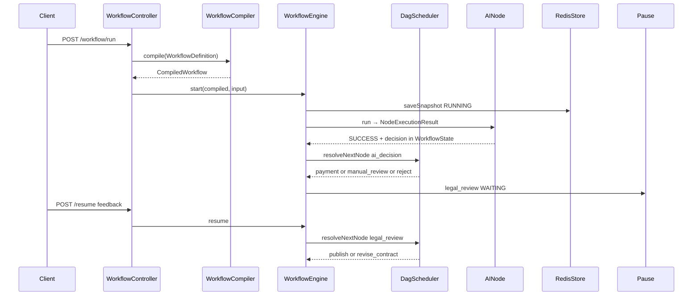
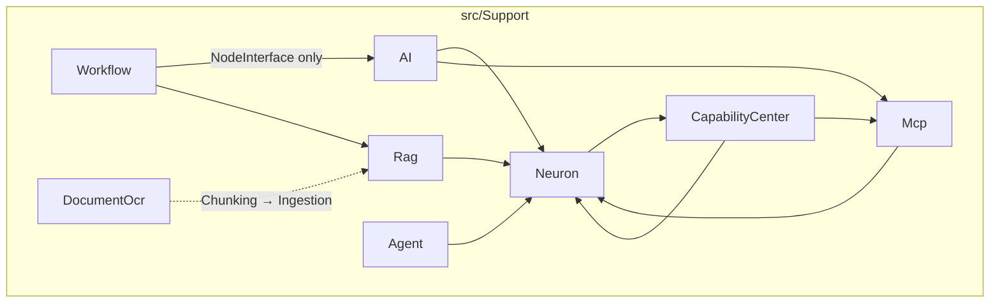

# Neuron AI + Swoolefy 集成技术方案

进行代码开发时，要求如下：

1. 先认真阅读 swoolefy 框架代码，理解其设计思路和运行原理（含协程单例 `goApp`、协程并发 `Parallel`、`GoWaitGroup` 等）；再阅读 neuron-ai，理解其运行原理。
2. swoolefy 的 `composer.json` 已安装 `neuron-core/neuron-ai` 与 `php-standard-library/php-standard-library`，实现时应优先复用。
3. 文件配置化：按模块创建配置，并引入 stub 模板（`create` 应用时自动复制）。
4. 功能封装须便于业务快速接入。
5. 添加单元测试用例。

**相关文档**：

| 文档 | 用途 |
|------|------|
| [AI-WORKFLOW.md](AI-WORKFLOW.md) | 生产接入快速指南 |
| [CapabilityTool.md](CapabilityTool.md) | CapabilityCenter 设计与 Phase 规划 |
| [DocumentOcr.md](DocumentOcr.md) | DocumentOcr 技术方案 |
| 各模块 README | `src/Support/{Workflow,AI,Agent,Neuron,Rag,Mcp,CapabilityCenter,DocumentOcr}/README.md` |

---

## 0. 实现现状（以代码为准）

| 阶段 | 状态 | 要点 |
|------|------|------|
| Phase 1–4 | **已完成** | Workflow 三层引擎、AI 节点、Agent 路由、RAG、MCP、HITL、Saga、插件体系 |
| 生产加固 A/B/C/D | **已完成** | SupportLog、多版本 Registry、节点超时、出站 URL、HealthCheck、cancel CAS、租户隔离（RAG / ChatHistory） |
| CapabilityCenter Phase 3 | **已完成**（默认关闭） | Policy + Tag Top-K、InMemory Registry、`NeuronFactory` 接入 |
| DocumentOcr | **已完成** | Pandoc + DeepSeek OCR（图片 `/api/ocr`、PDF `/api/ocr/pdf`） |
| Neuron Middleware | **已完成** | `NeuronFactory` 支持 `middleware` / `globalMiddleware`；演示 API 已挂 |
| Provider Fallback | **已完成** | `RouterProvider` + `neuron.provider_fallback.order` |
| Phase 5 | **规划中** | 检索缓存、MCP Tool 审计深化、Composer 拆包、Capability embedding 语义检索、MinerU/Docling |

验证：`composer test:support`（含 `test:workflow` / `neuron` / `rag` / `mcp` / `capability` / `document-ocr` / `phase-a`…`phase-d`）。

---

## 1. 定位与核心原则

目标：打造 **PHP 版 Spring AI 2.0 + LangGraph + Temporal** —— Swoolefy 提供运行时与编排基础设施，Neuron AI 提供 AI 原语，业务层通过 **Workflow 节点 + 边依赖** 声明工作流，不直接操作调度器。

**关键边界（避免重复造轮子）**

| 层级 | 负责方 | 职责 |
|------|--------|------|
| 运行时 | Swoole / Swoolefy | HTTP/SSE/WS、协程、连接池、定时器、AsyncTask |
| 宏观编排 | **Swoolefy Workflow Engine** | 业务 DAG、通用 State、事件总线、Node 级协程并发、重试/超时、Saga、快照恢复、条件边路由 |
| Agent 编排 | **AgentScheduler + AgentRouterInterface** | 路由策略可插拔；协程并发；调度对象是 Agent，不是 Node |
| AI 原语 | **Neuron AI（复用）** | Agent、Prompt、Tool、Memory、Structured Output、Provider、RAG、MCP、Middleware |
| 文档解析 | **DocumentOcr** | DOCX/HTML/图片/PDF → Markdown，再接入 RAG 入库 |
| Tool 筛选 | **CapabilityCenter** | 百级 Tool 场景下 Top-K + pinned，再注入 Agent |
| 业务 | 应用 Module | `WorkflowDefinition`、自定义 Node、业务 Tool |

**Workflow 三层分离（Definition → Compiler → Runtime）**

| 层 | 类 | 职责 | 不负责 |
|----|-----|------|--------|
| **Definition** | `WorkflowDefinition` | Node、Edge、Metadata、Version；Fluent `addNode/addEdge` | 执行、Redis、协程 |
| **Compiler** | `WorkflowCompiler` | 校验、环检测、可达性 → `CompiledWorkflow` | Run 生命周期 |
| **Runtime** | `WorkflowEngine` + `PluginManager` | `start()` / `resume()` / `cancel()`；横切走 Plugin | 修改 DAG 定义 |

保留 `Workflow` 薄 Facade：`Workflow::define(...)->compile()->start(...)`。

**四类状态职责分离**

| 概念 | 职责 | 存储 |
|------|------|------|
| **WorkflowState** | 业务流程变量、节点输出、agentOutputs | Redis / DB `workflow_runs` |
| **ChatHistory（Memory）** | 用户与 Agent 多轮对话 | Redis / SQL 热存储 + SQL 冷归档 |
| **Structured Output DTO** | LLM 强类型 JSON | 写入 `WorkflowState`，供条件边消费 |
| **RAG 检索上下文** | 向量检索 Document 片段 | `state`；向量在 VectorStore |

**已落地的推荐策略**

- Definition / Compiler / Runtime 分离；`CompiledWorkflow` 可缓存、版本化（`WorkflowRegistry`）
- `DagScheduler` + `addConditionalEdges` + `ConditionEvaluatorInterface`（Symfony EL / JsonLogic）
- `AgentScheduler` + 六种 Router（Static / Rule / RoundRobin / LLM / Weighted / CostAware）
- Node 完整生命周期；横切走 `WorkflowPlugin`（Retry / Metrics / Tracing / OTel / Audit / RateLimit / Permission）
- `AINodeBuilder` DSL；`Agent::chatHistory()` + `ChatHistoryFactory`
- RAG：`RAGNode` / `RagRetrieveNode` / `RagIngestNode` + `IngestionPipeline`（sync | queue）
- MCP：`McpFactory` + `AINode.mcpServers`；CapabilityCenter 可选动态筛选
- DocumentOcr → Chunking → Ingestion（与 Neuron Document 解耦）

---

## 2. 总体架构



---

## 3. 模块地图（`src/Support/`）

与 [`Nacos/`](../src/Support/Nacos/) 一致：按子域分目录、包间单向依赖。业务示例在 `Test/Module/`。

### 3.1 目录结构（已实现）

```
src/Support/
  Workflow/                          # 纯编排内核，零 neuron-ai 依赖
    Workflow.php                     # Facade
    Definition/                      # WorkflowDefinition / Compiler / CompiledWorkflow / Edge*
    Condition/                       # SymfonyExpressionLanguageEvaluator / JsonLogicEvaluator
    Engine/                          # WorkflowEngine / DagScheduler / SubWorkflowRunner / SagaCoordinator
    State/WorkflowState.php
    Node/                            # AbstractNode / PauseNode / SubWorkflowNode
    Plugin/                          # PluginManager + Builtin（Retry/Metrics/Tracing/OTel/Audit/RateLimit/Permission）
    Store/                           # InMemory / Redis / Db RunStore
    Registry/WorkflowRegistry.php    # 多版本
    Auth/WorkflowHitlAuth.php        # HITL API Key + Role
    Schema/workflow_runs.sql

  Neuron/                            # Neuron 基础设施（无 Workflow Node）
    NeuronFactory.php                # Provider + Tool + Middleware + 可选 ChatHistory
    NeuronProviderFactory.php        # 多 Provider + RouterProvider fallback
    Memory/                          # InMemory / SQL / Redis / File + SqlChatHistoryArchive
    Http/                            # SwooleHttpClientAdapter / NeuronHttpFactory
    Embedding/EmbeddingFactory.php
    Schema/chat_history.sql, chat_messages.sql

  AI/                                # LLM Workflow 节点与 DSL
    Node/AINode.php, StructuredOutputNode.php, AgentParallelNode.php
    Builder/AINodeBuilder.php
    Stream/                          # SseResponse / StreamBridge / WebSocketStreamSink / SseStreamSink

  Agent/                             # 多 Agent 调度
    AgentScheduler.php, AgentRouterInterface.php, RouterContext.php
    Router/                          # Static / Rule / RoundRobin / LLM / Weighted / CostAware

  Rag/                               # 检索增强
    Factory/RagFactory.php, VectorStoreFactory.php
    Store/                           # file / phpvector / meilisearch / mariadb / pgvector / pinecone / qdrant / milvus
    Ingestion/                       # IngestionPipeline / RagIngestDispatcher（sync|queue）
    Retrieval/RetrievalService.php
    Tool/RetrievalToolFactory.php
    Node/RAGNode.php, RagRetrieveNode.php, RagIngestNode.php
    Builder/RAGNodeBuilder.php
    Console/ingest_documents.php

  Mcp/                               # Model Context Protocol
    McpFactory.php, McpComponentFactory.php, McpServerConfig.php
    McpStdioGuard.php, McpProcessRunner.php
    Repository/                      # InMemory / Db（mcp_server_configs.sql）
    # 注意：MCP Server 配置表当前为全局（server_id 唯一），非按租户隔离

  CapabilityCenter/                  # Tool 能力中心（默认 CAPABILITY_ENABLED=false）
    CapabilityCenter.php             # resolve → materialize → ToolInterface[]
    InMemoryCapabilityRegistry.php
    CapabilityComponentFactory.php
    LazyToolMaterializer.php
    Sync/McpCapabilitySync.php
    Resolver/                        # PolicyToolFilter → TagToolMatcher → Top-K + pinned

  DocumentOcr/                       # 文档 → Markdown（独立于 RAG）
    DocumentOcrFactory.php
    Parsers/AutoParser.php, PandocDriver.php, DeepSeekOcrDriver.php
    Chunking/ChunkingAdapter.php
    WorkDirectory.php

  # 横切（AI 栈依赖）
  SupportLog.php, ProductionHealthCheck.php, TenantScope.php
  FrameworkContext.php, Security/OutboundUrlGuard.php

Test/Module/
  Agent/                             # chat / structured / stream / tool / vision / capability / middleware
  Rag/, Workflow/, Order/, Research/, Knowledge/, Contract/, Mcp/
```

### 3.2 模块依赖



**硬约束**：

- `Support/Workflow` 不依赖 `Neuron` / `AI` / `Rag` / `Agent` / `Mcp` / `CapabilityCenter` / `DocumentOcr`
- `AI` / `Rag` / `Agent` / `Mcp` 仅依赖 `Workflow\Node\NodeInterface` + `Workflow\State\WorkflowState`
- `Neuron` 可依赖 `Mcp` / `CapabilityCenter`（装配 Tool）；不依赖 `Workflow\Engine`
- `DocumentOcr` 不依赖 Neuron Document；入库时由业务调用 `ChunkingAdapter` + `IngestionPipeline`
- Tracing / Metrics **不是**独立 Support 包，而是 `Workflow/Plugin/Builtin/*`

**命名空间**：`Swoolefy\Support\{Workflow|Neuron|AI|Rag|Agent|Mcp|CapabilityCenter|DocumentOcr}\...`

### 3.3 引擎内部契约（摘要）

- **WorkflowState**：`dto()` / `outputOf()` Typed API；快照序列化为 array
- **NodeExecutionResult** + **NodeStatus**：SUCCESS / FAILED / RETRY / WAITING / …
- **Node 生命周期**：`beforeExecute` → `execute` → `afterExecute`；以及 `onRetry` / `onTimeout` / `onPause` / `onResume` / `onFail` / `compensate`
- **WorkflowPlugin**：`onRunStart/End`、`onNodeBefore/After/Fail`；Definition 级与全局可叠加
- **HITL**：`PauseNode` → WAITING → 快照 → `resume()`（CAS + `WorkflowHitlAuth`）→ 条件边

详细 API 与示例见各模块 README；条件边 / AINode DSL / HITL 用法亦见下文 §4。

---

## 4. 业务层开发模型（已实现能力）

### 4.1 Workflow 声明式 API

```php
$definition = WorkflowDefinition::create('order_processing', '1.0.0')
    ->addNode('ai_decision', AINode::make('ai_decision')
        ->agent(OrderDecisionAgent::class)
        ->structured(OrderDecisionDto::class)
        ->build())
    ->addConditionalEdges('ai_decision', [
        'payment' => EdgeCondition::fromCallable(
            fn (WorkflowState $s) => ($s->dto(OrderDecisionDto::class)?->action ?? '') === 'pay'
        ),
        'manual_review' => EdgeCondition::fromCallable(
            fn (WorkflowState $s) => ($s->dto(OrderDecisionDto::class)?->action ?? '') === 'review'
        ),
    ], default: 'reject');

$engine->start($definition->compile(), $input);
```

条件求值器：`WORKFLOW_CONDITION_EVALUATOR=symfony|jsonlogic`。`CelEvaluator` 仍为 Phase 5 可选。

### 4.2 AINode Builder DSL

```php
AINode::make('research')
    ->agent(ResearchAgent::class)
    ->provider('deepseek')
    ->memory(/* 可选覆盖 */)
    ->mcp(['github'])           // → agentOptions.mcpServers
    ->structured(ReportDto::class)  // 与 stream 互斥
    ->timeout(120)
    ->build();
```

流式：`Support/AI/Stream`（SSE / WebSocket）；演示见 `AgentStreamController`、`AgentToolController::weatherStream`。

### 4.3 多 Agent 协同

| Router | 场景 |
|--------|------|
| `StaticRouter` | 固定 Agent 列表 |
| `RuleRouter` | 读 WorkflowState 规则选 Agent |
| `RoundRobinRouter` | 负载均衡（游标在 state.meta） |
| `LLMRouter` | LLM 决定调用哪些 Agent |
| `WeightedRouter` | 加权随机 |
| `CostAwareRouter` | 按成本/token 偏好 |

`AgentParallelNode` → `AgentScheduler` 协程并发 → `state.agentOutputs.{agentId}`。

### 4.4 对话记忆（Memory）

```php
// 业务 Agent 自行声明
    protected function chatHistory(): ChatHistoryInterface
    {
    return ChatHistoryFactory::sql($threadId, $pdo); // 或 inMemory / redis / file
}
```

- Schema：`Neuron/Schema/chat_history.sql`、`chat_messages.sql`（冷归档）
- 租户隔离：SQL / Redis 支持 `tenant_id`；`RAG_REQUIRE_TENANT_ISOLATION` / Phase D 测试覆盖
- HITL Pause **不切断** `threadId`

演示：`POST /api/v1/agent/chat-persist`。

### 4.5 Structured Output + 条件边

`AINode` / `structured()` → DTO 写入 State → `addConditionalEdges` 分支。同节点 **stream 与 structured 互斥**。

演示：`POST /api/v1/agent/weather`、`POST /api/v1/agent/polish/recommendation`。

### 4.6 Human-in-the-Loop（HITL）

- `PauseNode` + `resume` API；生产须配置 `workflow.hitl`（API Key / roles / assignee）
- status / events 默认脱敏（`WorkflowRunPresenter`）
- resume 使用 CAS（`saveIfStatus`）防并发覆盖

### 4.7 RAG

| 能力 | 实现 |
|------|------|
| 向量库 | file / phpvector / meilisearch / mariadb / pgvector / pinecone / qdrant / milvus |
| 入库 | `IngestionPipeline`；`RagIngestDispatcher` sync \| queue |
| 节点 | `RagIngestNode` / `RagRetrieveNode` / `RAGNode` |
| 按需检索 | `RetrievalToolFactory` |
| 租户 | `TenantScope` 前缀 `{tenantId}_{kb}` |
| CLI | `src/Support/Rag/Console/ingest_documents.php` |

演示：`/api/v1/rag/*`；工作流 `knowledge_qa` / `rag_qa`。

**文档入库前处理**：复杂格式先走 DocumentOcr（§4.10），再 Chunking → Ingestion。

### 4.8 MCP

```php
// AINode 声明式
->mcp(['github'])

// 或 NeuronFactory agentOptions
'mcpServers' => ['github'],
'mcpOnly' => ['github' => ['search_code']],
'mcpExclude' => ['github' => ['delete_repo']],
```

- 传输：远程 HTTP/SSE；本地 stdio 经 `McpStdioGuard` / `McpProcessRunner`（生产慎用）
- 配置：`neuron_ai.php` → `mcp` + DB `mcp_server_configs`（**全局** `server_id`，非租户隔离）
- URL：`OutboundUrlGuard` 白名单 / 私网拦截
- 管理 API：`GET /api/v1/mcp/servers`、`GET /api/v1/mcp/servers/tools`

### 4.9 CapabilityCenter（Tool 动态筛选）

当 MCP/Native Tool 达到几十～上百时，全量注入会导致 token 膨胀与误选。CapabilityCenter 在 `Agent::addTool()` 前：

1. Registry 存元数据（不持有真实 Tool）
2. Resolver：Policy → Tag 匹配 → Top-K + `pinnedTools`
3. Materializer 懒加载为 `ToolInterface[]`

```php
// neuron_ai.php → capability.enabled / CAPABILITY_ENABLED
// NeuronFactory::attachTools() 自动分流

$agent = $factory->create(MyAgent::class, $state, [
    'capabilityEnabled' => true,
    'capabilityTopK' => 3,
    'pinnedTools' => ['native:weather:get_date'],
    'capabilityProfile' => 'weather',
    'mcpServers' => ['weather_mcp'], // 限制来源；空数组不 sync 全部 MCP
]);
```

- 默认 **关闭**：与改造前一致（`McpFactory::tools()` 全量）
- **未实现**（见 CapabilityTool.md Phase 4+）：embedding 语义检索、管理 API、Tool 级 HITL/RateLimit、分布式 Registry

演示：`POST /api/v1/agent/capability/resolve`、`/capability/chat`。

### 4.10 DocumentOcr（文档 → Markdown）

| 输入 | Driver | selectionReason |
|------|--------|-----------------|
| `.docx` / `.html` / `.md` / `.txt` | PandocDriver | `structured_format:*` |
| `.png` / `.jpg` / `.jpeg` | DeepSeekOcrDriver `/api/ocr` | `image_extension:*` |
| `.pdf` | DeepSeekOcrDriver `/api/ocr/pdf` | `pdf_direct_deepseek_ocr` |

```php
$ocr = Application::getApp()->get('document_ocr'); // 组件文件 document_parser.php
$result = $ocr->parseFile('/data/manual.pdf');
$chunks = (new ChunkingAdapter())->splitParseResult($result, sourceName: 'manual.pdf');
// $pipeline->ingest('product_kb', $chunks);
```

- 配置：`Config/document_ocr.php`（stub：`document_ocr.conf.stub.php`）
- 异常：`DocumentException` → `ParserException` → `UnsupportedDocumentException`
- DeepSeek：`time_out` 必须 **>** `connect_timeout`；可注入外部 Guzzle Client
- **预留未做**：MinerU / Docling 复杂版面；无独立 HTTP 演示路由

详见 [DocumentOcr.md](DocumentOcr.md)。

### 4.11 Neuron Agent Middleware

与 [Neuron Middleware](https://docs.neuron-ai.dev/agent/middleware) 对齐。两种挂载方式：

1. Agent 子类覆盖 `middleware()` / `globalMiddleware()`（构造期）
2. `NeuronFactory` `agentOptions`（boot 阶段追加，适合 Workflow / 控制器注入）

```php
use NeuronAI\Agent\Middleware\Summarization;
use NeuronAI\Agent\Nodes\ChatNode;

$agent = $factory->create(MyAgent::class, $state, [
    'globalMiddleware' => [$recording],
    'middleware' => [
        // 实例，或 callable(Agent): WorkflowMiddleware（可用 boot 后 Provider）
        ChatNode::class => [
            fn (Agent $a) => new Summarization($a->resolveProvider(), maxTokens: 10000, messagesToKeep: 5),
        ],
    ],
]);
```

内置可复用：`ToolApproval`（HITL 工具审批）、`Summarization`、`ToolSearchMiddleware` 等（Neuron 包内）。

演示：`POST /api/v1/agent/middleware/chat`。

### 4.12 Provider Fallback

```php
// neuron_ai.php
'neuron' => [
    'default_provider' => 'deepseek',
    'provider_fallback' => [
        'order' => ['openai', 'anthropic'], // 备用顺序；空则不启用
    ],
],
```

瞬时错误（网络/超时/429/5xx）由 `RouterProvider` 切换；鉴权等确定性错误不切换。stream 仅在首 chunk 前可切换。

### 4.13 WorkflowPlugin 插件体系

| Plugin | 职责 |
|--------|------|
| `RetryPlugin` | 全局/节点级 RetryPolicy |
| `MetricsPlugin` | 指标（含已完成 run 清理 + FIFO 上限） |
| `TracingPlugin` | workflow.run / node.execute span（同上内存约束） |
| `OpenTelemetryPlugin` | OTel 导出 |
| `AuditPlugin` | 审计日志（FileAuditLogWriter 等） |
| `RateLimitPlugin` | Run/Agent 级限流 |
| `PermissionPlugin` | 租户/角色校验 |

---

## 5. Neuron AI 能力映射

| Neuron / 能力 | Swoolefy 桥接 | 说明 |
|---------------|---------------|------|
| Workflow DAG | `WorkflowDefinition` → Compiler → Engine | Definition / Runtime 分离 |
| 条件表达式 | `ConditionEvaluatorInterface` | Symfony EL / JsonLogic |
| Agent | `NeuronFactory::create/boot` | Provider + Tool + Middleware |
| Middleware | `agentOptions.middleware` / Agent 覆盖 | ToolApproval / Summarization / ToolSearch |
| ChatHistory | `ChatHistoryFactory` | InMemory / SQL / Redis / File |
| Structured | `AINode` + DTO + 条件边 | 与 stream 互斥 |
| Streaming | `AI/Stream` + Agent stream API | SSE / WebSocket |
| RAG | `RAGNode` / Retrieve / Ingest | 多 VectorStore |
| Embeddings | `EmbeddingFactory` | fail-fast / fake embeddings |
| McpConnector | `McpFactory` + `mcpServers` | HTTP/SSE / stdio |
| Tool 筛选 | `CapabilityCenter` | Top-K + pinned（可选） |
| 文档解析 | `DocumentOcr` | Pandoc + DeepSeek OCR |
| Provider 多活 | `NeuronProviderFactory` + RouterProvider | fallback order |
| 协程 HTTP | `NeuronHttpFactory` / CurlProxy | swoole \| guzzle |

---

## 6. HTTP 演示索引（Test 应用）

路由前缀 `/api`，定义见 `Test/Router/Common/Api.php`。

### 6.1 Agent

| 方法 | 路径 | 说明 |
|------|------|------|
| POST | `/v1/agent/chat` | 基础对话 |
| POST | `/v1/agent/chat1` | provider 必填变体 |
| POST | `/v1/agent/chat-thinking` | thinking / reasoning |
| POST | `/v1/agent/chat-persist` | SQL ChatHistory 多轮 |
| POST | `/v1/agent/weather` | Structured Output |
| POST | `/v1/agent/polish/recommendation` | 履历润色 → DTO |
| POST | `/v1/agent/vision/chat` | 多模态 |
| POST | `/v1/agent/stream/chat` | SSE 流式 |
| POST | `/v1/agent/tool/weather` | Tool Calling |
| POST | `/v1/agent/tool/weather/stream` | Tool + SSE |
| POST | `/v1/agent/capability/resolve` | Capability 仅解析 |
| POST | `/v1/agent/capability/chat` | Capability + LLM |
| POST | `/v1/agent/middleware/chat` | Middleware 演示 |

### 6.2 RAG / Workflow / MCP

| 方法 | 路径 | 说明 |
|------|------|------|
| GET/POST | `/v1/rag/config\|stores\|seed\|ingest\|retrieve\|ask` | RAG 演示 |
| POST | `/v1/rag/workflow/qa` | retrieve → answer 工作流 |
| GET/POST | `/v1/workflow/list\|describe\|run\|…` | 通用工作流 API |
| GET/POST | `/v1/workflow/run/status\|resume\|cancel\|events` | HITL / 状态 / SSE |
| GET | `/v1/mcp/servers`、`/v1/mcp/servers/tools` | MCP 管理与发现 |
| * | `/v1/order/workflow/*`、`/v1/research/workflow/*` | 业务 Demo |

**Registry 已注册 workflowId 示例**：`order_processing`、`order_saga`、`multi_agent_research`、`mcp_research`、`contract_review`、`knowledge_qa`、`rag_qa`。

DocumentOcr **无** HTTP 路由，经 DI `document_ocr` 调用。

---

## 7. 配置与组件

### 7.1 配置文件（stub → 应用 Config）

| Stub | 目标 | 内容 |
|------|------|------|
| `src/Stubs/workflow.conf.stub.php` | `Config/workflow.php` | RunStore、条件求值器、节点超时、HITL |
| `src/Stubs/neuron_ai.conf.stub.php` | `Config/neuron_ai.php` | providers、fallback、rag、mcp、security、**capability** |
| `src/Stubs/document_ocr.conf.stub.php` | `Config/document_ocr.php` | pandoc + deepseek_ocr（含 pdf_endpoint） |
| `src/Stubs/document_parser.component.stub.php` | `Config/component/document_parser.php` | DI 名 **`document_ocr`** → `DocumentOcrFactory` |

MCP **无**独立 conf；配置段在 `neuron_ai.php`。

### 7.2 关键环境变量（节选）

```
# Workflow
WORKFLOW_CONDITION_EVALUATOR=symfony
WORKFLOW_HITL_API_KEY=
WORKFLOW_DEFAULT_NODE_TIMEOUT=120

# Neuron / Provider
NEURON_PROVIDER_FALLBACK_ORDER=openai,anthropic
DEEPSEEK_API_KEY= ...

# Capability（默认关）
CAPABILITY_ENABLED=false
CAPABILITY_DEFAULT_TOP_K=5
CAPABILITY_FAIL_CLOSED=false

# RAG
RAG_VECTOR_STORE=meilisearch
RAG_INGEST_MODE=sync          # sync | queue
RAG_REQUIRE_TENANT_ISOLATION=0

# MCP
MCP_DEFAULT_TIMEOUT=30
MCP_MAX_LOCAL_PROCESSES=3

# DocumentOcr
PANDOC_BIN=pandoc
DEEPSEEK_OCR_BASE_URI=http://127.0.0.1:7860
DEEPSEEK_OCR_PDF_ENDPOINT=/api/ocr/pdf
DEEPSEEK_OCR_TIME_OUT=120
DEEPSEEK_OCR_CONNECT_TIMEOUT=3
```

完整列表见各 stub 与模块 README。

### 7.3 生产检查

`ProductionHealthCheck`：禁止生产用 memory RunStore、短 Redis TTL、未配置 HITL key、Embedding/向量库别名、出站 URL、租户隔离开关等。

---

## 8. 数据库表（已提供 Schema）

| Schema | 用途 |
|--------|------|
| `Support/Workflow/Schema/workflow_runs.sql` | Run 快照 / 状态 |
| `Support/Neuron/Schema/chat_history.sql` | SQL ChatHistory 热存储 |
| `Support/Neuron/Schema/chat_messages.sql` | 冷归档逐条消息 |
| `Support/Mcp/Schema/mcp_server_configs.sql` | MCP Server 配置（全局 server_id） |

PgVector / MariaDB 等向量表 **不自动 DDL**，按各 Store 文档建表。

---

## 9. 可观测性

- Workflow Plugin：`TracingPlugin` / `MetricsPlugin` / `OpenTelemetryPlugin` / `AuditPlugin`
- 建议字段：`runId`、`nodeId`、`threadId`、`knowledgeBase`、`mcpServer`、`toolName`、`pluginName`、`cid`
- MCP / Capability / ChatHistory 失败走 `SupportLog`
- 关键 span / 指标名：`workflow.run`、`workflow.edge.route`、`rag.retrieve`、`mcp.tool.call`、`router.route`、`plugin.hook`

---

## 10. 测试矩阵

```bash
composer test:support          # 聚合

composer test:workflow         # Phase1–4 + Integration + RunStore + HitlAuth + PluginMemory
composer test:agent
composer test:ai
composer test:neuron           # 含 Middleware、Provider fallback、SQL tenant
composer test:rag
composer test:mcp
composer test:capability
composer test:document-ocr
composer test:phase-a          # SupportLog / MCP 可观测
composer test:phase-b          # 多版本、超时、出站 URL、HealthCheck
composer test:phase-c          # cancel CAS、并行 Agent 错误策略
composer test:phase-d          # RAG / Redis ChatHistory 租户隔离
```

---

## 11. 分阶段路线（回顾 + 后续）

### 已完成：Phase 1–4 + 生产 A/B/C/D

- Phase 1：Workflow 三层、AINode、ChatHistory、Retry/Tracing、Order 示例
- Phase 2：Stream、Agent 路由、MCP HTTP、Ingestion CLI、SqlChatHistoryArchive、Metrics
- Phase 3：HITL、RAG 问答节点、LLMRouter、OTel/Audit、MCP 多 Agent 示例
- Phase 4：多向量库、RagIngestNode、RetrievalTool、MCP stdio/DB API、CostAware、Saga、RateLimit/Permission
- 生产 A–D：日志、HealthCheck、出站守卫、租户隔离（RAG/ChatHistory）
- 增量：CapabilityCenter Phase 3、DocumentOcr（含 PDF）、Neuron Middleware、Provider Fallback

### Phase 5 — 持续（未完成）

| 项 | 说明 |
|----|------|
| 检索缓存 | RAG 查询结果缓存 |
| MCP 深化 | Tool 调用审计、更细 rate limit；**按租户** MCP 配置隔离（当前全局表） |
| Capability Phase 4+ | embedding 语义 Tool 检索、管理 API、Tool 级 HITL |
| DocumentOcr | MinerU / Docling 复杂 PDF 版面 |
| 条件边 | 可选 `CelEvaluator` |
| 工程化 | 按模块拆 `bingcool/swoolefy-*` Composer 包与文档 |

> 注：原 Phase 5「多租户隔离」中 **RAG / ChatHistory** 部分已由 Phase D 落地；MCP 配置租户隔离仍待做。

---

## 12. 风险与对策

| 风险 | 对策 |
|------|------|
| 多条件同时为 true | 声明顺序决胜；编译期 warning；推荐互斥条件 |
| structured 与 stream 冲突 | 同节点互斥 |
| Memory 与 WorkflowState 混淆 | 独立存储；条件边只读 WorkflowState |
| 入库阻塞 Worker | `RAG_INGEST_MODE=queue` / AsyncTask |
| MCP 工具过多 token 爆炸 | `mcpOnly` / CapabilityCenter Top-K / ToolSearch Middleware |
| 本地 stdio MCP 阻塞 | 生产优先 HTTP/SSE；进程限流 |
| MCP 凭证泄露 | env；API 脱敏；OutboundUrlGuard |
| Capability 误关导致行为变化 | 默认 `CAPABILITY_ENABLED=false`；fail-open 可回退全量 MCP |
| OCR 超时配置错误 | `time_out > connect_timeout` 构造期校验 |
| WorkflowEngine 膨胀 | 横切走 Plugin |
| Agent 路由硬编码 | `AgentRouterInterface` 可插拔 |

---

## 13. 与 Spring AI 2.0 的对照

| Spring AI 2.0 概念 | 本方案对应 |
|--------------------|-----------|
| Router / Gateway | `addConditionalEdges` + `EdgeCondition` |
| Structured Output | `AINode` + DTO → 条件边 |
| Chat Memory | `ChatHistoryFactory` + `Agent::chatHistory()` |
| Human approval | `PauseNode` + resume；Tool 级可用 Neuron `ToolApproval` Middleware |
| Tool Calling | Neuron Tools + MCP + CapabilityCenter |
| RAG Advisors | `RAGNode` / `RagRetrieveNode` / `RetrievalTool` |
| Observability | Workflow Plugin（Tracing / Metrics / OTel / Audit） |

---

## 14. 交付物索引

| 模块 | 路径 |
|------|------|
| Workflow | [`src/Support/Workflow/`](../src/Support/Workflow/) |
| AI | [`src/Support/AI/`](../src/Support/AI/) |
| Agent | [`src/Support/Agent/`](../src/Support/Agent/) |
| Neuron | [`src/Support/Neuron/`](../src/Support/Neuron/) |
| Rag | [`src/Support/Rag/`](../src/Support/Rag/) |
| Mcp | [`src/Support/Mcp/`](../src/Support/Mcp/) |
| CapabilityCenter | [`src/Support/CapabilityCenter/`](../src/Support/CapabilityCenter/) |
| DocumentOcr | [`src/Support/DocumentOcr/`](../src/Support/DocumentOcr/) |
| Test 演示 | [`Test/Module/`](../Test/Module/) |
| 配置 stub | [`src/Stubs/`](../src/Stubs/) |

---

## 15. 实施 To-dos

| 状态 | 阶段 | 模块 | 内容 |
|------|------|------|------|
| [x] | Phase 1–4 | 见 §11 | Workflow / AI / Agent / Neuron / Rag / Mcp / 插件 / Saga / HITL |
| [x] | 生产 A–D | Support | SupportLog、HealthCheck、出站 URL、租户隔离（RAG/ChatHistory） |
| [x] | 增量 | CapabilityCenter | Phase 3：Policy+Tag、Registry、NeuronFactory 接入 |
| [x] | 增量 | DocumentOcr | Pandoc + DeepSeek（图片+PDF） |
| [x] | 增量 | Neuron | Middleware 挂载 + Provider Fallback |
| [ ] | Phase 5 | Rag | 检索缓存 |
| [ ] | Phase 5 | Mcp | 按租户配置隔离；Tool 调用审计深化 |
| [ ] | Phase 5 | CapabilityCenter | embedding 语义检索、管理 API |
| [ ] | Phase 5 | DocumentOcr | MinerU / Docling |
| [ ] | Phase 5 | 工程化 | Composer 拆包与文档站点 |
