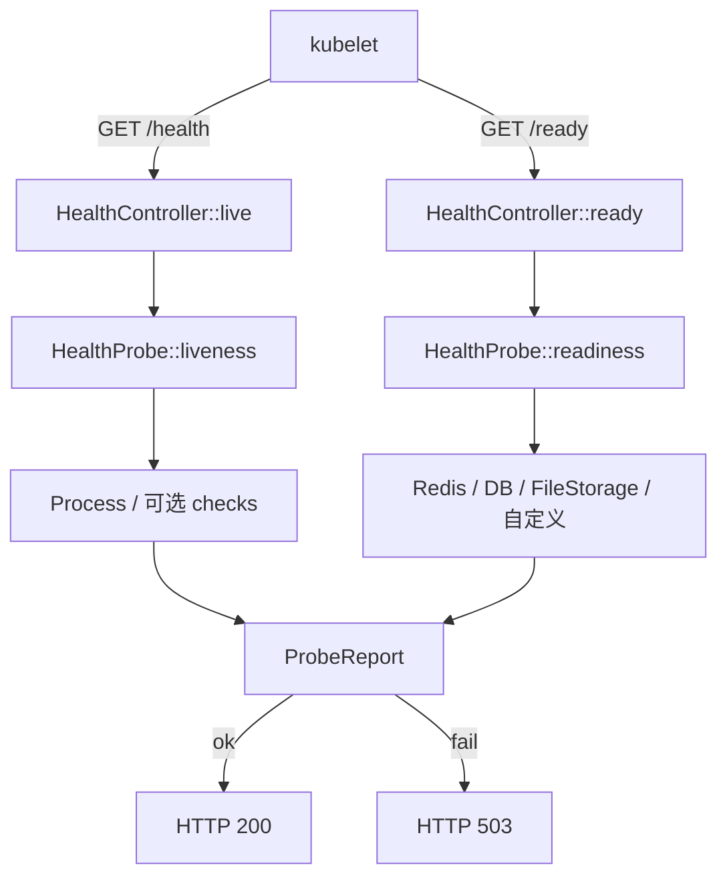

# Health（K8s HTTP 探针：/health · /ready）

为 Kubernetes（及同类编排）提供运行期 **liveness / readiness** HTTP 探针。Worker 进程对外暴露轻量 GET 接口，kubelet 按 HTTP 状态码决定是否重启容器或摘除流量。

与 CLI 侧 [`ProductionHealthCheck`](../../Support/ProductionHealthCheck.php)（部署前 Neuron/Workflow **配置体检**）互补，**不互相替代**。

---

## 目录

```text
Health/
├── HealthCheckInterface.php   # 单项检查契约
├── HealthCheckResult.php      # 单项结果 VO
├── ProbeReport.php            # 一次探针汇总
├── HealthConfig.php           # Config/health.php 读取
├── CheckFactory.php           # type → 检查实例
├── HealthProbe.php            # liveness / readiness 执行器
├── HealthController.php       # 框架内置 Controller
├── HealthRoutes.php           # 无鉴权路由注册
├── Check/
│   ├── ProcessHealthCheck.php     # 进程存活（无 I/O）
│   ├── RedisHealthCheck.php       # PING redis 组件
│   ├── DatabaseHealthCheck.php    # SELECT 1
│   └── FileStorageHealthCheck.php # FileStorageSystem put/exists/delete
└── README.md
```

关联：

| 路径 | 职责 |
|------|------|
| `src/Stubs/health.conf.stub.php` | create → `Config/health.php` |
| `src/Stubs/health.router.stub.php` | create → `Router/Common/Health.php` |
| `src/Stubs/file_storage_system.conf.stub.php` | FileStorage 盘配置模版 |
| `src/Stubs/file_storage.component.stub.php` | DI 组件 `file_storage` |
| `Test/Config/health.php` | Test 应用示例配置 |
| `Test/Router/Common/Health.php` | Test 已调用 `HealthRoutes::register()` |

---

## 两种探针语义

| 探针 | 默认路径 | kubelet | 失败后果 | 推荐检查内容 |
|------|----------|---------|----------|--------------|
| **liveness** | `/health`、`/healthz`、`/livez` | `livenessProbe` | 多次失败后**重启 Pod** | 仅进程存活（默认空配置 = Process） |
| **readiness** | `/ready`、`/readyz` | `readinessProbe` | 从 Service **摘除 Endpoints**，不杀进程 | Redis / DB / **FileStorage** 等依赖 |

**生产禁忌：** 不要把 Redis/DB/对象存储绑在 liveness 上。依赖抖动会导致重启风暴；依赖问题应只影响 readiness（暂时不接流量）。



---

## 快速接入

### 1. 配置

`create` 会复制模版；已有应用可手动：

```bash
cp src/Stubs/health.conf.stub.php App/Config/health.php
```

核心项（详见 stub 注释）：

| 键 | 说明 |
|----|------|
| `enabled` | 总开关；false 时不注册路由 |
| `liveness_path` / `readiness_path` | 主路径 |
| `aliases` | 额外路径（healthz / readyz 等） |
| `liveness_checks` | 空 = 仅进程存活（推荐） |
| `readiness_checks` | 如 `redis`、`database`、`file_storage`、自定义 `class` |
| `include_details` | 非生产是否返回 `checks[]` 明细 |
| `include_details_in_prd` | 生产是否返回明细（默认 false，防泄露拓扑） |

环境变量：`HEALTH_PROBE_ENABLED`、`HEALTH_LIVENESS_PATH`、`HEALTH_READINESS_PATH`、`HEALTH_INCLUDE_DETAILS`、`HEALTH_INCLUDE_DETAILS_IN_PRD` 等。

### 2. 注册路由（无鉴权 / 无限流）

在应用 Router 扫描目录中增加文件，或入口调用一次：

```php
\Swoolefy\Http\Health\HealthRoutes::register();
```

`HealthRoutes` 幂等；路径**不要**挂 `AuthenticateMiddleware` / RateLimit，否则探针会 401/429，导致误杀或误摘流。

### 3. 本地验证

```bash
php cli.php start Test

curl -i http://127.0.0.1:9501/health
curl -i http://127.0.0.1:9501/ready
curl -i http://127.0.0.1:9501/healthz
```

成功示例（HTTP **200**，业务 `code=0`）：

```json
{
  "code": 0,
  "msg": "ok",
  "data": {
    "status": "ok",
    "probe": "liveness",
    "timestamp": "2026-07-19T13:00:00+00:00",
    "duration_ms": 0.12,
    "checks": [
      { "name": "process", "status": "up", "message": "worker process is serving", "meta": { "pid": 123, "php": "8.4.0" } }
    ]
  }
}
```

依赖失败时 readiness 返回 HTTP **503**，`data.status` = `unavailable`。

---

## 检查类型（readiness_checks / liveness_checks）

| type | 实现 | 配置示例 |
|------|------|----------|
| `process` | `ProcessHealthCheck` | `['type' => 'process']` |
| `redis` | `RedisHealthCheck` | `['type' => 'redis', 'component' => 'redis', 'name' => 'redis']` |
| `database` / `db` | `DatabaseHealthCheck` | `['type' => 'database', 'component' => 'db', 'name' => 'database']` |
| `file_storage` / `storage` / `filestorage` | `FileStorageHealthCheck` | 见下节 |
| `class` | 自定义零参类，实现 `HealthCheckInterface` | `['type' => 'class', 'class' => \App\Health\Xxx::class]` |

- `component`：Application 容器组件名；支持 `getObject()` 协程包装。
- `name`：出现在 JSON `checks[].name`，可与 component 不同（多实例时区分）。

自定义示例：

```php
namespace App\Health;

use Swoolefy\Http\Health\HealthCheckInterface;
use Swoolefy\Http\Health\HealthCheckResult;

final class QueueDepthCheck implements HealthCheckInterface
{
    public function name(): string
    {
        return 'queue';
    }

    public function check(): HealthCheckResult
    {
        // 自行 catch，返回 ok=false，勿抛到 Controller
        return new HealthCheckResult('queue', true, 'depth ok');
    }
}
```

```php
'readiness_checks' => [
    ['type' => 'redis', 'component' => 'redis'],
    ['type' => 'class', 'class' => \App\Health\QueueDepthCheck::class],
],
```

---

## FileStorageSystem（本地 + 三云）

探针类型 `file_storage` 基于 [FileStorageSystem](../../../../library/src/FileStorageSystem/README.md)，对指定盘执行轻量 **put → exists → delete**，验证对象存储可写可读。

### 前置

1. `Config/file_storage_system.php`（盘配置）
2. `Config/component/file_storage.php`（DI 名 `file_storage` → `FileStorageManager`）

### 支持的 driver

| driver | 厂商 / 介质 | 说明 |
|--------|-------------|------|
| `local` | 本机目录 | Flysystem Local；检查 root 可写 |
| `aws_s3` | Amazon S3 | 需 `aws/aws-sdk-php`；兼容 MinIO 等 Endpoint |
| `aliyun_oss` | 阿里云 OSS | 需 `alibabacloud/oss-v2` |
| `tengxun_cos` | 腾讯云 COS | 需 `qcloud/cos-sdk-v5` |
| `fake` | 内存盘 | 单测用 |

### 配置项

| 键 | 说明 | 默认 |
|----|------|------|
| `type` | `file_storage`（或 `storage` / `filestorage`） | — |
| `component` | Application 组件名 | `file_storage` |
| `disk` / `provider` | `file_storage_system.php` 中的 **provider 键名** | 省略 = `default_provider` |
| `probe_path` | 探针对象 path（写后删除） | `.swoolefy/health-probe` |
| `name` | JSON `checks[].name` | `file_storage` |

### readiness 配置示例

```php
'readiness_checks' => [
    ['type' => 'redis', 'component' => 'redis'],

    // 默认盘（多为 local）
    ['type' => 'file_storage', 'component' => 'file_storage', 'name' => 'storage'],

    // 显式指定本地盘
    ['type' => 'file_storage', 'disk' => 'local', 'name' => 'storage-local'],

    // 三云（按环境启用其一或多项；密钥走 env，见 file_storage_system stub）
    // ['type' => 'file_storage', 'disk' => 'aws_s3', 'name' => 'storage-s3'],
    // ['type' => 'file_storage', 'disk' => 'aliyun_oss', 'name' => 'storage-oss'],
    // ['type' => 'file_storage', 'disk' => 'tengxun_cos', 'name' => 'storage-cos'],
],
```

成功时 `checks[]` 示例：

```json
{
  "name": "storage-oss",
  "status": "up",
  "message": "put/exists/delete ok",
  "meta": {
    "component": "file_storage",
    "disk": "aliyun_oss",
    "driver": "aliyun_oss",
    "probe_path": ".swoolefy/health-probe",
    "latency_ms": 42.5
  }
}
```

**注意：** 云盘探针会产生极小的瞬时对象读写；勿挂 liveness；生产可按环境只检查「接流量必需」的那一个盘。

---

## 响应与 HTTP 状态

| 条件 | HTTP | 业务 code | msg |
|------|------|-----------|-----|
| 探针通过 | **200** | 0 | `ok` |
| 探针失败 | **503** | 503 | liveness: `not ok`；readiness: `not ready` |
| `enabled=false` 仍误调用 | 503 | 503 | `health probe disabled` |

**kubelet 只看 HTTP status**；body 供人工/监控排障。

Controller 内先 `swooleResponse->status()`，再 `returnJson` 并 `setEnd`，避免被 `ActionResultNormalizer` 二次包装冲掉状态码。

---

## Kubernetes 清单示例

```yaml
apiVersion: apps/v1
kind: Deployment
metadata:
  name: swoolefy-http
spec:
  template:
    spec:
      containers:
        - name: app
          ports:
            - containerPort: 9501
          livenessProbe:
            httpGet:
              path: /health
              port: 9501
            initialDelaySeconds: 15
            periodSeconds: 10
            failureThreshold: 3
          readinessProbe:
            httpGet:
              path: /ready
              port: 9501
            initialDelaySeconds: 5
            periodSeconds: 5
            failureThreshold: 3
```

端口与 `Protocol/conf.php` 中 HTTP `listen_port` 保持一致。

---

## 与 ProductionHealthCheck 对照

| | HTTP Health（本模块） | ProductionHealthCheck |
|--|----------------------|------------------------|
| 时机 | 进程运行中，kubelet 周期调用 | 部署前 / CI，CLI 一次 |
| 入口 | `GET /health`、`GET /ready` | `ProductionHealthCheck::run()` |
| 关注点 | 进程存活、Redis/DB/对象存储瞬时可达 | Neuron 凭证、HITL、RunStore、出站 URL 等配置正确性 |
| 失败表现 | HTTP 503 / 摘流或重启 | 抛异常，阻止带错配置上线 |

推荐流水线：**先** `ProductionHealthCheck::run()`，**再**滚动发布；上线后靠本模块持续探针。

---

## 核心类职责

| 类 | 职责 |
|----|------|
| `HealthConfig` | 读 `Config/health.php` + env |
| `HealthProbe` | 组装检查列表并执行，产出 `ProbeReport` |
| `CheckFactory` | `type` → `HealthCheckInterface` |
| `HealthController` | HTTP 入口，写 200/503 + JSON |
| `HealthRoutes` | 注册无中间件路由（幂等） |
| `FileStorageHealthCheck` | FileStorageManager 指定 disk 的 put/exists/delete |

执行流：`Route` → `HealthController` → `HealthProbe` → `CheckFactory` → 各项 `check()` → `ProbeReport` → 响应。

---

## 测试

```bash
# 单元（不连 Redis）：配置、工厂、AND 失败语义、file_storage 工厂
composer test -- --filter HealthProbeTest

# HTTP（需 php cli.php start Test）
composer test:http -- --filter HealthProbeHttpTest
```

PHPUnit Http 探活（`HttpServerManager`）会优先请求 `/health`，再回退 `/`。

---

## 运维建议

1. **liveness_checks 保持空**（或仅 `process`）。
2. **readiness** 只放「接流量必需」依赖；可选依赖勿阻塞 ready。
3. FileStorage 云盘检查会有轻量写删；按环境裁剪，勿与 liveness 混用。
4. 生产关闭 `include_details_in_prd`，除非排障临时打开。
5. 探针路径勿走网关鉴权、勿挂全局限流。
6. `initialDelaySeconds` 留足 Worker 启动时间（加载配置 / 连池）。
