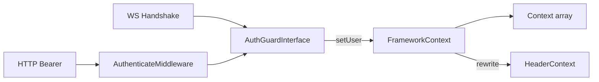

# Auth（统一身份：AuthUser + Guard）

在 Swoole **常驻进程 + 协程** 下，为 HTTP / WebSocket / Workflow HITL 提供同一套身份层：不可变 `AuthUser`、可替换的 `AuthGuardInterface`（默认 JWT），经 `FrameworkContext` 写入协程 Context（**array 快照**，可 `goApp` 透传）。

完整说明：[docs/Auth.md](../../../docs/Auth.md)

---

## 目录

```text
Auth/
├── AuthUser.php              # 不可变身份 VO（toArray / fromArray）
├── AuthException.php         # 鉴权失败；code → HTTP 401/403/500
├── AuthGuardInterface.php    # authenticate + generateToken
├── JwtAuthGuard.php          # 默认 JWT（Library Jwt）
└── README.md
```

关联（不在本目录）：

| 路径 | 职责 |
|------|------|
| [`FrameworkContext`](../FrameworkContext.php) | 唯一身份门面：`setUser` / `user` / `userOrFail` / `getUserId` |
| [`AuthenticateMiddleware`](../../Http/Middleware/AuthenticateMiddleware.php) | 强制 Bearer |
| [`OptionalAuthenticateMiddleware`](../../Http/Middleware/OptionalAuthenticateMiddleware.php) | 有 token 则验，无则匿名放行 |
| `Test/Config/auth.php` + `component/auth.php` | JWT 配置与 `auth.guard` 组件 |
| `src/Stubs/auth.conf.stub.php` | `create` 时复制为 `Config/auth.php` |

---

## 核心约定

| 规则 | 说明 |
|------|------|
| Context 只存 array | `setUser` → `__swoolefy_auth_user`；禁止存 `AuthUser` 对象（`goApp` 会跳过 object） |
| Guard 可单例，用户不可 | `auth.guard` 进程内复用；**禁止**在 Guard 上缓存当前用户 |
| 业务只读 FrameworkContext | 禁止把 Body/Query 的 `userId` / `uid` 当鉴权身份 |
| 未 `setUser` | `getUserId()` 仍可读透传头 `x-user-id`（兼容网关验票） |
| 已 `setUser` | Auth **优先**，Header 兜底 |



---

## 快速使用

### 1. 注册组件

模版：`src/Stubs/auth.conf.stub.php` → `APP_PATH/Config/auth.php`，并在 `Config/component/auth.php` 注册：

```php
use Swoolefy\Support\Auth\JwtAuthGuard;

$config = include APP_PATH . '/Config/auth.php';

return [
    'auth.guard' => static function () use ($config) {
        return new JwtAuthGuard($config['jwt'] ?? []);
    },
];
```

环境变量：`AUTH_JWT_SECRET`（生产必填）、`AUTH_JWT_ALGO`、`AUTH_JWT_TTL`、`AUTH_JWT_ISSUER`、`AUTH_JWT_AUDIENCE`。

### 2. 路由挂中间件

```php
use Swoolefy\Http\Middleware\AuthenticateMiddleware;
use Swoolefy\Http\Middleware\OptionalAuthenticateMiddleware;

// 强制登录
Route::get('/api/me', [AuthUserController::class, 'me'])
    ->middleware(AuthenticateMiddleware::class);

// 游客 + 登录用户均可访问（有 token 则验）
Route::get('/api/feed', [FeedController::class, 'index'])
    ->middleware(OptionalAuthenticateMiddleware::class);
```

中间件**零参** `new`；内部 `Application::getApp()->get('auth.guard')`。

### 3. 登录签发 / 业务读取

```php
use Swoolefy\Core\Application;
use Swoolefy\Support\Auth\AuthUser;
use Swoolefy\Support\FrameworkContext;

/** @var \Swoolefy\Support\Auth\AuthGuardInterface $guard */
$guard = Application::getApp()->get('auth.guard');

$token = $guard->generateToken(new AuthUser(
    userId: 'u1',
    roles: ['operator'],
    tenantId: 't1',
));

// 请求内（中间件已 setUser 后）
$user = FrameworkContext::userOrFail();
$userId = FrameworkContext::getUserId();

goApp(static function (): void {
    // 子协程可读同一身份（array 透传）
    $id = FrameworkContext::getUserId();
});
```

### 4. WebSocket / HITL

- WS：握手 callback 用同一 `auth.guard` 解析 JWT，**忽略** query `uid`。
- HITL：`FrameworkContext::userOrFail()` + `WorkflowHitlAuth::*ForUser`；admin 看 `roles`，不信任 `X-Workflow-Role`。

联调：`GET /api/auth-user/me`（见 `Test/Controller/AuthUserController.php`）。

---

## Guard 语义

| `authenticate` 结果 | 含义 |
|---------------------|------|
| `null` | 无凭证（匿名）；强制中间件 → 401；可选中间件 → 放行 |
| `AuthUser` | 验票成功 → `FrameworkContext::setUser` |
| 抛 `AuthException` | 有凭证但非法/过期 → **401**（不可当匿名） |

替换实现：实现 `AuthGuardInterface`，改 `component/auth.php` 注册即可。

---

## 测试

```bash
composer test:auth
# 等价：
# phpunit --testsuite unit --filter AuthModuleTest
# phpunit --testsuite coroutine --filter AuthContextGoAppTest
# Http：composer test:http -- --filter AuthUserControllerTest
```

| 套件 | 用例 |
|------|------|
| Unit | `PhpUintTest/Unit/Support/Auth/AuthModuleTest` |
| Coroutine | `PhpUintTest/Coroutine/Support/Auth/AuthContextGoAppTest` |
| Http | `PhpUintTest/Unit/Controller/AuthUserControllerTest`（无 Bearer → 401） |

---

## 刻意不做

| 不做 | 原因 |
|------|------|
| 完整 Gate / Policy / RBAC 注册表 | 当前 `hasRole` / HITL assignee 即可 |
| OAuth2 / Session Guard | API 优先 JWT；可后接 |
| WS 每条消息重验 JWT | 握手绑定即可 |

禁忌与更多 curl / 配置表见 [docs/Auth.md](../../../docs/Auth.md)。
