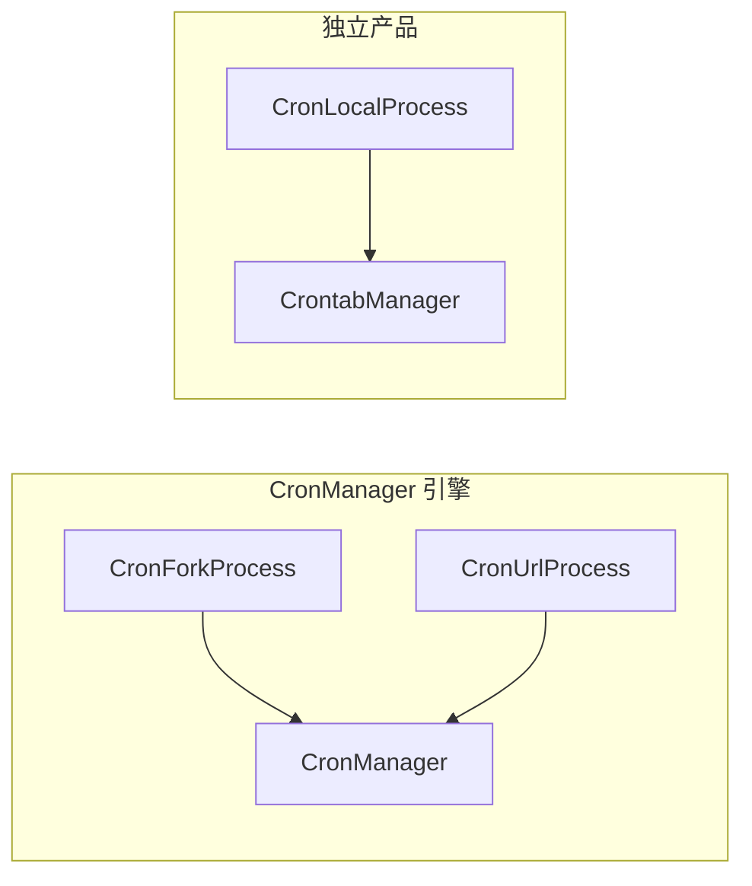
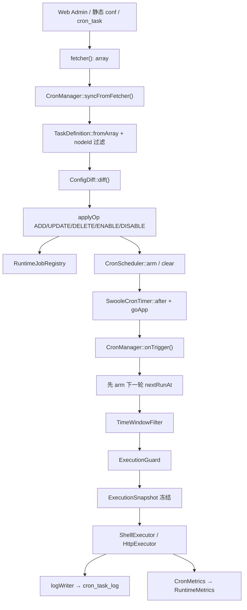
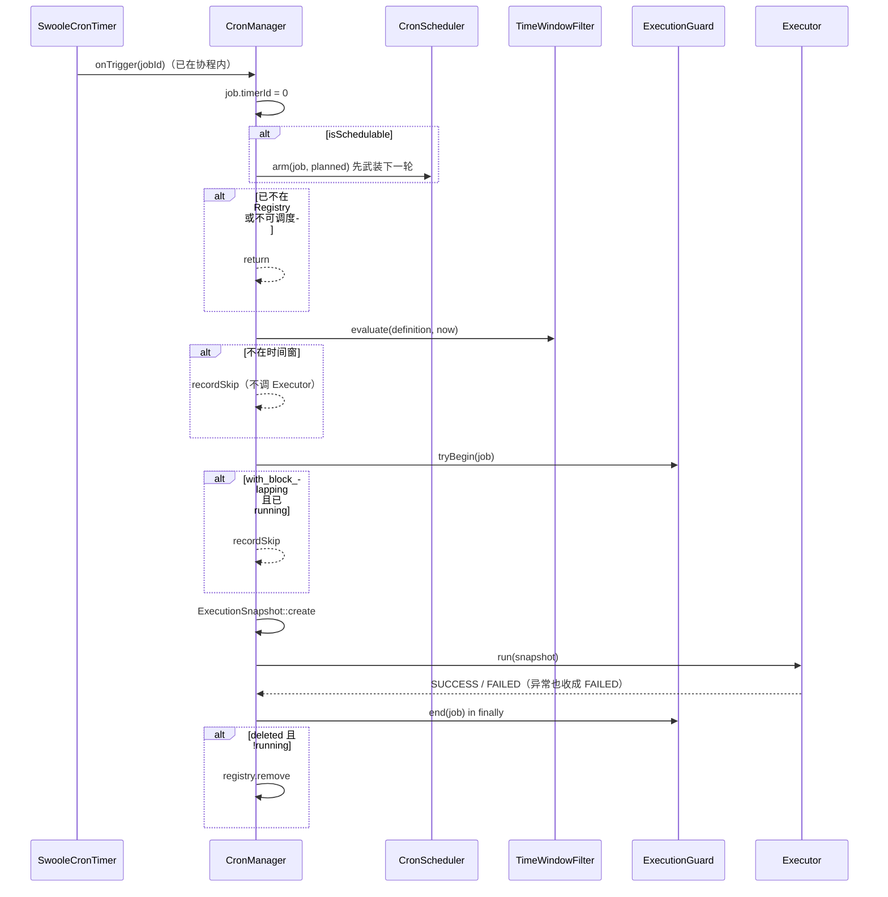

# Worker Cron（CronManager 生产引擎）

`Swoolefy\Worker\Cron` 提供 **数据库 / 静态配置驱动** 的常驻 Worker 定时任务：Polling 拉取配置 → Config Diff 最小化变更 → Runtime 武装 one-shot Timer → 时间窗 / 重叠守卫 → Shell 或 HTTP 执行 → 写 `cron_task_log` 与 Runtime 指标。

**CronManager 是 Fork / URL / DB Cron 的唯一调度器。** `CronLocalProcess` 是另一条产品线（进程内 `CrontabManager` 单规则），不创建、不启动 `CronManager`。

- 架构设计：[Swoolefy-Cron-Production-Architecture-Review.md](../../../docs/Swoolefy-Cron-Production-Architecture-Review.md)
- Web Admin API 设计（尚未作为框架产品落地）：[Swoolefy-Cron-WebAdmin-API-Architecture.md](../../../docs/Swoolefy-Cron-WebAdmin-API-Architecture.md)
- 可观测性：[Core/Runtime/README.md](../../Core/Runtime/README.md)
- 业务拉取 / 日志约定：`CronTaskInterface`（Test 实现见 `Test/Module/Cron/Service/CronTaskService.php`）

---

## 目录结构

```
Cron/
├── CronManager.php                 # 编排门面：Sync / Diff / Runtime / Scheduler / Guard / Log / Metrics
├── ConfigDiff.php                  # 纯比较器：ADD / UPDATE / DELETE / ENABLE / DISABLE / NOOP
├── RuntimeJobRegistry.php          # 进程内 Job 状态（不含 Timer / 执行细节）
├── RuntimeJob.php                  # 单个 Job 的可变运行态
├── TaskDefinition.php              # 不可变配置快照（value object）
├── CronScheduler.php               # 只武装 / 清除 one-shot Timer
├── CronTimerInterface.php
├── SwooleCronTimer.php             # 生产 Timer：after/tick 经 goApp 进协程
├── CronClockInterface.php
├── SystemCronClock.php             # 生产时钟（time()）
├── ExpressionParser.php            # 纯数字 → Interval；否则 Linux Cron
├── ScheduleInterface.php
├── IntervalSchedule.php            # 秒级网格（>= 5）
├── CronExpressionSchedule.php      # 五段 Linux Cron
├── TimeWindowFilter.php            # cron_between / cron_skip
├── ExecutionGuard.php              # with_block_lapping 进程内临界区
├── ExecutionSnapshot.php           # 本轮冻结定义 + execBatchId
├── ExecutionResult.php             # SUCCESS / FAILED / SKIPPED
├── CronExecutorInterface.php
├── CompositeExecutor.php           # 按 exec_type 分发
├── ShellExecutor.php               # exec_type=1
├── HttpExecutor.php                # exec_type=2
├── CronMetrics.php                 # 接入 RuntimeMetrics（关闭时 no-op）
├── CronProcess.php                 # Worker 基类：装配 CronManager
├── CronForkProcess.php             # Shell / swoolefy script Worker
├── CronUrlProcess.php              # HTTP Worker
├── CronLocalProcess.php            # 独立产品：进程内本地 crontab
├── CronForkRunner.php              # 子进程拉起与并发限制（不负责调度）
└── CronTaskInterface.php           # 业务侧 fetch + log 约定
```

单测辅助（不在本目录）：`PHPUintTest/Unit/Worker/Cron/Support/ManualCronTimer.php`、`FrozenCronClock.php`、`RecordingExecutor.php`。

---

## 产品定位：两条线互不共用调度器

| 产品线 | Worker | 调度器 | 典型来源 | 一个 Worker 跑多少任务 |
|---|---|---|---|---|
| Fork / URL / DB Cron | `CronForkProcess` / `CronUrlProcess` | **仅** `CronManager` | 静态 `task_list` 或 DB Closure | 同一进程内多 Job |
| 进程内本地 Cron | `CronLocalProcess` | `CrontabManager::addRule` | Worker `args` 单条规则 | **一条** 本地规则 |

`CronProcess` 不再调用 `CrontabManager::addRule`。`CronForkProcess::run()` / `CronUrlProcess::run()` 只调用 `runCronTask()`。`CronLocalProcess::run()` **不**调用 `runCronTask()`，也不构造 `CronManager`。



---

## 核心原理

`CronManager` 是编排者：不自己解析 expression、不自己发 HTTP/Shell、不自己比较 fingerprint。分层边界禁止互相越权。



### 分层职责

| 组件 | 职责 | 禁止 |
|---|---|---|
| `ConfigDiff` | 纯比较 `$runtime` 与 `$desired`，产出 op | 访问 DB、改 Timer、改 Registry |
| `RuntimeJobRegistry` | 进程内 Job 状态 | Timer、执行、Diff |
| `CronScheduler` + `CronTimerInterface` | 武装 / 清除 one-shot Timer | 解析 expression、执行任务 |
| `ExpressionParser` + `ScheduleInterface` | 计算严格晚于基准的 `nextRunAt` | 武装 Timer |
| `TimeWindowFilter` | 本轮是否 SKIP | 改 expression / Timer |
| `ExecutionGuard` | `with_block_lapping` 临界区 | I/O、sleep、`go()` |
| `ExecutionSnapshot` | 冻结本轮 `TaskDefinition` | 被 Config Update 改写 |
| `CronExecutorInterface` | 怎么执行 | 上抛到 Worker；返回 SKIPPED |
| `CronMetrics` | 刷 Gauge / Counter / Histogram | 自建第二套监控 |

### 调度不变量

1. **Active Job = 恰好一个 Schedule Timer**；Disabled / Deleted = 零个。`CronScheduler::arm()` 内部先 `clear` 再 `after`，禁止双 Timer。
2. **先 arm 再执行**（`onTrigger` 固定顺序）：用「刚刚触发的计划点」计算下一格，避免 `finish_time + interval` 漂移；长任务期间下一计划点仍能触发，供重叠 SKIP；SUCCESS / FAILED / SKIPPED / Exception 都不会丢失后续调度。
3. **Enable ≠ Immediately Run**：`applyEnable()` 只武装下一合法 `nextRunAt`，不立刻调用 Executor。Interval / Cron 都取**严格晚于**基准的下一个点。
4. **Last Known Good**：`fetcher` 抛异常 = DB 故障，`syncFromFetcher()` **不**调用 `applyRows()`，绝不 clear all。`fetcher` **成功返回 `[]`** 才按全量 DELETE 收敛。
5. **Job Exception ≠ Worker Exception**：Executor / `logWriter` 异常隔离在本 Job，不得拖垮其它 Job 或 Worker。
6. **DELETE 不杀进行中的 Execution**：只清未来 Timer、打 `deleted`；`onTrigger` 的 `finally` 里若 `deleted && !running` 再 `registry->remove()`。
7. **Snapshot 边界**：`ExecutionSnapshot::create()` 之后，`UPDATE` 只替换 `RuntimeJob::$definition`，本轮 command / url / headers 保持冻结。
8. **Swoole 6 协程**：`SwooleCronTimer` 的 `after` / `tick` 必须 `goApp` 后再进 `onTrigger`。`proc_open` / Guzzle 不能在进程事件循环里调用。`onTrigger` 本身不再二次 `go()`，以免 Guard 临界区与 `finally` 脱节。

### expression 双模式

`ExpressionParser::parse()`：

| 形态 | 判定 | 实现 | 对齐规则 |
|---|---|---|---|
| 秒级 Interval | `int` / `float` / 纯数字字符串 | `IntervalSchedule` | `next = floor(from/N)*N + N`，落在网格点则跳到下一格 |
| Linux Cron | 其余 trim 后的五段表达式 | `CronExpressionSchedule`（`dragonmantank/cron-expression`） | 严格晚于 `$fromTimestamp` 的下一触发点 |

- `IntervalSchedule` 要求间隔 **>= 5 秒**（构造时校验）。`ExpressionParser` 先拒绝 `< 1`，再交给 `IntervalSchedule`。
- 时区只作用于 Linux Cron（任务 `timezone` 或 `date_default_timezone_get()`）。秒级 Interval 对齐 unix 网格，与时区无关。
- **不补偿 misfire**：Worker 停机期间错过的历史点不会在重启后瞬间补跑。

---

## 端到端逻辑流程

### 1. Worker 启动

`CronForkProcess::run()` / `CronUrlProcess::run()` → `CronProcess::runCronTask()`：

1. `createCronManager()`：把 `args['task_list']` 包成 fetcher，注入 Executor / `SwooleCronTimer` / `SystemCronClock` / `logWriter`。
2. `RuntimeRegistry::registerCronSnapshot(fn () => $this->cronManager->diagnostics())`。
3. `CronManager::start()`：
   - 防重入（`$started`）。
   - `syncFromFetcher()` 做初始同步；失败保留空 Runtime，后续 Polling 重试。
   - 仅当 `pollIntervalMs > 0`（`task_list` 是 Closure）时 `timer->tick()` 武装 Config Polling。
   - 静态数组 fetcher：`pollIntervalMs = 0`，只同步一次。

### 2. Config Polling

`createCronManager()` 中：

```text
pollIntervalMs = (task_list instanceof Closure)
    ? max(1, (int)(args['cron_poll_interval'] ?? 20)) * 1000
    : 0
```

每次 tick 调用 `syncFromFetcher()`。`SwooleCronTimer::tick` 同样 `goApp`，以便 fetcher 走 DB（Swoole 6 hook 要求协程）。

### 3. sync → 规范化 → Diff → applyOp

```text
syncFromFetcher()
  ├─ fetcher 抛异常 / 非 array → lastConfigSyncError，return false（保留 Runtime）
  └─ 成功 array → applyRows()
        ├─ 非 array 行跳过
        ├─ TaskDefinition::fromArray() 失败：只跳过该行
        ├─ nodeId 过滤（在 Diff 之前）：本节点 nodeId 非空且任务挂了其它节点 → 丢弃
        │     改挂其它节点的任务会从 $desired 消失 → DELETE
        ├─ 同一 jobId 后写覆盖先写
        ├─ ConfigDiff::diff(registry.definitions(), $desired)
        └─ applyOp()
```

| op | 条件 | Runtime / Timer |
|---|---|---|
| `ADD` | desired 有、runtime 无 | `put` 新 `RuntimeJob`；仅 `STATUS_ENABLED` 时 `arm` |
| `UPDATE` | 同一 jobId 的 `fingerprint()` 变化 | 先 `clear` 旧 Timer，换 definition / schedule，再按需 `arm` |
| `DELETE` | runtime 有、desired 无 | `clear` Timer，`deleted=true`；未 running 则立即 `remove` |
| `ENABLE` | status `0 → 1` | 换定义，`arm` 下一合法点（不立刻执行） |
| `DISABLE` | status `1 → 0` | `clear` Timer，**保留** Job（与 DELETE 不同） |
| `NOOP` | 身份、status、fingerprint 均未变 | `applyOp` 丢弃 |

status 与 fingerprint 同时变化时，`ConfigDiff` 可能连续发出 `UPDATE` + `ENABLE`/`DISABLE`。非法 expression 只跳过该 op，不影响同轮其它 Job。

**身份键 `jobId`**（`TaskDefinition::resolveJobId()`）：

1. 非空 `cron_task_id` → `id:{n}`
2. 数值 `id > 0` → `id:{n}`
3. 否则 `cron_name` / `name` → `name:{name}`
4. 三者皆空 → `CronException`，该行被跳过

无稳定 id 时改名 = 旧键 DELETE + 新键 ADD。

### 4. Timer 触发（`onTrigger`）

生产路径：`SwooleCronTimer` → `goApp` → `CronManager::onTrigger($jobId)`。



`recordSkip` 写日志并 `metrics->recordRun(SKIPPED)`，不创建真正的执行。SKIP 不更新 `lastRunAt`。

### 5. 执行

| Worker | `createCronExecutor()` | 实际执行 |
|---|---|---|
| `CronProcess`（默认） | `CompositeExecutor(ShellExecutor, HttpExecutor)` | `exec_type=2` → HTTP，其余 → Shell |
| `CronForkProcess` | `ShellExecutor(forkRunner: executeCronSnapshot)` | `CronForkRunner::procOpen` / `exec` |
| `CronUrlProcess` | `HttpExecutor(transport: executeHttpSnapshot)` | Guzzle + before/response/after 回调 |

- Shell：有 `exec_bin_file` 则 `bin + (exec_script ?: command) + argv`；否则 `command ?: exec_script`。空命令 / `proc_open` 失败 / 非零退出 → `FAILED`，不抛。
- HTTP：`url ?: command`；`FILTER_VALIDATE_URL` 失败 → `FAILED`。GET + body → query；其它方法 + body → json。**2xx 为 SUCCESS**，其余状态码 FAILED。响应 body 失败日志截断 200 字符。`HttpExecutor` **不重试**。
- `CronForkProcess` 额外：`run_type` 含 swoolefy 时强制 `proc_open` 并补 `daemon` / `schedule_model`；分钟级 Cron（首字段 `*` 或 `*/N`）启动前随机 `System::sleep(0.2~2.0)` 降惊群；`CronForkRunner::isNextHandle(true, 120)` 达并发上限则本轮 FAILED。
- 未知 `exec_type`：`CompositeExecutor` 回退 Shell，不增加 MQ / RPC 类型。

### 6. 日志与指标

- 配置变更（ADD/UPDATE/DELETE/ENABLE/DISABLE）：`writeDefinitionLog`，`execBatchId` 通常为空串。
- 执行期：`writeLog(snapshot, message, pid)`，`execBatchId` 为 `bin2hex(random_bytes(8))`。
- `logWriter` 由 `CronProcess` 包成 `logCronTaskRuntime()`：仅当 `cron_task_id > 0` 且配置了 `cron_db_log_class`（实现 `CronTaskInterface`）时落库。类缺失或抛异常只记 `CRON_FORK_LOG`。
- `refreshMetrics()` 在 start / stop / sync / 每轮 Execution `finally` 后刷新 Gauge。

### 7. Worker 停止

`CronProcess::onShutDown()` **必须**显式调用（不能只依赖析构）：

1. `cronManager->stop()`：清 Polling tick、`scheduler->clearAll`、`timer->clearAll`、`registry->clear`。
2. `RuntimeRegistry::registerCronSnapshot(null)`。
3. `SwooleCronTimer::clearAll()` 只清本实例 `$owned` 的 timerId，避免误清其它业务 Timer。

---

## Worker 配置键

`CronProcess::createCronManager()` 读取 `getArgs()`：

| 键 | 类型 | 默认 | 说明 |
|---|---|---|---|
| `task_list` | `array` 或 `Closure` | `[]` | 静态数组只同步一次；Closure 每次 Polling 调用，成功必须返回 `array` |
| `cron_poll_interval` | `int` 秒 | `20` | 仅 Closure fetcher 生效；`< 1` 会被抬到 `1` 再 `* 1000` |
| `node_id` | `int` | `null` | 非空时丢弃 `definition->nodeId` 非空且不等于本节点的任务 |
| `cron_node_id` | `int` | — | `node_id` 的别名 |

`CronLocalProcess` **不读**上述调度键，只读：

| 键 | 说明 |
|---|---|
| `cron_name` | 本地规则名（`CrontabManager::addRule` 的 name） |
| `cron_expression` | 秒级数字或 Linux Cron |
| `handler_class` | 必须继承 `Swoolefy\Core\Crontab\AbstractCronController` |
| `with_block_lapping` | 上一轮未完成则本轮不跑 |
| `run_in_background` | 后台运行，不受主进程退出影响 |

环境变量（现有用法，不是新 API）：

| 变量 | 说明 |
|---|---|
| `CRON_NODE_ID` | Test 配置里写入 `args['node_id']` |
| `CRON_DEBUG` | 为真时 `fmtPrintNote` 打印 sync / 非法行等调试信息 |

---

## fetcher 约定

`CronManager` 构造参数：

```php
/**
 * @param callable():array<int, array<string, mixed>> $fetcher
 */
```

| 行为 | 引擎语义 |
|---|---|
| 返回 `list<array>` | 成功快照，进入 Diff |
| 返回非 array | `CronException`，视为故障，保留 Last Known Good |
| 抛 `\Throwable` | 同上 |
| 成功返回 `[]` | 配置侧确实无任务，全量 DELETE |

`CronProcess::createTaskFetcher()`：

- Closure：每次调用；返回非 array 抛 `RuntimeException`。
- 静态数组：闭包每次返回同一份，且不 Polling。

业务侧实现 `CronTaskInterface`：

```php
public function fetchCronTask(int $execType, $nodeId); // 期望 array
public function logCronTaskRuntime(
    ScheduleEvent|CronUrlTaskMetaDtoWorker $scheduleTask,
    string $execBatchId,
    string $message,
    int $pid = 0
);
```

`CronManager` **不直接依赖**该接口。`CronProcess` 把 Closure `task_list` 包成 fetcher，把 `logCronTaskRuntime` 包成 `logWriter`。

Test 实现 `Test\Module\Cron\Service\CronTaskService`：

- 按 `node_id` + `exec_type` 拉 `cron_task`（**不要只查 status=1**，否则 DISABLE 会被误当成 DELETE）。
- `exec_type=1` → `ScheduleEvent` 数组；`exec_type=2` → `CronUrlTaskMetaDtoWorker` 数组。
- `logCronTaskRuntime` 写入 `cron_task_log`（`cron_id` / `exec_batch_id` / `pid` / `task_item` / `message`）。

---

## 任务字段（`TaskDefinition::fromArray`）

同时兼容 DB `cron_task` 行与 Worker Meta。缺 `status` 时默认 `STATUS_ENABLED`（静态 conf 无停用字段）。`http_request_time_out <= 0` 回退 **120** 秒。

### 身份与调度

| 配置键（别名） | 规范化字段 | 说明 |
|---|---|---|
| `cron_task_id` / `id` | `cronTaskId` / `jobId` | 稳定身份优先 |
| `cron_name` / `name` | `cronName` | 无 id 时作为身份 |
| `cron_expression` / `expression` | `expression` | **必填**，否则抛 `CronException` |
| `status` | `status` | `0` 停用 / `1` 启用 |
| `exec_type` | `execType` | `1` Shell（`CronProcess::EXEC_FORK_TYPE`）/ `2` HTTP（`EXEC_URL_TYPE`）；缺省时有 URL 则 HTTP，否则 Shell |
| `with_block_lapping` | `withBlockLapping` | `true`：同一 Job 最多一个 Running |
| `node_id` | `nodeId` | 空串 / null → null |
| `timezone` | `timezone` | 仅 Linux Cron |
| `updated_at` | `updatedAt` | 计入 fingerprint |

### 时间窗

| 键 | 语义 |
|---|---|
| `cron_between` | 允许窗；空 = 全天允许。多窗 OR |
| `cron_skip` | 跳过窗；空 = 不额外排除。任一命中即 SKIP |

兼容单窗 `[start, end]` 与多窗 `[[start, end], ...]`。时刻串 `HH:MM` / `HH:MM:SS` 锚定到 `$now` 的当天；跨日窗（如 `22:00-02:00`）按字面时间戳比较，不自动拆日。判定：`allowed = inside(between) && !inside(skip)`。

### Shell（`exec_type=1`）

| 键 | 说明 |
|---|---|
| `command` / `exec_script` | 互相回填；像 `http(s)://` 时回填为 `url` |
| `exec_bin_file` | 解释器 / 二进制 |
| `argv` | 关联键写成 `--name=value`，数字键只转义值 |
| `fork_type` | `proc_open`（默认，`CronForkProcess::FORK_TYPE_PROC_OPEN`）或 `exec` |
| `run_type` | 含 swoolefy 时走 script 补参 |
| `output` | `exec` 模式输出，默认 `/dev/null` |
| `extend` | 透传给 `CronForkRunner` |

框架 **没有** 通用的 Shell 执行超时字段。`CronForkProcess` 传给 `isNextHandle(true, 120)` 的 `120` 是「达并发上限后等待已有子进程」的秒数，不是任务 timeout。

### HTTP（`exec_type=2`）

| 键（别名） | 规范化字段 | 默认 |
|---|---|---|
| `url` / `command`（像 URL 时） | `url` | — |
| `http_method` / `method` | `httpMethod` | `GET`（会 `strtoupper`） |
| `http_body` / `params` | `httpBody` | `[]`（JSON 字符串会 decode） |
| `http_headers` / `headers` | `httpHeaders` | `[]` |
| `http_request_time_out` / `request_time_out` | `httpRequestTimeOut` | `120` 秒 |

`CronUrlProcess::executeHttpSnapshot()` 另读 Meta 上的 `connect_time_out`（默认 30）、`before_callback` / `response_callback` / `after_callback`。`before_callback` 为 Closure 且返回 `false` 时本轮视为失败（status=0）。

### fingerprint（决定 UPDATE）

计入：`expression`、`execType`、`withBlockLapping`、`command`、`cronBetween`、`cronSkip`、`httpMethod`、`httpBody`、`httpHeaders`、`httpRequestTimeOut`、`execBinFile`、`execScript`、`url`、`runType`、`forkType`、`argv`、`updatedAt`、`timezone`。

**不计入**（单独变化不会 UPDATE）：`cronName`、`cronTaskId`、`nodeId`、`output`、`extend`、`cronDbLogClass`、`cronMetaOrigin`、`raw`。`status` 走 ENABLE/DISABLE，不进 fingerprint。

---

## 使用例子

### 启动 Test WorkerCron

仓库根目录 `cron.php` 指向 `Test\WorkerCron\MainCronProcess`，配置文件 `Test/WorkerCron/worker_cron_conf.php`（当前默认只 merge 了 fork 配置）。

```bash
# 前台
php cron.php start Test

# 守护进程
php cron.php start Test --daemon=1

php cron.php restart Test
php cron.php stop Test --force=1
```

生成应用侧 Cron 目录（框架脚手架，不是本引擎 API）：

```bash
php script.php start App --c=gen:cron:service
```

### Fork / Shell（`CronForkProcess`）

`Test/WorkerCron/conf/schedule_fork_conf.php`：

```php
[
    'process_name' => 'system-schedule-task',
    'handler' => \Swoolefy\Worker\Cron\CronForkProcess::class,
    'worker_num' => 1,
    'args' => [
        'cron_poll_interval' => 20,
        'node_id' => env('CRON_NODE_ID'),
        'task_list' => function () {
            $list1 = include __DIR__ . '/fork_task.php';
            // $list4 = (new \Test\Module\Cron\Service\CronTaskService())
            //     ->fetchCronTask(CronProcess::EXEC_FORK_TYPE, env('CRON_NODE_ID'));
            return array_merge($list1 ?? [], $list4 ?? []);
        },
    ],
]
```

静态任务示例（`Test/WorkerCron/conf/fork_task.php`）：

```php
[
    'cron_name' => 'shell1',
    'cron_expression' => 15,                    // 每 15 秒，对齐 unix 网格
    'exec_bin_file' => '/bin/bash',
    'exec_script' => APP_PATH . '/Python/shell.sh',
    'with_block_lapping' => true,
    'cron_between' => [['00:01', '14:00']],
    'cron_skip' => [['14:00', '18:00']],
    'fork_type' => CronForkProcess::FORK_TYPE_EXEC,
],
[
    'cron_name' => 'swoolefy-php',
    'run_type' => \Swoolefy\Worker\Dto\CronForkTaskMetaDtoWorker::RUN_TYPE,
    'cron_expression' => 15,
    'exec_bin_file' => SystemEnv::PhpBinFile(),
    'exec_script' => '/path/to/script.php start ' . APP_NAME . ' --c=test:script',
    'argv' => ['name' => 'bingcoolhuang'],
    'with_block_lapping' => true,
    'fork_type' => CronForkProcess::FORK_TYPE_EXEC,
]
```

Linux Cron 写法（同一字段）：

```php
'cron_expression' => '*/5 * * * *',   // 每 5 分钟
```

### HTTP（`CronUrlProcess`）

`Test/WorkerCron/conf/schedule_url_conf.php` 当前是**静态数组合并**（`pollIntervalMs=0`）。要走 DB Polling，把 `task_list` 改成 Closure，并调用 `CronTaskService::fetchCronTask(CronProcess::EXEC_URL_TYPE, $nodeId)`。

`Test/WorkerCron/conf/remote_task.php`：

```php
[
    'cron_name' => 'send message',
    'cron_expression' => 10,
    'url' => 'http://127.0.0.1:9501/index/index',
    'method' => 'get',
    'connect_time_out' => 10,
    'request_time_out' => 15,
    'headers' => [],
    'params' => ['name' => 'bingcool'],
    'before_callback' => function () { /* ... */ },
    'response_callback' => [\Test\WorkerCron\CurlQuery\RemoteUrl::class, 'handle'],
    'after_callback' => function () { /* ... */ },
]
```

### 进程内本地 Cron（`CronLocalProcess`，不走 CronManager）

`Test/WorkerCron/conf/schedule_local_conf.php`：

```php
[
    'process_name' => 'test-local-cron-worker11',
    'handler' => \Swoolefy\Worker\Cron\CronLocalProcess::class,
    'worker_num' => 2,
    'life_time' => 3600,
    'args' => [
        'cron_name' => 'cancel-order',
        'handler_class' => \Test\WorkerCron\LocalOrder\LocalOrderHandle::class,
        'with_block_lapping' => 1,
        'cron_expression' => 10,
    ],
]
```

`handler_class` 必须继承 `AbstractCronController` 并实现 `doCronTask($cron, string $cronName)`。重叠由 `with_block_lapping + $this->handing` 控制，与 `ExecutionGuard` 无关。

### Test HTTP 管理 API（写库，不直接改 Timer）

路由：`Test/Router/Module/CronManager.php`，控制器 `Test/Module/Cron/Controller/CronTaskManagerController.php`，默认端口 **9501**。Worker 靠 Polling Diff 收敛，后台不操作 Scheduler。

```bash
# 列表
curl -X GET 'http://127.0.0.1:9501/api/v1/tasks?page=1&pageSize=20&status=1&nodeId=1&execType=1' \
  -H 'Accept: application/json'

# 创建 Shell 任务
curl -X POST 'http://127.0.0.1:9501/api/v1/tasks' \
  -H 'Content-Type: application/json' \
  -d '{
    "name": "demo-shell",
    "expression": "5 * * * *",
    "command": "php script.php start --c=Demo",
    "execType": 1,
    "nodeId": 1,
    "status": 1,
    "withBlockLapping": 0
  }'

# 创建 HTTP 任务
curl -X POST 'http://127.0.0.1:9501/api/v1/tasks' \
  -H 'Content-Type: application/json' \
  -d '{
    "name": "demo-http",
    "expression": "0 * * * *",
    "command": "https://httpbin.org/post",
    "execType": 2,
    "nodeId": 1,
    "httpMethod": "POST",
    "httpRequestTimeOut": 30,
    "httpBody": {"ping": true},
    "httpHeaders": {"X-Demo": "1"}
  }'

# 部分更新
curl -X PUT 'http://127.0.0.1:9501/api/v1/tasks' \
  -H 'Content-Type: application/json' \
  -d '{"id": 1, "expression": "10 * * * *", "status": 1}'

# 停用 / 启用（Diff 走 DISABLE / ENABLE，不是 DELETE）
curl -X POST 'http://127.0.0.1:9501/api/v1/tasks/status' \
  -H 'Content-Type: application/json' \
  -d '{"id": 1, "status": 0}'

# 删除（软删后 fetcher 不再返回该行 → DELETE）
curl -X DELETE 'http://127.0.0.1:9501/api/v1/tasks' \
  -H 'Content-Type: application/json' \
  -d '{"id": 1}'

# 执行日志
curl -X GET 'http://127.0.0.1:9501/api/v1/tasks/logs?taskId=1&page=1&pageSize=20'
```

这些 API 属于 **Test 应用**，不是 `src/Worker/Cron` 对外 SDK。

### 如何新增一个 Job

**方式 A — 静态 conf（最快）**

1. 在 `fork_task.php` 或 `remote_task.php` 追加一条（必须有 `cron_name`/`id` 与 `cron_expression`/`expression`）。
2. 静态 `task_list` **不会**自动重拉：改完需重启该 Cron Worker（`php cron.php restart Test`）。
3. 若 `task_list` 已是 Closure 且 `include` 了该文件，下一轮 Polling 会 Diff 出 ADD。

**方式 B — 数据库（动态）**

1. `schedule_fork_conf.php` / `schedule_url_conf.php` 的 `task_list` 改为 Closure，内部调用 `CronTaskService::fetchCronTask(...)`。
2. 用上面的 `POST /api/v1/tasks`（或直接写 `cron_task`）插入行：`status=1`、正确的 `exec_type` 与 `node_id`。
3. 最多等待 `cron_poll_interval` 秒，本节点 Worker Diff 出 ADD 并 `arm`。不会立刻执行。

**方式 C — 本地进程内任务**

1. 实现 `AbstractCronController`。
2. 在 `schedule_local_conf.php` 增加一个 `CronLocalProcess` Worker（一个进程一条规则）。
3. 在 `worker_cron_conf.php` 里 `include` 该 conf。这与 CronManager 无关。

### 编程装配（单测 / 自定义 Worker）

```php
use Swoolefy\Worker\Cron\CronManager;
use Swoolefy\Worker\Cron\CompositeExecutor;
use Swoolefy\Worker\Cron\ShellExecutor;
use Swoolefy\Worker\Cron\HttpExecutor;
use Swoolefy\Worker\Cron\SwooleCronTimer;
use Swoolefy\Worker\Cron\SystemCronClock;

$manager = new CronManager(
    fetcher: static fn (): array => [
        [
            'id' => 1,
            'cron_name' => 'demo',
            'expression' => 15,
            'exec_type' => 1,
            'status' => 1,
            'command' => '/bin/echo hello',
        ],
    ],
    executor: new CompositeExecutor(new ShellExecutor(), new HttpExecutor()),
    timer: new SwooleCronTimer(),
    clock: new SystemCronClock(),
    pollIntervalMs: 0,          // 静态：不 Polling
    nodeId: null,
    logWriter: null,
);
$manager->start();
// Worker 退出前：
$manager->stop();
```

单测应注入 `ManualCronTimer` + `FrozenCronClock`，不要依赖真实 Swoole 时钟。公开只读辅助：`registry()`、`scheduler()`、`timerCountFor()`、`diagnostics()`、`lastConfigSyncError()`、`lastConfigSyncAt()`。

---

## 可观测性

Cron **复用**现有 `RuntimeRegistry` / `RuntimeMetrics` / `RuntimeDiagnostics`，不另建 Prometheus 或跨 Worker 聚合。指标名称固定，**不含** `jobId` / `cron_name` 标签（避免高基数）。`RuntimeRegistry::metrics()` 为 `null`（指标未启用）时 `CronMetrics` 全部 no-op。

### 指标（`worker.metrics.cron`）

由 `CronMetrics` 写入，`RuntimeDiagnostics::metrics()` 归类：

| 名称 | 类型 | 含义 |
|---|---|---|
| `swoolefy_cron_jobs_total` | Gauge | Registry 内 Job 数（含 Disabled / 待释放 deleted） |
| `swoolefy_cron_jobs_enabled` | Gauge | `isSchedulable()` 的 Job 数 |
| `swoolefy_cron_jobs_running` | Gauge | 至少有一个 Execution 在跑的 Job 数（不是 `runningCount` 之和） |
| `swoolefy_cron_runs_total` | Counter | 含 SUCCESS / FAILED / SKIPPED |
| `swoolefy_cron_runs_success` | Counter | |
| `swoolefy_cron_runs_failed` | Counter | |
| `swoolefy_cron_runs_skipped` | Counter | 时间窗 / 重叠 |
| `swoolefy_cron_execution_duration_seconds` | Histogram | 实际执行耗时；SKIPPED 不观察 |

HTTP Worker 不会调用 `recordCronJobs()`，对应 Gauge 保持 0，但 `worker.metrics.cron` 键仍存在。

### 诊断快照（`worker.cron`）

`CronProcess::runCronTask()` 注册 `CronManager::diagnostics()`：

```json
{
  "job_count": 2,
  "enabled_count": 1,
  "running_count": 0,
  "last_config_sync": 1786258800,
  "last_config_sync_error": null,
  "jobs": [
    {
      "id": 1,
      "name": "demo-shell",
      "status": 1,
      "nextRunAt": 1786258815,
      "lastRunAt": 1786258800,
      "running": false,
      "timerId": 3
    }
  ]
}
```

未接入（普通 HTTP Worker）时：`{"enabled": false}`。采集失败：`{"error":"collector_failed"}`。`onShutDown` 传 `null` 注销。

### 如何读到这些数据

`GET /api/runtime`（`Test/Router/Common/Runtime.php`）读的是**承载该请求的 HTTP Worker** 本地状态。Cron Worker 与 HTTP Worker 进程隔离，因此该接口上的 `worker.cron` 通常是 `enabled=false`。这不是漏接，而是 Runtime 的进程本地模型。

当前 **没有** 已注册的生产端点按 `process_name` 去拉 Cron Worker 快照（`/process-runtime` 不是现有 `CtlApi` 路由）。详见 [Core/Runtime/README.md](../../Core/Runtime/README.md)。

---

## 尚未实现（当前仍为真）

与架构文档 P2 / Phase 5 对齐，**引擎内没有**下列能力：

| 能力 | 现状 |
|---|---|
| Retry | `HttpExecutor` / `ShellExecutor` 失败即本轮 FAILED，不重试 |
| Misfire / Backfill / Catch-up | `calculateNextRunAt` 只算下一合法点，不补历史 |
| 分布式锁 / Leader Election | `ExecutionGuard` 是**进程内**协作式互斥，不是跨节点锁 |
| Manual Run | 无「忽略 expression 立刻执行一次」的引擎 API |
| 框架级 Web Admin | Test 应用有 `cron_task` CRUD；设计文档与 HTML 原型在 `docs/`，不是 `src/Worker/Cron` 的一部分 |
| 跨进程 Runtime 查询 | Cron 诊断只活在 Cron Worker 的 `RuntimeRegistry` |
| MQ / RPC / DAG / 独立 Scheduler 服务 | 明确不引入 |

`CronForkRunner` 的 `concurrent`（默认 5，上限 10）是**同一 `cron_name` 的 fork 并发限制**，不是分布式 Max Concurrent，也不是架构文档里未做的「增强 Execution History」。

---

## 运行测试

```bash
# CronManager 生命周期 / Diff / 表达式 / 时间窗 / Guard（不依赖真实 Swoole 时钟）
./vendor/bin/phpunit --filter Worker\\\\Cron

# SwooleCronTimer goApp 协程边界
./vendor/bin/phpunit --filter SwooleCronTimerCoroutineTest
```

主要用例：

- `PHPUintTest/Unit/Worker/Cron/CronManagerLifecycleTest.php` — Timer 不变量、Last Known Good、Snapshot 冻结、异常隔离、nodeId
- `PHPUintTest/Unit/Worker/Cron/ConfigDiffTest.php`
- `PHPUintTest/Unit/Worker/Cron/ExpressionParserTest.php`
- `PHPUintTest/Unit/Worker/Cron/ExecutorAndWindowTest.php`
- `PHPUintTest/Coroutine/Worker/Cron/SwooleCronTimerCoroutineTest.php`

---

## 相关类速查

| 方法 / 常量 | 类 | 用途 |
|---|---|---|
| `start()` / `stop()` / `syncFromFetcher()` / `applyRows()` / `onTrigger()` | `CronManager` | 生命周期与触发 |
| `diagnostics()` | `CronManager` | Runtime 诊断 |
| `ADD` `UPDATE` `DELETE` `ENABLE` `DISABLE` `NOOP` | `ConfigDiff` | Diff op |
| `fromArray()` / `resolveJobId()` / `fingerprint()` / `toLogDto()` | `TaskDefinition` | 配置规范化 |
| `arm()` / `clear()` / `clearAll()` / `activeTimerCount()` | `CronScheduler` | one-shot Timer |
| `tryBegin()` / `end()` | `ExecutionGuard` | 重叠 |
| `evaluate()` | `TimeWindowFilter` | 时间窗 |
| `parse()` / `isSecondInterval()` | `ExpressionParser` | 表达式 |
| `run()` | `CronExecutorInterface` | 执行 |
| `recordJobs()` / `recordRun()` | `CronMetrics` | 指标 |
| `runCronTask()` / `createCronManager()` / `createTaskFetcher()` | `CronProcess` | Worker 装配 |
| `executeCronSnapshot()` | `CronForkProcess` | Shell 钩子 |
| `executeHttpSnapshot()` | `CronUrlProcess` | HTTP 钩子 |
| `registerCronSnapshot()` / `cronSnapshot()` | `RuntimeRegistry` | 诊断挂载 |
